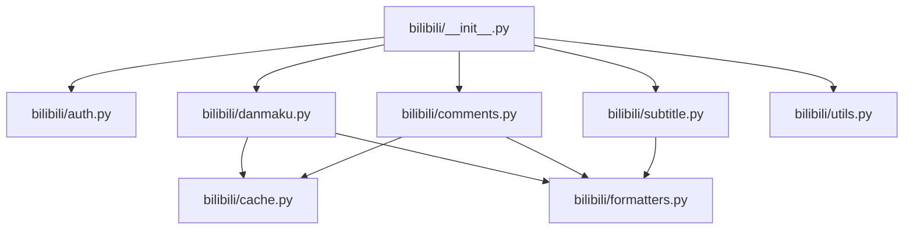
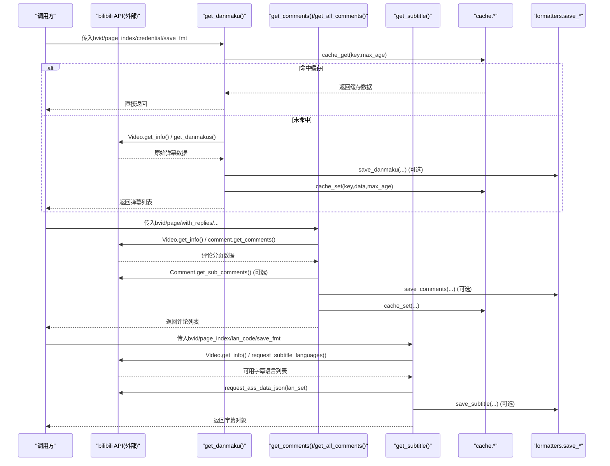
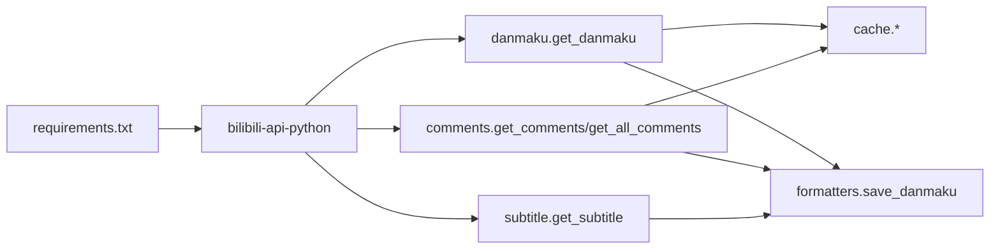

# API参考文档

<cite>
**本文引用的文件**   
- [bilibili/__init__.py](file://bilibili/__init__.py)
- [bilibili/auth.py](file://bilibili/auth.py)
- [bilibili/danmaku.py](file://bilibili/danmaku.py)
- [bilibili/comments.py](file://bilibili/comments.py)
- [bilibili/subtitle.py](file://bilibili/subtitle.py)
- [bilibili/utils.py](file://bilibili/utils.py)
- [bilibili/cache.py](file://bilibili/cache.py)
- [bilibili/formatters.py](file://bilibili/formatters.py)
- [requirements.txt](file://requirements.txt)
</cite>

## 目录
1. [简介](#简介)
2. [项目结构](#项目结构)
3. [核心组件](#核心组件)
4. [架构总览](#架构总览)
5. [详细组件分析](#详细组件分析)
6. [依赖关系分析](#依赖关系分析)
7. [性能与缓存](#性能与缓存)
8. [错误处理与调试建议](#错误处理与调试建议)
9. [版本兼容性与弃用说明](#版本兼容性与弃用说明)
10. [结论](#结论)
11. [附录：完整API规范与示例](#附录完整api规范与示例)

## 简介
本模块提供对B站视频弹幕、评论（含楼中楼回复）、字幕的抓取能力，并内置基于文件的JSON缓存机制与多种格式的输出保存。对外暴露简洁的异步函数接口，支持通过Cookie解析生成认证对象以访问受限资源。

## 项目结构
- bilibili/
  - __init__.py：统一导出公共API
  - auth.py：Cookie解析为Credential
  - danmaku.py：获取弹幕
  - comments.py：获取评论与全量翻页
  - subtitle.py：获取字幕
  - utils.py：通用工具（BV号提取）
  - cache.py：本地JSON缓存
  - formatters.py：数据格式化与文件保存
- requirements.txt：外部依赖声明

图表来源
- [bilibili/__init__.py:1-19](file://bilibili/__init__.py#L1-L19)
- [bilibili/danmaku.py:1-64](file://bilibili/danmaku.py#L1-L64)
- [bilibili/comments.py:1-171](file://bilibili/comments.py#L1-L171)
- [bilibili/subtitle.py:1-77](file://bilibili/subtitle.py#L1-L77)
- [bilibili/utils.py:1-28](file://bilibili/utils.py#L1-L28)
- [bilibili/cache.py:1-42](file://bilibili/cache.py#L1-L42)
- [bilibili/formatters.py:1-166](file://bilibili/formatters.py#L1-L166)

章节来源
- [bilibili/__init__.py:1-19](file://bilibili/__init__.py#L1-L19)

## 核心组件
- 认证与凭证
  - parse_cookie(cookie_str): 将包含SESSDATA的Cookie字符串解析为bilibili_api.Credential对象；缺失必要字段时返回None。
- 弹幕
  - get_danmaku(bvid, page_index=0, max_age=30, credential=None, save_fmt=None): 异步获取指定分P的弹幕列表，支持缓存命中与可选保存到txt/json/csv。
- 评论
  - get_comments(bvid, page=1, max_age=30, credential=None, save_fmt=None, with_replies=False): 获取单页评论，可选择同时拉取每条评论的楼中楼回复（第1页，最多20条）。
  - get_all_comments(bvid, max_age=30, credential=None, save_fmt=None, with_replies=False, max_pages=0): 全量翻页获取评论，具备安全上限与空页检测。
- 字幕
  - get_subtitle(bvid, page_index=0, credential=None, lan_code="", save_fmt="srt"): 自动或按语言代码获取字幕，支持srt/ass/lrc/json输出。
- 工具
  - extract_bvid(raw): 从纯BV号或链接中提取BV号，失败抛出ValueError。

章节来源
- [bilibili/auth.py:8-37](file://bilibili/auth.py#L8-L37)
- [bilibili/danmaku.py:13-63](file://bilibili/danmaku.py#L13-L63)
- [bilibili/comments.py:42-170](file://bilibili/comments.py#L42-L170)
- [bilibili/subtitle.py:21-76](file://bilibili/subtitle.py#L21-L76)
- [bilibili/utils.py:8-27](file://bilibili/utils.py#L8-L27)

## 架构总览
整体流程围绕“输入BV号 → 解析信息 → 调用bilibili-api → 缓存/格式化 → 返回结果”展开。

图表来源
- [bilibili/danmaku.py:13-63](file://bilibili/danmaku.py#L13-L63)
- [bilibili/comments.py:13-170](file://bilibili/comments.py#L13-L170)
- [bilibili/subtitle.py:21-76](file://bilibili/subtitle.py#L21-L76)
- [bilibili/cache.py:14-41](file://bilibili/cache.py#L14-L41)
- [bilibili/formatters.py:50-166](file://bilibili/formatters.py#L50-L166)

## 详细组件分析

### 认证与凭证（auth.parse_cookie）
- 功能：解析Cookie字符串，提取SESSDATA等字段，构造bilibili_api.Credential对象。
- 参数
  - cookie_str: str，必须包含SESSDATA键值对。
- 返回值
  - Credential | None：成功返回凭证对象，否则返回None。
- 行为与异常
  - 若cookie_str为空或缺少SESSDATA，返回None。
  - 内部使用简单分号分割与等号拆分，不处理复杂编码场景。
- 使用建议
  - 在需要登录态的评论/字幕请求中传入该凭证。

章节来源
- [bilibili/auth.py:8-37](file://bilibili/auth.py#L8-L37)

### 弹幕（danmaku.get_danmaku）
- 功能：获取指定分P的弹幕，支持缓存与可选保存。
- 参数
  - bvid: str，视频BV号。
  - page_index: int，分P索引（默认0）。
  - max_age: int，缓存有效期秒（默认30），0表示禁用缓存。
  - credential: Credential | None，登录凭证。
  - save_fmt: str | None，保存格式（txt/json/csv），None不保存。
- 返回值
  - list[弹幕条目]：每条包含时间、文本、模式、字号、颜色、用户ID等字段。
- 行为与异常
  - 优先读取缓存；未命中则调用Video.get_info()与get_danmakus()。
  - 可调用save_danmaku进行持久化。
- 复杂度
  - I/O密集型，时间主要消耗在网络请求与序列化。

章节来源
- [bilibili/danmaku.py:13-63](file://bilibili/danmaku.py#L13-L63)
- [bilibili/formatters.py:101-141](file://bilibili/formatters.py#L101-L141)

### 评论（comments.get_comments / get_all_comments）
- get_comments
  - 参数
    - bvid: str
    - page: int，页码（默认1）
    - max_age: int，缓存有效期秒
    - credential: Credential | None
    - save_fmt: str | None
    - with_replies: bool，是否获取楼中楼回复（第1页，最多20条）
  - 返回值
    - list[{"comment": {...}, "replies": [...]}]
  - 行为
    - 先查缓存；未命中则调用Video.get_info()与comment.get_comments()。
    - 若with_replies为True且评论有回复，逐条拉取子回复并延时0.3s。
- get_all_comments
  - 参数
    - bvid: str
    - max_age: int
    - credential: Credential | None
    - save_fmt: str | None
    - with_replies: bool
    - max_pages: int，0表示不限
  - 返回值
    - list[{"comment": {...}, "replies": [...]}]
  - 行为
    - 循环翻页，具备连续空页停止、已知总数停止、累计数量上限（10000）保护。
    - 每次翻页后延时0.5s，避免触发限流。
- 异常与容错
  - 子回复获取失败会打印错误并返回空列表，不影响主流程。

章节来源
- [bilibili/comments.py:13-170](file://bilibili/comments.py#L13-L170)
- [bilibili/formatters.py:50-97](file://bilibili/formatters.py#L50-L97)

### 字幕（subtitle.get_subtitle）
- 功能：获取视频字幕，支持多语言选择与多格式保存。
- 参数
  - bvid: str
  - page_index: int，分P索引（默认0）
  - credential: Credential | None
  - lan_code: str，语言代码（如ai-zh/en/ja），为空则优先中文
  - save_fmt: str，保存格式（srt/ass/lrc/json），默认srt
- 返回值
  - 字幕对象（来自bilibili_api.ass）或None（无字幕时）
- 行为
  - 先获取可用语言列表；根据lan_code精确匹配或关键词模糊匹配；未匹配则回退到第一个语言。
  - 默认优先顺序：ai-zh > zh-Hans > zh-Hant。
  - 支持保存为srt/ass/lrc/json。

章节来源
- [bilibili/subtitle.py:21-76](file://bilibili/subtitle.py#L21-L76)
- [bilibili/formatters.py:146-166](file://bilibili/formatters.py#L146-L166)

### 工具（utils.extract_bvid）
- 功能：从纯BV号或链接中提取BV号。
- 参数
  - raw: str，支持纯BV号、完整bilibili.com/video/BV...链接、短链b23.tv/xxx。
- 返回值
  - str：提取到的BV号。
- 异常
  - 无法解析时抛出ValueError。

章节来源
- [bilibili/utils.py:8-27](file://bilibili/utils.py#L8-L27)

### 缓存（cache）
- 关键函数
  - cache_key(bvid, dtype, page=0): 生成MD5缓存键。
  - cache_get(key, max_age): 读取缓存，过期则删除并返回None。
  - cache_set(key, payload, max_age): 写入缓存，记录时间与最大存活期。
- 存储位置
  - 项目根目录下.bili_cache文件夹中的JSON文件。

章节来源
- [bilibili/cache.py:14-41](file://bilibili/cache.py#L14-L41)

### 格式化与保存（formatters）
- 评论
  - format_comment(c), format_reply(r): 精简字段。
  - save_comments(comments_with_replies, bvid, fmt="txt"): 支持json/csv/txt。
- 弹幕
  - save_danmaku(dms, bvid, fmt="txt"): 支持json/csv/txt。
- 字幕
  - save_subtitle(sub_obj, bvid, lan_code, fmt="srt"): 支持srt/ass/lrc/json。

章节来源
- [bilibili/formatters.py:21-166](file://bilibili/formatters.py#L21-L166)

## 依赖关系分析
- 外部依赖
  - bilibili-api-python>=0.17.0：提供video/comment/Credential/ass等能力。
  - aiohttp>=3.8.0：底层异步HTTP客户端。
  - streamlit>=1.20.0：用于可能的Web演示（与本API无关）。
- 模块内依赖
  - danmaku/comments/subtitle均依赖cache与formatters。
  - __init__.py仅做统一导出，不引入额外耦合。

图表来源
- [requirements.txt:1-4](file://requirements.txt#L1-L4)
- [bilibili/danmaku.py:1-64](file://bilibili/danmaku.py#L1-L64)
- [bilibili/comments.py:1-171](file://bilibili/comments.py#L1-L171)
- [bilibili/subtitle.py:1-77](file://bilibili/subtitle.py#L1-L77)
- [bilibili/cache.py:1-42](file://bilibili/cache.py#L1-L42)
- [bilibili/formatters.py:1-166](file://bilibili/formatters.py#L1-L166)

章节来源
- [requirements.txt:1-4](file://requirements.txt#L1-L4)

## 性能与缓存
- 缓存策略
  - 所有主要接口均支持max_age控制缓存有效期；设为0即禁用缓存。
  - 评论全量翻页存在安全上限（累计超过10000条停止）与空页检测，避免无限循环。
- I/O优化
  - 评论子回复拉取时加入0.3s延时，降低瞬时并发压力。
  - 翻页间隔0.5s，减少被限流风险。
- 建议
  - 批量任务建议开启合理max_age以减少重复请求。
  - 大视频评论建议限制max_pages或分批处理。

[本节为通用指导，无需列出具体文件来源]

## 错误处理与调试建议
- 常见异常
  - ValueError：extract_bvid无法解析BV号时抛出。
  - 网络/鉴权异常：由bilibili-api-python抛出，上层未捕获，需调用方自行try/except。
- 日志与定位
  - 各模块均有print日志，便于观察缓存命中、请求进度与保存路径。
  - 评论子回复失败会打印错误并继续执行，不会中断主流程。
- 调试建议
  - 设置max_age=0强制走网络，验证接口连通性。
  - 使用最小page_index/page组合复现问题。
  - 检查Cookie是否包含SESSDATA，必要时传入credential。
  - 查看.bili_cache目录确认缓存是否生效。

章节来源
- [bilibili/utils.py:17-27](file://bilibili/utils.py#L17-L27)
- [bilibili/comments.py:27-39](file://bilibili/comments.py#L27-L39)

## 版本兼容性与弃用说明
- 依赖版本
  - bilibili-api-python>=0.17.0：确保Credential、video、comment、ass等API可用。
- 兼容性注意
  - 字幕语言代码映射为本地字典，随平台更新可能变化；当前默认优先中文。
  - 评论分页字段名来源于bilibili-api响应，若上游变更可能导致total计数差异。
- 弃用警告
  - 当前未发现显式弃用标记；但建议关注bilibili-api-python的发布说明，及时升级以适配平台变更。

章节来源
- [requirements.txt:1-4](file://requirements.txt#L1-L4)
- [bilibili/subtitle.py:11-18](file://bilibili/subtitle.py#L11-L18)

## 结论
本模块提供了面向B站弹幕、评论、字幕的统一异步API，结合本地缓存与多格式输出，适合批处理与二次开发。通过parse_cookie快速构建凭证，配合合理的max_age与分页策略，可在保证稳定性的前提下高效采集数据。

[本节为总结，无需列出具体文件来源]

## 附录：完整API规范与示例

### 公共导出清单
- parse_cookie
- extract_bvid
- get_danmaku
- get_comments
- get_all_comments
- get_subtitle

章节来源
- [bilibili/__init__.py:5-18](file://bilibili/__init__.py#L5-L18)

### 数据类型定义
- 弹幕条目（简化）
  - time: float，播放时间（秒）
  - text: str，弹幕文本
  - mode: int，显示模式
  - font_size: int，字号
  - color: int，颜色
  - uid: int，用户ID
- 评论条目（简化）
  - like: int，点赞数
  - uname: str，用户名
  - time: str，发布时间（格式化）
  - text: str，评论内容
  - reply_count: int，回复数
  - rpid: int，评论ID
- 回复条目（简化）
  - like: int
  - uname: str
  - time: str
  - text: str
  - reply_to: str，被回复用户名
  - rpid: int

章节来源
- [bilibili/formatters.py:21-45](file://bilibili/formatters.py#L21-L45)
- [bilibili/danmaku.py:47-57](file://bilibili/danmaku.py#L47-L57)

### 枚举与常量
- 字幕语言代码映射（部分）
  - ai-zh: 中文（AI自动生成）
  - zh-Hans: 中文（简体）
  - zh-Hant: 中文（繁体）
  - en: 英语
  - ja: 日语
  - ko: 韩语

章节来源
- [bilibili/subtitle.py:11-18](file://bilibili/subtitle.py#L11-L18)

### 异常类型列表
- ValueError：BV号解析失败。
- 其他异常：由bilibili-api-python抛出（网络、鉴权、参数校验等），调用方应捕获。

章节来源
- [bilibili/utils.py:17-27](file://bilibili/utils.py#L17-L27)

### 错误码对照表
- 本项目未定义业务错误码；错误主要通过异常传播。
- 若需了解bilibili-api-python的错误码，请参考其官方文档或源码注释。

[本节为通用说明，无需列出具体文件来源]

### 代码示例（路径引用）
- 弹幕抓取示例
  - 参见：[bilibili_demo.py:129-153](file://bilibili_demo.py#L129-L153)
- 评论抓取示例（单页/全量）
  - 参见：[bilibili_demo.py:183-271](file://bilibili_demo.py#L183-L271)
- 字幕抓取示例
  - 参见：[bilibili_demo.py:302-342](file://bilibili_demo.py#L302-L342)
- Cookie解析与CLI入口
  - 参见：[bilibili_demo.py:346-451](file://bilibili_demo.py#L346-L451)

章节来源
- [bilibili_demo.py:129-451](file://bilibili_demo.py#L129-L451)

### 最佳实践
- 首次运行建议关闭缓存（max_age=0）验证接口可用性。
- 批量任务启用缓存，合理设置max_age。
- 评论全量抓取建议设置max_pages与with_replies按需开启。
- 字幕语言优先中文，如需英文可传lan_code="en"。

[本节为通用指导，无需列出具体文件来源]