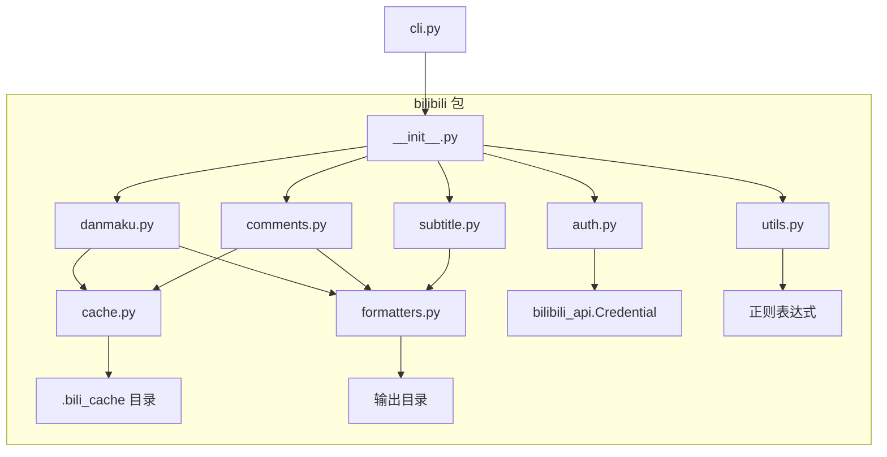
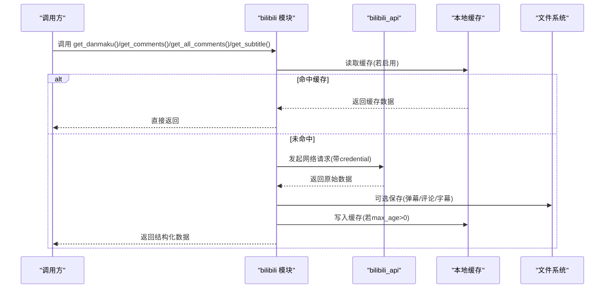
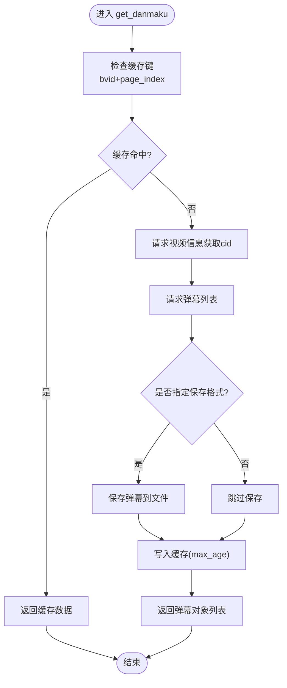
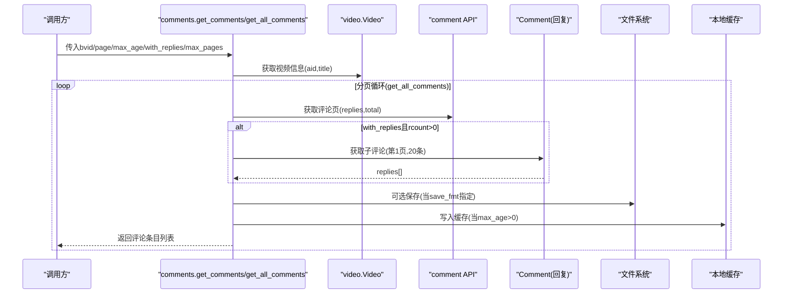
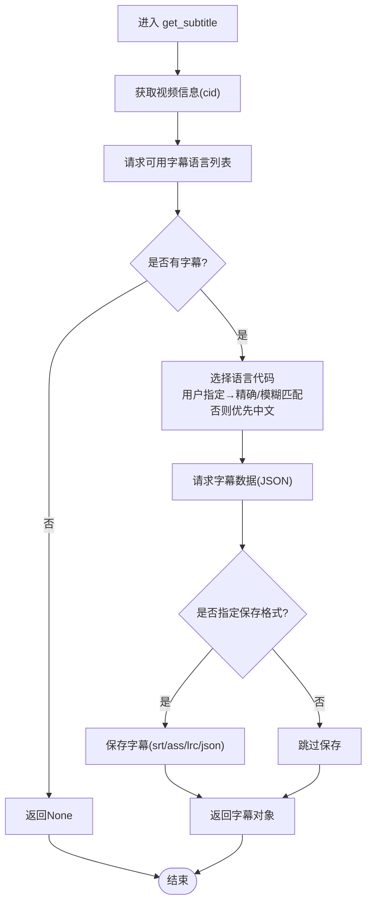
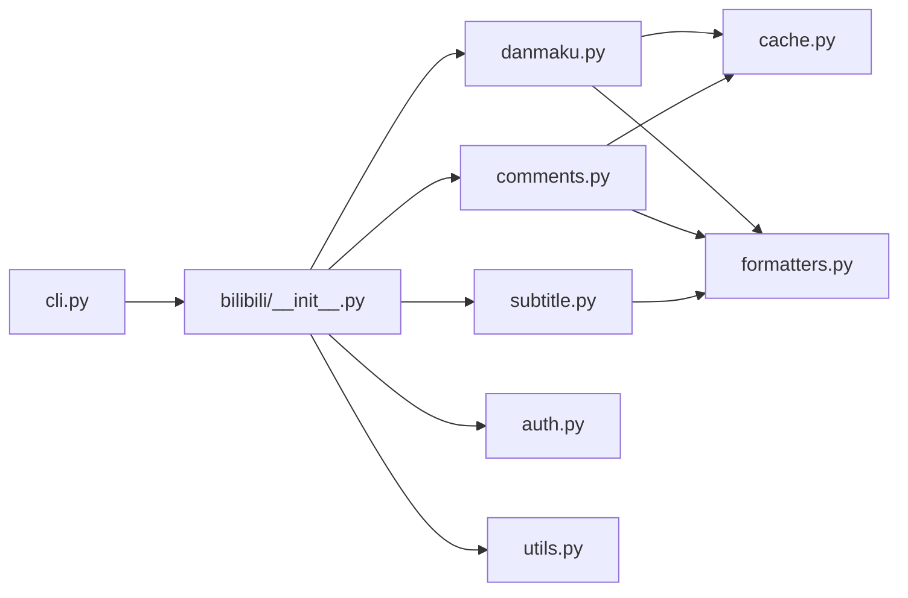

# Python模块API

<cite>
**本文引用的文件**   
- [bilibili/__init__.py](file://bilibili/__init__.py)
- [bilibili/danmaku.py](file://bilibili/danmaku.py)
- [bilibili/comments.py](file://bilibili/comments.py)
- [bilibili/subtitle.py](file://bilibili/subtitle.py)
- [bilibili/auth.py](file://bilibili/auth.py)
- [bilibili/utils.py](file://bilibili/utils.py)
- [bilibili/cache.py](file://bilibili/cache.py)
- [bilibili/formatters.py](file://bilibili/formatters.py)
- [cli.py](file://cli.py)
</cite>

## 目录
1. [简介](#简介)
2. [项目结构](#项目结构)
3. [核心组件](#核心组件)
4. [架构总览](#架构总览)
5. [详细组件分析](#详细组件分析)
6. [依赖关系分析](#依赖关系分析)
7. [性能与最佳实践](#性能与最佳实践)
8. [故障排查指南](#故障排查指南)
9. [结论](#结论)
10. [附录：示例用法路径](#附录示例用法路径)

## 简介
本仓库提供用于抓取B站视频弹幕、评论（含楼中楼回复）以及字幕的Python工具包。模块对外暴露一组异步函数接口，支持缓存、登录凭证注入、多格式保存等能力。主要公共接口包括：
- get_danmaku()：获取视频弹幕
- get_comments()：获取单页评论
- get_all_comments()：全量翻页获取评论
- get_subtitle()：获取视频字幕
- parse_cookie()：解析Cookie为登录凭证
- extract_bvid()：从URL或纯BV号中提取BV号

所有数据获取均为异步调用，返回的数据结构与字段含义在文档中详细说明。

## 项目结构
模块采用按功能划分的分层组织方式：
- bilibili/：核心库
  - __init__.py：统一导出公共API
  - danmaku.py：弹幕抓取
  - comments.py：评论抓取（单页/全量）
  - subtitle.py：字幕抓取
  - auth.py：Cookie解析与凭证构造
  - utils.py：通用工具（如BV号提取）
  - cache.py：基于文件的JSON缓存
  - formatters.py：数据格式化与文件保存
- cli.py：命令行入口，封装上述API的使用流程

图表来源
- [bilibili/__init__.py:1-19](file://bilibili/__init__.py#L1-L19)
- [bilibili/danmaku.py:1-64](file://bilibili/danmaku.py#L1-L64)
- [bilibili/comments.py:1-171](file://bilibili/comments.py#L1-L171)
- [bilibili/subtitle.py:1-77](file://bilibili/subtitle.py#L1-L77)
- [bilibili/auth.py:1-38](file://bilibili/auth.py#L1-L38)
- [bilibili/utils.py:1-28](file://bilibili/utils.py#L1-L28)
- [bilibili/cache.py:1-42](file://bilibili/cache.py#L1-L42)
- [bilibili/formatters.py:1-166](file://bilibili/formatters.py#L1-L166)
- [cli.py:1-118](file://cli.py#L1-L118)

章节来源
- [bilibili/__init__.py:1-19](file://bilibili/__init__.py#L1-L19)
- [cli.py:1-118](file://cli.py#L1-L118)

## 核心组件
- 认证与凭证
  - parse_cookie(cookie_str: str) -> Credential | None：解析包含SESSDATA的Cookie字符串为Credential对象；失败返回None。
- BV号工具
  - extract_bvid(raw: str) -> str：从完整链接或短链中提取BV号；无法解析时抛出ValueError。
- 弹幕
  - get_danmaku(bvid: str, page_index: int = 0, max_age: int = 30, credential: Credential = None, save_fmt: str = None) -> list[DanmakuItem]：异步获取弹幕列表，支持缓存与保存。
- 评论
  - get_comments(bvid: str, page: int = 1, max_age: int = 30, credential: Credential = None, save_fmt: str = None, with_replies: bool = False) -> list[CommentEntry]：异步获取单页评论，可选拉取楼中楼回复。
  - get_all_comments(bvid: str, max_age: int = 30, credential: Credential = None, save_fmt: str = None, with_replies: bool = False, max_pages: int = 0) -> list[CommentEntry]：异步全量翻页获取评论，内置安全上限与空页检测。
- 字幕
  - get_subtitle(bvid: str, page_index: int = 0, credential: Credential = None, lan_code: str = "", save_fmt: str = "srt") -> SubtitleObject | None：异步获取字幕对象，支持自动语言选择与保存。

章节来源
- [bilibili/auth.py:1-38](file://bilibili/auth.py#L1-L38)
- [bilibili/utils.py:1-28](file://bilibili/utils.py#L1-L28)
- [bilibili/danmaku.py:1-64](file://bilibili/danmaku.py#L1-L64)
- [bilibili/comments.py:1-171](file://bilibili/comments.py#L1-L171)
- [bilibili/subtitle.py:1-77](file://bilibili/subtitle.py#L1-L77)

## 架构总览
整体流程围绕“输入校验 → 凭证处理 → 网络请求 → 缓存/保存 → 返回结构化数据”展开。各模块通过bilibili_api进行网络交互，使用本地文件缓存减少重复请求，并通过formatters将结果持久化到多种格式。

图表来源
- [bilibili/danmaku.py:1-64](file://bilibili/danmaku.py#L1-L64)
- [bilibili/comments.py:1-171](file://bilibili/comments.py#L1-L171)
- [bilibili/subtitle.py:1-77](file://bilibili/subtitle.py#L1-L77)
- [bilibili/cache.py:1-42](file://bilibili/cache.py#L1-L42)
- [bilibili/formatters.py:1-166](file://bilibili/formatters.py#L1-L166)

## 详细组件分析

### 弹幕模块 get_danmaku()
- 函数签名
  - async def get_danmaku(bvid: str, page_index: int = 0, max_age: int = 30, credential: Credential = None, save_fmt: str = None) -> list[DanmakuItem]
- 参数说明
  - bvid: 视频BV号（支持纯BV号或完整链接，建议先经extract_bvid处理）
  - page_index: 分P索引，默认0
  - max_age: 缓存有效期秒，0表示禁用缓存
  - credential: 登录凭证，可为None
  - save_fmt: 保存格式，支持txt/json/csv；None不保存
- 返回值
  - 弹幕对象列表（来自bilibili_api），每个元素包含时间、文本、样式等信息
- 行为与限制
  - 优先读取缓存；未命中则请求视频信息与弹幕
  - 可打印前10条弹幕预览
  - 可选保存到指定格式
- 错误处理
  - 网络异常由上层捕获；缓存读写异常会中断并回退到网络请求
- 代码片段路径
  - [bilibili/danmaku.py:13-63](file://bilibili/danmaku.py#L13-L63)

图表来源
- [bilibili/danmaku.py:13-63](file://bilibili/danmaku.py#L13-L63)
- [bilibili/cache.py:14-41](file://bilibili/cache.py#L14-L41)
- [bilibili/formatters.py:101-141](file://bilibili/formatters.py#L101-L141)

章节来源
- [bilibili/danmaku.py:1-64](file://bilibili/danmaku.py#L1-L64)
- [bilibili/cache.py:1-42](file://bilibili/cache.py#L1-L42)
- [bilibili/formatters.py:101-141](file://bilibili/formatters.py#L101-L141)

### 评论模块 get_comments() 与 get_all_comments()
- 函数签名
  - async def get_comments(bvid: str, page: int = 1, max_age: int = 30, credential: Credential = None, save_fmt: str = None, with_replies: bool = False) -> list[CommentEntry]
  - async def get_all_comments(bvid: str, max_age: int = 30, credential: Credential = None, save_fmt: str = None, with_replies: bool = False, max_pages: int = 0) -> list[CommentEntry]
- 参数说明
  - bvid: 视频BV号
  - page: 页码（仅get_comments有效）
  - max_age: 缓存有效期秒
  - credential: 登录凭证
  - save_fmt: 保存格式，支持txt/json/csv
  - with_replies: 是否获取楼中楼回复（每条评论最多第1页、20条）
  - max_pages: 最大页数（0=不限）
- 返回值
  - 评论条目列表，每项为{"comment": {...}, "replies": [...]}
- 行为与限制
  - get_comments：获取单页评论，可选拉取回复；支持缓存
  - get_all_comments：循环翻页直至达到目标页数、空页连续出现、已知总数或安全上限（10000条）；支持回复拉取与进度打印
- 错误处理
  - 拉取回复失败会记录日志并返回空列表，不影响主流程
- 代码片段路径
  - [bilibili/comments.py:42-89](file://bilibili/comments.py#L42-L89)
  - [bilibili/comments.py:92-170](file://bilibili/comments.py#L92-L170)

图表来源
- [bilibili/comments.py:13-40](file://bilibili/comments.py#L13-L40)
- [bilibili/comments.py:42-89](file://bilibili/comments.py#L42-L89)
- [bilibili/comments.py:92-170](file://bilibili/comments.py#L92-L170)
- [bilibili/formatters.py:50-96](file://bilibili/formatters.py#L50-L96)
- [bilibili/cache.py:14-41](file://bilibili/cache.py#L14-L41)

章节来源
- [bilibili/comments.py:1-171](file://bilibili/comments.py#L1-L171)
- [bilibili/formatters.py:50-96](file://bilibili/formatters.py#L50-L96)
- [bilibili/cache.py:1-42](file://bilibili/cache.py#L1-L42)

### 字幕模块 get_subtitle()
- 函数签名
  - async def get_subtitle(bvid: str, page_index: int = 0, credential: Credential = None, lan_code: str = "", save_fmt: str = "srt") -> SubtitleObject | None
- 参数说明
  - bvid: 视频BV号
  - page_index: 分P索引
  - credential: 登录凭证
  - lan_code: 字幕语言代码（如ai-zh、en、ja）；为空时优先中文
  - save_fmt: 保存格式，支持srt/ass/lrc/json
- 返回值
  - 字幕对象（SubtitleObject）；若无字幕返回None
- 行为与限制
  - 自动列出可用语言；用户指定语言优先匹配code，否则模糊匹配doc/code；未匹配则使用第一个
  - 默认优先中文（ai-zh > zh-Hans > zh-Hant）
  - 可选保存至多种格式
- 错误处理
  - 无字幕时返回None并提示
- 代码片段路径
  - [bilibili/subtitle.py:21-76](file://bilibili/subtitle.py#L21-L76)

图表来源
- [bilibili/subtitle.py:21-76](file://bilibili/subtitle.py#L21-L76)
- [bilibili/formatters.py:146-166](file://bilibili/formatters.py#L146-L166)

章节来源
- [bilibili/subtitle.py:1-77](file://bilibili/subtitle.py#L1-L77)
- [bilibili/formatters.py:146-166](file://bilibili/formatters.py#L146-L166)

### 认证与工具
- parse_cookie(cookie_str: str) -> Credential | None
  - 解析Cookie字符串，提取SESSDATA等字段，构造Credential对象；缺失SESSDATA返回None
- extract_bvid(raw: str) -> str
  - 从完整链接或短链中提取BV号；不支持的输入抛出ValueError
- 代码片段路径
  - [bilibili/auth.py:8-37](file://bilibili/auth.py#L8-L37)
  - [bilibili/utils.py:8-27](file://bilibili/utils.py#L8-L27)

章节来源
- [bilibili/auth.py:1-38](file://bilibili/auth.py#L1-L38)
- [bilibili/utils.py:1-28](file://bilibili/utils.py#L1-L28)

## 依赖关系分析
- 外部依赖
  - bilibili_api：提供video、comment、Credential、字幕语言请求等能力
- 内部依赖
  - cache.py：提供缓存键生成、读取、写入
  - formatters.py：提供弹幕/评论/字幕的格式化与保存
  - auth.py / utils.py：提供凭证与BV号工具
- 入口
  - cli.py：组合调用各模块API，形成完整的命令行工作流

图表来源
- [cli.py:18-26](file://cli.py#L18-L26)
- [bilibili/__init__.py:5-18](file://bilibili/__init__.py#L5-L18)
- [bilibili/danmaku.py:9-10](file://bilibili/danmaku.py#L9-L10)
- [bilibili/comments.py:9-10](file://bilibili/comments.py#L9-L10)
- [bilibili/subtitle.py:8](file://bilibili/subtitle.py#L8)

章节来源
- [cli.py:1-118](file://cli.py#L1-L118)
- [bilibili/__init__.py:1-19](file://bilibili/__init__.py#L1-L19)

## 性能与最佳实践
- 异步并发
  - 所有公开接口均为异步函数，建议在调用方使用asyncio.run或事件循环管理并发
  - 批量操作时可并行调用多个独立任务，但需考虑平台限频策略
- 缓存策略
  - 合理设置max_age：频繁访问的数据可适当增大，避免频繁网络请求
  - 对敏感或实时性要求高的数据，可将max_age设为0禁用缓存
- 速率控制
  - 评论回复拉取已内置延时（约0.3秒），避免触发反爬限制
  - 全量翻页默认有安全上限（10000条）与空页检测，防止无限循环
- 保存格式选择
  - txt适合快速查看；json便于后续处理；csv适合表格分析；字幕支持srt/ass/lrc/json
- 凭证管理
  - 使用parse_cookie注入SESSDATA以获得更高权限（如更多评论可见性）
- 资源清理
  - .bili_cache目录会累积缓存文件，定期清理可减少磁盘占用

[本节为通用指导，无需具体文件引用]

## 故障排查指南
- 无法解析BV号
  - 现象：extract_bvid抛出ValueError
  - 排查：确认输入是否为合法BV号或包含bilibili.com/video/或b23.tv的链接
  - 参考路径：[bilibili/utils.py:8-27](file://bilibili/utils.py#L8-L27)
- Cookie无效或缺失SESSDATA
  - 现象：parse_cookie返回None
  - 排查：确保Cookie字符串包含SESSDATA字段
  - 参考路径：[bilibili/auth.py:8-37](file://bilibili/auth.py#L8-L37)
- 评论回复拉取失败
  - 现象：日志显示“回复获取失败 rpid=...”
  - 排查：网络波动或平台限制；可重试或关闭with_replies
  - 参考路径：[bilibili/comments.py:27-39](file://bilibili/comments.py#L27-L39)
- 字幕不可用
  - 现象：get_subtitle返回None并提示“该视频没有字幕”
  - 排查：确认视频是否存在字幕；尝试不同lan_code
  - 参考路径：[bilibili/subtitle.py:47-49](file://bilibili/subtitle.py#L47-L49)
- 缓存未生效
  - 现象：多次调用仍走网络请求
  - 排查：检查max_age是否大于0；确认缓存目录存在且可写
  - 参考路径：[bilibili/cache.py:19-41](file://bilibili/cache.py#L19-L41)

章节来源
- [bilibili/utils.py:1-28](file://bilibili/utils.py#L1-L28)
- [bilibili/auth.py:1-38](file://bilibili/auth.py#L1-L38)
- [bilibili/comments.py:1-171](file://bilibili/comments.py#L1-L171)
- [bilibili/subtitle.py:1-77](file://bilibili/subtitle.py#L1-L77)
- [bilibili/cache.py:1-42](file://bilibili/cache.py#L1-L42)

## 结论
本模块以清晰的异步API封装了B站弹幕、评论与字幕的抓取能力，并提供缓存、凭证、保存等实用特性。通过合理的参数配置与并发策略，可在保证稳定性的前提下提升效率。建议在生产环境中结合业务需求调整缓存策略与速率控制，并对异常进行完善的上层处理。

[本节为总结，无需具体文件引用]

## 附录：示例用法路径
- 弹幕抓取示例
  - 参考实现路径：[bilibili_demo.py:129-153](file://bilibili_demo.py#L129-L153)
- 评论抓取示例（单页/全量）
  - 参考实现路径：[bilibili_demo.py:183-271](file://bilibili_demo.py#L183-L271)
- 字幕抓取示例
  - 参考实现路径：[bilibili_demo.py:302-342](file://bilibili_demo.py#L302-L342)
- CLI入口示例
  - 参考实现路径：[cli.py:63-117](file://cli.py#L63-L117)

章节来源
- [bilibili_demo.py:129-153](file://bilibili_demo.py#L129-L153)
- [bilibili_demo.py:183-271](file://bilibili_demo.py#L183-L271)
- [bilibili_demo.py:302-342](file://bilibili_demo.py#L302-L342)
- [cli.py:63-117](file://cli.py#L63-L117)