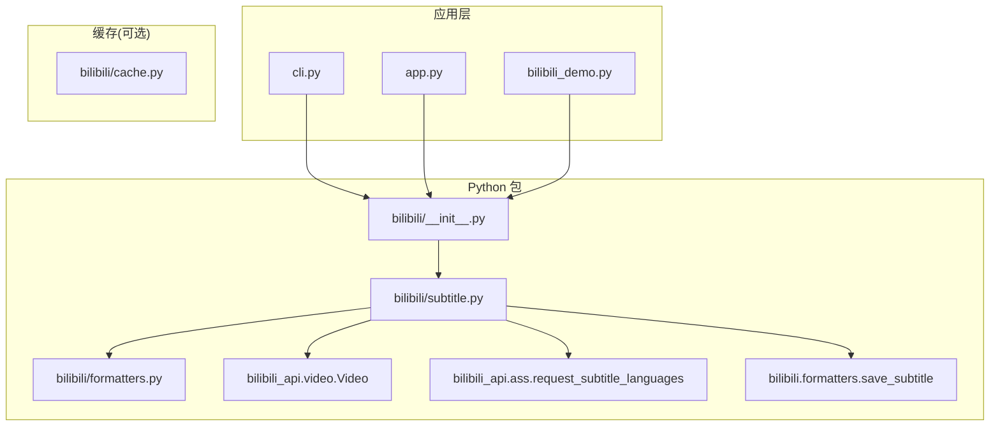
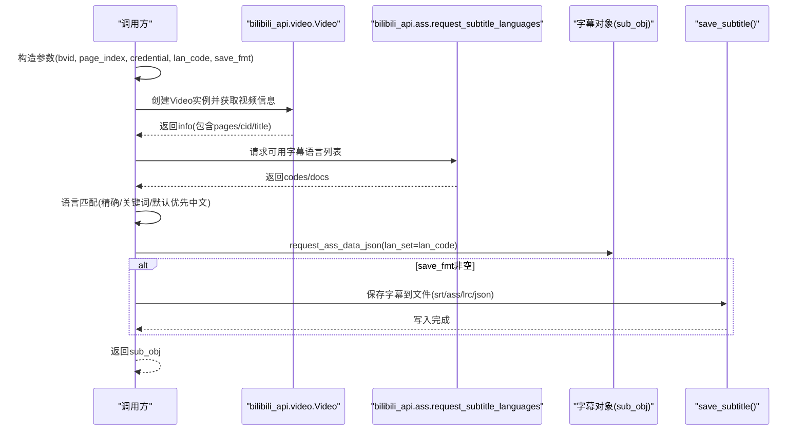
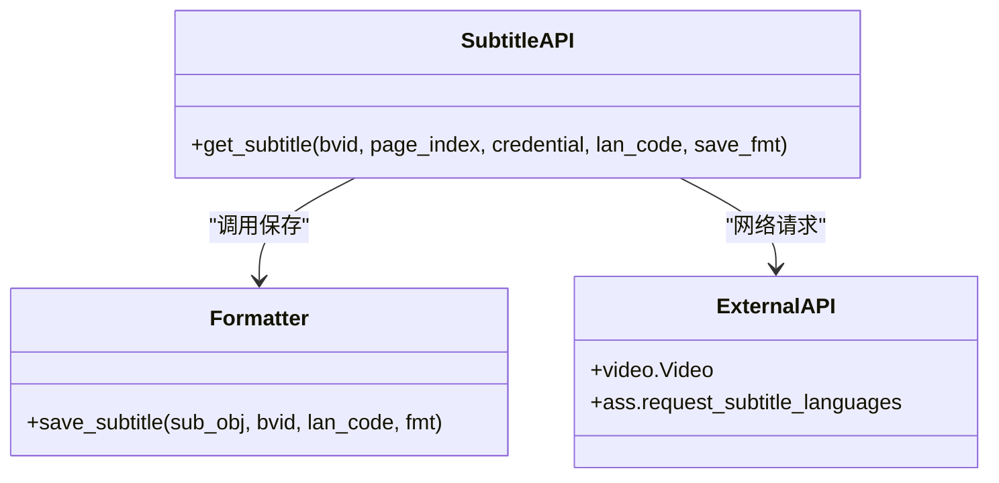

# 字幕API接口

<cite>
**本文引用的文件**
- [subtitle.py](file://bilibili/subtitle.py)
- [formatters.py](file://bilibili/formatters.py)
- [__init__.py](file://bilibili/__init__.py)
- [cache.py](file://bilibili/cache.py)
- [cli.py](file://cli.py)
- [app.py](file://app.py)
- [bilibili_demo.py](file://bilibili_demo.py)
</cite>

## 目录
1. [简介](#简介)
2. [项目结构](#项目结构)
3. [核心组件](#核心组件)
4. [架构总览](#架构总览)
5. [详细组件分析](#详细组件分析)
6. [依赖关系分析](#依赖关系分析)
7. [性能与缓存策略](#性能与缓存策略)
8. [故障排查指南](#故障排查指南)
9. [结论](#结论)
10. [附录：示例与最佳实践](#附录示例与最佳实践)

## 简介
本参考文档聚焦于字幕API接口的完整规范，重点围绕 get_subtitle() 函数进行说明。内容涵盖函数签名、参数语义、返回值格式与数据结构、支持的语言类型及映射、多语言获取与自动匹配流程、字幕文件格式支持与转换选项、特殊字符处理与编码方案，以及性能优化与缓存策略建议。读者无需深入源码即可理解并正确使用该接口。

## 项目结构
本项目将字幕功能封装在 bilibili 包中，并通过 CLI 和 Streamlit 应用暴露使用入口。关键文件职责如下：
- bilibili/subtitle.py：实现 get_subtitle() 核心逻辑，包含语言列表获取、语言自动匹配、数据请求与保存调用。
- bilibili/formatters.py：提供 save_subtitle() 通用保存逻辑，支持 srt/ass/lrc/json 等格式。
- bilibili/__init__.py：统一导出 get_subtitle 等能力，供上层模块或外部导入。
- bilibili/cache.py：基于文件的 JSON 缓存工具（弹幕/评论已使用，字幕可复用）。
- cli.py / app.py / bilibili_demo.py：命令行与 Web 界面入口，演示如何调用 get_subtitle() 并保存结果。

图表来源
- [subtitle.py:1-77](file://bilibili/subtitle.py#L1-L77)
- [formatters.py:144-166](file://bilibili/formatters.py#L144-L166)
- [__init__.py:1-19](file://bilibili/__init__.py#L1-L19)
- [cache.py:1-42](file://bilibili/cache.py#L1-L42)
- [cli.py:1-118](file://cli.py#L1-L118)
- [app.py:1-143](file://app.py#L1-L143)
- [bilibili_demo.py:273-343](file://bilibili_demo.py#L273-L343)

章节来源
- [subtitle.py:1-77](file://bilibili/subtitle.py#L1-L77)
- [formatters.py:144-166](file://bilibili/formatters.py#L144-L166)
- [__init__.py:1-19](file://bilibili/__init__.py#L1-L19)
- [cache.py:1-42](file://bilibili/cache.py#L1-L42)
- [cli.py:1-118](file://cli.py#L1-L118)
- [app.py:1-143](file://app.py#L1-L143)
- [bilibili_demo.py:273-343](file://bilibili_demo.py#L273-L343)

## 核心组件
- get_subtitle(bvid, page_index=0, credential=None, lan_code="", save_fmt="srt")
  - 作用：根据 BV 号获取指定分P的字幕，支持语言自动匹配与多格式保存。
  - 输入参数：
    - bvid: 视频BV号（字符串）
    - page_index: 分P索引（整数，默认0）
    - credential: 登录凭证（Credential对象，可为None）
    - lan_code: 目标语言代码（字符串，如 ai-zh/en/ja/ko；为空则自动选择）
    - save_fmt: 保存格式（字符串，支持 srt/ass/lrc/json；为None时不保存）
  - 返回：
    - 成功：返回字幕对象（sub_obj），可通过其方法转换为不同格式文本或JSON
    - 无字幕：返回 None
  - 副作用：
    - 当 save_fmt 非空时，会在当前工作目录下生成对应格式的文件，文件名形如 subtitle_{bvid}_{lan_code}.{fmt}

- save_subtitle(sub_obj, bvid, lan_code, fmt="srt")
  - 作用：将字幕对象按指定格式保存到文件
  - 支持格式：
    - srt：标准SRT时间轴文本
    - ass：ASS样式字幕
    - lrc：歌词式时间轴文本
    - json：结构化JSON数组（每条含时间与文本字段）

章节来源
- [subtitle.py:21-76](file://bilibili/subtitle.py#L21-L76)
- [formatters.py:144-166](file://bilibili/formatters.py#L144-L166)

## 架构总览
get_subtitle() 的调用链与数据流如下：

图表来源
- [subtitle.py:38-76](file://bilibili/subtitle.py#L38-L76)
- [formatters.py:144-166](file://bilibili/formatters.py#L144-L166)

## 详细组件分析

### get_subtitle() 函数规范
- 函数签名
  - async def get_subtitle(bvid: str, page_index: int = 0, credential: Credential = None, lan_code: str = "", save_fmt: str = "srt")
- 参数说明
  - bvid: 必填。视频BV号。
  - page_index: 可选。分P索引，默认0。
  - credential: 可选。登录凭证，用于访问受限资源。
  - lan_code: 可选。语言代码，若为空则自动匹配。
  - save_fmt: 可选。保存格式，支持 srt/ass/lrc/json；为None时不保存。
- 返回值
  - 成功：返回字幕对象（sub_obj），可用于 to_srt()/to_ass()/to_lrc()/to_simple_json() 等方法。
  - 失败：若无字幕，返回 None。
- 行为细节
  - 先通过 Video.get_info() 获取页面信息，提取 cid。
  - 通过 request_subtitle_languages() 获取可用语言列表 codes/docs。
  - 语言匹配策略：
    - 若传入 lan_code：优先精确匹配 code；否则在 docs/codes 中进行大小写不敏感的部分匹配；仍失败则回退到第一个可用语言。
    - 若未传入 lan_code：默认优先顺序为 ai-zh > zh-Hans > zh-Hant，再回退到首个可用语言。
  - 最终通过 request_ass_data_json(lan_set=lan_code) 拉取字幕数据。
  - 若 save_fmt 非空，调用 save_subtitle() 输出文件。

章节来源
- [subtitle.py:21-76](file://bilibili/subtitle.py#L21-L76)

### 语言类型与映射
- 内置映射表（显示名 → 代码）
  - ai-zh: 中文（AI自动生成）
  - zh-Hans: 中文（简体）
  - zh-Hant: 中文（繁体）
  - en: 英语
  - ja: 日语
  - ko: 韩语
- 自动匹配优先级
  - 用户指定：精确匹配 → 关键词模糊匹配 → 回退首个
  - 未指定：优先 ai-zh → zh-Hans → zh-Hant → 首个可用

章节来源
- [subtitle.py:10-18](file://bilibili/subtitle.py#L10-L18)
- [subtitle.py:53-67](file://bilibili/subtitle.py#L53-L67)

### 字幕文件格式与转换
- 支持格式
  - srt：标准SRT时间轴文本
  - ass：ASS样式字幕
  - lrc：歌词式时间轴文本
  - json：结构化JSON数组（每条含时间与文本字段）
- 保存路径与命名
  - 默认保存在当前工作目录
  - 文件名：subtitle_{bvid}_{lan_code}.{fmt}
- 转换方式
  - 通过字幕对象的 to_srt()/to_ass()/to_lrc()/to_simple_json() 方法进行格式转换

章节来源
- [formatters.py:144-166](file://bilibili/formatters.py#L144-L166)

### 特殊字符处理与编码
- 编码策略
  - 所有文本输出均以 UTF-8 编码写入文件，确保中日韩等多语言字符正确显示。
- 注意事项
  - 若下游系统对BOM有要求，可在读取CSV时采用 utf-8-sig（本项目评论保存已使用该策略，字幕保存统一使用UTF-8）。
  - 建议在终端或编辑器中设置UTF-8环境，避免乱码。

章节来源
- [formatters.py:157-165](file://bilibili/formatters.py#L157-L165)

### 错误处理与边界情况
- 无字幕场景
  - 当视频没有字幕时，函数打印提示并返回 None。
- 语言未匹配
  - 若用户指定的语言无法匹配，会打印提示并回退到第一个可用语言。
- 异常捕获
  - 上层CLI/Web入口对整体流程进行了 try/except 包裹，便于展示错误信息。

章节来源
- [subtitle.py:47-63](file://bilibili/subtitle.py#L47-L63)
- [app.py:137-139](file://app.py#L137-L139)

## 依赖关系分析
- 内部依赖
  - subtitle.py 依赖 formatters.py 的 save_subtitle()
  - __init__.py 统一导出 get_subtitle()
  - cache.py 提供通用缓存工具（字幕可复用）
- 外部依赖
  - bilibili_api.video.Video：获取视频信息与CID
  - bilibili_api.ass.request_subtitle_languages：获取字幕语言列表与数据

图表来源
- [subtitle.py:1-77](file://bilibili/subtitle.py#L1-L77)
- [formatters.py:144-166](file://bilibili/formatters.py#L144-L166)

章节来源
- [subtitle.py:1-77](file://bilibili/subtitle.py#L1-L77)
- [formatters.py:144-166](file://bilibili/formatters.py#L144-L166)
- [__init__.py:1-19](file://bilibili/__init__.py#L1-L19)

## 性能与缓存策略
- 网络请求优化
  - 仅请求必要信息：先获取 info 与语言列表，再按需拉取具体语言字幕。
  - 语言自动匹配减少无效请求，避免多次尝试下载。
- 本地缓存建议
  - 复用 bilibili/cache.py 的缓存机制，对视频信息、语言列表或字幕数据进行缓存，降低重复请求。
  - 缓存键设计：结合 bvid、page_index、lan_code、save_fmt 等维度生成唯一键。
  - 过期策略：根据业务需求设置 max_age（例如30秒至数小时不等）。
- 并发与限流
  - 批量抓取时可引入异步并发，但需控制并发度以避免触发平台限流。
- 存储优化
  - 大体积字幕优先使用 srt/ass 文本格式；需要二次处理时使用 json 格式。

章节来源
- [cache.py:1-42](file://bilibili/cache.py#L1-L42)

## 故障排查指南
- 常见问题
  - 返回 None：表示该视频无字幕。检查 bv_id 是否正确，或确认视频是否提供字幕。
  - 语言未匹配：检查传入的 lan_code 是否为可用语言之一，或允许自动匹配。
  - 编码问题：确保终端/编辑器设置为UTF-8；必要时在读取CSV时启用 utf-8-sig。
- 定位步骤
  - 查看控制台日志中的“可用语言”列表，确认目标语言是否存在。
  - 检查生成的文件名是否符合 subtitle_{bvid}_{lan_code}.{fmt} 规则。
  - 若使用 Cookie 登录，确认凭证有效且包含必要字段。

章节来源
- [subtitle.py:47-63](file://bilibili/subtitle.py#L47-L63)
- [app.py:137-139](file://app.py#L137-L139)

## 结论
get_subtitle() 提供了简洁而强大的字幕获取能力，支持多语言自动匹配与多种格式保存。通过合理的语言选择策略与统一的编码处理，能够稳定地满足大多数使用场景。结合缓存与并发策略，可进一步提升性能与用户体验。

## 附录：示例与最佳实践

### 基本用法（获取英文字幕并保存为SRT）
- 调用方式
  - 通过 CLI：python cli.py BVxxxxx -s --sub-lan en --save srt
  - 通过 Python 包：from bilibili import get_subtitle; await get_subtitle("BVxxxxx", lan_code="en", save_fmt="srt")
- 说明
  - 若省略 lan_code，将自动优先选择中文相关字幕。

章节来源
- [cli.py:83-90](file://cli.py#L83-L90)
- [__init__.py:9-18](file://bilibili/__init__.py#L9-L18)

### 多语言字幕获取与自动匹配
- 自动匹配流程
  - 未指定 lan_code：优先 ai-zh → zh-Hans → zh-Hant → 首个可用语言
  - 指定 lan_code：精确匹配 → 关键词模糊匹配 → 回退首个
- 适用场景
  - 面向国际用户的视频，自动选择最接近的语言以提升体验。

章节来源
- [subtitle.py:53-67](file://bilibili/subtitle.py#L53-L67)

### 保存为不同格式
- SRT/ASS/LRC/JSON
  - 通过 save_fmt 指定格式，文件将保存在当前工作目录。
- 文件名约定
  - subtitle_{bvid}_{lan_code}.{fmt}

章节来源
- [formatters.py:144-166](file://bilibili/formatters.py#L144-L166)

### 在Streamlit应用中集成
- 入口
  - app.py 提供图形化界面，支持选择字幕语言与保存格式。
- 交互
  - 用户选择语言后，界面会调用 get_subtitle() 并生成下载按钮。

章节来源
- [app.py:82-92](file://app.py#L82-L92)

### 在命令行脚本中使用
- 入口
  - cli.py 提供命令行参数，支持 -s/--subtitle、--sub-lan、--save 等。
- 示例
  - python cli.py BVxxxxx -s --sub-lan ja --save ass

章节来源
- [cli.py:46-58](file://cli.py#L46-L58)
- [cli.py:83-90](file://cli.py#L83-L90)

### 在演示脚本中使用
- 入口
  - bilibili_demo.py 同时实现了字幕获取与保存逻辑，可作为参考实现。
- 注意
  - 演示脚本内也定义了 get_subtitle() 与 save_subtitle()，与包内实现一致。

章节来源
- [bilibili_demo.py:273-343](file://bilibili_demo.py#L273-L343)