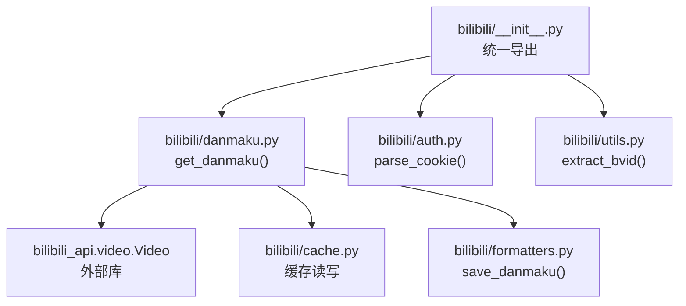
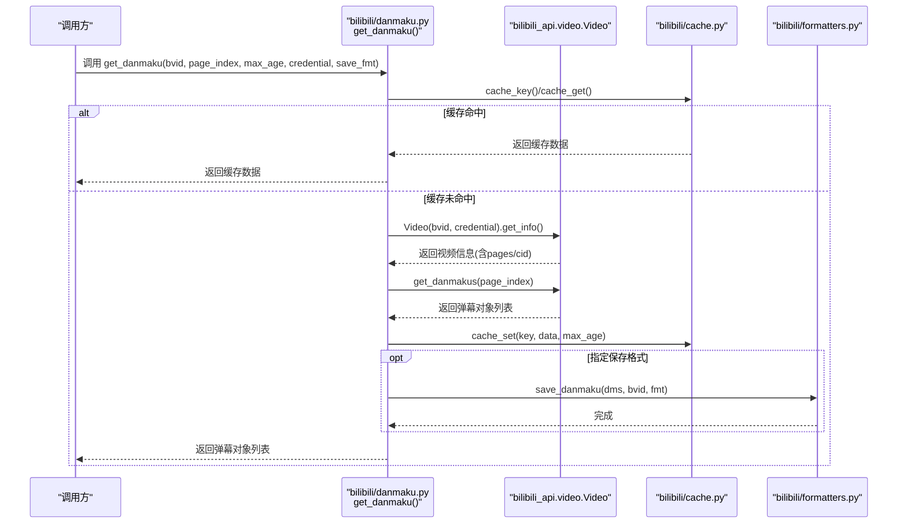
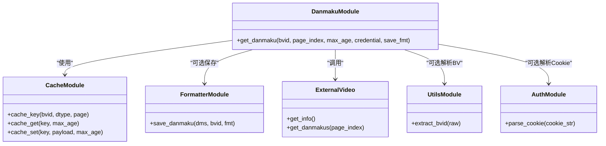

# 弹幕API接口

<cite>
**本文引用的文件**   
- [bilibili/danmaku.py](file://bilibili/danmaku.py)
- [bilibili/__init__.py](file://bilibili/__init__.py)
- [bilibili/auth.py](file://bilibili/auth.py)
- [bilibili/utils.py](file://bilibili/utils.py)
- [bilibili/cache.py](file://bilibili/cache.py)
- [bilibili/formatters.py](file://bilibili/formatters.py)
- [bilibili_demo.py](file://bilibili_demo.py)
</cite>

## 目录
1. [简介](#简介)
2. [项目结构](#项目结构)
3. [核心组件](#核心组件)
4. [架构总览](#架构总览)
5. [详细组件分析](#详细组件分析)
6. [依赖关系分析](#依赖关系分析)
7. [性能与缓存优化](#性能与缓存优化)
8. [故障排查指南](#故障排查指南)
9. [结论](#结论)
10. [附录：示例与最佳实践](#附录示例与最佳实践)

## 简介
本参考文档聚焦于“弹幕API接口”，围绕 get_danmaku() 函数提供完整的API规范、参数说明、返回值格式与数据结构，并给出同步/异步调用方式、错误处理、分页（多P）获取方法以及性能优化与缓存使用建议。该模块基于 bilibili-api-python 提供的视频与弹幕能力，封装了缓存、格式化与保存等通用流程，便于在业务中快速集成。

## 项目结构
本项目采用按功能划分的模块化组织方式，核心弹幕相关代码位于 bilibili/danmaku.py，并通过包入口统一导出；认证、工具、缓存与格式化分别由独立模块承担，便于复用与维护。

图示来源
- [bilibili/__init__.py:1-19](file://bilibili/__init__.py#L1-L19)
- [bilibili/danmaku.py:1-64](file://bilibili/danmaku.py#L1-L64)
- [bilibili/cache.py:1-42](file://bilibili/cache.py#L1-L42)
- [bilibili/formatters.py:101-141](file://bilibili/formatters.py#L101-L141)
- [bilibili/auth.py:1-38](file://bilibili/auth.py#L1-L38)
- [bilibili/utils.py:1-28](file://bilibili/utils.py#L1-L28)

章节来源
- [bilibili/__init__.py:1-19](file://bilibili/__init__.py#L1-L19)
- [bilibili/danmaku.py:1-64](file://bilibili/danmaku.py#L1-L64)

## 核心组件
- get_danmaku(bvid, page_index=0, max_age=30, credential=None, save_fmt=None)
  - 作用：根据BV号与分P索引获取弹幕数据，支持缓存命中、可选保存到文件。
  - 输入参数：
    - bvid: 字符串，视频的BV号或可解析的链接（可通过 extract_bvid 预处理）。
    - page_index: 整数，分P索引（默认0表示第一P）。
    - max_age: 整数秒，缓存有效期；为0时禁用缓存。
    - credential: Credential 对象（来自 bilibili_api），用于需要登录态的请求。
    - save_fmt: 字符串，可选 "txt"/"json"/"csv"，指定保存格式；None 不保存。
  - 返回：原始弹幕对象列表（来自 bilibili_api.video.Video.get_danmakus），每个元素包含 dm_time/text/mode/font_size/color/uid 等属性。
  - 副作用：
    - 若命中缓存则直接返回缓存结果。
    - 未命中则请求视频信息以定位 cid，再拉取弹幕。
    - 将结果写入缓存（受 max_age 控制）。
    - 若指定 save_fmt，调用 save_danmaku 持久化到文件。

章节来源
- [bilibili/danmaku.py:13-63](file://bilibili/danmaku.py#L13-L63)
- [bilibili/formatters.py:101-141](file://bilibili/formatters.py#L101-L141)
- [bilibili/cache.py:14-41](file://bilibili/cache.py#L14-L41)

## 架构总览
下图展示了 get_danmaku() 的调用链路与关键交互点：从入口导入、凭证解析、缓存判断、视频信息查询、弹幕抓取、缓存落盘与可选文件保存。

图示来源
- [bilibili/danmaku.py:13-63](file://bilibili/danmaku.py#L13-L63)
- [bilibili/cache.py:14-41](file://bilibili/cache.py#L14-L41)
- [bilibili/formatters.py:101-141](file://bilibili/formatters.py#L101-L141)

## 详细组件分析

### get_danmaku() API 规范
- 函数签名
  - async def get_danmaku(bvid: str, page_index: int = 0, max_age: int = 30, credential: Credential = None, save_fmt: str = None)
- 参数说明
  - bvid: 必填。支持纯BV号或可被 extract_bvid 解析的链接。
  - page_index: 可选。分P索引，默认0。
  - max_age: 可选。缓存有效期（秒），0 表示禁用缓存。
  - credential: 可选。Credential 对象，用于需要登录态的访问。
  - save_fmt: 可选。保存格式 "txt"/"json"/"csv"，None 不保存。
- 返回值
  - 类型：list[DanmakuItem]，其中 DanmakuItem 为 bilibili_api 返回的弹幕对象，至少包含以下字段：
    - dm_time: 浮点数，弹幕时间（秒）
    - text: 字符串，弹幕文本
    - mode: 整数，弹幕显示模式
    - font_size: 整数，字体大小
    - color: 整数，颜色值
    - uid: 整数，发送者用户ID
- 行为说明
  - 优先尝试缓存命中；命中则直接返回。
  - 未命中则通过 video.Video.get_info() 获取 pages 列表，依据 page_index 定位 cid。
  - 调用 video.Video.get_danmakus(page_index=page_index) 获取弹幕。
  - 将结果写入缓存（受 max_age 控制）。
  - 如指定 save_fmt，调用 save_danmaku 进行持久化。

章节来源
- [bilibili/danmaku.py:13-63](file://bilibili/danmaku.py#L13-L63)
- [bilibili/formatters.py:101-141](file://bilibili/formatters.py#L101-L141)

### 弹幕数据字段含义
- time / dm_time: 弹幕出现时间（秒），浮点数。
- text: 弹幕内容（字符串）。
- mode: 弹幕显示模式（整数），不同数值对应滚动、顶部、底部、逆向等显示方式。
- font_size: 字体大小（整数）。
- color: 颜色值（整数），通常为RGB整型编码。
- uid: 发送弹幕的用户ID（整数）。

章节来源
- [bilibili/danmaku.py:47-56](file://bilibili/danmaku.py#L47-L56)
- [bilibili/formatters.py:107-136](file://bilibili/formatters.py#L107-L136)
- [bilibili_demo.py:111-122](file://bilibili_demo.py#L111-L122)

### 分页与多P视频弹幕获取
- 单P获取：传入 page_index=0（默认）即可获取第一P弹幕。
- 多P获取：遍历目标视频的 pages 列表，依次对每个 page_index 调用 get_danmaku()。
- 注意事项：
  - 需先通过 video.Video.get_info() 获取 pages 列表，确认有效页码范围。
  - 各P的弹幕相互独立，cid 不同，缓存键会因 page_index 不同而区分。

章节来源
- [bilibili/danmaku.py:36-42](file://bilibili/danmaku.py#L36-L42)
- [bilibili_demo.py:137-143](file://bilibili_demo.py#L137-L143)

### 同步与异步调用方式
- 异步调用（推荐）
  - 直接使用 await get_danmaku(...)。
  - 适合高并发场景，结合 asyncio.gather 批量拉取多个视频弹幕。
- 同步调用
  - 在同步环境中通过 asyncio.run(get_danmaku(...)) 包装执行。
  - 注意避免阻塞事件循环。

章节来源
- [bilibili/danmaku.py:13-63](file://bilibili/danmaku.py#L13-L63)
- [bilibili_demo.py:414-451](file://bilibili_demo.py#L414-L451)

### 错误处理与异常捕获
- 常见异常来源
  - BV号解析失败：extract_bvid 抛出 ValueError。
  - 网络请求失败：video.Video.get_info/get_danmakus 可能抛出网络异常。
  - 缓存I/O异常：磁盘不可写、JSON解析失败等。
- 建议策略
  - 在调用处使用 try/except 捕获异常，记录日志并降级处理（例如跳过当前视频、重试或回退到无缓存模式）。
  - 对 credential 为空但需要登录态的场景，提前校验并提示用户补充 Cookie。

章节来源
- [bilibili/utils.py:8-27](file://bilibili/utils.py#L8-L27)
- [bilibili/danmaku.py:36-63](file://bilibili/danmaku.py#L36-L63)
- [bilibili_demo.py:403-412](file://bilibili_demo.py#L403-L412)

### 保存与格式化
- 支持格式
  - txt：每行一条弹幕，带时间戳前缀。
  - json：结构化数组，字段包括 time_s/text/mode/font_size/color/uid。
  - csv：表格形式，列名同上。
- 输出位置
  - 默认在项目根目录生成 danmaku_{bvid}.{fmt} 文件。

章节来源
- [bilibili/formatters.py:101-141](file://bilibili/formatters.py#L101-L141)

## 依赖关系分析
- 内部依赖
  - get_danmaku 依赖：
    - cache 模块：生成缓存键、读取/写入缓存。
    - formatters 模块：保存弹幕到文件。
    - utils/auth 模块：辅助提取BV号与解析Cookie为Credential。
- 外部依赖
  - bilibili_api.video.Video：负责视频信息与弹幕数据的获取。

图示来源
- [bilibili/danmaku.py:1-64](file://bilibili/danmaku.py#L1-L64)
- [bilibili/cache.py:1-42](file://bilibili/cache.py#L1-L42)
- [bilibili/formatters.py:101-141](file://bilibili/formatters.py#L101-L141)
- [bilibili/utils.py:1-28](file://bilibili/utils.py#L1-L28)
- [bilibili/auth.py:1-38](file://bilibili/auth.py#L1-L38)

章节来源
- [bilibili/__init__.py:1-19](file://bilibili/__init__.py#L1-L19)
- [bilibili/danmaku.py:1-64](file://bilibili/danmaku.py#L1-L64)

## 性能与缓存优化
- 缓存策略
  - 启用缓存：设置 max_age > 0，相同 bvid+page_index 的结果会被缓存到 .bili_cache 目录。
  - 禁用缓存：max_age=0 将绕过缓存，每次均发起网络请求。
  - 合理设置过期时间：热门视频可设置较长缓存时间，减少重复请求。
- 批量与并发
  - 使用 asyncio.gather 并发拉取多个视频的弹幕，提升吞吐。
  - 对多P视频，建议逐P顺序或有限并发，避免瞬时压力过大。
- I/O优化
  - 大体积弹幕保存为 json/csv 便于后续处理；txt 仅用于快速预览。
  - 避免频繁小文件写入，必要时合并写入或延迟落盘。
- 资源限制
  - 对评论/字幕等其他接口保持合理的延时与重试策略，避免触发平台限流。

章节来源
- [bilibili/cache.py:1-42](file://bilibili/cache.py#L1-L42)
- [bilibili/danmaku.py:30-34](file://bilibili/danmaku.py#L30-L34)
- [bilibili_demo.py:447-449](file://bilibili_demo.py#L447-L449)

## 故障排查指南
- BV号无法解析
  - 现象：抛出 ValueError。
  - 排查：检查输入是否为合法BV号或完整链接；使用 extract_bvid 预处理。
- 登录态缺失
  - 现象：部分受限内容无法获取。
  - 排查：通过 parse_cookie 正确构造 Credential，确保 SESSDATA 等必要字段存在。
- 缓存问题
  - 现象：旧数据未更新或缓存文件损坏。
  - 排查：删除 .bili_cache 下对应文件；调整 max_age；检查磁盘权限。
- 网络异常
  - 现象：get_info/get_danmakus 抛错。
  - 排查：检查网络连通性、代理配置；增加重试与超时控制。

章节来源
- [bilibili/utils.py:8-27](file://bilibili/utils.py#L8-L27)
- [bilibili/auth.py:8-37](file://bilibili/auth.py#L8-L37)
- [bilibili/cache.py:19-28](file://bilibili/cache.py#L19-L28)

## 结论
get_danmaku() 提供了简洁一致的弹幕获取接口，内置缓存与可选的文件保存能力，适用于多种业务场景。通过合理设置 page_index 可实现多P弹幕获取；配合 Credential 可访问受限内容。在生产环境建议结合并发与缓存策略，并做好异常处理与监控。

## 附录：示例与最佳实践
- 基本用法（异步）
  - 直接 await get_danmaku(bvid, page_index=0, max_age=30, credential=None, save_fmt=None)。
- 多P弹幕获取
  - 先调用 get_info() 获取 pages 列表，再遍历 page_index 逐个调用 get_danmaku()。
- 保存为不同格式
  - save_fmt="json"/"csv"/"txt"，按需选择。
- 并发拉取
  - 使用 asyncio.gather 并行处理多个视频，注意限流与错误隔离。
- 凭证管理
  - 使用 parse_cookie 从 Cookie 字符串构建 Credential，确保包含 SESSDATA。

章节来源
- [bilibili/danmaku.py:13-63](file://bilibili/danmaku.py#L13-L63)
- [bilibili_demo.py:129-153](file://bilibili_demo.py#L129-L153)
- [bilibili/auth.py:8-37](file://bilibili/auth.py#L8-L37)