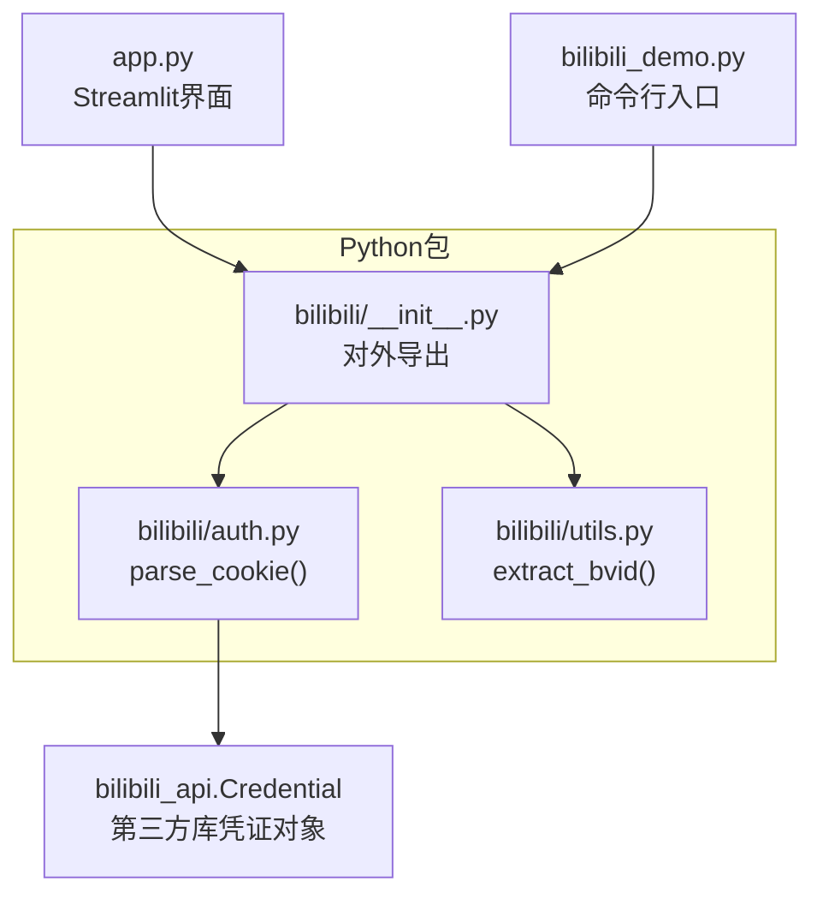
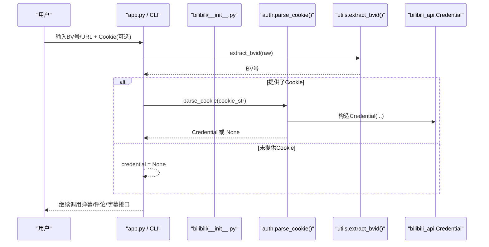
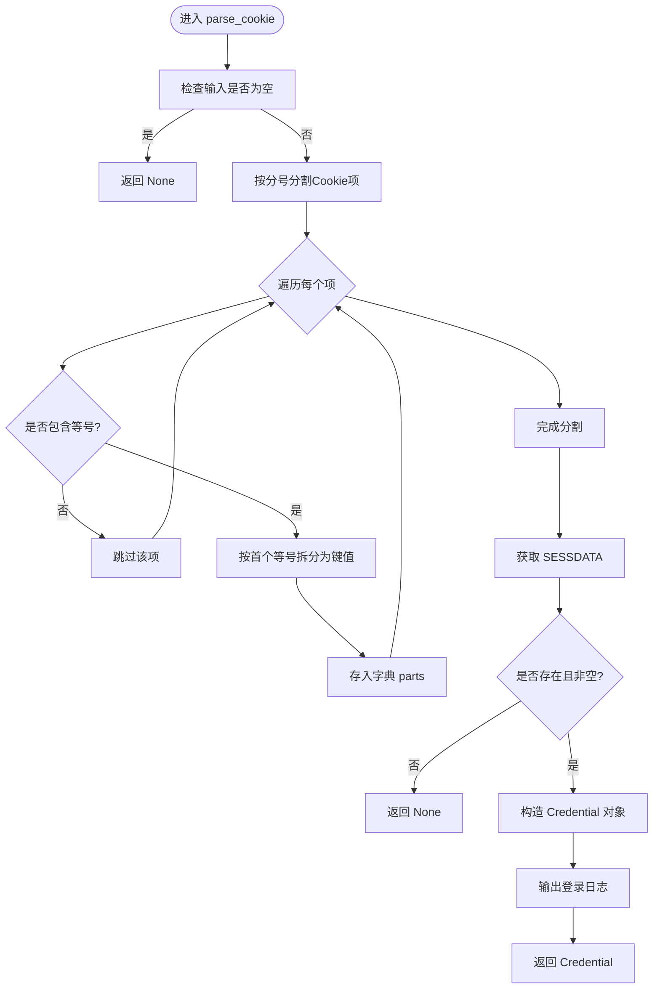
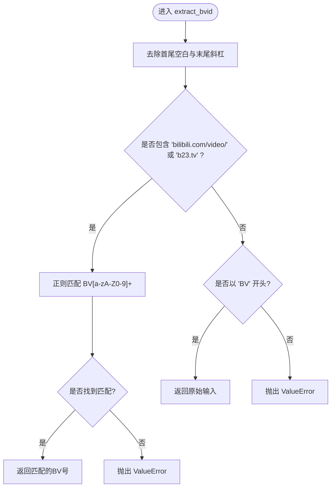
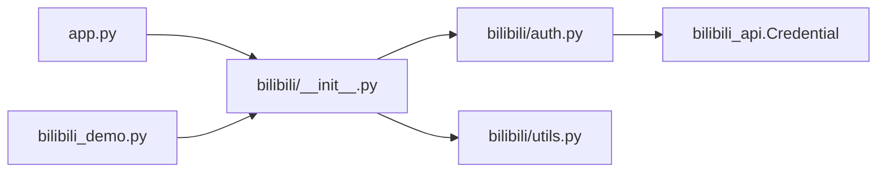

# 认证和工具API

<cite>
**本文引用的文件**   
- [bilibili/auth.py](file://bilibili/auth.py)
- [bilibili/utils.py](file://bilibili/utils.py)
- [bilibili/__init__.py](file://bilibili/__init__.py)
- [bilibili_demo.py](file://bilibili_demo.py)
- [app.py](file://app.py)
- [README.md](file://README.md)
</cite>

## 目录
1. [简介](#简介)
2. [项目结构](#项目结构)
3. [核心组件](#核心组件)
4. [架构总览](#架构总览)
5. [详细组件分析](#详细组件分析)
6. [依赖关系分析](#依赖关系分析)
7. [性能与可用性考虑](#性能与可用性考虑)
8. [故障排查指南](#故障排查指南)
9. [安全最佳实践与Cookie管理建议](#安全最佳实践与cookie管理建议)
10. [结论](#结论)

## 简介
本参考文档聚焦于认证与工具相关的两个核心函数：parse_cookie() 与 extract_bvid()，提供完整的API规范、参数说明、返回值格式、使用场景与示例。同时说明 Cookie 字符串解析规则、Credential 对象构建过程、BV号提取支持的URL格式、认证状态管理与凭证验证机制，并给出常见问题排查方法与解决方案，以及安全最佳实践与Cookie管理建议。

## 项目结构
本项目围绕B站弹幕/评论/字幕抓取能力组织代码，其中认证与工具相关逻辑位于 bilibili 包内：
- auth.py：实现 parse_cookie()，将浏览器Cookie字符串解析为 bilibili_api.Credential 对象
- utils.py：实现 extract_bvid()，从多种输入格式中提取BV号
- __init__.py：统一对外暴露 parse_cookie 与 extract_bvid 等接口
- app.py：Streamlit Web界面，调用上述接口完成用户交互与任务执行
- bilibili_demo.py：命令行脚本，复用相同的核心函数实现CLI入口

图表来源
- [bilibili/auth.py:1-38](file://bilibili/auth.py#L1-L38)
- [bilibili/utils.py:1-28](file://bilibili/utils.py#L1-L28)
- [bilibili/__init__.py:1-19](file://bilibili/__init__.py#L1-L19)
- [app.py:1-200](file://app.py#L1-L200)
- [bilibili_demo.py:1-452](file://bilibili_demo.py#L1-L452)

章节来源
- [bilibili/auth.py:1-38](file://bilibili/auth.py#L1-L38)
- [bilibili/utils.py:1-28](file://bilibili/utils.py#L1-L28)
- [bilibili/__init__.py:1-19](file://bilibili/__init__.py#L1-L19)
- [app.py:1-200](file://app.py#L1-L200)
- [bilibili_demo.py:1-452](file://bilibili_demo.py#L1-L452)

## 核心组件
本节对两个核心函数进行完整API规范说明。

### parse_cookie(cookie_str: str) -> Credential | None
- 功能：解析浏览器Cookie字符串，构造 bilibili_api.Credential 对象用于后续API鉴权
- 参数：
  - cookie_str: 包含SESSDATA的Cookie字符串（键值对以分号分隔）
- 返回：
  - 成功：Credential 对象（来自 bilibili_api）
  - 失败：None（当输入为空或缺少SESSDATA时）
- 行为要点：
  - 按分号分割Cookie项，再按首个等号拆分键值
  - 必须存在SESSDATA字段，否则返回None
  - 可选字段包括 bili_jct、buvid3、DedeUserID，缺失时使用空串填充
  - 成功时输出日志提示已加载Cookie凭证
- 使用场景：
  - 在命令行或Web界面中，用户粘贴Cookie后，通过该函数生成凭证对象传递给视频/评论/字幕模块

章节来源
- [bilibili/auth.py:8-37](file://bilibili/auth.py#L8-L37)
- [bilibili_demo.py:346-363](file://bilibili_demo.py#L346-L363)

### extract_bvid(raw: str) -> str
- 功能：从多种输入格式中提取BV号
- 参数：
  - raw: 原始输入，支持纯BV号、完整链接、短链接等
- 返回：
  - 成功：BV号字符串（形如 BVxxxxxxxxxx）
  - 失败：抛出 ValueError（无法解析时）
- 行为要点：
  - 去除首尾空白与末尾斜杠
  - 若输入包含“bilibili.com/video/”或“b23.tv”，则使用正则匹配BV号
  - 若输入以“BV”开头，直接返回
  - 其他情况抛出异常
- 使用场景：
  - 用户在界面或命令行输入视频链接或BV号时，先规范化为BV号再进行后续操作

章节来源
- [bilibili/utils.py:8-27](file://bilibili/utils.py#L8-L27)
- [bilibili_demo.py:403-412](file://bilibili_demo.py#L403-L412)

## 架构总览
下图展示了从用户输入到最终调用第三方库凭证对象的流程，以及工具函数如何被上层应用集成。

图表来源
- [bilibili/__init__.py:5-18](file://bilibili/__init__.py#L5-L18)
- [bilibili/auth.py:8-37](file://bilibili/auth.py#L8-L37)
- [bilibili/utils.py:8-27](file://bilibili/utils.py#L8-L27)
- [app.py:50-56](file://app.py#L50-L56)
- [bilibili_demo.py:414-418](file://bilibili_demo.py#L414-L418)

## 详细组件分析

### 组件A：parse_cookie() 详解
- 设计模式：轻量级解析器，负责将浏览器Cookie字符串转换为 bilibili_api.Credential 对象
- 数据结构与复杂度：
  - 时间复杂度：O(n)，n为Cookie项数量（按分号分割）
  - 空间复杂度：O(k)，k为键值对数量
- 依赖链：
  - 依赖 bilibili_api.Credential 作为目标对象类型
- 错误处理：
  - 输入为空或缺少SESSDATA时返回None
- 优化机会：
  - 可引入更严格的字段校验与白名单过滤
  - 可增加对重复键的处理策略（当前仅保留最后一个）

图表来源
- [bilibili/auth.py:18-37](file://bilibili/auth.py#L18-L37)

章节来源
- [bilibili/auth.py:8-37](file://bilibili/auth.py#L8-L37)

### 组件B：extract_bvid() 详解
- 设计模式：输入规范化与正则提取器
- 数据结构与复杂度：
  - 时间复杂度：O(m)，m为输入长度（strip/rstrip与正则匹配）
  - 空间复杂度：O(1)
- 依赖链：
  - 依赖标准库 re 模块进行正则匹配
- 错误处理：
  - 无法识别的输入抛出 ValueError
- 优化机会：
  - 可预编译正则表达式以提升性能
  - 可增加更多URL格式的显式支持分支

图表来源
- [bilibili/utils.py:20-27](file://bilibili/utils.py#L20-L27)

章节来源
- [bilibili/utils.py:8-27](file://bilibili/utils.py#L8-L27)

### 使用示例与场景
- parse_cookie() 典型用法：
  - 用户在界面输入Cookie字符串（含SESSDATA），调用 parse_cookie() 得到 Credential 对象，随后传入视频/评论/字幕模块
  - 命令行模式下通过 --cookie 参数传入Cookie字符串
- extract_bvid() 典型用法：
  - 用户输入纯BV号、完整链接或短链接，调用 extract_bvid() 得到标准化BV号后再进行后续操作

章节来源
- [app.py:50-56](file://app.py#L50-L56)
- [bilibili_demo.py:414-418](file://bilibili_demo.py#L414-L418)

## 依赖关系分析
- 内部依赖：
  - __init__.py 导出 parse_cookie 与 extract_bvid，供 app.py 与 bilibili_demo.py 使用
- 外部依赖：
  - parse_cookie() 依赖 bilibili_api.Credential 作为凭证对象类型
- 耦合与内聚：
  - 认证与工具模块职责清晰，低耦合；上层应用通过包导出统一接入

图表来源
- [bilibili/__init__.py:5-18](file://bilibili/__init__.py#L5-L18)
- [bilibili/auth.py:5-37](file://bilibili/auth.py#L5-L37)
- [app.py:13-56](file://app.py#L13-L56)
- [bilibili_demo.py:414-418](file://bilibili_demo.py#L414-L418)

章节来源
- [bilibili/__init__.py:5-18](file://bilibili/__init__.py#L5-L18)
- [bilibili/auth.py:5-37](file://bilibili/auth.py#L5-L37)
- [app.py:13-56](file://app.py#L13-L56)
- [bilibili_demo.py:414-418](file://bilibili_demo.py#L414-L418)

## 性能与可用性考虑
- 解析效率：
  - parse_cookie() 与 extract_bvid() 均为线性时间复杂度，适合高频调用
- 缓存与重试：
  - 上层模块（弹幕/评论/字幕）实现了本地缓存与分页控制，避免频繁网络请求
- 用户体验：
  - 界面与CLI均提供清晰的输入提示与错误反馈，便于快速定位问题

[本节为通用指导，不直接分析具体文件]

## 故障排查指南
- 常见认证问题：
  - 缺少SESSDATA：parse_cookie() 会返回None，导致后续API鉴权失败
  - Cookie过期或被风控：需重新登录并更新Cookie
  - 字段缺失：bili_jct、buvid3、DedeUserID缺失不影响基本鉴权，但可能影响部分受限接口
- 常见BV号解析问题：
  - 输入格式不支持：extract_bvid() 会抛出ValueError，请检查是否为纯BV号、完整链接或短链接
- 排查步骤：
  - 确认输入是否正确（无多余空格、末尾斜杠）
  - 确认Cookie中包含SESSDATA
  - 查看界面或控制台输出的日志提示

章节来源
- [bilibili/auth.py:18-37](file://bilibili/auth.py#L18-L37)
- [bilibili/utils.py:20-27](file://bilibili/utils.py#L20-L27)
- [app.py:50-56](file://app.py#L50-L56)

## 安全最佳实践与Cookie管理建议
- 最小权限原则：
  - 仅在需要时传递Cookie，避免全局存储
- 传输与存储安全：
  - 不在日志中打印完整Cookie，必要时脱敏显示
  - 避免将Cookie提交到不受信任的服务端
- 生命周期管理：
  - 定期刷新Cookie，避免长期有效导致的泄露风险
- 环境隔离：
  - 开发环境与生产环境使用不同的Cookie与凭据
- 合规性：
  - 遵守平台服务条款与隐私政策，合理使用Cookie

[本节为通用指导，不直接分析具体文件]

## 结论
parse_cookie() 与 extract_bvid() 分别承担认证凭证构建与输入规范化两大职责，配合 bilibili_api.Credential 与上层应用形成简洁可靠的认证与工具链路。遵循本文档的API规范与安全建议，可有效提升系统的稳定性与安全性。