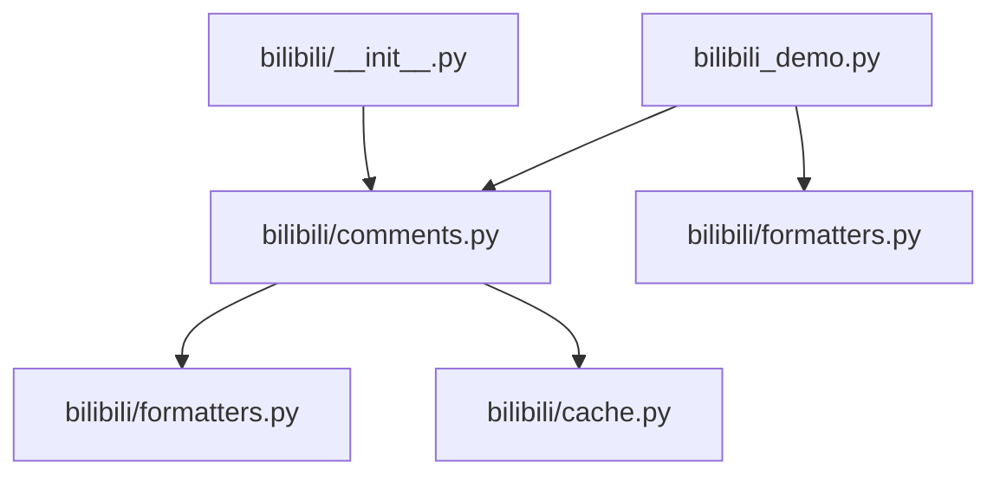
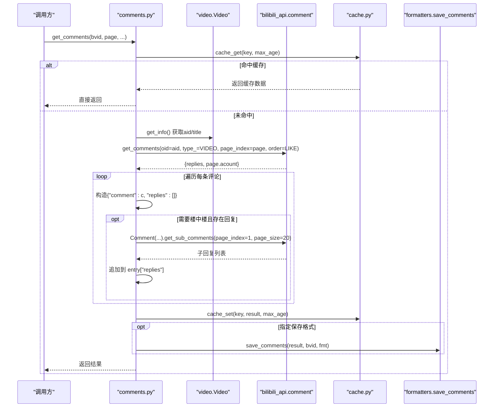
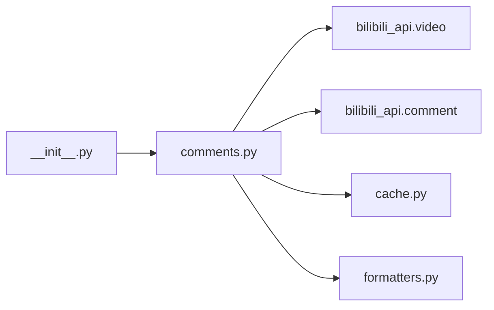
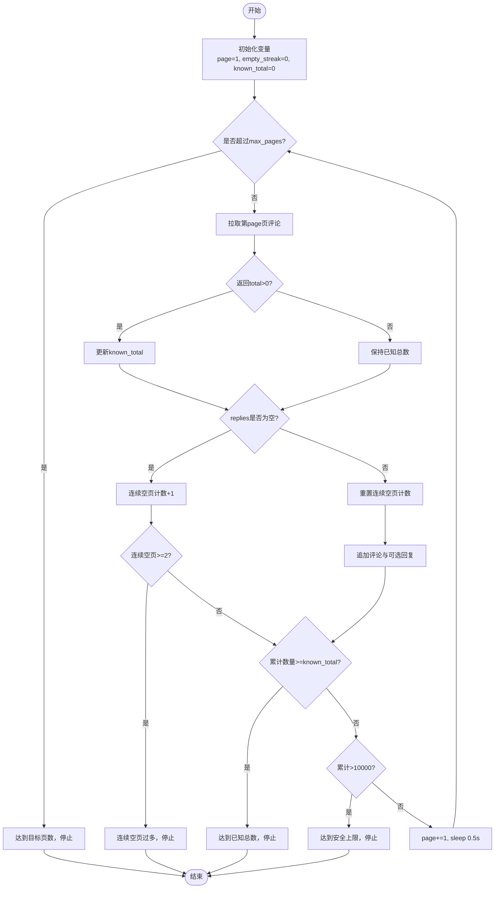

# 评论API接口

<cite>
**本文引用的文件**
- [bilibili/comments.py](file://bilibili/comments.py)
- [bilibili/__init__.py](file://bilibili/__init__.py)
- [bilibili/formatters.py](file://bilibili/formatters.py)
- [bilibili/cache.py](file://bilibili/cache.py)
- [bilibili_demo.py](file://bilibili_demo.py)
</cite>

## 目录
1. [简介](#简介)
2. [项目结构](#项目结构)
3. [核心组件](#核心组件)
4. [架构总览](#架构总览)
5. [详细组件分析](#详细组件分析)
6. [依赖关系分析](#依赖关系分析)
7. [性能与稳定性](#性能与稳定性)
8. [故障排查指南](#故障排查指南)
9. [结论](#结论)
10. [附录：字段与数据结构说明](#附录字段与数据结构说明)

## 简介
本参考文档聚焦于评论抓取模块对外暴露的两个异步函数：get_comments() 与 get_all_comments()。文档覆盖函数签名、参数说明、返回值格式与数据结构，详细说明评论数据字段含义（like、uname、time、text、reply_count、rpid 等）以及楼中楼回复结构；并提供完整的代码示例路径，展示单页评论获取与全量评论抓取的分页处理与循环获取逻辑；同时给出排序选项与过滤条件说明，并总结错误处理与重试机制的最佳实践。

## 项目结构
本项目围绕 bilibili 包提供弹幕、评论、字幕的抓取能力。评论相关核心位于 comments.py，配合 formatters.py 进行格式化输出，cache.py 提供本地缓存支持，__init__.py 统一导出对外 API。demo 脚本提供了命令行入口与使用示例。

图表来源
- [bilibili/__init__.py:1-19](file://bilibili/__init__.py#L1-L19)
- [bilibili/comments.py:1-171](file://bilibili/comments.py#L1-L171)
- [bilibili/formatters.py:1-166](file://bilibili/formatters.py#L1-L166)
- [bilibili/cache.py:1-42](file://bilibili/cache.py#L1-L42)
- [bilibili_demo.py:1-452](file://bilibili_demo.py#L1-L452)

章节来源
- [bilibili/__init__.py:1-19](file://bilibili/__init__.py#L1-L19)
- [bilibili/comments.py:1-171](file://bilibili/comments.py#L1-L171)
- [bilibili/formatters.py:1-166](file://bilibili/formatters.py#L1-L166)
- [bilibili/cache.py:1-42](file://bilibili/cache.py#L1-L42)
- [bilibili_demo.py:1-452](file://bilibili_demo.py#L1-L452)

## 核心组件
- 评论抓取模块
  - get_comments(bvid, page=1, max_age=30, credential=None, save_fmt=None, with_replies=False)
  - get_all_comments(bvid, max_age=30, credential=None, save_fmt=None, with_replies=False, max_pages=0)
- 内部辅助
  - _fetch_one_page(aid, page, credential)
  - _fetch_replies(aid, rpid, credential)
- 数据格式化与保存
  - format_comment / format_reply / save_comments
- 本地缓存
  - cache_key / cache_get / cache_set

章节来源
- [bilibili/comments.py:42-171](file://bilibili/comments.py#L42-L171)
- [bilibili/formatters.py:21-96](file://bilibili/formatters.py#L21-L96)
- [bilibili/cache.py:14-42](file://bilibili/cache.py#L14-L42)

## 架构总览
评论抓取流程由上层调用 get_comments/get_all_comments 触发，内部通过视频信息接口解析 aid，再调用底层评论 API 分页拉取。可选地按评论项的 rpid 拉取楼中楼回复。结果可写入本地缓存并按需保存到文件。

图表来源
- [bilibili/comments.py:42-171](file://bilibili/comments.py#L42-L171)
- [bilibili/cache.py:14-42](file://bilibili/cache.py#L14-L42)
- [bilibili/formatters.py:50-96](file://bilibili/formatters.py#L50-L96)

## 详细组件分析

### 函数一：get_comments()
- 功能
  - 获取指定视频的指定页评论，可选择是否附带楼中楼回复，支持缓存与可选的文件保存。
- 函数签名
  - async def get_comments(bvid: str, page: int = 1, max_age: int = 30, credential: Credential = None, save_fmt: str = None, with_replies: bool = False) -> list
- 参数说明
  - bvid: 视频 BV 号（字符串）
  - page: 页码，默认 1
  - max_age: 缓存有效期（秒），默认 30；为 0 表示禁用缓存
  - credential: 登录凭证（Credential），可为空
  - save_fmt: 保存格式，可选 "json"/"csv"/"txt"，None 不保存
  - with_replies: 是否获取楼中楼回复（仅第一页，最多 20 条）
- 返回值
  - 列表，每项为 {"comment": 原始评论对象, "replies": 子回复列表}
- 行为细节
  - 先查缓存，命中则直接返回
  - 通过 video.Video.get_info() 解析 aid
  - 调用 comment.get_comments(oid=aid, type_=VIDEO, page_index=page, order=LIKE)
  - 对 replies 逐项构建条目；若 with_replies 且 rcount > 0，则调用 Comment(...).get_sub_comments(rpid, page_index=1, page_size=20)
  - 写入缓存；如指定 save_fmt，调用 save_comments 持久化
- 关键实现位置
  - 函数定义与主流程：[bilibili/comments.py:42-89](file://bilibili/comments.py#L42-L89)
  - 单页请求封装：[bilibili/comments.py:13-24](file://bilibili/comments.py#L13-L24)
  - 楼中楼请求封装：[bilibili/comments.py:27-39](file://bilibili/comments.py#L27-L39)
  - 缓存读写：[bilibili/cache.py:14-42](file://bilibili/cache.py#L14-L42)
  - 保存逻辑：[bilibili/formatters.py:50-96](file://bilibili/formatters.py#L50-L96)

章节来源
- [bilibili/comments.py:42-89](file://bilibili/comments.py#L42-L89)
- [bilibili/comments.py:13-39](file://bilibili/comments.py#L13-L39)
- [bilibili/cache.py:14-42](file://bilibili/cache.py#L14-L42)
- [bilibili/formatters.py:50-96](file://bilibili/formatters.py#L50-L96)

### 函数二：get_all_comments()
- 功能
  - 全量翻页获取评论，支持目标页数限制、安全上限保护、并发友好的限速与连续空页检测。
- 函数签名
  - async def get_all_comments(bvid: str, max_age: int = 30, credential: Credential = None, save_fmt: str = None, with_replies: bool = False, max_pages: int = 0) -> list
- 参数说明
  - bvid: 视频 BV 号
  - max_age: 缓存有效期（秒）
  - credential: 登录凭证
  - save_fmt: 保存格式
  - with_replies: 是否获取楼中楼回复
  - max_pages: 最大页数，0 表示不限
- 返回值
  - 列表，结构与 get_comments 一致，但包含多页累计的所有评论项
- 行为细节
  - 解析 aid/title，打印进度
  - 循环逐页调用 _fetch_one_page，维护 known_total、empty_streak、all_items
  - 当 with_replies 且 rcount > 0 时，拉取子回复并限速 sleep
  - 停止条件：达到 max_pages、连续两页无数据、累计数量超过 known_total、或超过安全上限（10000）
  - 完成后统计并可选保存
- 关键实现位置
  - 函数定义与主循环：[bilibili/comments.py:92-171](file://bilibili/comments.py#L92-L171)
  - 单页请求封装：[bilibili/comments.py:13-24](file://bilibili/comments.py#L13-L24)
  - 楼中楼请求封装：[bilibili/comments.py:27-39](file://bilibili/comments.py#L27-L39)
  - 保存逻辑：[bilibili/formatters.py:50-96](file://bilibili/formatters.py#L50-L96)

章节来源
- [bilibili/comments.py:92-171](file://bilibili/comments.py#L92-L171)
- [bilibili/comments.py:13-39](file://bilibili/comments.py#L13-L39)
- [bilibili/formatters.py:50-96](file://bilibili/formatters.py#L50-L96)

### 排序选项与过滤条件
- 排序
  - 当前实现固定使用“按点赞数”排序（order=LIKE）。如需其他排序方式，可在 _fetch_one_page 中调整 order 参数。
- 过滤
  - 未内置关键词/用户/时间范围等过滤；可在获取后在应用层对返回结果进行二次筛选。

章节来源
- [bilibili/comments.py:13-24](file://bilibili/comments.py#L13-L24)

### 错误处理与重试机制
- 现有策略
  - 楼中楼拉取异常被捕获并记录日志，返回空列表，避免中断整体流程。
  - 全量抓取具备连续空页检测与安全上限保护，防止无限循环与内存溢出。
- 建议的重试与降级最佳实践
  - 网络异常指数退避重试：对 _fetch_one_page 与 _fetch_replies 增加带退避的重试包装（例如初始间隔 0.5s，最大 3 次，指数增长至 5s）。
  - 限流与背压：保持现有 sleep，必要时根据响应状态码动态调整间隔。
  - 幂等与断点续抓：结合缓存键与已抓取页码集合，失败后可从上次成功页继续。
  - 熔断与告警：连续失败阈值后快速失败并上报。
  - 超时控制：为每个 HTTP 请求设置合理超时，避免阻塞。

章节来源
- [bilibili/comments.py:27-39](file://bilibili/comments.py#L27-L39)
- [bilibili/comments.py:123-158](file://bilibili/comments.py#L123-L158)

### 完整代码示例（路径引用）
- 单页评论获取（含可选回复）
  - 示例入口与调用路径：[bilibili_demo.py:183-212](file://bilibili_demo.py#L183-L212)
  - 对应库内实现：[bilibili/comments.py:42-89](file://bilibili/comments.py#L42-L89)
- 全量评论抓取（分页循环）
  - 示例入口与调用路径：[bilibili_demo.py:214-271](file://bilibili_demo.py#L214-L271)
  - 对应库内实现：[bilibili/comments.py:92-171](file://bilibili/comments.py#L92-L171)
- 保存为 JSON/CSV/TXT
  - 保存逻辑：[bilibili/formatters.py:50-96](file://bilibili/formatters.py#L50-L96)
- 缓存开关与有效期
  - 缓存键生成与读写：[bilibili/cache.py:14-42](file://bilibili/cache.py#L14-L42)

## 依赖关系分析
- 外部依赖
  - bilibili_api.video：用于获取视频信息与 aid
  - bilibili_api.comment：用于评论与子评论的拉取
- 内部依赖
  - cache：本地 JSON 缓存
  - formatters：数据格式化与文件保存
- 导出关系
  - __init__.py 将 get_comments 与 get_all_comments 暴露给外部

图表来源
- [bilibili/__init__.py:1-19](file://bilibili/__init__.py#L1-L19)
- [bilibili/comments.py:1-171](file://bilibili/comments.py#L1-L171)
- [bilibili/cache.py:1-42](file://bilibili/cache.py#L1-L42)
- [bilibili/formatters.py:1-166](file://bilibili/formatters.py#L1-L166)

章节来源
- [bilibili/__init__.py:1-19](file://bilibili/__init__.py#L1-L19)
- [bilibili/comments.py:1-171](file://bilibili/comments.py#L1-L171)

## 性能与稳定性
- 分页与限速
  - 全量抓取每页间 sleep 0.5s，拉取子回复时每条 sleep 0.3s，降低风控风险。
- 安全上限
  - 累计超过 10000 条自动停止，避免内存占用过高。
- 连续空页检测
  - 连续两页无数据即停止，减少无效请求。
- 缓存命中
  - 相同 bvid+page+with_replies 组合命中缓存可显著降低重复请求。

章节来源
- [bilibili/comments.py:123-158](file://bilibili/comments.py#L123-L158)
- [bilibili/comments.py:42-89](file://bilibili/comments.py#L42-L89)
- [bilibili/cache.py:14-42](file://bilibili/cache.py#L14-L42)

## 故障排查指南
- 常见问题
  - 子回复为空：检查 rcount 是否为 0；确认 with_replies 为 True；查看 _fetch_replies 异常日志。
  - 全量抓取提前结束：检查连续空页计数与 known_total 是否正确更新；确认网络延迟导致空页误判。
  - 保存文件为空：确认 save_fmt 非 None 且 write 权限正常。
- 定位方法
  - 关注控制台输出中的 "[评论]"、"[视频]"、"[!] 回复获取失败" 等提示。
  - 检查 .bili_cache 目录下的缓存文件是否存在与过期时间。
- 改进建议
  - 为 _fetch_one_page 与 _fetch_replies 增加重试与超时配置。
  - 增加结构化日志（级别、上下文：bvid、aid、page、rpid）。

章节来源
- [bilibili/comments.py:27-39](file://bilibili/comments.py#L27-L39)
- [bilibili/comments.py:123-158](file://bilibili/comments.py#L123-L158)
- [bilibili/cache.py:14-42](file://bilibili/cache.py#L14-L42)

## 结论
get_comments 与 get_all_comments 提供了稳定易用的评论抓取能力，内置缓存、限速与安全上限，适合大多数场景。若需更严格的稳定性保障，建议引入重试、超时与结构化日志；若需更多过滤与排序，可在应用层扩展。

## 附录：字段与数据结构说明

### 返回数据结构
- 顶层结构
  - 列表，元素为 {"comment": 原始评论对象, "replies": 子回复列表}
- 评论对象关键字段
  - like: 点赞数
  - member.uname: 用户名
  - ctime: 创建时间戳（Unix 秒）
  - content.message: 评论内容文本
  - rcount: 回复数量
  - rpid: 评论 ID（用于拉取楼中楼）
- 子回复对象关键字段
  - like: 点赞数
  - member.uname: 用户名
  - ctime: 创建时间戳
  - content.message: 回复内容文本
  - parent: 父评论 ID
  - members: 成员映射（可用于查找被回复者 uname）
  - rpid: 回复 ID

章节来源
- [bilibili/formatters.py:21-45](file://bilibili/formatters.py#L21-L45)
- [bilibili_demo.py:49-64](file://bilibili_demo.py#L49-L64)

### 字段含义速查表
- like: 点赞数（整数）
- uname: 用户名（字符串）
- time: 发布时间（格式化后的字符串，YYYY-MM-DD HH:MM）
- text: 评论/回复正文（字符串）
- reply_count: 该评论的回复总数（整数）
- rpid: 评论/回复的唯一标识（整数）

章节来源
- [bilibili/formatters.py:21-45](file://bilibili/formatters.py#L21-L45)

### 流程图：全量抓取终止条件

图表来源
- [bilibili/comments.py:123-158](file://bilibili/comments.py#L123-L158)