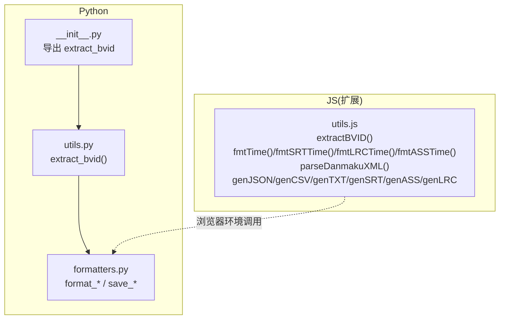
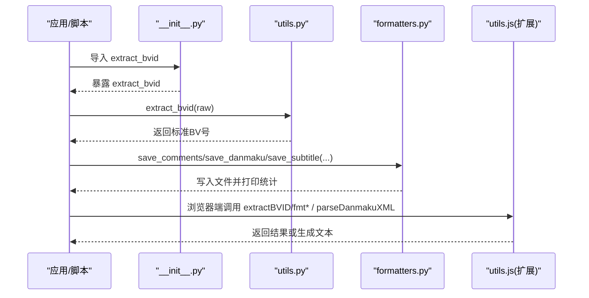
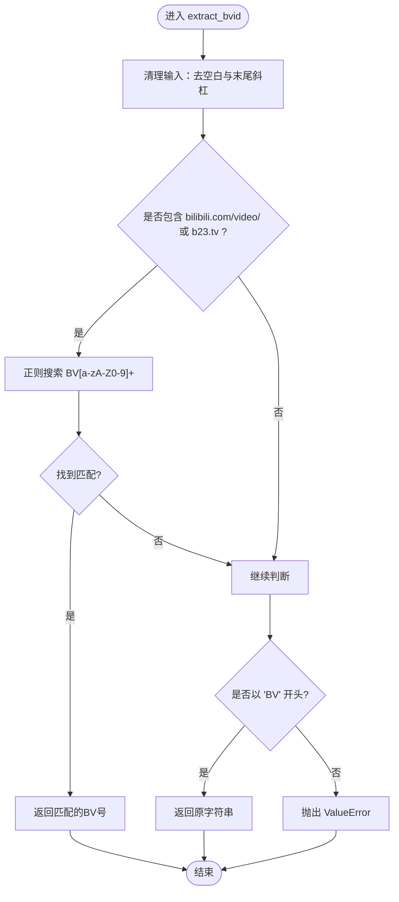
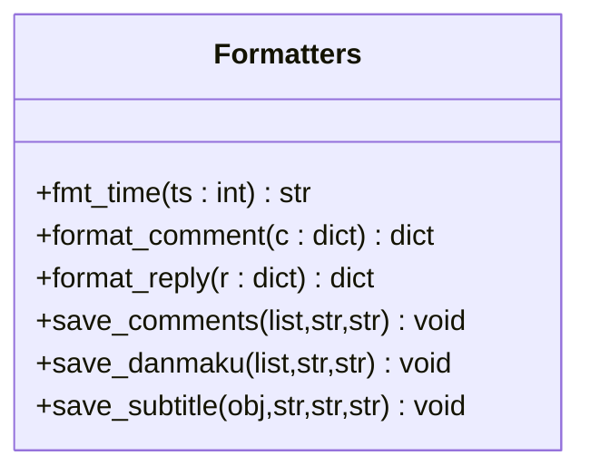
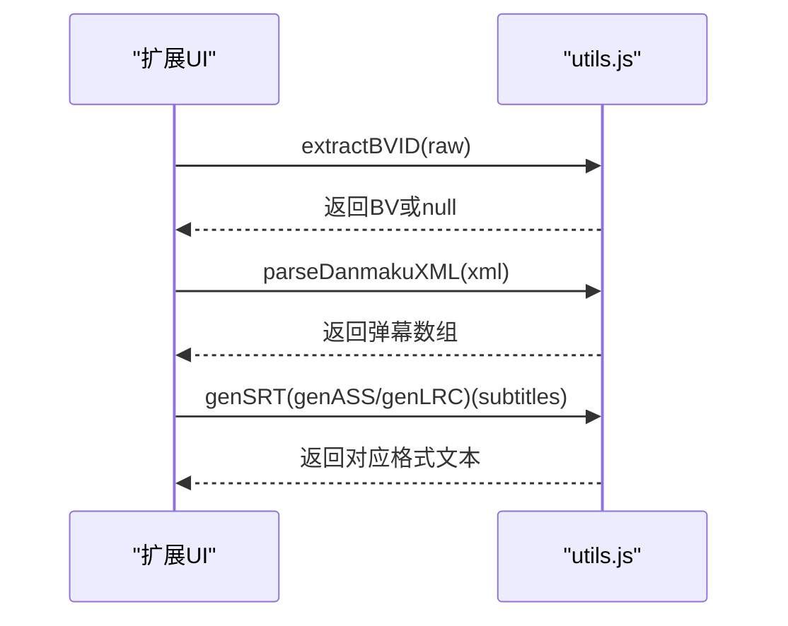
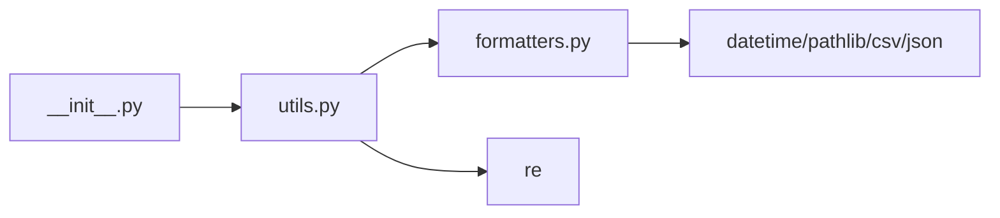

# 工具API

<cite>
**本文引用的文件**
- [bilibili/utils.py](file://bilibili/utils.py)
- [bilibili/formatters.py](file://bilibili/formatters.py)
- [bilibili/__init__.py](file://bilibili/__init__.py)
- [bilibili-extension--main/utils.js](file://bilibili-extension--main/utils.js)
</cite>

## 目录
1. [简介](#简介)
2. [项目结构](#项目结构)
3. [核心组件](#核心组件)
4. [架构总览](#架构总览)
5. [详细组件分析](#详细组件分析)
6. [依赖关系分析](#依赖关系分析)
7. [性能考虑](#性能考虑)
8. [故障排查指南](#故障排查指南)
9. [结论](#结论)
10. [附录：使用示例与最佳实践](#附录使用示例与最佳实践)

## 简介
本参考文档聚焦于“工具模块API”，覆盖以下能力：
- URL解析与BV号提取（Python/JS双端）
- 数据格式转换（评论、弹幕、字幕）
- 字符串与时间格式化
- 文件保存（txt/json/csv/srt/ass/lrc）
- 错误处理规范与异常类型定义
- 实际使用场景与性能建议

说明：仓库中未实现AV号与BV号的相互转换函数，因此本节不提供该功能。若需此能力，可在现有工具层扩展。

## 项目结构
工具相关代码主要分布在两个位置：
- Python侧：bilibili/utils.py（URL/BV解析）、bilibili/formatters.py（数据格式化与文件保存）
- JS侧（浏览器扩展）：bilibili-extension--main/utils.js（WBI签名、MD5、时间格式化、弹幕XML解析、通用生成器）

图表来源
- [bilibili/utils.py:1-28](file://bilibili/utils.py#L1-L28)
- [bilibili/formatters.py:1-166](file://bilibili/formatters.py#L1-L166)
- [bilibili/__init__.py:1-19](file://bilibili/__init__.py#L1-L19)
- [bilibili-extension--main/utils.js:1-296](file://bilibili-extension--main/utils.js#L1-L296)

章节来源
- [bilibili/utils.py:1-28](file://bilibili/utils.py#L1-L28)
- [bilibili/formatters.py:1-166](file://bilibili/formatters.py#L1-L166)
- [bilibili/__init__.py:1-19](file://bilibili/__init__.py#L1-L19)
- [bilibili-extension--main/utils.js:1-296](file://bilibili-extension--main/utils.js#L1-L296)

## 核心组件
- BV号提取（Python）
  - 函数：extract_bvid(raw: str) -> str
  - 输入：纯BV号、完整视频链接、短链接等
  - 输出：标准化BV号字符串
  - 异常：无法解析时抛出 ValueError
- 数据格式化与保存（Python）
  - 评论：format_comment(c), format_reply(r), save_comments(...)
  - 弹幕：save_danmaku(dms, bvid, fmt="txt")
  - 字幕：save_subtitle(sub_obj, bvid, lan_code, fmt="srt")
  - 时间：fmt_time(ts: int) -> str
- 工具（JS，浏览器扩展）
  - MD5、WBI签名辅助（getWbiKeys/getMixKey/encryptWbi）
  - BV号提取：extractBVID(raw)
  - 时间格式化：fmtTime/fmtSRTTime/fmtLRCTime/fmtASSTime
  - 弹幕XML解析：parseDanmakuXML(xmlText)
  - 文本生成：genJSON/genCSV/genTXT/genSRT/genASS/genLRC
  - 扁平化：formatDanmakuFlat/formatComment

章节来源
- [bilibili/utils.py:8-27](file://bilibili/utils.py#L8-L27)
- [bilibili/formatters.py:14-166](file://bilibili/formatters.py#L14-L166)
- [bilibili-extension--main/utils.js:104-296](file://bilibili-extension--main/utils.js#L104-L296)

## 架构总览
下图展示工具API在整体系统中的角色与交互：上层业务通过统一入口导入工具函数；Python侧负责结构化数据的格式化与持久化；JS侧提供浏览器端的签名、解析与文本生成能力。

图表来源
- [bilibili/__init__.py:5-18](file://bilibili/__init__.py#L5-L18)
- [bilibili/utils.py:8-27](file://bilibili/utils.py#L8-L27)
- [bilibili/formatters.py:50-166](file://bilibili/formatters.py#L50-L166)
- [bilibili-extension--main/utils.js:149-296](file://bilibili-extension--main/utils.js#L149-L296)

## 详细组件分析

### 组件A：BV号提取（Python）
- 函数签名
  - extract_bvid(raw: str) -> str
- 行为说明
  - 清理输入：去除首尾空白与末尾斜杠
  - 支持模式：
    - 包含 bilibili.com/video/ 的长链接
    - 包含 b23.tv 的短链接
    - 以 BV 开头的纯BV号
  - 正则匹配：从任意位置提取形如 BV[a-zA-Z0-9]+ 的子串
  - 失败路径：无法识别时抛出 ValueError
- 输入验证
  - 非字符串：建议在调用方进行类型检查
  - 空串/仅空白：将被视为无效输入并抛错
- 输出格式
  - 返回标准BV号字符串（不含协议、域名、路径）
- 边界情况
  - 链接尾部多余斜杠会被忽略
  - 短链接中若无BV片段，将抛错
  - 纯BV号必须严格以“BV”开头
- 复杂度
  - 时间 O(n)，空间 O(1)（n为输入长度）
- 错误处理
  - 抛出 ValueError，消息包含原始输入以便定位

图表来源
- [bilibili/utils.py:8-27](file://bilibili/utils.py#L8-L27)

章节来源
- [bilibili/utils.py:8-27](file://bilibili/utils.py#L8-L27)

### 组件B：数据格式化与文件保存（Python）
- 时间格式化
  - fmt_time(ts: int) -> str
    - 输入：Unix秒级时间戳
    - 输出：本地时间的“YYYY-MM-DD HH:MM”字符串
- 评论格式化
  - format_comment(c: dict) -> dict
    - 字段映射：like/uname/time/text/reply_count/rpid
  - format_reply(r: dict) -> dict
    - 字段映射：like/uname/time/text/reply_to/rpid
- 评论保存
  - save_comments(comments_with_replies: list, bvid: str, fmt: str = "txt")
    - 支持输出：json/csv/txt
    - JSON：嵌套结构，保留replies数组
    - CSV：扁平化，增加level字段区分comment/reply
    - TXT：人类可读，缩进表示回复层级
    - 输出路径：默认位于包根上级目录（OUTPUT_DIR），文件名 comments_{bvid}.{ext}
- 弹幕保存
  - save_danmaku(dms: list, bvid: str, fmt: str = "txt")
    - 支持输出：json/csv/txt
    - 字段：time_s/text/mode/font_size/color/uid
    - 输出路径：danmaku_{bvid}.{ext}
- 字幕保存
  - save_subtitle(sub_obj, bvid: str, lan_code: str, fmt: str = "srt")
    - 支持输出：srt/ass/lrc/json
    - 对srt/ass/lrc调用对象方法生成文本；json直接序列化简单结构
    - 输出路径：subtitle_{bvid}_{lan_code}.{ext}
- 错误处理
  - 文件IO异常由底层open/write抛出，调用方可捕获
  - 字段缺失：格式化函数对可选字段做了容错（如.get(..., 0)）
- 复杂度
  - 线性遍历数据，I/O主导；内存占用与数据规模成正比

图表来源
- [bilibili/formatters.py:14-166](file://bilibili/formatters.py#L14-L166)

章节来源
- [bilibili/formatters.py:14-166](file://bilibili/formatters.py#L14-L166)

### 组件C：浏览器端工具（JS）
- WBI签名辅助
  - getWbiKeys(): 获取img/sub密钥并缓存1小时
  - getMixKey(img, sub): 基于固定混洗表生成mixKey
  - encryptWbi(params, mixKey): 拼接参数+时间戳+mixKey后MD5得到w_rid
- MD5
  - md5(str): 纯JS实现，用于WBI签名
- BV号提取
  - extractBVID(raw): 同Python逻辑，但返回null而非抛错
- 时间格式化
  - fmtTime(ts_sec): “YYYY-MM-DD HH:MM”
  - fmtSRTTime(sec): SRT时间码
  - fmtLRCTime(sec): LRC时间码
  - fmtASSTime(sec): ASS时间码
- 弹幕XML解析
  - parseDanmakuXML(xmlText): 解析<d p=...>...</d>节点，输出扁平列表
- 文本生成器
  - genJSON(data)/genCSV(rows, fields)/genTXT(lines)
  - genSRT(subtitles)/genASS(subtitles, title)/genLRC(subtitles)
- 数据扁平化
  - formatDanmakuFlat(dms): 规范化弹幕字段
  - formatComment(c, replies=[]): 构造评论树结构

图表来源
- [bilibili-extension--main/utils.js:104-296](file://bilibili-extension--main/utils.js#L104-L296)

章节来源
- [bilibili-extension--main/utils.js:104-296](file://bilibili-extension--main/utils.js#L104-L296)

## 依赖关系分析
- Python入口
  - __init__.py 导出 extract_bvid，供上层直接使用
- 模块内依赖
  - formatters.py 依赖 datetime、pathlib、csv、json
  - utils.py 依赖 re
- 跨语言协作
  - JS侧提供与Python一致的格式化与解析能力，便于在浏览器环境中复用

图表来源
- [bilibili/__init__.py:5-18](file://bilibili/__init__.py#L5-L18)
- [bilibili/utils.py:1-28](file://bilibili/utils.py#L1-L28)
- [bilibili/formatters.py:1-166](file://bilibili/formatters.py#L1-L166)

章节来源
- [bilibili/__init__.py:5-18](file://bilibili/__init__.py#L5-L18)
- [bilibili/utils.py:1-28](file://bilibili/utils.py#L1-L28)
- [bilibili/formatters.py:1-166](file://bilibili/formatters.py#L1-L166)

## 性能考虑
- 正则匹配
  - extract_bvid 使用单次正则扫描，时间复杂度O(n)，适合短输入
- 文件I/O
  - 批量保存采用顺序写入，避免多次打开关闭；大文件建议分批写入或流式处理
- 内存占用
  - 弹幕/评论全量加载到内存再序列化，数据量大时应考虑分页或流式处理
- 浏览器端
  - MD5/WBI计算在UI线程执行，大量数据可能阻塞界面，可考虑Web Worker

[本节为通用指导，不直接分析具体文件]

## 故障排查指南
- BV号提取失败
  - 现象：抛出 ValueError（Python）或返回 null（JS）
  - 排查：确认输入是否为有效链接或纯BV号；注意短链接重定向后的真实地址
- 文件格式错误
  - 现象：CSV/JSON/SRT/ASS/LRC 内容不可用
  - 排查：检查字段名与顺序；确保时间单位一致（秒/毫秒）
- 弹幕解析异常
  - 现象：弹幕条数为0或字段为空
  - 排查：确认XML结构与正则匹配范围；检查特殊字符转义
- 权限与路径
  - 现象：保存文件失败
  - 排查：确认输出目录存在且可写；Windows下注意编码与路径分隔符

章节来源
- [bilibili/utils.py:8-27](file://bilibili/utils.py#L8-L27)
- [bilibili/formatters.py:50-166](file://bilibili/formatters.py#L50-L166)
- [bilibili-extension--main/utils.js:186-203](file://bilibili-extension--main/utils.js#L186-L203)

## 结论
本工具API围绕“输入清洗—解析—格式化—持久化”的主线，提供了跨语言的一致能力。Python侧侧重结构化数据处理与文件落盘，JS侧侧重浏览器环境的签名、解析与文本生成。遵循本文档的输入校验与错误处理规范，可在多场景中稳定复用这些工具函数。

[本节为总结性内容，不直接分析具体文件]

## 附录：使用示例与最佳实践
- 典型流程（Python）
  - 从用户输入提取BV号
  - 下载/解析弹幕、评论、字幕
  - 调用保存函数输出多种格式
- 典型流程（JS扩展）
  - 在页面中抽取BV号
  - 解析弹幕XML并转换为SRT/ASS/LRC
  - 生成CSV/JSON供后续处理
- 最佳实践
  - 始终对输入做前置校验（类型、非空）
  - 对网络响应做状态码与字段完整性检查
  - 对大文件采用分块写入与进度反馈
  - 对关键路径添加日志与异常堆栈

[本节为概念性指导，不直接分析具体文件]