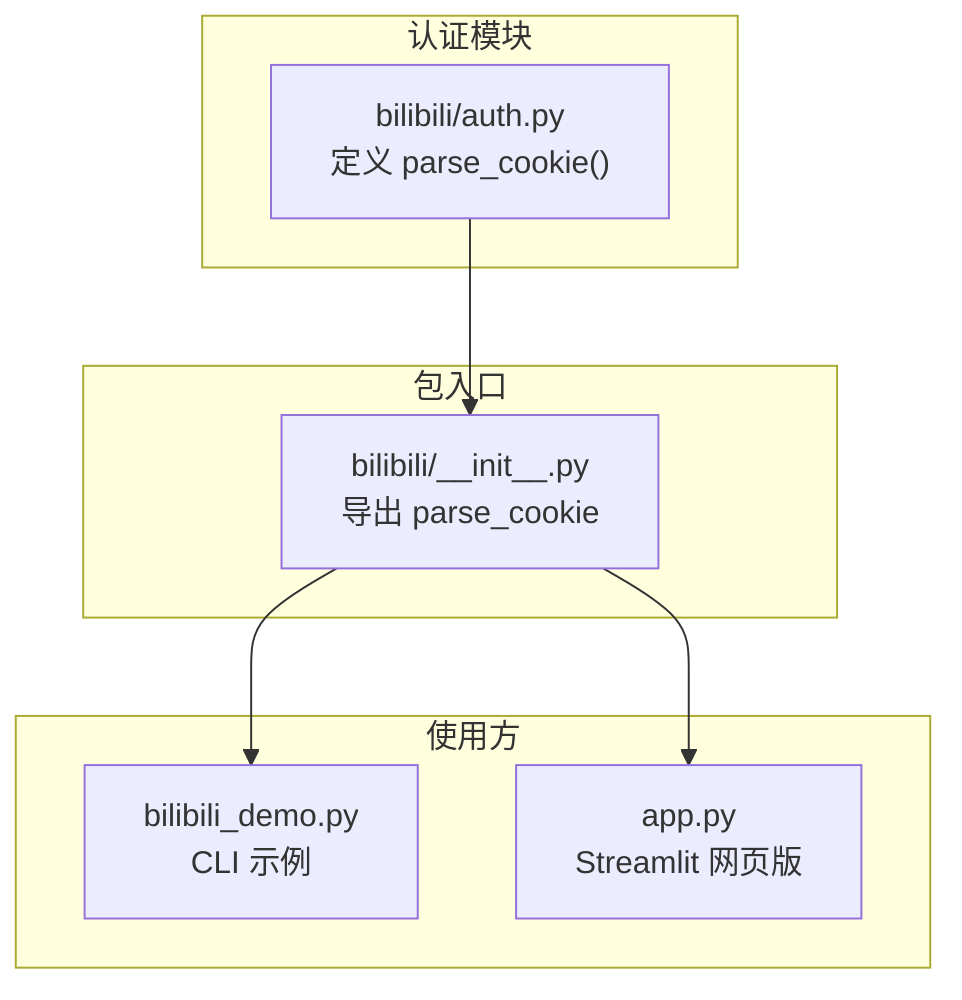
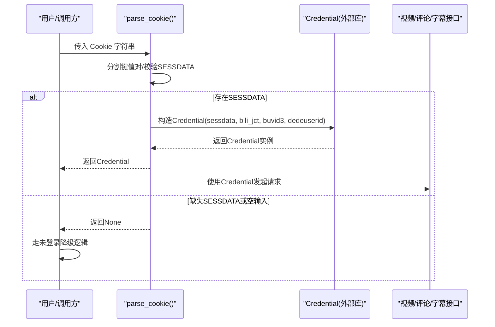
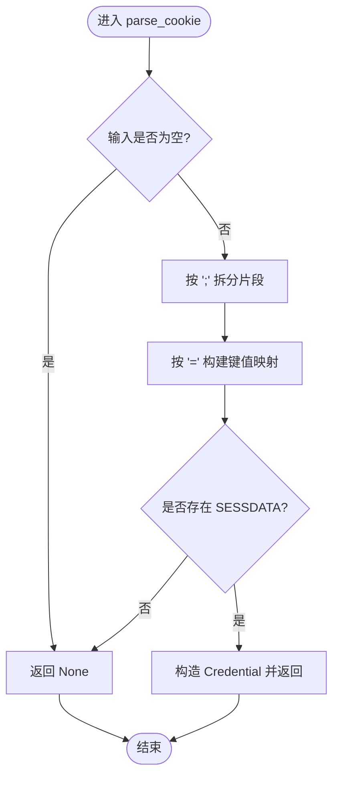
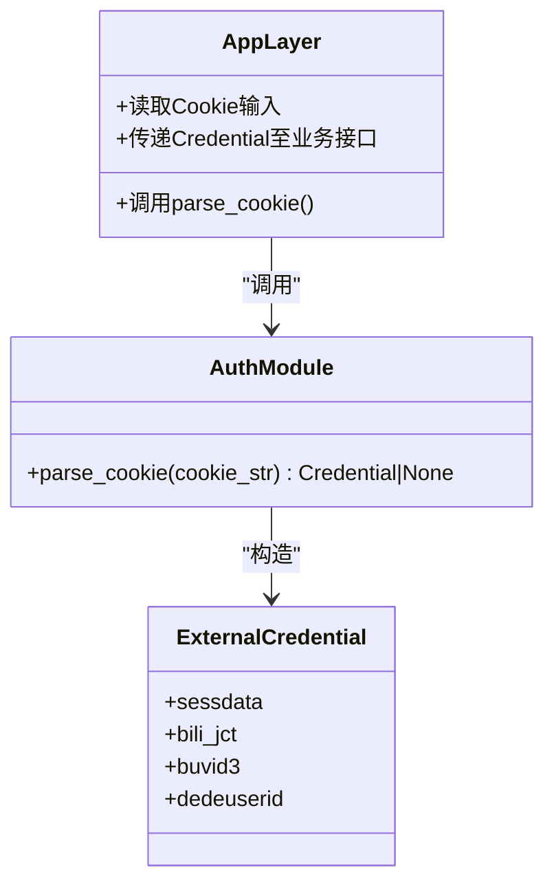

# 认证API

<cite>
**本文引用的文件**   
- [bilibili/auth.py](file://bilibili/auth.py)
- [bilibili/__init__.py](file://bilibili/__init__.py)
- [bilibili_demo.py](file://bilibili_demo.py)
- [app.py](file://app.py)
</cite>

## 目录
1. [简介](#简介)
2. [项目结构](#项目结构)
3. [核心组件](#核心组件)
4. [架构总览](#架构总览)
5. [详细组件分析](#详细组件分析)
6. [依赖关系分析](#依赖关系分析)
7. [性能与可靠性考虑](#性能与可靠性考虑)
8. [故障排查指南](#故障排查指南)
9. [结论](#结论)
10. [附录：Cookie获取方式示例路径](#附录cookie获取方式示例路径)

## 简介
本参考文档聚焦于认证模块的API，围绕以下目标展开：
- 完整记录 parse_cookie() 函数的使用方法、输入格式要求、解析规则与错误处理。
- 说明 Credential 对象的创建过程、属性含义与生命周期管理建议。
- 提供多种 Cookie 获取方式的示例代码（以“示例路径”形式给出）。
- 说明认证失败的处理策略与重试机制建议。
- 给出安全最佳实践与敏感信息保护建议。
- 提供调试认证问题的方法与常见错误解决方案。

## 项目结构
本项目将认证相关能力集中在 bilibili/auth.py 中，并通过包入口统一导出；上层应用通过命令行脚本或 Streamlit Web 界面调用该能力。

图示来源
- [bilibili/auth.py:1-38](file://bilibili/auth.py#L1-L38)
- [bilibili/__init__.py:1-19](file://bilibili/__init__.py#L1-L19)
- [bilibili_demo.py:344-363](file://bilibili_demo.py#L344-L363)
- [app.py:11-16](file://app.py#L11-L16)

章节来源
- [bilibili/auth.py:1-38](file://bilibili/auth.py#L1-L38)
- [bilibili/__init__.py:1-19](file://bilibili/__init__.py#L1-L19)

## 核心组件
- parse_cookie(cookie_str: str) -> Credential | None
  - 作用：从浏览器 Cookie 字符串中解析出必要的凭证字段，构造并返回 bilibili_api.Credential 对象；若缺少必要字段或输入为空，则返回 None。
  - 关键行为：
    - 按分号分隔键值对，支持空格修剪与等号分割。
    - 必须包含 SESSDATA，否则返回 None。
    - 可选字段 bili_jct、buvid3、DedeUserID 会被映射到 Credential 对应参数。
    - 成功时打印一条日志提示已加载凭证。
- Credential 对象
  - 由外部库 bilibili_api 提供，用于携带会话凭据发起受保护的请求。
  - 常用构造参数（与本仓库用法一致）：sessdata、bili_jct、buvid3、dedeuserid。

章节来源
- [bilibili/auth.py:8-37](file://bilibili/auth.py#L8-L37)
- [bilibili_demo.py:346-363](file://bilibili_demo.py#L346-L363)

## 架构总览
下图展示了从用户输入到认证凭证构建再到上层功能调用的整体流程。

图示来源
- [bilibili/auth.py:8-37](file://bilibili/auth.py#L8-L37)
- [bilibili_demo.py:346-363](file://bilibili_demo.py#L346-L363)
- [app.py:55-56](file://app.py#L55-L56)

## 详细组件分析

### parse_cookie() 函数详解
- 输入
  - cookie_str: 标准 Cookie 文本，形如 “key1=value1; key2=value2”。
  - 必需字段：SESSDATA。
  - 可选字段：bili_jct、buvid3、DedeUserID。
- 解析规则
  - 以分号 “;” 切分为多个片段。
  - 每个片段去除首尾空白后，按第一个等号 “=” 拆分为键和值。
  - 提取 SESSDATA；若为空或缺失，直接返回 None。
  - 将 bili_jct、buvid3、DedeUserID 作为可选参数透传给 Credential。
- 返回值
  - 成功：返回 bilibili_api.Credential 实例。
  - 失败：返回 None（包括空输入、无SESSDATA等情况）。
- 副作用
  - 成功时输出日志 “[登录] 已加载Cookie凭证”。

图示来源
- [bilibili/auth.py:18-37](file://bilibili/auth.py#L18-L37)

章节来源
- [bilibili/auth.py:8-37](file://bilibili/auth.py#L8-L37)

### Credential 对象说明
- 创建过程
  - 由 parse_cookie() 在内部调用外部库的 Credential 构造函数完成。
  - 必填：sessdata（来自 Cookie 中的 SESSDATA）。
  - 可选：bili_jct、buvid3、dedeuserid（分别来自 Cookie 中的 bili_jct、buvid3、DedeUserID）。
- 属性与作用
  - sessdata：会话标识，用于访问需要登录的资源。
  - bili_jct：提交表单等操作所需的令牌。
  - buvid3：设备指纹相关标识。
  - dedeuserid：用户ID标识。
- 生命周期管理建议
  - 在单次任务执行期间持有即可，避免跨进程/跨会话持久化明文凭证。
  - 不要将 Credential 序列化到磁盘或日志中。
  - 在不需要使用时及时释放引用，避免长时间驻留内存。

章节来源
- [bilibili/auth.py:31-37](file://bilibili/auth.py#L31-L37)
- [bilibili_demo.py:358-363](file://bilibili_demo.py#L358-L363)

### 使用示例（示例路径）
以下为不同场景下获取 Cookie 并构造 Credential 的示例位置（不展示具体代码内容）：
- 命令行脚本中使用 --cookie 参数
  - 示例路径：[bilibili_demo.py:398](file://bilibili_demo.py#L398)
  - 解析与构造位置：[bilibili_demo.py:417](file://bilibili_demo.py#L417)
- Streamlit 网页版输入框
  - 示例路径：[app.py:41](file://app.py#L41)
  - 解析与构造位置：[app.py:56](file://app.py#L56)
- 包入口统一导出
  - 示例路径：[bilibili/__init__.py:5](file://bilibili/__init__.py#L5)

章节来源
- [bilibili_demo.py:398-417](file://bilibili_demo.py#L398-L417)
- [app.py:41-56](file://app.py#L41-L56)
- [bilibili/__init__.py:5-6](file://bilibili/__init__.py#L5-L6)

## 依赖关系分析
- 模块内依赖
  - auth.py 依赖外部库 bilibili_api 提供的 Credential。
  - __init__.py 重新导出 parse_cookie，供上层模块统一导入。
- 调用链
  - 上层应用（demo/app）导入 parse_cookie，并在获得 Cookie 字符串后调用其生成 Credential，再传递给视频/评论/字幕等接口。

图示来源
- [bilibili/auth.py:1-37](file://bilibili/auth.py#L1-L37)
- [bilibili/__init__.py:5-6](file://bilibili/__init__.py#L5-L6)
- [bilibili_demo.py:417](file://bilibili_demo.py#L417)
- [app.py:56](file://app.py#L56)

章节来源
- [bilibili/auth.py:1-37](file://bilibili/auth.py#L1-L37)
- [bilibili/__init__.py:1-19](file://bilibili/__init__.py#L1-L19)

## 性能与可靠性考虑
- 解析复杂度
  - 时间复杂度 O(n)，n 为 Cookie 字符串长度；空间复杂度 O(k)，k 为键值对数量。
- 健壮性
  - 对空输入与缺失 SESSDATA 的情况进行快速失败，避免后续无效调用。
- 可观测性
  - 成功时输出日志便于定位是否成功加载凭证。
- 建议
  - 在批量任务中复用同一 Credential 实例以减少重复解析开销。
  - 对网络请求增加超时与重试策略（见下一节）。

章节来源
- [bilibili/auth.py:18-37](file://bilibili/auth.py#L18-L37)

## 故障排查指南
- 常见问题
  - 返回 None：检查输入是否为空或是否缺少 SESSDATA。
  - 权限不足/鉴权失败：确认 SESSDATA 有效且未过期；必要时刷新 Cookie。
  - 日志无输出：确认调用路径确实进入了 parse_cookie 的成功分支。
- 调试方法
  - 在调用处打印原始 Cookie 的前缀部分（注意脱敏），确认键名大小写与分隔符是否正确。
  - 在 parse_cookie 前后增加断点或日志，观察 parts 字典内容与 SESSDATA 取值。
- 常见错误与修复
  - 缺少分号或等号：确保 Cookie 格式为标准 “key=value; ...”。
  - 键名大小写不一致：SESSDATA 为大写，bili_jct 为小写，DedeUserID 混合大小写。
  - 多余空白字符：函数会做 trim，但建议保持规范格式。

章节来源
- [bilibili/auth.py:18-37](file://bilibili/auth.py#L18-L37)

## 结论
- parse_cookie() 提供了简洁可靠的 Cookie 解析与 Credential 构建能力，适用于 CLI 与 Web 等多种前端形态。
- 通过严格校验 SESSDATA 与可选字段的透传，既保证了安全性也兼顾了灵活性。
- 建议在应用中遵循最小权限与最短生命周期的原则管理 Credential，并结合重试与限流策略提升鲁棒性。

## 附录：Cookie获取方式示例路径
- 命令行参数传入
  - 示例路径：[bilibili_demo.py:398](file://bilibili_demo.py#L398)
  - 解析与构造位置：[bilibili_demo.py:417](file://bilibili_demo.py#L417)
- Streamlit 密码输入框
  - 示例路径：[app.py:41](file://app.py#L41)
  - 解析与构造位置：[app.py:56](file://app.py#L56)
- 包入口统一导入
  - 示例路径：[bilibili/__init__.py:5](file://bilibili/__init__.py#L5)