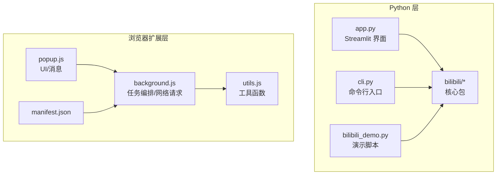
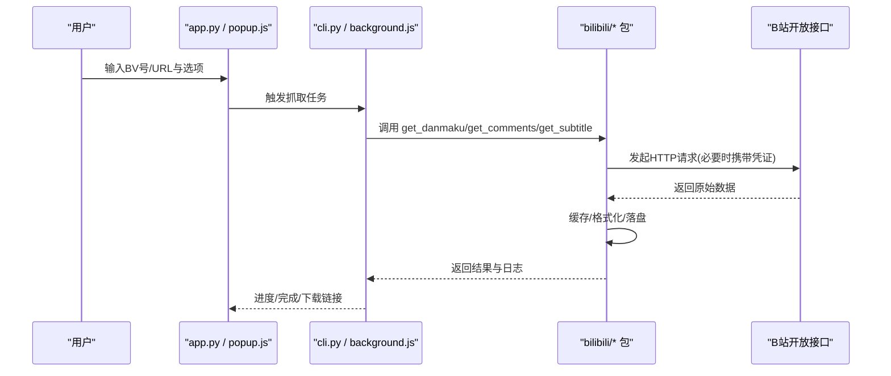
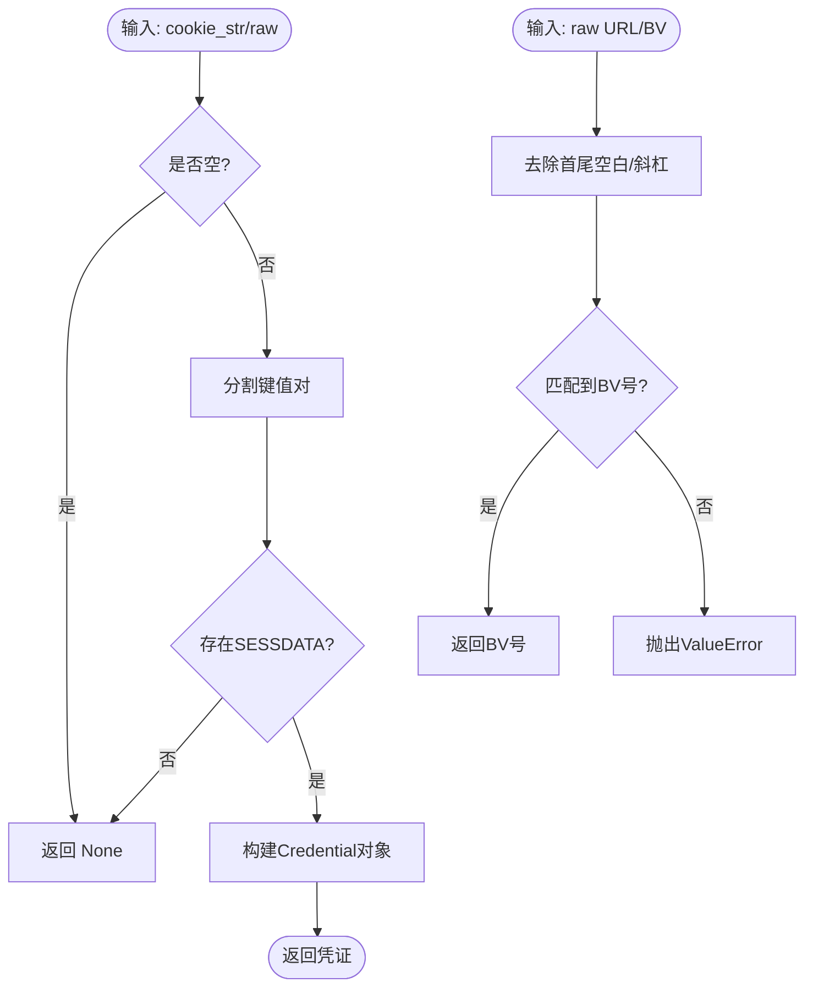
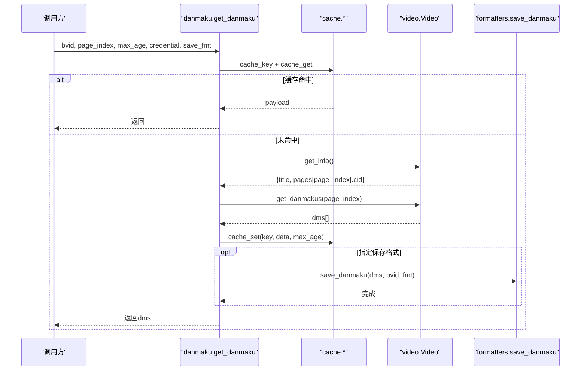
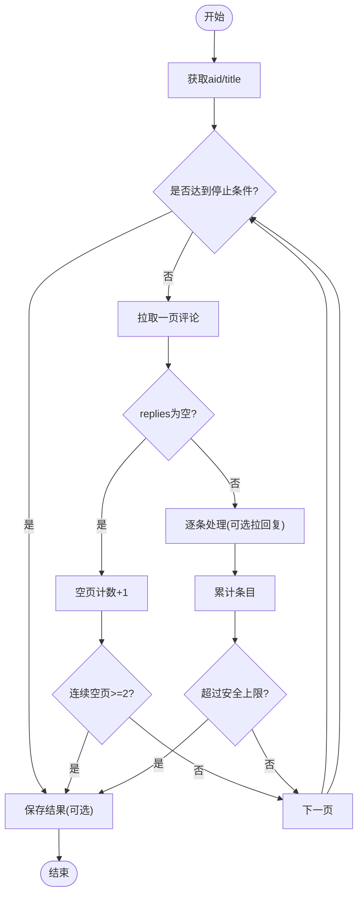
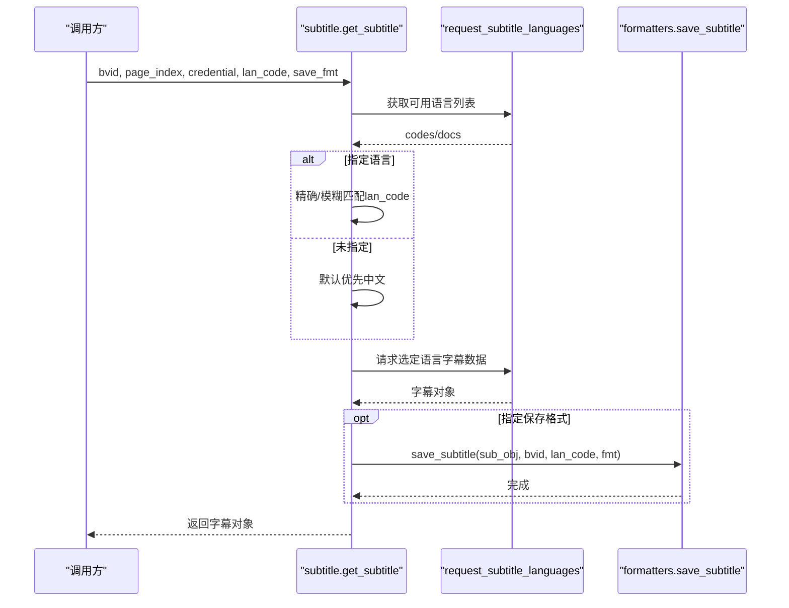
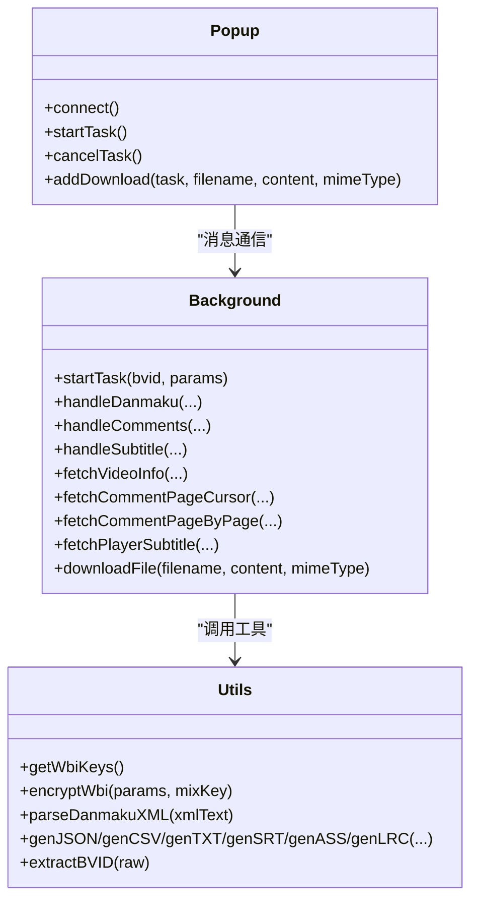
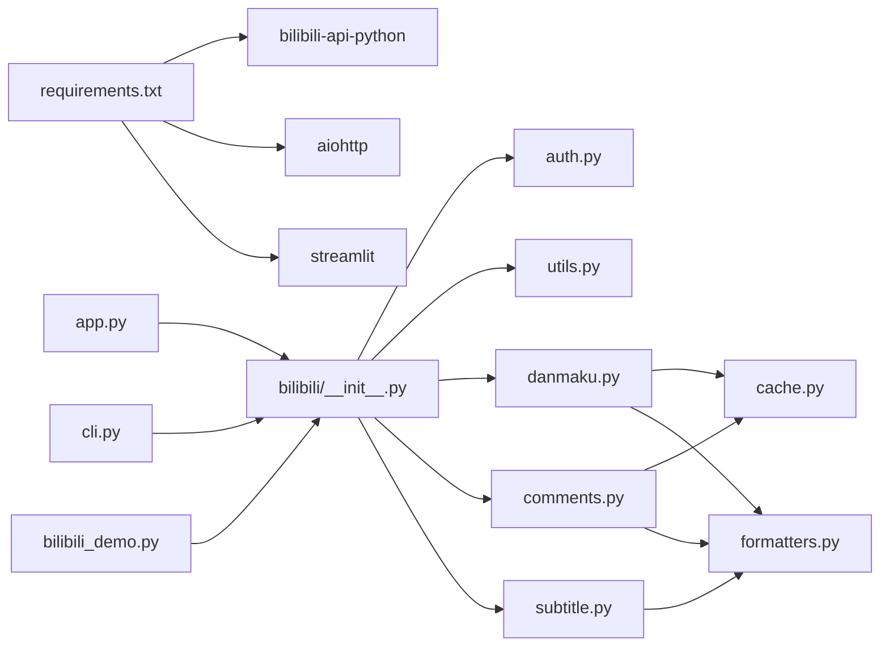

# 开发指南

<cite>
**本文引用的文件**   
- [app.py](file://app.py)
- [cli.py](file://cli.py)
- [bilibili_demo.py](file://bilibili_demo.py)
- [requirements.txt](file://requirements.txt)
- [bilibili/__init__.py](file://bilibili/__init__.py)
- [bilibili/auth.py](file://bilibili/auth.py)
- [bilibili/utils.py](file://bilibili/utils.py)
- [bilibili/danmaku.py](file://bilibili/danmaku.py)
- [bilibili/comments.py](file://bilibili/comments.py)
- [bilibili/subtitle.py](file://bilibili/subtitle.py)
- [bilibili/cache.py](file://bilibili/cache.py)
- [bilibili/formatters.py](file://bilibili/formatters.py)
- [bilibili-extension--main/manifest.json](file://bilibili-extension--main/manifest.json)
- [bilibili-extension--main/background.js](file://bilibili-extension--main/background.js)
- [bilibili-extension--main/popup.js](file://bilibili-extension--main/popup.js)
- [bilibili-extension--main/utils.js](file://bilibili-extension--main/utils.js)
</cite>

## 目录
1. [简介](#简介)
2. [项目结构](#项目结构)
3. [核心组件](#核心组件)
4. [架构总览](#架构总览)
5. [详细组件分析](#详细组件分析)
6. [依赖关系分析](#依赖关系分析)
7. [性能与缓存](#性能与缓存)
8. [调试与故障排除](#调试与故障排除)
9. [新增功能开发流程](#新增功能开发流程)
10. [第三方集成示例](#第三方集成示例)
11. [测试策略与实践](#测试策略与实践)
12. [代码贡献与版本管理](#代码贡献与版本管理)
13. [开发环境搭建与依赖管理](#开发环境搭建与依赖管理)
14. [结论](#结论)

## 简介
本项目提供 B站视频弹幕、评论（含楼中楼回复）、字幕的抓取能力，包含三种使用形态：
- Streamlit 本地网页版：面向非技术用户，图形化操作，支持下载结果文件。
- CLI 命令行工具：便于脚本化与自动化工作流集成。
- 浏览器扩展：在 B站页面内一键抓取并下载结果。

同时提供 Python 包 bilibili，封装了认证、BV号解析、数据获取与格式化保存等核心能力，供上层应用复用。

## 项目结构
- 顶层入口
  - app.py：Streamlit 本地网页版入口，负责参数收集、异步编排与下载按钮生成。
  - cli.py：命令行入口，基于 argparse 解析参数，调用 bilibili 包进行抓取。
  - bilibili_demo.py：独立可运行的演示脚本，内置完整逻辑（弹幕/评论/字幕），可作为参考实现。
  - requirements.txt：Python 依赖声明。
- Python 包 bilibili
  - __init__.py：对外暴露统一接口。
  - auth.py：Cookie 解析为 Credential。
  - utils.py：通用工具（如 BV 号提取）。
  - danmaku.py：弹幕抓取。
  - comments.py：评论抓取（单页/全量翻页，可选楼中楼）。
  - subtitle.py：字幕抓取与语言选择。
  - cache.py：基于文件的 JSON 缓存。
  - formatters.py：数据格式化与文件保存（txt/json/csv/srt/ass/lrc）。
- 浏览器扩展 bilibili-extension--main
  - manifest.json：扩展清单与权限声明。
  - background.js：后台任务编排、API 调用、WBI 签名、下载控制。
  - popup.js：弹出窗口 UI 与消息通道。
  - utils.js：通用工具（MD5/WBI/BV 提取/时间格式/文件生成器）。

图表来源
- [app.py:1-143](file://app.py#L1-L143)
- [cli.py:1-118](file://cli.py#L1-L118)
- [bilibili_demo.py:1-452](file://bilibili_demo.py#L1-L452)
- [bilibili/__init__.py:1-19](file://bilibili/__init__.py#L1-L19)
- [bilibili-extension--main/manifest.json:1-20](file://bilibili-extension--main/manifest.json#L1-L20)
- [bilibili-extension--main/background.js:1-567](file://bilibili-extension--main/background.js#L1-L567)
- [bilibili-extension--main/popup.js:1-228](file://bilibili-extension--main/popup.js#L1-L228)
- [bilibili-extension--main/utils.js:1-296](file://bilibili-extension--main/utils.js#L1-L296)

章节来源
- [app.py:1-143](file://app.py#L1-L143)
- [cli.py:1-118](file://cli.py#L1-L118)
- [bilibili_demo.py:1-452](file://bilibili_demo.py#L1-L452)
- [requirements.txt:1-4](file://requirements.txt#L1-L4)
- [bilibili/__init__.py:1-19](file://bilibili/__init__.py#L1-L19)
- [bilibili-extension--main/manifest.json:1-20](file://bilibili-extension--main/manifest.json#L1-L20)

## 核心组件
- 认证模块 auth.parse_cookie：将 Cookie 字符串解析为 bilibili_api.Credential，用于需要登录态的接口。
- 工具模块 utils.extract_bvid：从纯 BV 号或完整链接中提取 BV 号。
- 弹幕模块 danmaku.get_danmaku：获取分P弹幕，支持缓存与多格式保存。
- 评论模块 comments.get_comments/get_all_comments：单页或全量翻页获取评论，支持楼中楼回复。
- 字幕模块 subtitle.get_subtitle：按语言优先策略获取字幕，支持 srt/ass/lrc/json。
- 缓存模块 cache：基于 .bili_cache 目录的 JSON 缓存，支持过期清理。
- 格式化模块 formatters：统一的输出格式化与文件写入（txt/json/csv/srt/ass/lrc）。

章节来源
- [bilibili/auth.py:1-38](file://bilibili/auth.py#L1-L38)
- [bilibili/utils.py:1-28](file://bilibili/utils.py#L1-L28)
- [bilibili/danmaku.py:1-64](file://bilibili/danmaku.py#L1-L64)
- [bilibili/comments.py:1-171](file://bilibili/comments.py#L1-L171)
- [bilibili/subtitle.py:1-77](file://bilibili/subtitle.py#L1-L77)
- [bilibili/cache.py:1-42](file://bilibili/cache.py#L1-L42)
- [bilibili/formatters.py:1-166](file://bilibili/formatters.py#L1-L166)

## 架构总览
系统分为三层：
- 表现层：Streamlit 应用与浏览器扩展 UI，负责交互与状态展示。
- 编排层：CLI/后台任务调度，协调各模块执行顺序与错误处理。
- 数据层：bilibili 包封装 API 调用、缓存、格式化与持久化。

图表来源
- [app.py:46-142](file://app.py#L46-L142)
- [cli.py:63-117](file://cli.py#L63-L117)
- [bilibili-extension--main/background.js:428-475](file://bilibili-extension--main/background.js#L428-L475)
- [bilibili/danmaku.py:13-63](file://bilibili/danmaku.py#L13-L63)
- [bilibili/comments.py:42-171](file://bilibili/comments.py#L42-L171)
- [bilibili/subtitle.py:21-77](file://bilibili/subtitle.py#L21-L77)

## 详细组件分析

### 认证与工具
- parse_cookie：解析 SESSDATA 等字段，构造 Credential；缺失则返回 None。
- extract_bvid：支持纯 BV 号与常见链接格式，失败抛出异常。

图表来源
- [bilibili/auth.py:8-37](file://bilibili/auth.py#L8-L37)
- [bilibili/utils.py:8-27](file://bilibili/utils.py#L8-L27)

章节来源
- [bilibili/auth.py:1-38](file://bilibili/auth.py#L1-L38)
- [bilibili/utils.py:1-28](file://bilibili/utils.py#L1-L28)

### 弹幕模块
- 流程：计算缓存键 → 命中则返回 → 否则通过 video.Video 获取信息并拉取弹幕 → 缓存 → 可选保存。
- 输出：txt/json/csv，文件名以 danmaku_{bvid} 开头。

图表来源
- [bilibili/danmaku.py:13-63](file://bilibili/danmaku.py#L13-L63)
- [bilibili/cache.py:14-41](file://bilibili/cache.py#L14-L41)
- [bilibili/formatters.py:101-141](file://bilibili/formatters.py#L101-L141)

章节来源
- [bilibili/danmaku.py:1-64](file://bilibili/danmaku.py#L1-L64)
- [bilibili/formatters.py:101-141](file://bilibili/formatters.py#L101-L141)

### 评论模块
- 单页：get_comments 支持 with_replies 获取楼中楼，带限频 sleep。
- 全量：get_all_comments 循环翻页，支持目标页数、安全上限、连续空页停止。

图表来源
- [bilibili/comments.py:92-171](file://bilibili/comments.py#L92-L171)
- [bilibili/formatters.py:50-96](file://bilibili/formatters.py#L50-L96)

章节来源
- [bilibili/comments.py:1-171](file://bilibili/comments.py#L1-L171)
- [bilibili/formatters.py:50-96](file://bilibili/formatters.py#L50-L96)

### 字幕模块
- 语言选择：优先 ai-zh/zh-Hans/zh-Hant，其次用户指定或首个可用。
- 获取方式：通过 request_subtitle_languages 获取列表，再拉取对应语言数据。
- 输出：srt/ass/lrc/json。

图表来源
- [bilibili/subtitle.py:21-77](file://bilibili/subtitle.py#L21-L77)
- [bilibili/formatters.py:146-166](file://bilibili/formatters.py#L146-L166)

章节来源
- [bilibili/subtitle.py:1-77](file://bilibili/subtitle.py#L1-L77)
- [bilibili/formatters.py:146-166](file://bilibili/formatters.py#L146-L166)

### 浏览器扩展
- manifest.json：声明权限与入口。
- background.js：任务编排、WBI 签名、评论分页回退策略、字幕多端点回退、下载与消息通知。
- popup.js：连接后台、读取设置、发送任务、展示日志与下载按钮。
- utils.js：MD5/WBI 签名、时间格式、XML 弹幕解析、文件生成器。

图表来源
- [bilibili-extension--main/background.js:428-567](file://bilibili-extension--main/background.js#L428-L567)
- [bilibili-extension--main/popup.js:1-228](file://bilibili-extension--main/popup.js#L1-L228)
- [bilibili-extension--main/utils.js:104-147](file://bilibili-extension--main/utils.js#L104-L147)
- [bilibili-extension--main/utils.js:186-296](file://bilibili-extension--main/utils.js#L186-L296)

章节来源
- [bilibili-extension--main/manifest.json:1-20](file://bilibili-extension--main/manifest.json#L1-L20)
- [bilibili-extension--main/background.js:1-567](file://bilibili-extension--main/background.js#L1-L567)
- [bilibili-extension--main/popup.js:1-228](file://bilibili-extension--main/popup.js#L1-L228)
- [bilibili-extension--main/utils.js:1-296](file://bilibili-extension--main/utils.js#L1-L296)

## 依赖关系分析
- Python 依赖
  - bilibili-api-python：官方 SDK，提供 video/comment/Credential 等能力。
  - aiohttp：异步 HTTP 客户端（SDK 内部使用）。
  - streamlit：Web 界面框架。
- 包内依赖
  - danmaku/comments/subtitle 均依赖 cache 与 formatters。
  - 上层入口（app.py/cli.py）仅依赖 bilibili 包对外暴露的函数。

图表来源
- [requirements.txt:1-4](file://requirements.txt#L1-L4)
- [bilibili/__init__.py:1-19](file://bilibili/__init__.py#L1-L19)
- [bilibili/danmaku.py:1-64](file://bilibili/danmaku.py#L1-L64)
- [bilibili/comments.py:1-171](file://bilibili/comments.py#L1-L171)
- [bilibili/subtitle.py:1-77](file://bilibili/subtitle.py#L1-L77)
- [bilibili/cache.py:1-42](file://bilibili/cache.py#L1-L42)
- [bilibili/formatters.py:1-166](file://bilibili/formatters.py#L1-L166)

章节来源
- [requirements.txt:1-4](file://requirements.txt#L1-L4)
- [bilibili/__init__.py:1-19](file://bilibili/__init__.py#L1-L19)

## 性能与缓存
- 缓存策略
  - 基于 .bili_cache 目录的 JSON 文件，键由 bvid+类型+页码 MD5 生成。
  - 记录 _cached_at 与 max_age，过期自动删除。
- 速率限制
  - 评论楼中楼与翻页间使用 asyncio.sleep 控制频率，避免风控。
- I/O 优化
  - 批量写入与最小化中间对象，减少内存占用。
- 建议
  - 合理设置 max_age，平衡实时性与带宽。
  - 大评论集启用 max_pages 限制，防止无限增长。

章节来源
- [bilibili/cache.py:1-42](file://bilibili/cache.py#L1-L42)
- [bilibili/comments.py:77-80](file://bilibili/comments.py#L77-L80)
- [bilibili/comments.py:157-158](file://bilibili/comments.py#L157-L158)

## 调试与故障排除
- 日志与进度
  - Streamlit 侧通过捕获 stdout 并在界面显示最近 N 行日志。
  - 扩展侧通过消息类型 progress/info/success/error/done 反馈状态。
- 常见问题
  - 无法解析 BV 号：检查输入是否为有效链接或 BV 号。
  - 评论接口受限：扩展会自动回退至备用接口并加签。
  - 字幕无内容：尝试不同语言或确认视频是否存在字幕。
- 定位方法
  - 开启扩展 devMode 查看控制台日志。
  - 在 CLI 中打印缓存路径，检查缓存是否命中。

章节来源
- [app.py:59-74](file://app.py#L59-L74)
- [bilibili-extension--main/background.js:34-36](file://bilibili-extension--main/background.js#L34-L36)
- [bilibili-extension--main/background.js:118-134](file://bilibili-extension--main/background.js#L118-L134)
- [bilibili-extension--main/background.js:166-192](file://bilibili-extension--main/background.js#L166-L192)

## 新增功能开发流程
- 需求分析与设计
  - 明确输入输出、是否需要认证、是否需缓存与多格式保存。
- 创建新模块
  - 在 bilibili/ 下新建模块文件（如 new_feature.py），遵循现有命名与注释风格。
  - 在 __init__.py 中导出新函数，保持对外接口稳定。
- 实现要点
  - 复用 cache 与 formatters，确保一致的文件命名与编码。
  - 如需网络请求，尽量使用 bilibili-api-python 提供的对象与方法。
- 接入上层入口
  - 在 cli.py 增加参数与分支逻辑。
  - 在 app.py 添加 UI 控件与调用流程。
- 编写测试
  - 单元测试：覆盖解析、格式化、缓存键生成等纯函数。
  - 集成测试：模拟网络响应或使用 mock，验证端到端流程。
- 提交与评审
  - 遵循贡献规范，附带变更说明与用例。

章节来源
- [bilibili/__init__.py:1-19](file://bilibili/__init__.py#L1-L19)
- [cli.py:29-60](file://cli.py#L29-L60)
- [app.py:18-43](file://app.py#L18-L43)

## 第三方集成示例
- 数据分析工具（pandas）
  - 读取 CSV/JSON 输出，进行清洗与可视化。
  - 建议将保存格式设为 csv/json，便于后续处理。
- 自动化工作流（CI/CD）
  - 使用 cli.py 作为脚本入口，结合环境变量传入参数。
  - 将输出产物作为工件上传，便于审计与回溯。
- 浏览器扩展二次开发
  - 在 popup.js 中扩展设置项，在 background.js 中适配新的任务或格式。
  - 利用 utils.js 中的 WBI 签名与文件生成器快速实现新功能。

章节来源
- [cli.py:63-117](file://cli.py#L63-L117)
- [bilibili-extension--main/popup.js:11-51](file://bilibili-extension--main/popup.js#L11-L51)
- [bilibili-extension--main/background.js:428-475](file://bilibili-extension--main/background.js#L428-L475)
- [bilibili-extension--main/utils.js:205-254](file://bilibili-extension--main/utils.js#L205-L254)

## 测试策略与实践
- 单元测试
  - 针对 utils.extract_bvid、auth.parse_cookie、cache.cache_key 等纯函数进行断言。
  - 针对 formatters 的输出格式进行结构与内容校验。
- 集成测试
  - 使用 pytest-asyncio 运行 get_danmaku/get_comments/get_subtitle，mock 网络层或替换为本地样本数据。
  - 验证缓存命中与过期行为。
- 回归与稳定性
  - 对评论翻页边界条件（空页、总数已知、安全上限）进行覆盖。
  - 对字幕语言匹配与回退路径进行验证。

章节来源
- [bilibili/utils.py:8-27](file://bilibili/utils.py#L8-L27)
- [bilibili/auth.py:8-37](file://bilibili/auth.py#L8-L37)
- [bilibili/cache.py:14-41](file://bilibili/cache.py#L14-L41)
- [bilibili/formatters.py:50-166](file://bilibili/formatters.py#L50-L166)
- [bilibili/comments.py:123-158](file://bilibili/comments.py#L123-L158)
- [bilibili/subtitle.py:53-71](file://bilibili/subtitle.py#L53-L71)

## 代码贡献与版本管理
- 分支策略
  - main：稳定发布分支。
  - feature/*：新功能开发分支。
  - hotfix/*：紧急修复分支。
- 提交规范
  - 采用约定式提交（feat/fix/docs/chore/test），简要描述变更目的与影响范围。
- 版本发布
  - 依据语义化版本（主.次.修订），在 README 或变更日志中记录重要更新。
- 审查流程
  - 提交 PR，至少一名维护者审查通过后合并。

[本节为通用实践说明，不直接分析具体文件]

## 开发环境搭建与依赖管理
- 环境准备
  - Python 3.9+，推荐虚拟环境（venv/conda）。
- 安装依赖
  - pip install -r requirements.txt
- 运行方式
  - Streamlit：streamlit run app.py
  - CLI：python cli.py <BV号或URL> [选项]
  - 扩展：在 Chrome 扩展管理中加载解压后的扩展目录。
- 配置 Cookie
  - 在 app.py 或 cli.py 中传入包含 SESSDATA 的 Cookie 字符串。
  - 扩展可在设置中启用自动填充 Cookie。

章节来源
- [requirements.txt:1-4](file://requirements.txt#L1-L4)
- [app.py:18-43](file://app.py#L18-L43)
- [cli.py:29-60](file://cli.py#L29-L60)
- [bilibili-extension--main/popup.js:27-51](file://bilibili-extension--main/popup.js#L27-L51)

## 结论
本项目以清晰的模块化设计与稳定的外部接口，提供了弹幕、评论、字幕的一站式抓取能力。通过 Streamlit、CLI 与浏览器扩展三种形态，满足不同场景的使用需求。建议在新增功能时严格遵循现有模式，完善缓存与格式化，补充测试用例，并保持对外接口的向后兼容。