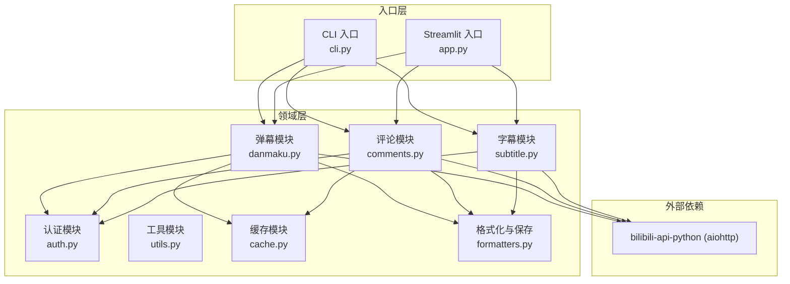
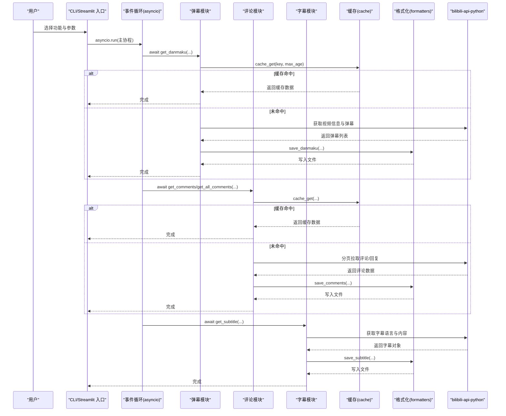
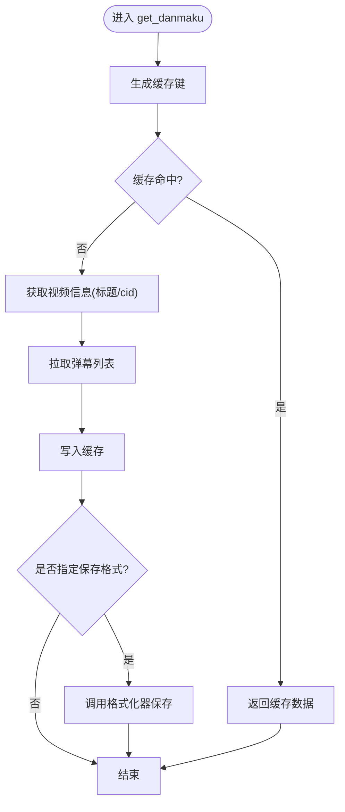
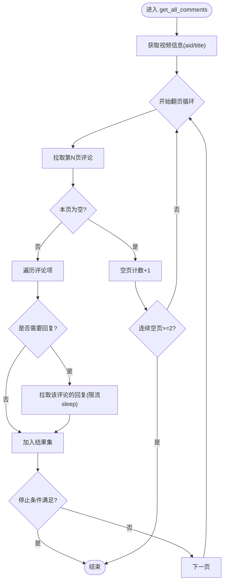
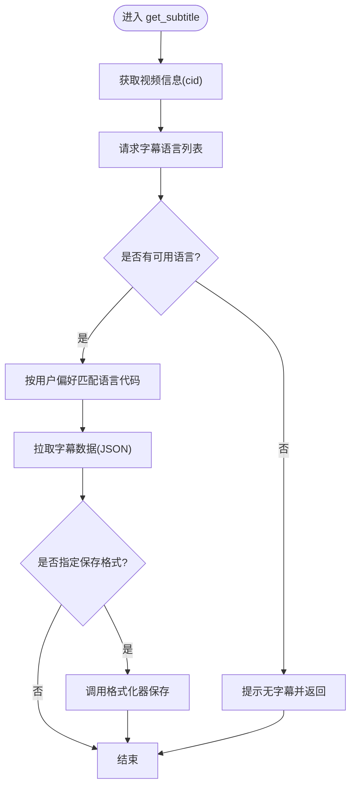
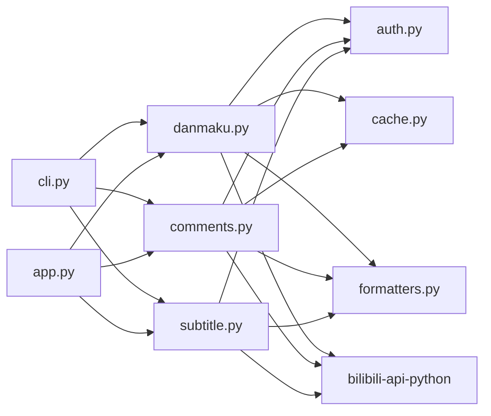

# 异步处理架构

<cite>
**本文引用的文件**   
- [app.py](file://app.py)
- [cli.py](file://cli.py)
- [bilibili/__init__.py](file://bilibili/__init__.py)
- [bilibili/utils.py](file://bilibili/utils.py)
- [bilibili/auth.py](file://bilibili/auth.py)
- [bilibili/danmaku.py](file://bilibili/danmaku.py)
- [bilibili/comments.py](file://bilibili/comments.py)
- [bilibili/subtitle.py](file://bilibili/subtitle.py)
- [bilibili/cache.py](file://bilibili/cache.py)
- [bilibili/formatters.py](file://bilibili/formatters.py)
- [bilibili_demo.py](file://bilibili_demo.py)
- [requirements.txt](file://requirements.txt)
</cite>

## 目录
1. [简介](#简介)
2. [项目结构](#项目结构)
3. [核心组件](#核心组件)
4. [架构总览](#架构总览)
5. [详细组件分析](#详细组件分析)
6. [依赖关系分析](#依赖关系分析)
7. [性能与并发优化](#性能与并发优化)
8. [资源管理与错误恢复](#资源管理与错误恢复)
9. [调试与故障排除](#调试与故障排除)
10. [结论](#结论)

## 简介
本仓库实现了一个基于 asyncio 的 B站弹幕、评论与字幕抓取工具，提供命令行与 Streamlit Web 两种入口。系统通过 bilibili-api-python 封装的异步接口访问 B站 API，结合本地 JSON 缓存减少重复请求，并通过格式化模块将结果持久化为多种文本/结构化格式。整体采用“事件循环 + 协程”的异步模型，以函数式模块化组织业务逻辑，便于扩展与维护。

## 项目结构
- 应用入口
  - CLI 入口：解析参数并编排异步任务执行
  - Streamlit 入口：在浏览器中交互式触发相同异步流程
- 领域模块
  - 弹幕、评论、字幕三个独立异步功能模块
  - 认证（Cookie 解析）、缓存（文件型 JSON）、通用工具（BV 号提取）
  - 数据格式化与保存（txt/json/csv/srt/ass/lrc）
- 外部依赖
  - bilibili-api-python：B站 API 的 Python 异步封装
  - aiohttp：底层 HTTP 客户端（由上层库使用）
  - streamlit：Web UI 框架

图表来源
- [cli.py:63-117](file://cli.py#L63-L117)
- [app.py:76-142](file://app.py#L76-L142)
- [bilibili/danmaku.py:13-64](file://bilibili/danmaku.py#L13-L64)
- [bilibili/comments.py:42-171](file://bilibili/comments.py#L42-L171)
- [bilibili/subtitle.py:21-77](file://bilibili/subtitle.py#L21-L77)
- [bilibili/auth.py:8-38](file://bilibili/auth.py#L8-L38)
- [bilibili/cache.py:14-42](file://bilibili/cache.py#L14-L42)
- [bilibili/formatters.py:50-166](file://bilibili/formatters.py#L50-L166)

章节来源
- [cli.py:1-118](file://cli.py#L1-L118)
- [app.py:1-281](file://app.py#L1-L281)
- [bilibili/__init__.py:1-19](file://bilibili/__init__.py#L1-L19)
- [requirements.txt:1-4](file://requirements.txt#L1-L4)

## 核心组件
- 事件循环与协程编排
  - CLI 与 Streamlit 均通过 asyncio.run 启动事件循环，并在协程中顺序 await 各功能模块，保证可观测性与可控性。
- 网络请求异步化
  - 所有对外部 B站 API 的调用均为异步方法，避免阻塞事件循环。
- 缓存策略
  - 基于文件的 JSON 缓存，按 BV 号、数据类型与页码生成键，支持过期时间控制。
- 数据持久化
  - 统一格式化输出到 txt/json/csv/srt/ass/lrc，便于后续分析与播放。
- 认证与凭证
  - 从 Cookie 字符串解析出 Credential 对象，用于需要登录态的请求。

章节来源
- [cli.py:63-117](file://cli.py#L63-L117)
- [app.py:76-142](file://app.py#L76-L142)
- [bilibili/cache.py:14-42](file://bilibili/cache.py#L14-L42)
- [bilibili/formatters.py:50-166](file://bilibili/formatters.py#L50-L166)
- [bilibili/auth.py:8-38](file://bilibili/auth.py#L8-L38)

## 架构总览
下图展示了从用户输入到数据落盘的整体异步流程，包括事件循环、协程编排、缓存命中判断、API 调用与格式化保存。

图表来源
- [cli.py:63-117](file://cli.py#L63-L117)
- [app.py:76-142](file://app.py#L76-L142)
- [bilibili/danmaku.py:13-64](file://bilibili/danmaku.py#L13-L64)
- [bilibili/comments.py:42-171](file://bilibili/comments.py#L42-L171)
- [bilibili/subtitle.py:21-77](file://bilibili/subtitle.py#L21-L77)
- [bilibili/cache.py:14-42](file://bilibili/cache.py#L14-L42)
- [bilibili/formatters.py:50-166](file://bilibili/formatters.py#L50-L166)

## 详细组件分析

### 弹幕模块（Danmaku）
- 职责
  - 根据 BV 号与分 P 索引获取视频信息，拉取弹幕列表，可选保存到文件。
- 关键流程
  - 计算缓存键 → 尝试命中缓存 → 若未命中则调用 API 获取弹幕 → 写入缓存与文件。
- 并发特性
  - 单条协程串行执行；适合与评论/字幕并行调度以提升吞吐。
- 复杂度
  - I/O 密集为主，CPU 开销低；内存占用与弹幕数量线性相关。

图表来源
- [bilibili/danmaku.py:13-64](file://bilibili/danmaku.py#L13-L64)
- [bilibili/cache.py:14-42](file://bilibili/cache.py#L14-L42)
- [bilibili/formatters.py:101-142](file://bilibili/formatters.py#L101-L142)

章节来源
- [bilibili/danmaku.py:13-64](file://bilibili/danmaku.py#L13-L64)

### 评论模块（Comments）
- 职责
  - 支持单页或全量翻页获取评论，可选择同时拉取楼中楼回复。
- 关键流程
  - 单页：获取 aid → 拉取一页评论 → 可选拉取每条评论的回复 → 缓存与保存。
  - 全量：循环翻页直至达到目标页数、连续空页或安全上限，累计评论与回复。
- 并发特性
  - 当前为串行拉取；可通过并发策略提升吞吐（见后文优化建议）。
- 复杂度
  - I/O 密集；回复拉取存在额外 N 次请求，需限流保护。

图表来源
- [bilibili/comments.py:92-171](file://bilibili/comments.py#L92-L171)

章节来源
- [bilibili/comments.py:42-171](file://bilibili/comments.py#L42-L171)

### 字幕模块（Subtitle）
- 职责
  - 获取可用字幕语言列表，按用户偏好匹配语言代码，拉取字幕并保存为 srt/ass/lrc/json。
- 关键流程
  - 获取视频 cid → 请求字幕语言列表 → 匹配语言 → 拉取字幕数据 → 格式化保存。
- 并发特性
  - 单协程串行；可与弹幕/评论并行调度。

图表来源
- [bilibili/subtitle.py:21-77](file://bilibili/subtitle.py#L21-L77)
- [bilibili/formatters.py:146-166](file://bilibili/formatters.py#L146-L166)

章节来源
- [bilibili/subtitle.py:21-77](file://bilibili/subtitle.py#L21-L77)

### 认证与工具
- 认证（Cookie 解析）
  - 从包含 SESSDATA 的 Cookie 字符串解析出 Credential 对象，供需要登录态的 API 使用。
- 工具（BV 号提取）
  - 支持纯 BV 号、完整链接与短链接三种输入格式，正则提取 BV 号。

章节来源
- [bilibili/auth.py:8-38](file://bilibili/auth.py#L8-L38)
- [bilibili/utils.py:8-28](file://bilibili/utils.py#L8-L28)

### 缓存与格式化
- 缓存
  - 基于 .bili_cache 目录的 JSON 文件，键为 MD5(bvid:dtype:page)，记录缓存时间与最大存活时间。
- 格式化与保存
  - 评论：json/csv/txt，保留层级与元数据
  - 弹幕：json/csv/txt，保留时间戳与样式字段
  - 字幕：srt/ass/lrc/json，直接转换输出

章节来源
- [bilibili/cache.py:14-42](file://bilibili/cache.py#L14-L42)
- [bilibili/formatters.py:50-166](file://bilibili/formatters.py#L50-L166)

## 依赖关系分析
- 内部依赖
  - 入口层（CLI/Streamlit）依赖领域层（弹幕/评论/字幕），领域层依赖认证、缓存、格式化与 bilibili-api-python。
- 外部依赖
  - bilibili-api-python 基于 aiohttp 进行异步 HTTP 通信；streamlit 作为 Web 运行时。

图表来源
- [cli.py:63-117](file://cli.py#L63-L117)
- [app.py:76-142](file://app.py#L76-L142)
- [bilibili/danmaku.py:13-64](file://bilibili/danmaku.py#L13-L64)
- [bilibili/comments.py:42-171](file://bilibili/comments.py#L42-L171)
- [bilibili/subtitle.py:21-77](file://bilibili/subtitle.py#L21-L77)
- [bilibili/auth.py:8-38](file://bilibili/auth.py#L8-L38)
- [bilibili/cache.py:14-42](file://bilibili/cache.py#L14-L42)
- [bilibili/formatters.py:50-166](file://bilibili/formatters.py#L50-L166)

章节来源
- [requirements.txt:1-4](file://requirements.txt#L1-L4)

## 性能与并发优化
说明：以下内容为通用优化建议，不直接对应仓库现有实现细节。

- 并发调度
  - 将弹幕、评论、字幕等互不依赖的任务放入 asyncio.gather 并发执行，显著缩短端到端耗时。
  - 对评论翻页与回复拉取引入信号量（Semaphore）限制并发度，避免触发服务端限频。
- 连接池与超时重试
  - 复用 bilibili-api-python 内部的 aiohttp 连接池；必要时自定义 ClientSession 配置超时与重试策略。
  - 针对间歇性网络抖动，增加指数退避重试与熔断降级（如跳过失败评论继续其他条目）。
- 限流与负载均衡
  - 全局速率限制：对评论/回复请求设置固定间隔 sleep 或令牌桶算法。
  - 多账号轮询：当需要大规模采集时，维护多个 Credential 轮换以降低单账号风险。
- 监控指标收集
  - 统计每个阶段的耗时、成功/失败次数、缓存命中率、I/O 大小，便于定位瓶颈。
  - 使用结构化日志输出关键路径指标，便于聚合与分析。

[本节为通用指导，无需源码引用]

## 资源管理与错误恢复
- 内存优化
  - 大列表（弹幕/评论）尽量流式处理或分批写入，避免一次性加载到内存导致峰值升高。
  - 关闭不必要的中间对象引用，及时释放临时变量。
- 文件 I/O 异步化
  - 当前保存操作为同步写盘；在高并发场景下可考虑线程池或进程池包装，避免阻塞事件循环。
- 错误恢复
  - 对单个评论/回复拉取异常进行捕获与降级，确保整体流程继续推进。
  - 对网络异常实施重试与回退策略，记录失败详情以便排查。
- 资源清理
  - 确保外部会话与句柄在使用完毕后正确关闭，避免资源泄漏。

[本节为通用指导，无需源码引用]

## 调试与故障排除
- 常见问题
  - BV 号解析失败：检查输入是否为有效链接或 BV 号格式。
  - 无字幕：确认视频是否存在字幕资源，或切换语言代码。
  - 评论为空：可能是分页终止条件触发或网络异常，检查日志与重试策略。
- 调试技巧
  - 启用详细日志输出，关注缓存命中与 API 响应状态。
  - 逐步缩小范围：先单独运行弹幕/评论/字幕，再组合验证。
  - 使用 Streamlit 界面快速复现问题，观察进度与错误提示。
- 故障定位
  - 检查 .bili_cache 目录中的缓存文件，确认过期策略是否正确。
  - 核对 Cookie 是否包含必要字段（SESSDATA 等），必要时重新登录获取。

章节来源
- [bilibili/utils.py:8-28](file://bilibili/utils.py#L8-L28)
- [bilibili/subtitle.py:21-77](file://bilibili/subtitle.py#L21-L77)
- [bilibili/comments.py:92-171](file://bilibili/comments.py#L92-L171)
- [bilibili/cache.py:14-42](file://bilibili/cache.py#L14-L42)

## 结论
本项目以 asyncio 为核心，围绕弹幕、评论、字幕三大能力构建清晰的异步流水线。通过缓存与格式化模块降低重复 I/O 与提升可用性，配合认证与工具模块形成完整的爬取解决方案。建议在现有基础上引入并发调度、限流与监控指标，进一步提升吞吐与稳定性，并逐步将文件 I/O 异步化以避免阻塞事件循环。