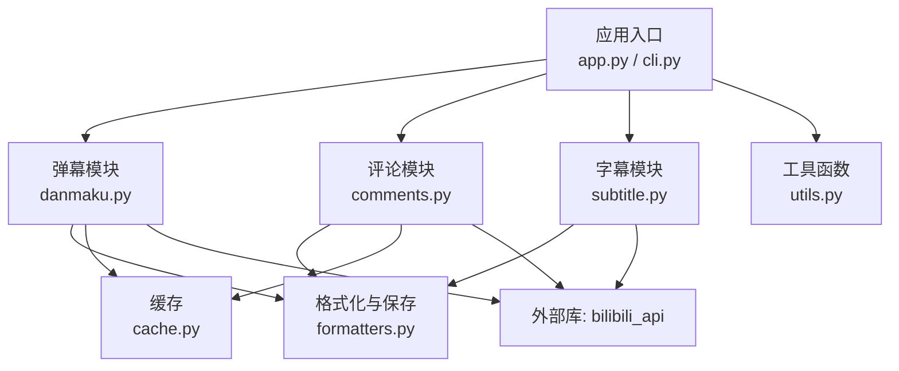
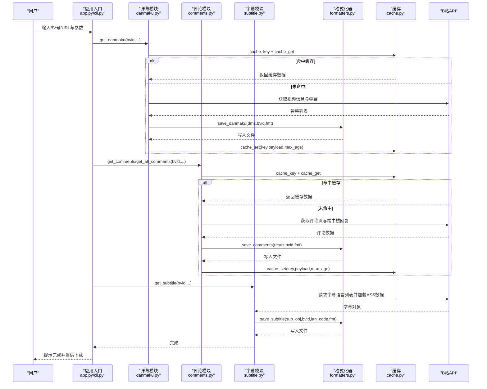
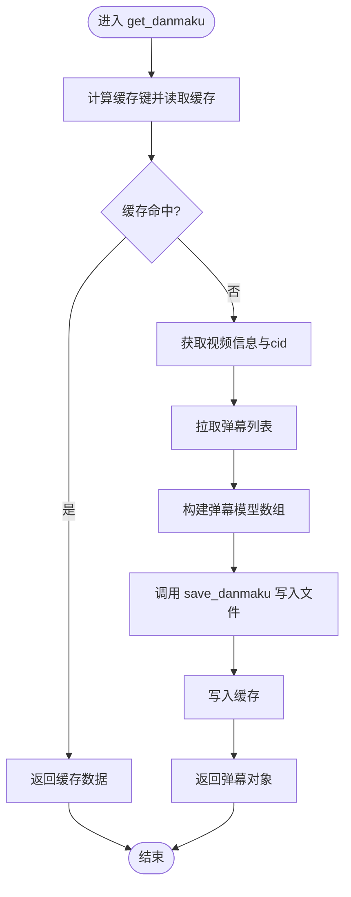
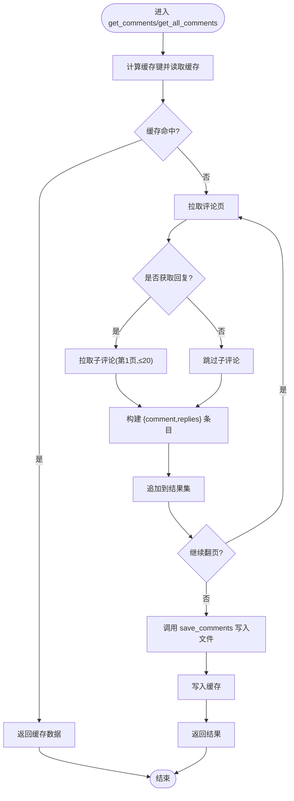
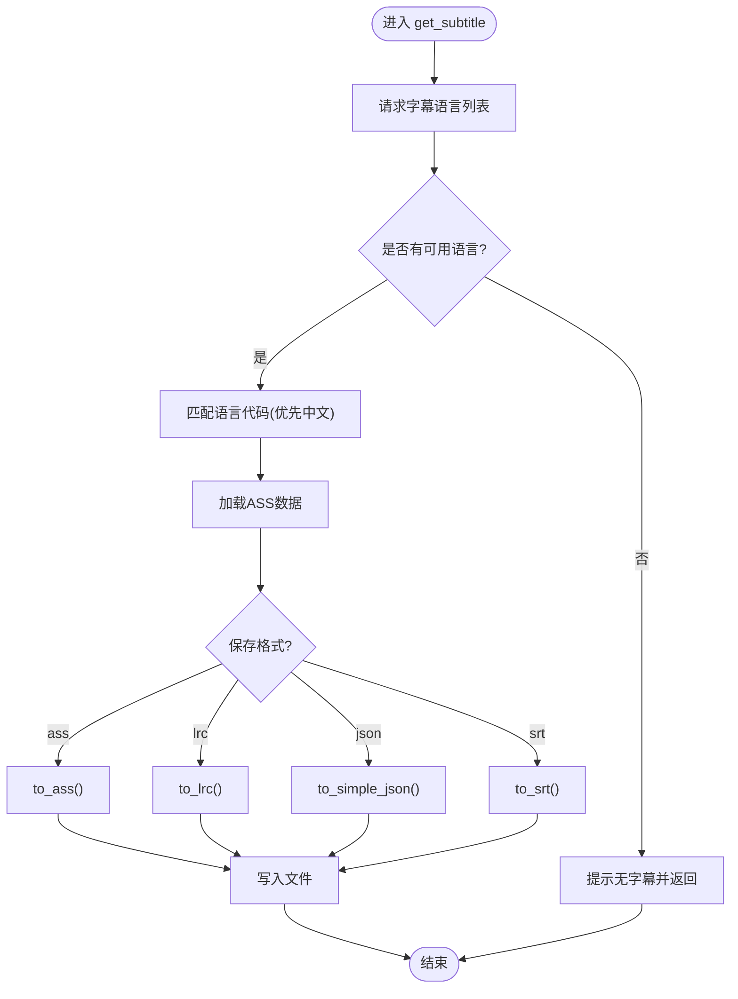
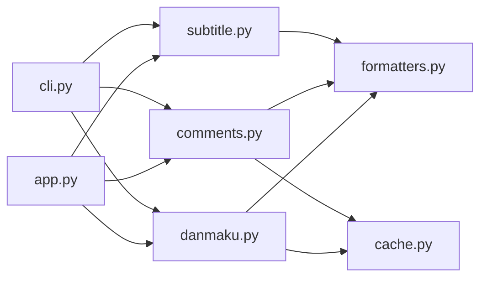

# 数据模型设计

<cite>
**本文引用的文件列表**
- [bilibili/danmaku.py](file://bilibili/danmaku.py)
- [bilibili/comments.py](file://bilibili/comments.py)
- [bilibili/subtitle.py](file://bilibili/subtitle.py)
- [bilibili/formatters.py](file://bilibili/formatters.py)
- [bilibili/cache.py](file://bilibili/cache.py)
- [bilibili/utils.py](file://bilibili/utils.py)
- [bilibili/__init__.py](file://bilibili/__init__.py)
- [app.py](file://app.py)
- [cli.py](file://cli.py)
- [bilibili_demo.py](file://bilibili_demo.py)
</cite>

## 目录
1. [引言](#引言)
2. [项目结构](#项目结构)
3. [核心数据模型](#核心数据模型)
4. [架构总览](#架构总览)
5. [详细组件分析](#详细组件分析)
6. [依赖关系分析](#依赖关系分析)
7. [性能与可扩展性](#性能与可扩展性)
8. [故障排查指南](#故障排查指南)
9. [结论](#结论)
10. [附录：序列化格式映射与迁移建议](#附录：序列化格式映射与迁移建议)

## 引言
本技术文档围绕弹幕、评论、字幕三类数据的数据模型设计与实现进行系统化说明，覆盖数据结构定义、字段类型约束、验证规则、序列化格式（JSON/CSV/SRT/ASS/LRC）映射、从API响应到最终输出的生命周期管理、完整性检查与错误处理机制，以及数据迁移与版本兼容性考虑。目标是帮助开发者快速理解并扩展数据模型，确保在新增格式或字段时具备可维护性与向后兼容能力。

## 项目结构
本项目采用“按功能模块划分”的组织方式，核心数据模型相关代码集中在以下模块：
- 弹幕抓取与模型构造：bilibili/danmaku.py
- 评论抓取与嵌套回复：bilibili/comments.py
- 字幕获取与语言选择：bilibili/subtitle.py
- 数据格式化与持久化：bilibili/formatters.py
- 缓存与键生成：bilibili/cache.py
- 工具函数（BV号解析等）：bilibili/utils.py
- 对外导出入口：bilibili/__init__.py
- CLI与Web界面入口：cli.py、app.py
- 示例脚本（含完整逻辑复现）：bilibili_demo.py

图表来源
- [app.py:1-142](file://app.py#L1-L142)
- [cli.py:1-118](file://cli.py#L1-L118)
- [bilibili/danmaku.py:1-64](file://bilibili/danmaku.py#L1-L64)
- [bilibili/comments.py:1-171](file://bilibili/comments.py#L1-L171)
- [bilibili/subtitle.py:1-77](file://bilibili/subtitle.py#L1-L77)
- [bilibili/formatters.py:1-166](file://bilibili/formatters.py#L1-L166)
- [bilibili/cache.py:1-42](file://bilibili/cache.py#L1-L42)
- [bilibili/utils.py:1-28](file://bilibili/utils.py#L1-L28)

章节来源
- [bilibili/__init__.py:1-19](file://bilibili/__init__.py#L1-L19)
- [bilibili/utils.py:1-28](file://bilibili/utils.py#L1-L28)
- [bilibili/cache.py:1-42](file://bilibili/cache.py#L1-L42)

## 核心数据模型
本节定义三类核心数据模型的字段、类型约束与校验规则。所有模型均来源于实际抓取流程中的对象构造与格式化输出。

### 弹幕数据模型（Danmaku）
- 字段定义
  - time: 浮点数，表示弹幕出现时间（秒），保留一位小数用于显示与存储
  - text: 字符串，弹幕文本内容
  - mode: 整数，弹幕模式（如滚动、顶部、底部等）
  - font_size: 整数，字体大小
  - color: 整数，颜色值（RGB整型）
  - uid: 字符串或数字，用户标识
- 类型约束
  - time ≥ 0；text非空；mode/font_size/color为有效数值；uid存在
- 数据来源
  - 由视频对象的弹幕列表逐项提取并转换为字典集合
- 典型用途
  - JSON/CSV/TXT 输出；SRT/ASS 可由第三方库转换

章节来源
- [bilibili/danmaku.py:47-57](file://bilibili/danmaku.py#L47-L57)
- [bilibili/formatters.py:106-141](file://bilibili/formatters.py#L106-L141)
- [bilibili_demo.py:148-153](file://bilibili_demo.py#L148-L153)

### 评论数据模型（Comment）
- 字段定义
  - like: 整数，点赞数
  - uname: 字符串，用户名
  - time: 字符串，可读时间（YYYY-MM-DD HH:MM）
  - text: 字符串，评论内容
  - reply_count: 整数，回复数量
  - rpid: 字符串或数字，评论ID
- 类型约束
  - like ≥ 0；uname非空；time符合日期格式；text非空；reply_count ≥ 0；rpid存在
- 数据来源
  - 原始评论对象经格式化函数抽取精简字段
- 嵌套结构
  - 每条评论可包含 replies 列表，每个回复项包含类似字段（如 reply_to 指向父级用户名）

章节来源
- [bilibili/formatters.py:21-45](file://bilibili/formatters.py#L21-L45)
- [bilibili/comments.py:74-89](file://bilibili/comments.py#L74-L89)
- [bilibili_demo.py:49-64](file://bilibili_demo.py#L49-L64)

### 字幕数据模型（Subtitle）
- 字段定义（简化JSON）
  - start: 浮点，开始时间（秒）
  - end: 浮点，结束时间（秒）
  - text: 字符串，字幕文本
  - lang: 字符串，语言代码（如 ai-zh, zh-Hans, en）
- 类型约束
  - start ≤ end；start/end ≥ 0；text非空；lang属于可用语言集合
- 数据来源
  - 通过字幕对象请求多语言列表并加载ASS数据，再转换为SRT/ASS/LRC/JSON
- 语言映射
  - 支持中文AI、简繁中文、英语、日语、韩语等，默认优先中文

章节来源
- [bilibili/subtitle.py:11-18](file://bilibili/subtitle.py#L11-L18)
- [bilibili/subtitle.py:21-77](file://bilibili/subtitle.py#L21-L77)
- [bilibili/formatters.py:146-166](file://bilibili/formatters.py#L146-L166)

## 架构总览
数据从B站API拉取后，经过缓存判断、模型构造、格式化与持久化，最终输出为多种文件格式。整体流程如下：

图表来源
- [app.py:46-142](file://app.py#L46-L142)
- [cli.py:63-118](file://cli.py#L63-L118)
- [bilibili/danmaku.py:13-64](file://bilibili/danmaku.py#L13-L64)
- [bilibili/comments.py:42-171](file://bilibili/comments.py#L42-L171)
- [bilibili/subtitle.py:21-77](file://bilibili/subtitle.py#L21-L77)
- [bilibili/formatters.py:50-166](file://bilibili/formatters.py#L50-L166)
- [bilibili/cache.py:14-42](file://bilibili/cache.py#L14-L42)

## 详细组件分析

### 弹幕数据流与模型构建
- 关键步骤
  - 解析BV号并获取视频信息（cid）
  - 拉取弹幕列表，逐条构造弹幕模型字典
  - 写入缓存与文件（JSON/CSV/TXT）
- 模型字段映射
  - dm_time → time（保留一位小数）
  - text → text
  - mode → mode
  - font_size → font_size
  - color → color
  - uid → uid
- 输出格式
  - JSON：数组，每项包含上述字段
  - CSV：表头 time_s,text,mode,font_size,color,uid
  - TXT：每行 “[时间s] 文本”

图表来源
- [bilibili/danmaku.py:13-64](file://bilibili/danmaku.py#L13-L64)
- [bilibili/formatters.py:101-141](file://bilibili/formatters.py#L101-L141)
- [bilibili/cache.py:14-42](file://bilibili/cache.py#L14-L42)

章节来源
- [bilibili/danmaku.py:13-64](file://bilibili/danmaku.py#L13-L64)
- [bilibili/formatters.py:101-141](file://bilibili/formatters.py#L101-L141)

### 评论数据流与嵌套回复
- 关键步骤
  - 单页获取：按页码拉取评论，可选获取楼中楼回复（限制第1页最多20条）
  - 全量翻页：循环拉取直到达到目标页数、已知总数或安全上限
  - 模型构造：将原始评论对象转为精简字段，并附加 replies 列表
- 模型字段映射
  - like → like
  - member.uname → uname
  - ctime → time（格式化）
  - content.message → text
  - rcount → reply_count
  - rpid → rpid
- 输出格式
  - JSON：数组，每项 comment 与 replies 均为精简模型
  - CSV：扁平化，level=comment/reply，统一字段集
  - TXT：层级缩进展示

图表来源
- [bilibili/comments.py:42-171](file://bilibili/comments.py#L42-L171)
- [bilibili/formatters.py:21-96](file://bilibili/formatters.py#L21-L96)
- [bilibili/cache.py:14-42](file://bilibili/cache.py#L14-L42)

章节来源
- [bilibili/comments.py:42-171](file://bilibili/comments.py#L42-L171)
- [bilibili/formatters.py:21-96](file://bilibili/formatters.py#L21-L96)

### 字幕数据流与语言选择
- 关键步骤
  - 获取字幕语言列表，根据用户指定或默认策略选择语言代码
  - 加载ASS数据，转换为SRT/ASS/LRC/JSON
- 模型字段映射（简化JSON）
  - start/end/text/lang 来自字幕对象内部结构
- 输出格式
  - SRT/ASS/LRC：标准字幕格式
  - JSON：结构化数组，便于后续处理

图表来源
- [bilibili/subtitle.py:21-77](file://bilibili/subtitle.py#L21-L77)
- [bilibili/formatters.py:146-166](file://bilibili/formatters.py#L146-L166)

章节来源
- [bilibili/subtitle.py:21-77](file://bilibili/subtitle.py#L21-L77)
- [bilibili/formatters.py:146-166](file://bilibili/formatters.py#L146-L166)

## 依赖关系分析
- 模块耦合
  - danmaku.py、comments.py、subtitle.py 均依赖 formatters.py 进行持久化
  - comments.py 与 danmaku.py 使用 cache.py 进行缓存读写
  - app.py 与 cli.py 作为入口编排各模块调用顺序
- 外部依赖
  - bilibili_api：提供视频、评论、字幕的异步接口
  - streamlit：Web界面交互
- 潜在循环依赖
  - 当前结构清晰，未见循环导入

图表来源
- [bilibili/danmaku.py:1-64](file://bilibili/danmaku.py#L1-L64)
- [bilibili/comments.py:1-171](file://bilibili/comments.py#L1-L171)
- [bilibili/subtitle.py:1-77](file://bilibili/subtitle.py#L1-L77)
- [bilibili/formatters.py:1-166](file://bilibili/formatters.py#L1-L166)
- [bilibili/cache.py:1-42](file://bilibili/cache.py#L1-L42)
- [app.py:1-142](file://app.py#L1-L142)
- [cli.py:1-118](file://cli.py#L1-L118)

章节来源
- [bilibili/__init__.py:1-19](file://bilibili/__init__.py#L1-L19)
- [bilibili/utils.py:1-28](file://bilibili/utils.py#L1-L28)

## 性能与可扩展性
- 缓存策略
  - 基于文件的JSON缓存，带过期时间控制，减少重复网络请求
  - 键生成使用MD5哈希，避免路径过长与冲突
- I/O优化
  - CSV使用utf-8-sig编码，兼容Excel
  - JSON使用ensure_ascii=False与indent=2提升可读性
- 并发与限流
  - 评论楼中楼拉取加入sleep，降低对服务端压力
  - 全量翻页设置安全上限，防止内存溢出
- 可扩展性建议
  - 新增格式时，在formatters.py中增加分支处理，保持单一职责
  - 模型字段变更需同步更新format_*函数与CSV fieldnames

[本节为通用指导，不直接分析具体文件]

## 故障排查指南
- BV号解析失败
  - 现象：抛出无法解析BV号的异常
  - 原因：输入不符合预期格式
  - 处理：检查输入是否为纯BV号或完整链接
- 评论回复获取失败
  - 现象：打印“回复获取失败 rpid=...”并返回空列表
  - 原因：网络错误或权限不足
  - 处理：重试或调整max_pages与with_replies
- 字幕无可用语言
  - 现象：提示该视频没有字幕
  - 原因：视频未提供字幕资源
  - 处理：更换视频或忽略字幕获取
- 缓存问题
  - 现象：缓存命中但数据陈旧
  - 原因：max_age设置过小或缓存文件损坏
  - 处理：增大max_age或删除缓存目录重新抓取

章节来源
- [bilibili/utils.py:8-28](file://bilibili/utils.py#L8-L28)
- [bilibili/comments.py:27-40](file://bilibili/comments.py#L27-L40)
- [bilibili/subtitle.py:43-50](file://bilibili/subtitle.py#L43-L50)
- [bilibili/cache.py:19-28](file://bilibili/cache.py#L19-L28)

## 结论
本项目围绕弹幕、评论、字幕三类数据构建了清晰的数据模型与完整的生命周期管理流程。通过模块化设计与统一的格式化器，实现了多格式输出与良好的可维护性。建议在后续迭代中引入更严格的类型校验与版本迁移策略，以进一步提升数据质量与系统稳定性。

[本节为总结性内容，不直接分析具体文件]

## 附录：序列化格式映射与迁移建议

### 序列化格式映射
- 弹幕
  - JSON：数组，字段 time_s/text/mode/font_size/color/uid
  - CSV：表头 time_s,text,mode,font_size,color,uid
  - TXT：每行 “[时间s] 文本”
- 评论
  - JSON：数组，每项包含 comment 与 replies 精简模型
  - CSV：扁平化，字段 level/like/uname/time/text/reply_count/reply_to/rpid
  - TXT：层级缩进展示
- 字幕
  - SRT/ASS/LRC：标准字幕格式
  - JSON：结构化数组，字段 start/end/text/lang

章节来源
- [bilibili/formatters.py:50-166](file://bilibili/formatters.py#L50-L166)
- [bilibili_demo.py:66-125](file://bilibili_demo.py#L66-L125)

### 数据完整性检查与错误处理
- 必填字段校验
  - 弹幕：time/text/mode/font_size/color/uid
  - 评论：like/uname/time/text/reply_count/rpid
  - 字幕：start/end/text/lang
- 边界条件
  - 时间范围：start ≤ end，time ≥ 0
  - 计数字段：like/reply_count ≥ 0
- 异常捕获
  - 评论回复拉取异常返回空列表
  - 字幕无语言时提前返回
  - BV号解析失败抛出异常

章节来源
- [bilibili/comments.py:27-40](file://bilibili/comments.py#L27-L40)
- [bilibili/subtitle.py:43-50](file://bilibili/subtitle.py#L43-L50)
- [bilibili/utils.py:8-28](file://bilibili/utils.py#L8-L28)

### 数据迁移与版本兼容性
- 字段演进策略
  - 新增字段时保持旧字段兼容，CSV fieldnames动态合并
  - JSON输出保留历史字段，标记废弃字段为可选
- 格式升级
  - 新增格式分支在formatters.py中独立处理，避免破坏现有逻辑
  - 版本号记录于输出文件名或元数据中，便于追溯
- 缓存与数据一致性
  - 缓存键包含数据类型与页码，避免跨版本污染
  - 清理过期缓存，必要时提供手动清理入口

章节来源
- [bilibili/formatters.py:50-166](file://bilibili/formatters.py#L50-L166)
- [bilibili/cache.py:14-42](file://bilibili/cache.py#L14-L42)