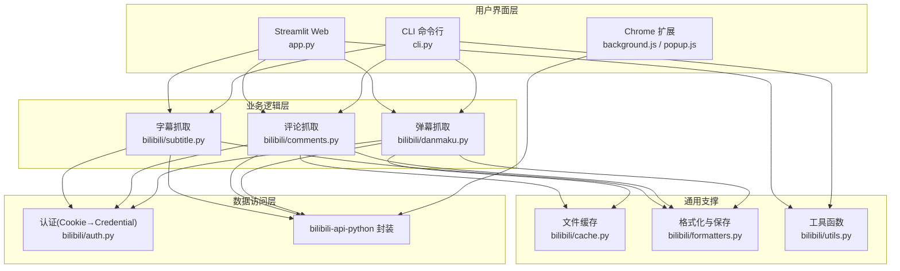
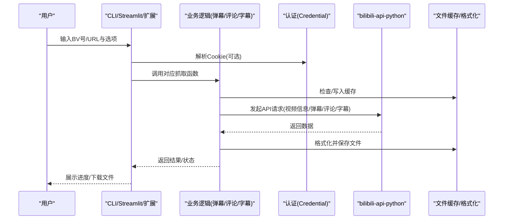
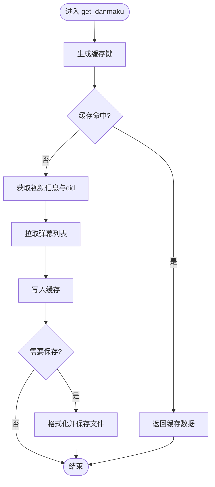
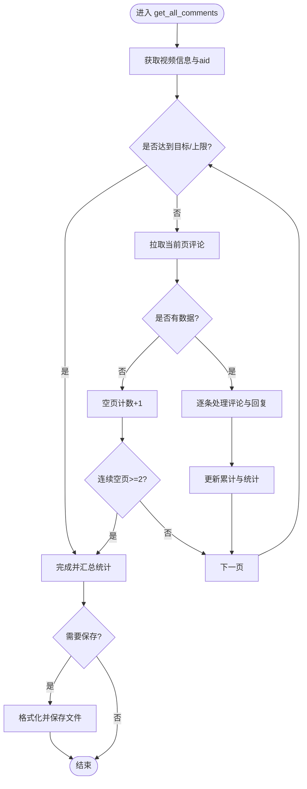
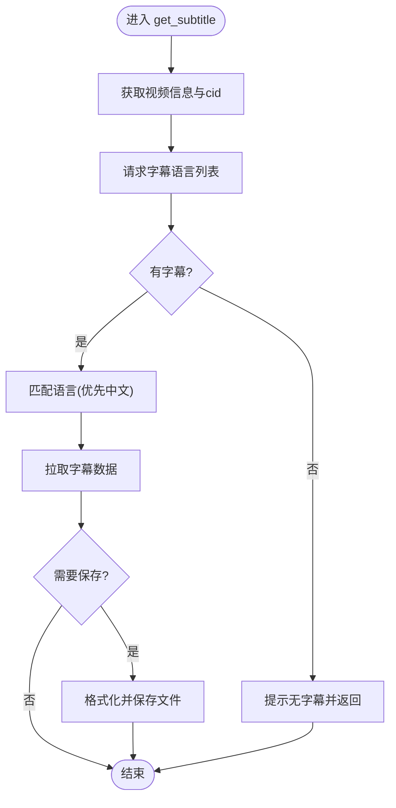
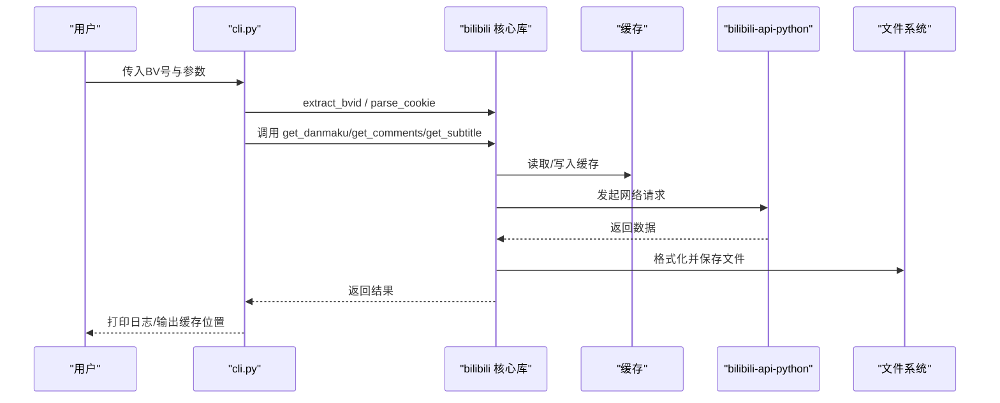
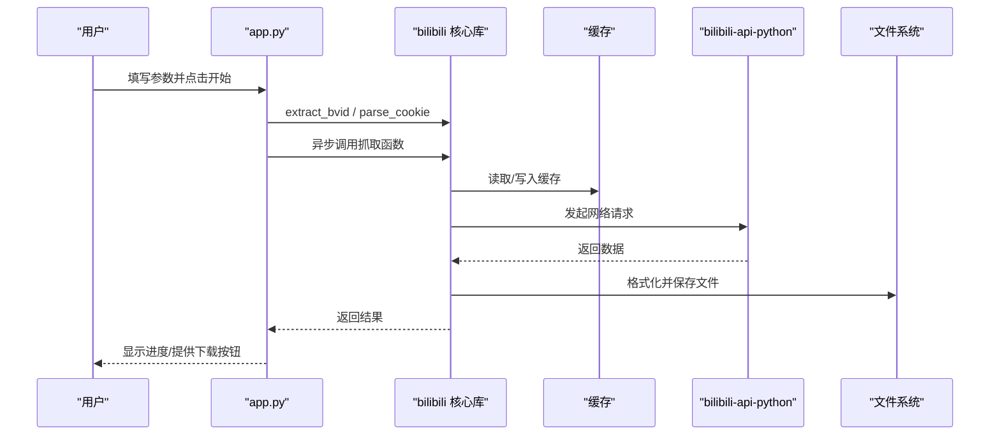
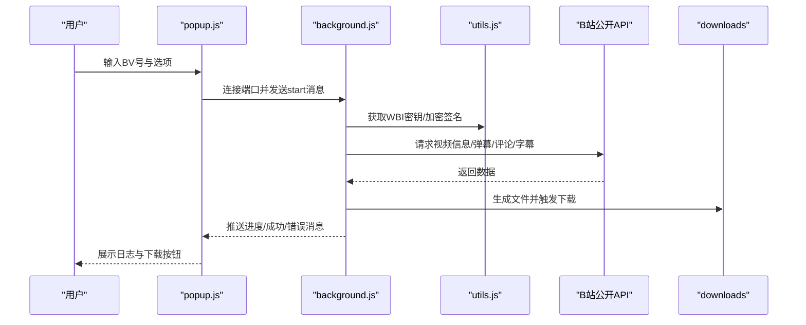
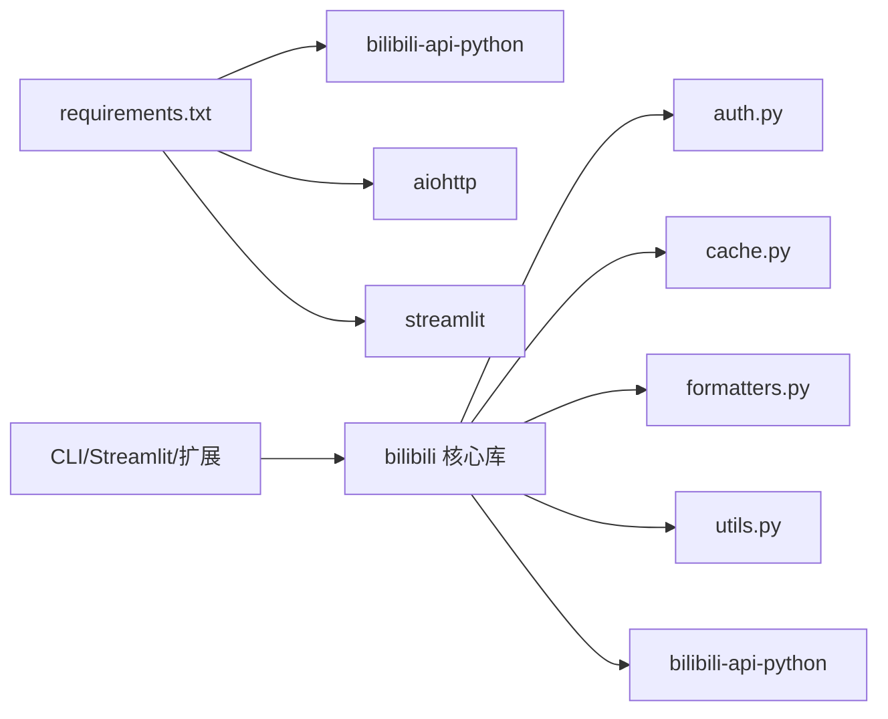
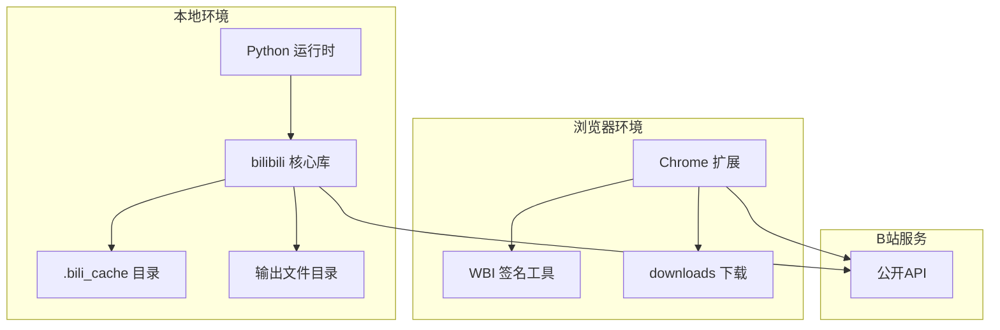

# 整体架构概览

<cite>
**本文引用的文件**   
- [app.py](file://app.py)
- [cli.py](file://cli.py)
- [bilibili/__init__.py](file://bilibili/__init__.py)
- [bilibili/danmaku.py](file://bilibili/danmaku.py)
- [bilibili/comments.py](file://bilibili/comments.py)
- [bilibili/subtitle.py](file://bilibili/subtitle.py)
- [bilibili/auth.py](file://bilibili/auth.py)
- [bilibili/cache.py](file://bilibili/cache.py)
- [bilibili/formatters.py](file://bilibili/formatters.py)
- [bilibili/utils.py](file://bilibili/utils.py)
- [bilibili_demo.py](file://bilibili_demo.py)
- [requirements.txt](file://requirements.txt)
- [bilibili-extension--main/manifest.json](file://bilibili-extension--main/manifest.json)
- [bilibili-extension--main/background.js](file://bilibili-extension--main/background.js)
- [bilibili-extension--main/popup.js](file://bilibili-extension--main/popup.js)
- [bilibili-extension--main/utils.js](file://bilibili-extension--main/utils.js)
</cite>

## 目录
1. [简介](#简介)
2. [项目结构](#项目结构)
3. [核心组件](#核心组件)
4. [架构总览](#架构总览)
5. [详细组件分析](#详细组件分析)
6. [依赖关系分析](#依赖关系分析)
7. [性能与缓存](#性能与缓存)
8. [部署拓扑与扩展点](#部署拓扑与扩展点)
9. [故障排查指南](#故障排查指南)
10. [结论](#结论)

## 简介
本项目面向B站视频内容，提供弹幕、评论（含楼中楼回复）、字幕的抓取与导出能力。系统采用分层架构：用户界面层（CLI命令行、Streamlit Web、Chrome扩展）、业务逻辑层（弹幕/评论/字幕抓取模块）、数据访问层（基于bilibili-api-python的API封装）以及本地文件缓存与格式化输出。通过模块化设计与清晰的职责划分，实现多入口复用同一套核心能力，并支持多种输出格式与语言选择。

## 项目结构
- 用户界面层
  - CLI命令行入口：解析参数、编排任务、调用核心库
  - Streamlit Web应用：交互式页面，异步执行任务并提供下载
  - Chrome扩展：在浏览器内直接发起请求、处理进度与下载
- 业务逻辑层
  - 弹幕抓取：获取分P弹幕列表、格式化与保存
  - 评论抓取：单页/全量翻页、可选楼中楼回复
  - 字幕抓取：自动语言匹配、多格式导出
- 数据访问层
  - 认证：Cookie解析为Credential对象
  - API封装：使用bilibili-api-python进行视频信息、弹幕、评论、字幕等接口调用
- 通用支撑
  - 缓存：基于文件的JSON缓存，按key与max_age控制有效期
  - 工具：BV号提取、时间格式化等
  - 格式化：统一将结果保存为txt/json/csv/srt/ass/lrc等

图表来源
- [cli.py:1-118](file://cli.py#L1-L118)
- [app.py:1-281](file://app.py#L1-L281)
- [bilibili-extension--main/background.js:1-567](file://bilibili-extension--main/background.js#L1-L567)
- [bilibili/danmaku.py:1-64](file://bilibili/danmaku.py#L1-L64)
- [bilibili/comments.py:1-171](file://bilibili/comments.py#L1-L171)
- [bilibili/subtitle.py:1-77](file://bilibili/subtitle.py#L1-L77)
- [bilibili/auth.py:1-38](file://bilibili/auth.py#L1-L38)
- [bilibili/cache.py:1-42](file://bilibili/cache.py#L1-L42)
- [bilibili/formatters.py:1-166](file://bilibili/formatters.py#L1-L166)
- [bilibili/utils.py:1-28](file://bilibili/utils.py#L1-L28)

章节来源
- [cli.py:1-118](file://cli.py#L1-L118)
- [app.py:1-281](file://app.py#L1-L281)
- [bilibili/__init__.py:1-19](file://bilibili/__init__.py#L1-L19)

## 核心组件
- 弹幕抓取
  - 功能：根据BV号与分P索引获取弹幕，支持缓存命中与多格式保存
  - 关键流程：生成缓存键→读取缓存→构造Video对象→获取信息与cid→拉取弹幕→写入缓存→按需保存
- 评论抓取
  - 功能：单页或全量翻页获取评论，可选楼中楼回复；具备安全上限与空页终止策略
  - 关键流程：获取aid→分页循环→拉取评论与回复→累计统计→写入缓存→按需保存
- 字幕抓取
  - 功能：列出可用语言并智能选择（优先中文），下载字幕并导出srt/ass/lrc/json
  - 关键流程：获取cid→请求字幕语言列表→匹配语言→拉取字幕数据→按需保存
- 认证与工具
  - Cookie解析为Credential对象，供API调用使用
  - BV号提取支持纯BV号与完整链接
- 缓存与格式化
  - 基于文件的JSON缓存，按key与max_age控制有效期
  - 统一输出到txt/json/csv/srt/ass/lrc等格式

章节来源
- [bilibili/danmaku.py:1-64](file://bilibili/danmaku.py#L1-L64)
- [bilibili/comments.py:1-171](file://bilibili/comments.py#L1-L171)
- [bilibili/subtitle.py:1-77](file://bilibili/subtitle.py#L1-L77)
- [bilibili/auth.py:1-38](file://bilibili/auth.py#L1-L38)
- [bilibili/cache.py:1-42](file://bilibili/cache.py#L1-L42)
- [bilibili/formatters.py:1-166](file://bilibili/formatters.py#L1-L166)
- [bilibili/utils.py:1-28](file://bilibili/utils.py#L1-L28)

## 架构总览
系统采用“界面层—业务层—数据访问层”的分层设计，配合统一的缓存与格式化模块，确保各入口可复用同一套核心能力。

图表来源
- [cli.py:63-118](file://cli.py#L63-L118)
- [app.py:46-142](file://app.py#L46-L142)
- [bilibili-extension--main/background.js:428-475](file://bilibili-extension--main/background.js#L428-L475)
- [bilibili/danmaku.py:13-64](file://bilibili/danmaku.py#L13-L64)
- [bilibili/comments.py:42-171](file://bilibili/comments.py#L42-L171)
- [bilibili/subtitle.py:21-77](file://bilibili/subtitle.py#L21-L77)
- [bilibili/auth.py:8-38](file://bilibili/auth.py#L8-L38)
- [bilibili/cache.py:14-42](file://bilibili/cache.py#L14-L42)
- [bilibili/formatters.py:50-166](file://bilibili/formatters.py#L50-L166)

## 详细组件分析

### 弹幕抓取模块
- 职责：从指定分P拉取弹幕，支持缓存命中与多格式保存
- 关键路径：
  - 生成缓存键→读取缓存→构造Video→获取info/cid→get_danmakus→写入缓存→save_danmaku
- 复杂度：O(N)遍历弹幕条目用于格式化与保存
- 优化点：大体积弹幕时考虑流式写入与分批保存

图表来源
- [bilibili/danmaku.py:13-64](file://bilibili/danmaku.py#L13-L64)
- [bilibili/cache.py:14-42](file://bilibili/cache.py#L14-L42)
- [bilibili/formatters.py:101-142](file://bilibili/formatters.py#L101-L142)

章节来源
- [bilibili/danmaku.py:1-64](file://bilibili/danmaku.py#L1-L64)

### 评论抓取模块
- 职责：单页或全量翻页获取评论，可选楼中楼回复；包含安全上限与空页终止
- 关键路径：
  - 获取aid→循环分页→拉取评论与回复→累计统计→写入缓存→save_comments
- 复杂度：O(P + R)，P为页数，R为回复总数
- 健壮性：连续空页停止、已知总量停止、最大条目数保护

图表来源
- [bilibili/comments.py:92-171](file://bilibili/comments.py#L92-L171)
- [bilibili/formatters.py:50-97](file://bilibili/formatters.py#L50-L97)

章节来源
- [bilibili/comments.py:1-171](file://bilibili/comments.py#L1-L171)

### 字幕抓取模块
- 职责：列出可用语言并智能选择，下载字幕并导出多格式
- 关键路径：
  - 获取cid→请求字幕语言列表→匹配语言→拉取字幕数据→save_subtitle
- 语言优先级：ai-zh > zh-Hans > zh-Hant，其次其他语言
- 输出格式：srt/ass/lrc/json

图表来源
- [bilibili/subtitle.py:21-77](file://bilibili/subtitle.py#L21-L77)
- [bilibili/formatters.py:146-166](file://bilibili/formatters.py#L146-L166)

章节来源
- [bilibili/subtitle.py:1-77](file://bilibili/subtitle.py#L1-L77)

### 认证与工具
- 认证：解析Cookie字符串为Credential对象，便于访问受限接口
- 工具：extract_bvid支持纯BV号与完整链接解析

章节来源
- [bilibili/auth.py:1-38](file://bilibili/auth.py#L1-L38)
- [bilibili/utils.py:1-28](file://bilibili/utils.py#L1-L28)

### 用户界面层交互序列

#### CLI 工作流

图表来源
- [cli.py:63-118](file://cli.py#L63-L118)
- [bilibili/__init__.py:1-19](file://bilibili/__init__.py#L1-L19)
- [bilibili/danmaku.py:13-64](file://bilibili/danmaku.py#L13-L64)
- [bilibili/comments.py:42-171](file://bilibili/comments.py#L42-L171)
- [bilibili/subtitle.py:21-77](file://bilibili/subtitle.py#L21-L77)

章节来源
- [cli.py:1-118](file://cli.py#L1-L118)

#### Streamlit Web 工作流

图表来源
- [app.py:46-142](file://app.py#L46-L142)
- [bilibili/danmaku.py:13-64](file://bilibili/danmaku.py#L13-L64)
- [bilibili/comments.py:42-171](file://bilibili/comments.py#L42-L171)
- [bilibili/subtitle.py:21-77](file://bilibili/subtitle.py#L21-L77)

章节来源
- [app.py:1-281](file://app.py#L1-L281)

#### Chrome 扩展工作流

图表来源
- [bilibili-extension--main/popup.js:178-228](file://bilibili-extension--main/popup.js#L178-L228)
- [bilibili-extension--main/background.js:428-475](file://bilibili-extension--main/background.js#L428-L475)
- [bilibili-extension--main/utils.js:107-147](file://bilibili-extension--main/utils.js#L107-L147)

章节来源
- [bilibili-extension--main/manifest.json:1-20](file://bilibili-extension--main/manifest.json#L1-L20)
- [bilibili-extension--main/background.js:1-567](file://bilibili-extension--main/background.js#L1-L567)
- [bilibili-extension--main/popup.js:1-228](file://bilibili-extension--main/popup.js#L1-L228)
- [bilibili-extension--main/utils.js:1-296](file://bilibili-extension--main/utils.js#L1-L296)

## 依赖关系分析
- 外部依赖
  - bilibili-api-python：提供video/comment/ass等高级封装
  - aiohttp：底层HTTP客户端（由bilibili-api-python引入）
  - streamlit：Web界面框架
- 内部依赖
  - 界面层依赖核心库导出的统一接口
  - 核心库依赖认证、缓存、格式化与工具模块
  - 扩展层直接调用B站公开API，内置WBI签名与XML解析

图表来源
- [requirements.txt:1-4](file://requirements.txt#L1-L4)
- [bilibili/__init__.py:1-19](file://bilibili/__init__.py#L1-L19)

章节来源
- [requirements.txt:1-4](file://requirements.txt#L1-L4)
- [bilibili/__init__.py:1-19](file://bilibili/__init__.py#L1-L19)

## 性能与缓存
- 异步编程
  - CLI与Streamlit均使用asyncio.run调度异步抓取，提升并发与响应性
- 文件缓存
  - 基于MD5哈希的缓存键，按max_age控制过期；命中后显著减少网络开销
- 速率限制与容错
  - 评论抓取对每条评论的回复请求加入延时，避免风控
  - 全量翻页具备空页连续检测、已知总量判断与安全上限保护
- 输出优化
  - 大文件采用流式写入与合适的编码（如CSV UTF-8-SIG）

章节来源
- [cli.py:63-118](file://cli.py#L63-L118)
- [app.py:76-142](file://app.py#L76-L142)
- [bilibili/cache.py:14-42](file://bilibili/cache.py#L14-L42)
- [bilibili/comments.py:123-171](file://bilibili/comments.py#L123-L171)
- [bilibili/formatters.py:66-97](file://bilibili/formatters.py#L66-L97)

## 部署拓扑与扩展点
- 部署拓扑
  - 本地运行：CLI/Streamlit在本地Python环境执行，依赖bilibili-api-python访问B站API
  - 浏览器端：Chrome扩展在用户浏览器内直接请求B站公开API，无需后端服务
- 扩展点设计
  - 新增抓取类型：在核心库新增模块并在__init__.py暴露接口，CLI/Streamlit即可复用
  - 新增输出格式：在formatters.py增加对应保存逻辑，界面层传递save_fmt即可
  - 新增语言映射：在subtitle.py的SUBTITLE_LAN_MAP中添加新语言
  - 扩展认证方式：在auth.py扩展Credential构建逻辑
  - 扩展UI：在CLI/Streamlit/扩展中增加参数与交互，统一调用核心库

图表来源
- [bilibili/cache.py:10-11](file://bilibili/cache.py#L10-L11)
- [bilibili/formatters.py:11](file://bilibili/formatters.py#L11)
- [bilibili-extension--main/background.js:428-475](file://bilibili-extension--main/background.js#L428-L475)
- [bilibili-extension--main/utils.js:107-147](file://bilibili-extension--main/utils.js#L107-L147)

## 故障排查指南
- 无法解析BV号
  - 现象：抛出ValueError
  - 排查：确认输入是否为有效BV号或完整链接
- 登录失败或权限不足
  - 现象：部分接口返回错误或空数据
  - 排查：检查Cookie是否包含SESSDATA且未过期
- 评论接口被风控
  - 现象：主流API受限，需切换备用接口
  - 排查：扩展已内置WBI签名与回退机制；若仍失败，降低请求频率或重试
- 字幕不可用
  - 现象：提示该视频没有字幕
  - 排查：确认视频是否存在字幕资源，或尝试不同语言代码
- 缓存问题
  - 现象：数据不更新或过期异常
  - 排查：检查.max_age设置与.bili_cache目录权限

章节来源
- [bilibili/utils.py:8-28](file://bilibili/utils.py#L8-L28)
- [bilibili/auth.py:8-38](file://bilibili/auth.py#L8-L38)
- [bilibili-extension--main/background.js:98-134](file://bilibili-extension--main/background.js#L98-L134)
- [bilibili/subtitle.py:43-77](file://bilibili/subtitle.py#L43-L77)
- [bilibili/cache.py:19-42](file://bilibili/cache.py#L19-L42)

## 结论
本系统通过清晰的分层与模块化设计，实现了弹幕、评论、字幕的统一抓取与导出能力。CLI与Streamlit复用同一核心库，Chrome扩展则直接在浏览器侧完成抓取与下载，满足不同场景需求。结合异步编程与文件缓存，系统在性能与稳定性上取得良好平衡。未来可通过扩展点轻松新增抓取类型、输出格式与认证方式，持续增强系统能力。