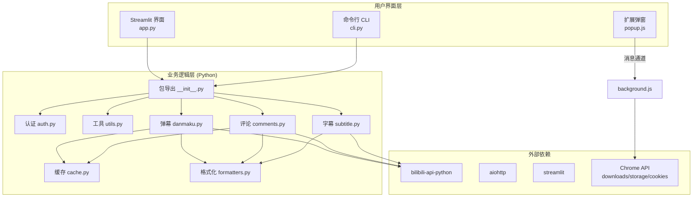
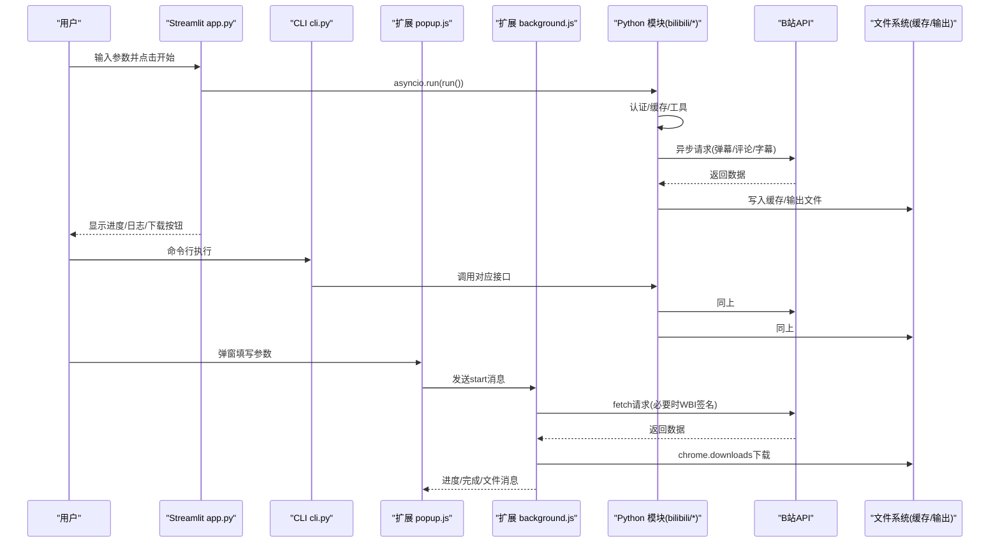
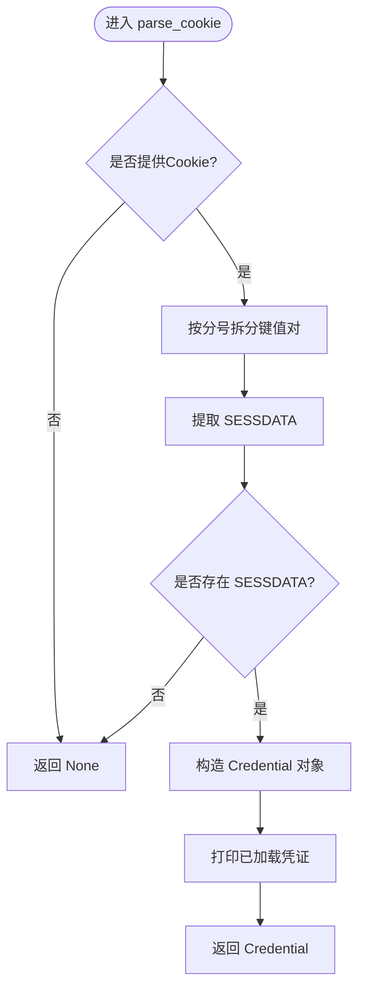
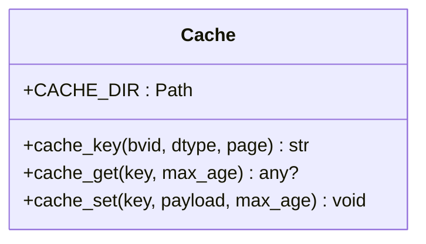
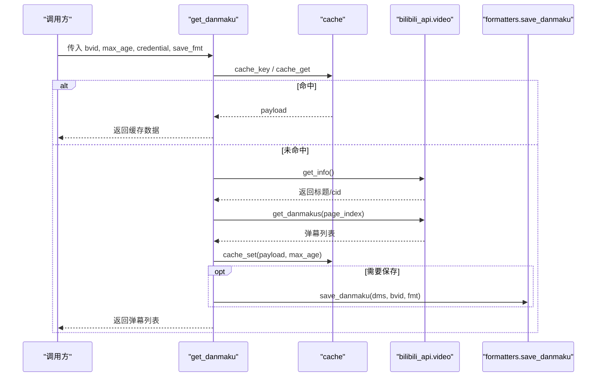
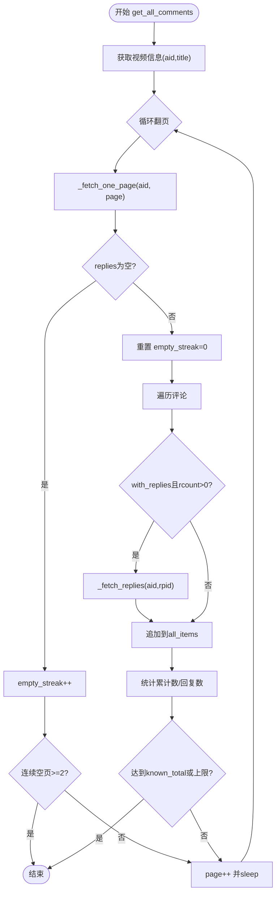
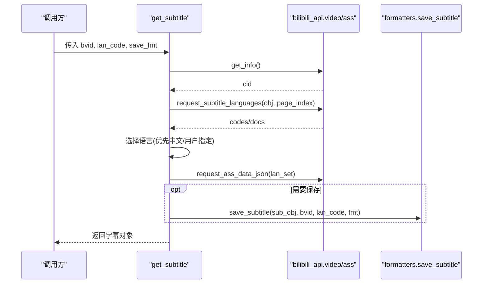
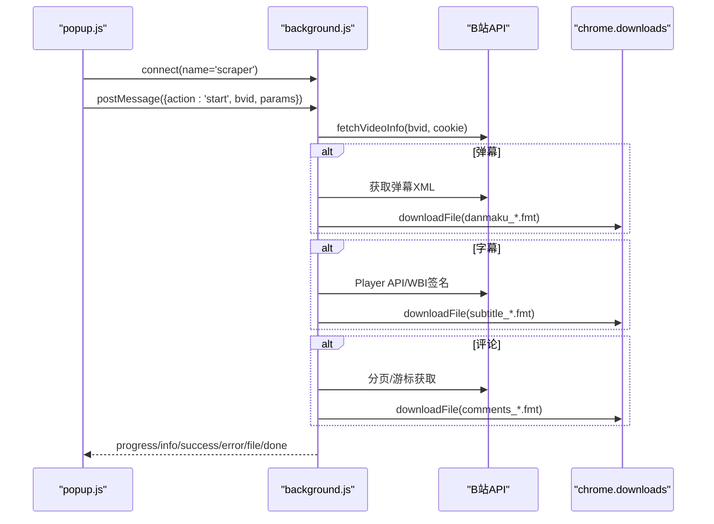
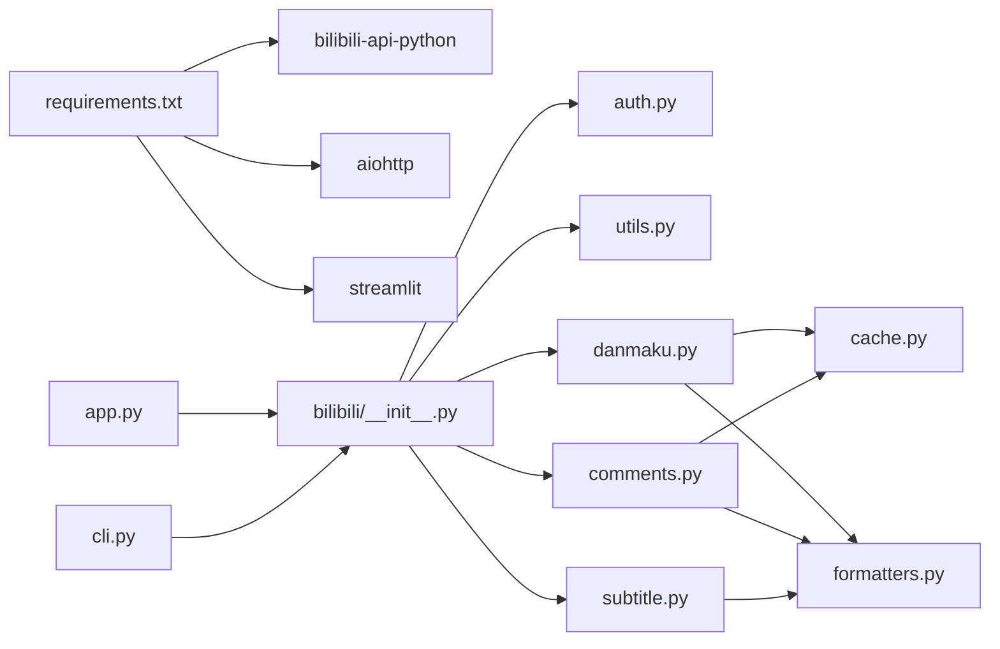

# 架构设计

<cite>
**本文引用的文件**   
- [app.py](file://app.py)
- [cli.py](file://cli.py)
- [bilibili/__init__.py](file://bilibili/__init__.py)
- [bilibili/auth.py](file://bilibili/auth.py)
- [bilibili/cache.py](file://bilibili/cache.py)
- [bilibili/utils.py](file://bilibili/utils.py)
- [bilibili/danmaku.py](file://bilibili/danmaku.py)
- [bilibili/comments.py](file://bilibili/comments.py)
- [bilibili/subtitle.py](file://bilibili/subtitle.py)
- [bilibili/formatters.py](file://bilibili/formatters.py)
- [bilibili_demo.py](file://bilibili_demo.py)
- [bilibili-extension--main/manifest.json](file://bilibili-extension--main/manifest.json)
- [bilibili-extension--main/background.js](file://bilibili-extension--main/background.js)
- [bilibili-extension--main/popup.js](file://bilibili-extension--main/popup.js)
- [requirements.txt](file://requirements.txt)
</cite>

## 目录
1. [简介](#简介)
2. [项目结构](#项目结构)
3. [核心组件](#核心组件)
4. [架构总览](#架构总览)
5. [详细组件分析](#详细组件分析)
6. [依赖关系分析](#依赖关系分析)
7. [性能考虑](#性能考虑)
8. [故障排查指南](#故障排查指南)
9. [结论](#结论)
10. [附录](#附录)

## 简介
本仓库提供面向B站的多模态数据抓取能力，覆盖弹幕、评论（含楼中楼回复）与字幕。系统包含三类入口：
- Streamlit本地网页版（app.py）
- 命令行工具（cli.py）
- Chrome扩展（background.js + popup.js）

后端通过 bilibili-api-python 或浏览器原生 fetch 访问B站API，结合本地JSON文件缓存与多格式输出（txt/json/csv/srt/ass/lrc），实现高可用、可插拔的爬取体验。

## 项目结构
- 应用层
  - Streamlit界面：app.py
  - CLI入口：cli.py
  - 扩展UI：popup.html/js、options.html/js
- 业务逻辑层（Python包 bilibili）
  - 认证：auth.py
  - 缓存：cache.py
  - 工具：utils.py
  - 功能模块：danmaku.py、comments.py、subtitle.py
  - 格式化与持久化：formatters.py
  - 对外导出：__init__.py
- 扩展端（Chrome Extension）
  - background.js：后台任务编排、网络请求、下载与消息通道
  - popup.js：用户交互、参数收集、日志与下载按钮
  - manifest.json：权限与入口声明
- 依赖清单：requirements.txt

图表来源
- [app.py:1-143](file://app.py#L1-L143)
- [cli.py:1-118](file://cli.py#L1-L118)
- [bilibili/__init__.py:1-19](file://bilibili/__init__.py#L1-L19)
- [bilibili/auth.py:1-38](file://bilibili/auth.py#L1-L38)
- [bilibili/cache.py:1-42](file://bilibili/cache.py#L1-L42)
- [bilibili/utils.py:1-28](file://bilibili/utils.py#L1-L28)
- [bilibili/danmaku.py:1-64](file://bilibili/danmaku.py#L1-L64)
- [bilibili/comments.py:1-171](file://bilibili/comments.py#L1-L171)
- [bilibili/subtitle.py:1-77](file://bilibili/subtitle.py#L1-L77)
- [bilibili/formatters.py:1-166](file://bilibili/formatters.py#L1-L166)
- [bilibili-extension--main/background.js:1-567](file://bilibili-extension--main/background.js#L1-L567)
- [bilibili-extension--main/popup.js:1-228](file://bilibili-extension--main/popup.js#L1-L228)
- [requirements.txt:1-4](file://requirements.txt#L1-L4)

章节来源
- [app.py:1-143](file://app.py#L1-L143)
- [cli.py:1-118](file://cli.py#L1-L118)
- [bilibili/__init__.py:1-19](file://bilibili/__init__.py#L1-L19)
- [bilibili-extension--main/manifest.json:1-20](file://bilibili-extension--main/manifest.json#L1-L20)
- [requirements.txt:1-4](file://requirements.txt#L1-L4)

## 核心组件
- 认证模块（Credential构建）
  - 解析Cookie字符串，提取SESSDATA等字段，构造 bilibili_api.Credential 对象，供后续API调用使用。
- 缓存模块（文件级JSON缓存）
  - 基于 .bili_cache 目录的键值存储，key由bvid+数据类型+页码哈希生成；写入时附带时间戳与max_age，读取时按过期策略删除并返回None。
- 工具模块（通用函数封装）
  - extract_bvid从多种输入（纯BV号、完整链接、短链）中提取BV号，失败抛出异常。
- 功能模块
  - 弹幕：获取视频信息→拉取弹幕→可选保存为txt/json/csv。
  - 评论：单页/全量翻页，支持楼中楼回复，带安全上限与空页停止策略。
  - 字幕：语言列表选择与自动优先中文，支持srt/ass/lrc/json。
- 格式化与持久化
  - 统一将原始数据转换为精简结构，并按指定格式落盘。

章节来源
- [bilibili/auth.py:1-38](file://bilibili/auth.py#L1-L38)
- [bilibili/cache.py:1-42](file://bilibili/cache.py#L1-L42)
- [bilibili/utils.py:1-28](file://bilibili/utils.py#L1-L28)
- [bilibili/danmaku.py:1-64](file://bilibili/danmaku.py#L1-L64)
- [bilibili/comments.py:1-171](file://bilibili/comments.py#L1-L171)
- [bilibili/subtitle.py:1-77](file://bilibili/subtitle.py#L1-L77)
- [bilibili/formatters.py:1-166](file://bilibili/formatters.py#L1-L166)

## 架构总览
系统采用分层设计：
- 用户界面层
  - Streamlit：提供可视化参数配置、进度与日志展示、结果下载。
  - CLI：命令行批处理与自动化集成。
  - 扩展：在浏览器内直接发起任务，利用chrome.downloads进行文件下载。
- 业务逻辑层
  - 认证、缓存、工具、弹幕/评论/字幕、格式化。
- 数据访问层
  - Python侧通过 bilibili-api-python 与 aiohttp 访问B站API。
  - 扩展侧通过浏览器fetch访问B站API，必要时进行WBI签名。

图表来源
- [app.py:46-142](file://app.py#L46-L142)
- [cli.py:63-117](file://cli.py#L63-L117)
- [bilibili/danmaku.py:13-64](file://bilibili/danmaku.py#L13-L64)
- [bilibili/comments.py:42-171](file://bilibili/comments.py#L42-L171)
- [bilibili/subtitle.py:21-77](file://bilibili/subtitle.py#L21-L77)
- [bilibili-extension--main/background.js:428-475](file://bilibili-extension--main/background.js#L428-L475)
- [bilibili-extension--main/popup.js:178-206](file://bilibili-extension--main/popup.js#L178-L206)

## 详细组件分析

### 认证模块（Credential对象构建）
- 职责
  - 解析Cookie字符串，提取SESSDATA、bili_jct、buvid3、DedeUserID等字段。
  - 构造 bilibili_api.Credential 对象，用于需要登录态的API调用。
- 关键流程
  - 若未提供Cookie或缺少SESSDATA，返回None。
  - 成功解析后打印提示并返回Credential。

图表来源
- [bilibili/auth.py:8-38](file://bilibili/auth.py#L8-L38)

章节来源
- [bilibili/auth.py:1-38](file://bilibili/auth.py#L1-L38)

### 缓存模块（文件级缓存策略）
- 职责
  - 提供基于文件的JSON缓存，支持按max_age过期清理。
- 数据结构
  - 缓存目录：.bili_cache
  - 键生成：MD5(bvid:dtype:page)
  - 缓存条目：{ "_cached_at": time, "max_age": int, "payload": any }
- 行为
  - 命中：直接返回payload
  - 未命中或过期：删除旧文件并返回None

图表来源
- [bilibili/cache.py:10-42](file://bilibili/cache.py#L10-L42)

章节来源
- [bilibili/cache.py:1-42](file://bilibili/cache.py#L1-L42)

### 工具模块（通用函数封装）
- 职责
  - extract_bvid：从纯BV号、完整链接、短链中抽取BV号；非法输入抛出异常。
- 复杂度
  - 正则匹配与字符串操作，时间复杂度O(n)，空间O(1)。

章节来源
- [bilibili/utils.py:1-28](file://bilibili/utils.py#L1-L28)

### 弹幕模块
- 职责
  - 获取视频信息与cid，拉取弹幕，支持缓存与多格式保存。
- 关键点
  - 先查缓存，命中则直接返回。
  - 使用 bilibili_api.video.Video 获取信息并拉取弹幕。
  - 可选保存到txt/json/csv。

图表来源
- [bilibili/danmaku.py:13-64](file://bilibili/danmaku.py#L13-L64)
- [bilibili/formatters.py:101-142](file://bilibili/formatters.py#L101-L142)

章节来源
- [bilibili/danmaku.py:1-64](file://bilibili/danmaku.py#L1-L64)
- [bilibili/formatters.py:101-142](file://bilibili/formatters.py#L101-L142)

### 评论模块（单页/全量翻页与楼中楼）
- 职责
  - 单页评论获取与全量翻页，支持楼中楼回复，具备安全上限与空页停止策略。
- 关键点
  - _fetch_one_page：分页获取评论与总数。
  - _fetch_replies：获取单条评论的回复（限第1页，最多20条）。
  - get_all_comments：循环翻页，记录累计数量与连续空页计数，达到阈值停止。

图表来源
- [bilibili/comments.py:92-171](file://bilibili/comments.py#L92-L171)

章节来源
- [bilibili/comments.py:1-171](file://bilibili/comments.py#L1-L171)

### 字幕模块（语言选择与多格式输出）
- 职责
  - 获取字幕语言列表，按优先级选择语言，下载字幕并保存为srt/ass/lrc/json。
- 关键点
  - request_subtitle_languages：列出可用语言。
  - 默认优先中文（ai-zh > zh-Hans > zh-Hant）。
  - 根据save_fmt调用to_srt/to_ass/to_lrc/to_simple_json。

图表来源
- [bilibili/subtitle.py:21-77](file://bilibili/subtitle.py#L21-L77)
- [bilibili/formatters.py:146-166](file://bilibili/formatters.py#L146-L166)

章节来源
- [bilibili/subtitle.py:1-77](file://bilibili/subtitle.py#L1-L77)
- [bilibili/formatters.py:146-166](file://bilibili/formatters.py#L146-L166)

### 扩展端（Chrome Extension）
- 职责
  - 在浏览器内发起弹幕/评论/字幕抓取，使用chrome.downloads下载文件，并通过消息通道向popup反馈进度。
- 关键点
  - biliFetch/biliFetchJSON：统一请求封装，携带必要Headers与Cookie。
  - 评论API回退：主流API受限则切换WBI签名的备用接口。
  - 字幕获取：优先Player API，否则回退至视频信息中的字幕字段。
  - 取消机制：全局cancelled标志，sleep支持中断。

图表来源
- [bilibili-extension--main/background.js:39-60](file://bilibili-extension--main/background.js#L39-L60)
- [bilibili-extension--main/background.js:98-134](file://bilibili-extension--main/background.js#L98-L134)
- [bilibili-extension--main/background.js:149-192](file://bilibili-extension--main/background.js#L149-L192)
- [bilibili-extension--main/background.js:428-475](file://bilibili-extension--main/background.js#L428-L475)
- [bilibili-extension--main/popup.js:60-99](file://bilibili-extension--main/popup.js#L60-L99)

章节来源
- [bilibili-extension--main/background.js:1-567](file://bilibili-extension--main/background.js#L1-L567)
- [bilibili-extension--main/popup.js:1-228](file://bilibili-extension--main/popup.js#L1-L228)
- [bilibili-extension--main/manifest.json:1-20](file://bilibili-extension--main/manifest.json#L1-L20)

## 依赖关系分析
- 外部依赖
  - bilibili-api-python：提供video/comment/ass等高级封装。
  - aiohttp：底层异步HTTP客户端。
  - streamlit：Web界面框架。
- 内部耦合
  - 各功能模块均依赖缓存与格式化模块。
  - 认证与工具被上层入口（app/cli）复用。
  - 扩展独立于Python模块，通过浏览器API直接与B站通信。

图表来源
- [requirements.txt:1-4](file://requirements.txt#L1-L4)
- [bilibili/__init__.py:1-19](file://bilibili/__init__.py#L1-L19)
- [app.py:1-143](file://app.py#L1-L143)
- [cli.py:1-118](file://cli.py#L1-L118)

章节来源
- [requirements.txt:1-4](file://requirements.txt#L1-L4)
- [bilibili/__init__.py:1-19](file://bilibili/__init__.py#L1-L19)

## 性能考虑
- 并发与异步
  - Python侧使用asyncio驱动异步I/O，减少等待时间。
  - 扩展侧使用Promise与await，避免阻塞UI线程。
- 缓存策略
  - 文件级JSON缓存降低重复请求成本；合理设置max_age平衡新鲜度与性能。
- 速率控制
  - 评论翻页与楼中楼请求间加入sleep，避免触发风控。
- I/O优化
  - 批量写入与流式输出，减少频繁磁盘操作。
- 可扩展点
  - 新增数据源：在功能模块中增加新的异步方法，并在入口聚合。
  - 新格式支持：在formatters中扩展保存逻辑。
  - 新认证方式：在auth中扩展解析器，保持Credential兼容。

[本节为通用指导，不直接分析具体文件]

## 故障排查指南
- 常见错误
  - BV号解析失败：检查输入是否为有效BV号或链接。
  - Cookie无效：确保包含SESSDATA且未过期。
  - 评论API受限：扩展会自动切换到WBI签名接口；Python侧可通过重试或更换代理。
  - 无字幕：确认视频存在字幕资源，或尝试其他语言代码。
- 恢复方案
  - 禁用缓存：设置max_age=0强制刷新。
  - 限制页数：设置max_pages避免无限翻页。
  - 取消任务：扩展支持cancel消息，Python侧可在上层捕获异常并退出。
- 定位手段
  - 查看控制台日志与下载面板，确认具体步骤失败位置。
  - 检查.bili_cache目录内容，验证缓存是否命中。

章节来源
- [bilibili/utils.py:1-28](file://bilibili/utils.py#L1-L28)
- [bilibili/auth.py:1-38](file://bilibili/auth.py#L1-L38)
- [bilibili-extension--main/background.js:477-494](file://bilibili-extension--main/background.js#L477-L494)
- [bilibili/cache.py:19-28](file://bilibili/cache.py#L19-L28)

## 结论
本系统以清晰的分层设计与模块化组织，实现了弹幕、评论与字幕的统一抓取能力。通过认证、缓存与格式化三大基础能力支撑，配合异步架构与多入口（Streamlit/CLI/扩展），具备良好的易用性与扩展性。建议在生产环境中引入更完善的错误上报、重试与限流策略，并持续监控B站API变更以保持稳定性。

[本节为总结，不直接分析具体文件]

## 附录
- 运行方式
  - Streamlit：python -m streamlit run app.py
  - CLI：python cli.py BVxxxxx -dc --all --replies --save json
  - 扩展：安装后在B站页面打开弹窗，输入BV号并选择选项
- 依赖版本
  - bilibili-api-python>=0.17.0
  - aiohttp>=3.8.0
  - streamlit>=1.20.0

章节来源
- [requirements.txt:1-4](file://requirements.txt#L1-L4)
- [cli.py:1-118](file://cli.py#L1-L118)
- [app.py:1-143](file://app.py#L1-L143)
- [bilibili-extension--main/manifest.json:1-20](file://bilibili-extension--main/manifest.json#L1-L20)