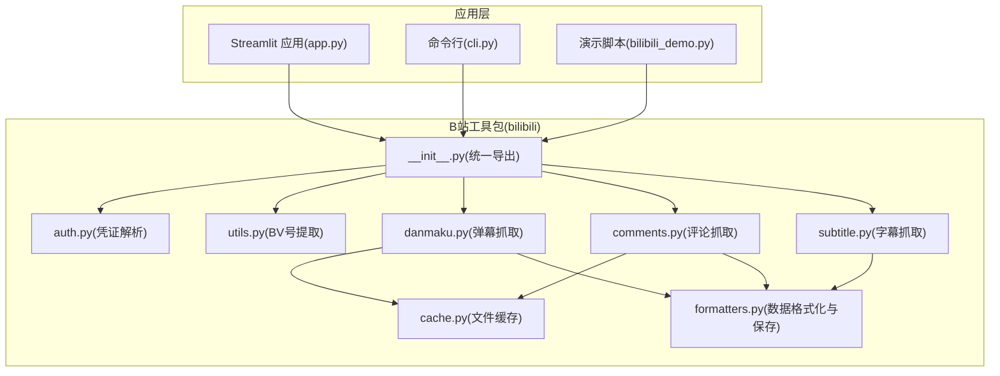
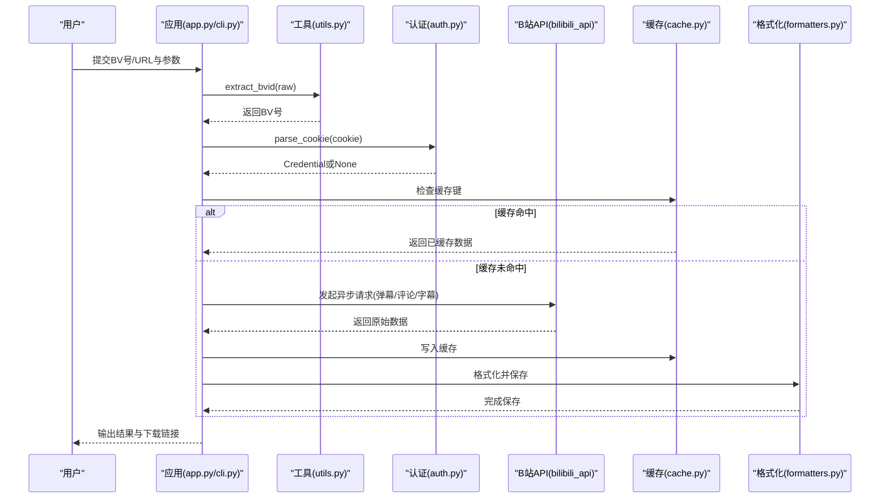
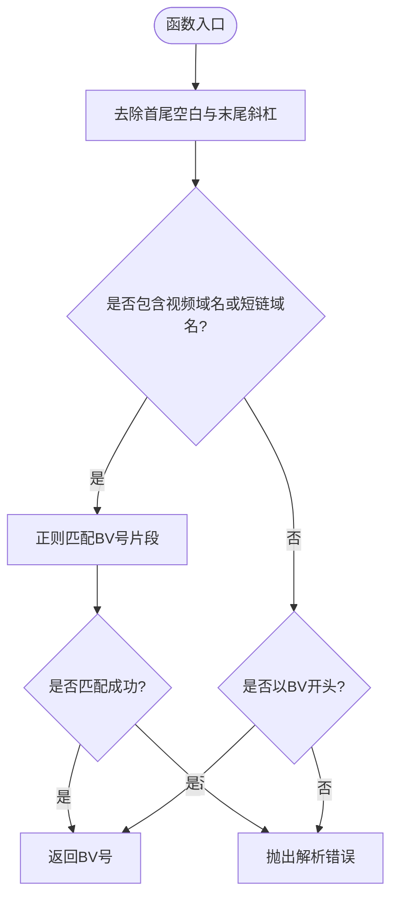
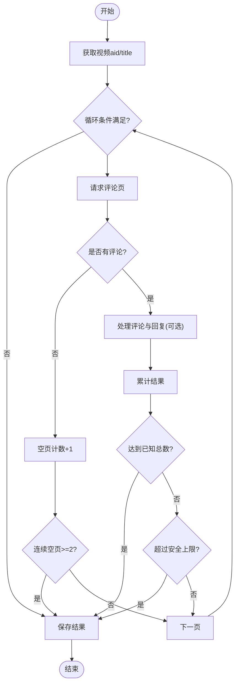
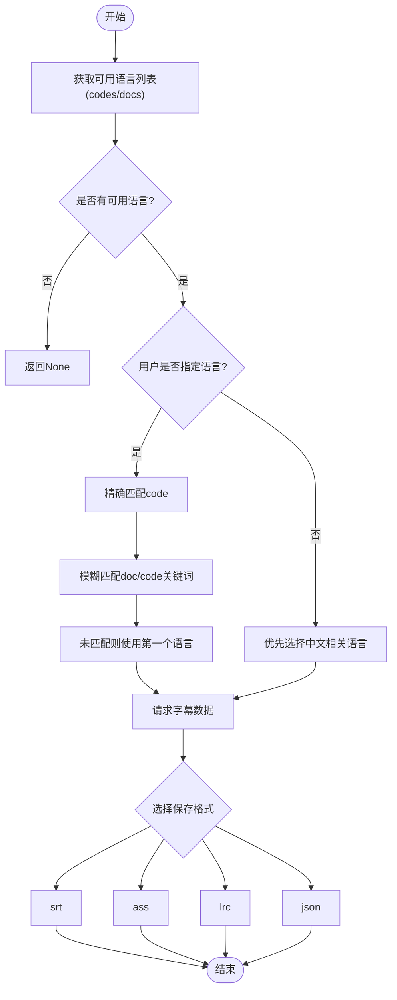
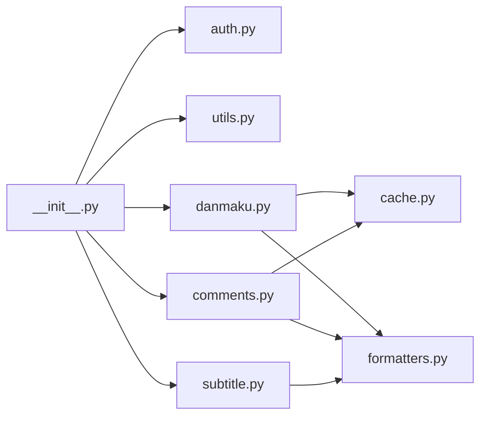

# 工具模块设计

<cite>
**本文引用的文件**   
- [bilibili/utils.py](file://bilibili/utils.py)
- [bilibili/formatters.py](file://bilibili/formatters.py)
- [bilibili/auth.py](file://bilibili/auth.py)
- [bilibili/danmaku.py](file://bilibili/danmaku.py)
- [bilibili/comments.py](file://bilibili/comments.py)
- [bilibili/subtitle.py](file://bilibili/subtitle.py)
- [bilibili/cache.py](file://bilibili/cache.py)
- [bilibili/__init__.py](file://bilibili/__init__.py)
- [app.py](file://app.py)
- [cli.py](file://cli.py)
- [bilibili_demo.py](file://bilibili_demo.py)
</cite>

## 目录
1. [简介](#简介)
2. [项目结构](#项目结构)
3. [核心组件](#核心组件)
4. [架构总览](#架构总览)
5. [详细组件分析](#详细组件分析)
6. [依赖关系分析](#依赖关系分析)
7. [性能与缓存特性](#性能与缓存特性)
8. [异步编程与错误处理](#异步编程与错误处理)
9. [日志记录系统](#日志记录系统)
10. [常用工具函数使用示例与最佳实践](#常用工具函数使用示例与最佳实践)
11. [扩展新工具函数的规范与测试要求](#扩展新工具函数的规范与测试要求)
12. [故障排查指南](#故障排查指南)
13. [结论](#结论)

## 简介
本技术文档聚焦于“工具模块”的设计与实现，涵盖通用函数封装、BV号提取算法、URL处理逻辑、格式转换工具、正则表达式使用模式、异步编程集成方式、错误处理机制以及日志记录系统的配置与使用。文档同时提供常用工具函数的使用示例、最佳实践和扩展开发规范，帮助读者快速理解并高效使用该工具集。

## 项目结构
该仓库采用按功能划分的模块化组织方式：
- bilibili/ 子包包含核心工具与业务模块（认证、弹幕、评论、字幕、格式化、缓存等）
- app.py 为 Streamlit Web 入口，封装了用户交互与异步调用
- cli.py 为命令行入口，复用 bilibili 包能力
- bilibili_demo.py 为独立演示脚本，内含与包内一致的逻辑复现

图表来源
- [app.py:1-142](file://app.py#L1-L142)
- [cli.py:1-118](file://cli.py#L1-L118)
- [bilibili/__init__.py:1-19](file://bilibili/__init__.py#L1-L19)
- [bilibili/auth.py:1-38](file://bilibili/auth.py#L1-L38)
- [bilibili/utils.py:1-28](file://bilibili/utils.py#L1-L28)
- [bilibili/danmaku.py:1-64](file://bilibili/danmaku.py#L1-L64)
- [bilibili/comments.py:1-171](file://bilibili/comments.py#L1-L171)
- [bilibili/subtitle.py:1-77](file://bilibili/subtitle.py#L1-L77)
- [bilibili/formatters.py:1-166](file://bilibili/formatters.py#L1-L166)
- [bilibili/cache.py:1-42](file://bilibili/cache.py#L1-L42)

章节来源
- [app.py:1-142](file://app.py#L1-L142)
- [cli.py:1-118](file://cli.py#L1-L118)
- [bilibili/__init__.py:1-19](file://bilibili/__init__.py#L1-L19)

## 核心组件
本节深入说明工具模块的关键设计与实现细节。

### BV号提取与URL处理
- extract_bvid(raw): 从纯BV号或完整链接中提取BV号，支持短链接；若无法解析则抛出异常。
- URL处理逻辑：
  - 去除首尾空白与末尾斜杠
  - 检测是否包含视频域名或短链域名
  - 使用正则匹配以捕获BV号片段
  - 若输入直接以BV开头则直接返回

正则表达式使用模式与匹配规则：
- 匹配规则：在包含视频域名的字符串中搜索形如“BV后跟字母数字序列”的片段
- 特殊字符处理：仅保留字母与数字，忽略其他字符
- 失败路径：当输入既不是有效BV号也不含可识别的视频链接时，抛出异常提示

章节来源
- [bilibili/utils.py:8-27](file://bilibili/utils.py#L8-L27)
- [bilibili_demo.py:403-412](file://bilibili_demo.py#L403-L412)

### 认证与凭证管理
- parse_cookie(cookie_str): 将Cookie字符串解析为Credential对象，支持SESSDATA、bili_jct、buvid3、DedeUserID等字段；缺失SESSDATA时返回None。

章节来源
- [bilibili/auth.py:8-37](file://bilibili/auth.py#L8-L37)
- [bilibili_demo.py:346-363](file://bilibili_demo.py#L346-L363)

### 弹幕抓取与保存
- get_danmaku(bvid, page_index, max_age, credential, save_fmt): 获取指定分P的弹幕，支持缓存命中与可选保存到txt/json/csv。
- 保存逻辑：
  - JSON：结构化列表，包含时间、文本、样式与用户信息
  - CSV：带表头，便于表格软件打开
  - TXT：每行一条，时间对齐显示

章节来源
- [bilibili/danmaku.py:13-63](file://bilibili/danmaku.py#L13-L63)
- [bilibili/formatters.py:101-141](file://bilibili/formatters.py#L101-L141)

### 评论抓取与保存
- get_comments(bvid, page, max_age, credential, save_fmt, with_replies): 单页评论抓取，可选楼中楼回复。
- get_all_comments(bvid, max_age, credential, save_fmt, with_replies, max_pages): 全量翻页抓取，内置安全上限与空页停止策略。
- 保存逻辑：
  - JSON：嵌套结构，主评论与回复分离
  - CSV：扁平化，区分level字段(comment/reply)
  - TXT：层级缩进展示

章节来源
- [bilibili/comments.py:42-89](file://bilibili/comments.py#L42-L89)
- [bilibili/comments.py:92-170](file://bilibili/comments.py#L92-L170)
- [bilibili/formatters.py:21-96](file://bilibili/formatters.py#L21-L96)

### 字幕抓取与保存
- get_subtitle(bvid, page_index, credential, lan_code, save_fmt): 获取字幕语言列表，自动选择或按代码匹配，支持srt/ass/lrc/json输出。
- 语言匹配策略：
  - 优先精确匹配code
  - 其次模糊匹配doc或code中的关键词
  - 未匹配则回退到第一个可用语言
  - 默认优先中文相关语言

章节来源
- [bilibili/subtitle.py:21-76](file://bilibili/subtitle.py#L21-L76)
- [bilibili/formatters.py:146-165](file://bilibili/formatters.py#L146-L165)

### 缓存模块
- cache_key(bvid, dtype, page): 生成MD5哈希键
- cache_get(key, max_age): 读取缓存，过期删除并返回None
- cache_set(key, payload, max_age): 写入缓存，附带时间与有效期

章节来源
- [bilibili/cache.py:14-41](file://bilibili/cache.py#L14-L41)

## 架构总览
整体架构围绕“输入解析 → 异步抓取 → 缓存控制 → 格式化输出”展开，上层应用通过统一接口调用各模块。

图表来源
- [app.py:46-142](file://app.py#L46-L142)
- [cli.py:63-117](file://cli.py#L63-L117)
- [bilibili/utils.py:8-27](file://bilibili/utils.py#L8-L27)
- [bilibili/auth.py:8-37](file://bilibili/auth.py#L8-L37)
- [bilibili/cache.py:14-41](file://bilibili/cache.py#L14-L41)
- [bilibili/formatters.py:50-96](file://bilibili/formatters.py#L50-L96)

## 详细组件分析

### 组件A：BV号提取与URL标准化流程
该组件负责将多种输入形式标准化为BV号，确保后续模块能稳定处理。

图表来源
- [bilibili/utils.py:8-27](file://bilibili/utils.py#L8-L27)

章节来源
- [bilibili/utils.py:8-27](file://bilibili/utils.py#L8-L27)

### 组件B：评论抓取与分页控制
该组件实现了单页与全量翻页两种模式，并内置安全上限与空页停止策略。

图表来源
- [bilibili/comments.py:92-170](file://bilibili/comments.py#L92-L170)

章节来源
- [bilibili/comments.py:92-170](file://bilibili/comments.py#L92-L170)

### 组件C：字幕语言匹配与保存
该组件根据用户偏好与可用语言列表进行匹配，并支持多格式保存。

图表来源
- [bilibili/subtitle.py:21-76](file://bilibili/subtitle.py#L21-L76)

章节来源
- [bilibili/subtitle.py:21-76](file://bilibili/subtitle.py#L21-L76)

## 依赖关系分析
- 外部依赖：
  - bilibili_api：用于访问B站API（视频信息、弹幕、评论、字幕）
  - streamlit：Web界面框架（app.py）
  - asyncio：异步运行环境（app.py/cli.py）
- 内部依赖：
  - __init__.py 统一导出公共接口
  - danmaku/comments/subtitle 依赖 cache 与 formatters
  - auth 依赖 bilibili_api.Credential

图表来源
- [bilibili/__init__.py:1-19](file://bilibili/__init__.py#L1-L19)
- [bilibili/danmaku.py:1-64](file://bilibili/danmaku.py#L1-L64)
- [bilibili/comments.py:1-171](file://bilibili/comments.py#L1-L171)
- [bilibili/subtitle.py:1-77](file://bilibili/subtitle.py#L1-L77)
- [bilibili/cache.py:1-42](file://bilibili/cache.py#L1-L42)
- [bilibili/formatters.py:1-166](file://bilibili/formatters.py#L1-L166)

章节来源
- [bilibili/__init__.py:1-19](file://bilibili/__init__.py#L1-L19)

## 性能与缓存特性
- 缓存策略：
  - 基于文件的JSON缓存，键由MD5哈希生成，避免冲突
  - 支持max_age控制有效期，过期自动清理
  - 弹幕与评论均利用缓存减少重复网络请求
- 性能优化建议：
  - 合理设置max_age，平衡实时性与性能
  - 对大规模评论抓取启用安全上限与空页停止，防止无限循环
  - 使用CSV/JSON批量保存，降低I/O开销

章节来源
- [bilibili/cache.py:14-41](file://bilibili/cache.py#L14-L41)
- [bilibili/danmaku.py:30-34](file://bilibili/danmaku.py#L30-L34)
- [bilibili/comments.py:61-65](file://bilibili/comments.py#L61-L65)

## 异步编程与错误处理
- 异步集成：
  - 所有抓取函数均为async，便于并发执行
  - 上层应用通过asyncio.run()调度协程
- 错误处理：
  - BV号解析失败抛出ValueError
  - 评论回复抓取异常被捕获并打印警告，继续执行
  - 字幕无可用语言时返回None并提示

章节来源
- [bilibili/utils.py:26-27](file://bilibili/utils.py#L26-L27)
- [bilibili/comments.py:37-39](file://bilibili/comments.py#L37-L39)
- [bilibili/subtitle.py:47-49](file://bilibili/subtitle.py#L47-L49)
- [app.py:114-139](file://app.py#L114-L139)

## 日志记录系统
当前系统使用print进行控制台输出，未引入标准logging模块。可通过以下方式定制：
- 日志级别：通过条件判断控制输出内容（如调试信息仅在特定模式下打印）
- 输出格式：自定义前缀与分隔符，便于过滤与分析
- 输出目标：重定向至文件或UI组件（如Streamlit的st.code）

章节来源
- [app.py:59-72](file://app.py#L59-L72)
- [bilibili/danmaku.py:43-45](file://bilibili/danmaku.py#L43-L45)
- [bilibili/comments.py:81-84](file://bilibili/comments.py#L81-L84)

## 常用工具函数使用示例与最佳实践
- BV号提取：
  - 输入纯BV号：直接返回
  - 输入完整链接：自动提取BV号
  - 输入短链接：同样支持
- Cookie解析：
  - 提供SESSDATA即可创建凭证
  - 可选附加字段提升鉴权成功率
- 弹幕抓取：
  - 支持分P索引
  - 可选保存格式，推荐JSON用于二次处理
- 评论抓取：
  - 单页适合快速预览
  - 全量翻页需设置max_pages与安全上限
- 字幕抓取：
  - 支持多语言自动匹配
  - 推荐srt格式兼容多数播放器

章节来源
- [bilibili/utils.py:8-27](file://bilibili/utils.py#L8-L27)
- [bilibili/auth.py:8-37](file://bilibili/auth.py#L8-L37)
- [bilibili/danmaku.py:13-63](file://bilibili/danmaku.py#L13-L63)
- [bilibili/comments.py:42-89](file://bilibili/comments.py#L42-L89)
- [bilibili/subtitle.py:21-76](file://bilibili/subtitle.py#L21-L76)

## 扩展新工具函数的规范与测试要求
- 设计规范：
  - 保持函数签名简洁，参数明确，返回值类型一致
  - 遵循现有命名约定（snake_case）
  - 新增函数应加入__init__.py统一导出
- 错误处理：
  - 对非法输入抛出明确异常
  - 对外部API调用进行异常捕获与降级处理
- 缓存集成：
  - 如需缓存，使用cache_key/cach_get/cach_set
  - 合理设置max_age避免脏读
- 测试要求：
  - 单元测试覆盖正常路径与异常路径
  - 模拟外部API响应，验证缓存命中与失效
  - 对正则表达式进行边界用例测试

章节来源
- [bilibili/__init__.py:11-18](file://bilibili/__init__.py#L11-L18)
- [bilibili/cache.py:14-41](file://bilibili/cache.py#L14-L41)

## 故障排查指南
- BV号解析失败：
  - 检查输入是否为有效BV号或包含视频域名
  - 确认正则匹配是否成功
- 评论抓取中断：
  - 检查连续空页计数与安全上限
  - 查看网络请求是否超时或限流
- 字幕语言不匹配：
  - 确认lan_code是否在可用列表中
  - 尝试使用模糊匹配或回退策略
- 缓存问题：
  - 检查缓存目录权限与文件大小
  - 调整max_age避免频繁刷新

章节来源
- [bilibili/utils.py:26-27](file://bilibili/utils.py#L26-L27)
- [bilibili/comments.py:148-155](file://bilibili/comments.py#L148-L155)
- [bilibili/subtitle.py:61-63](file://bilibili/subtitle.py#L61-L63)
- [bilibili/cache.py:24-28](file://bilibili/cache.py#L24-L28)

## 结论
本工具模块通过清晰的职责划分与统一的接口设计，实现了高效的B站数据采集与处理。BV号提取与URL标准化确保了输入的健壮性，异步编程与缓存机制提升了性能，而灵活的格式转换与保存策略满足了多样化的下游需求。遵循扩展规范与测试要求，可进一步丰富工具集的功能与可靠性。