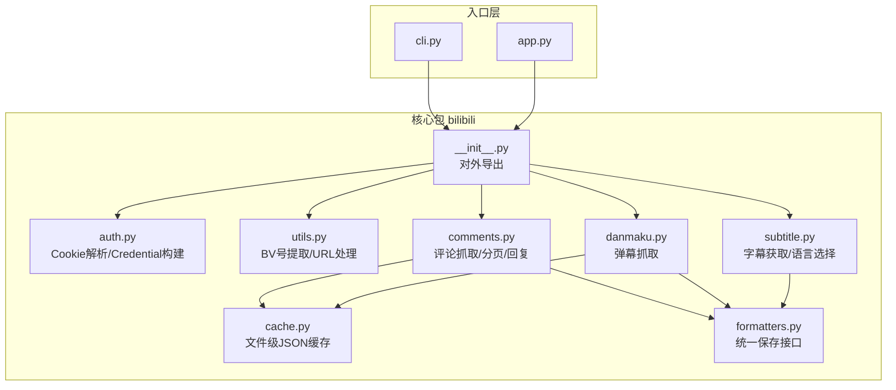
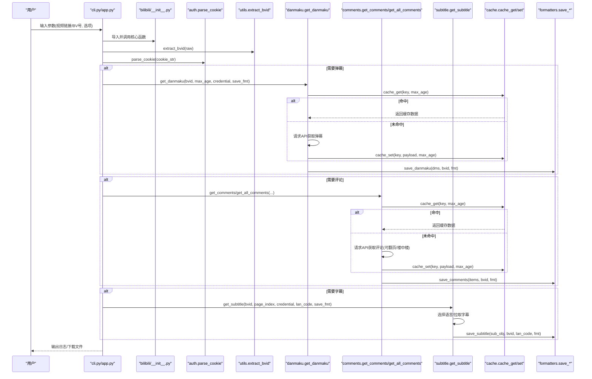
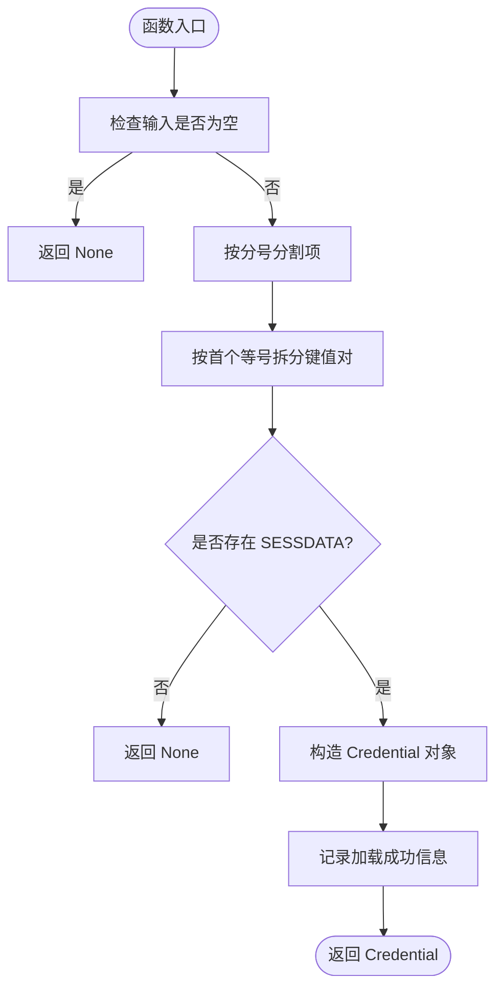
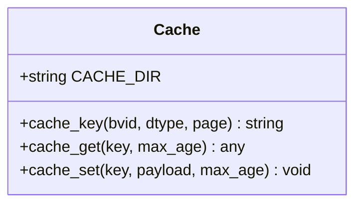
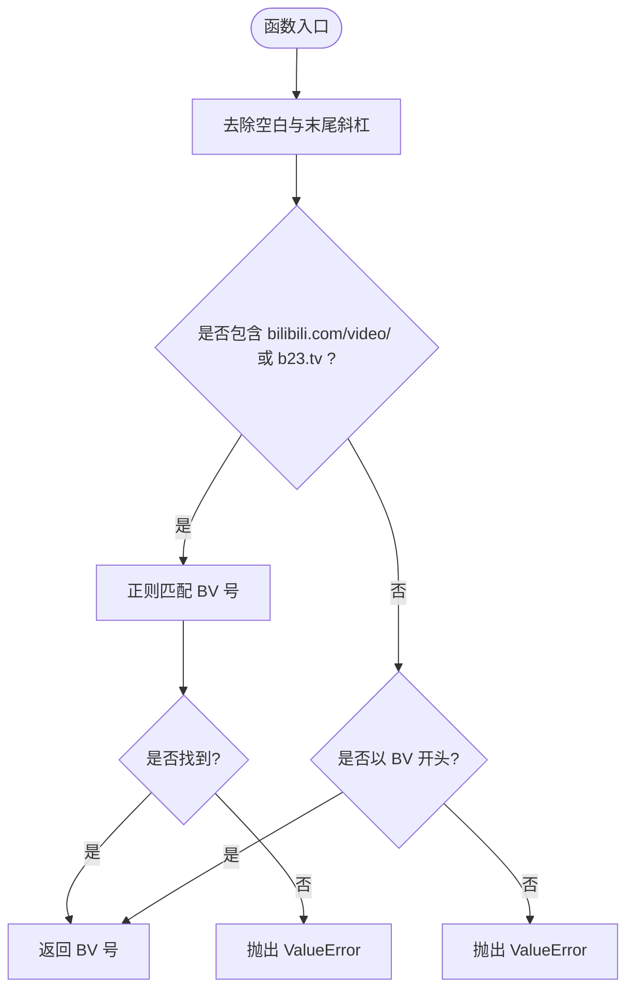
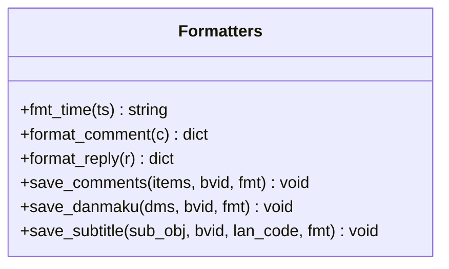
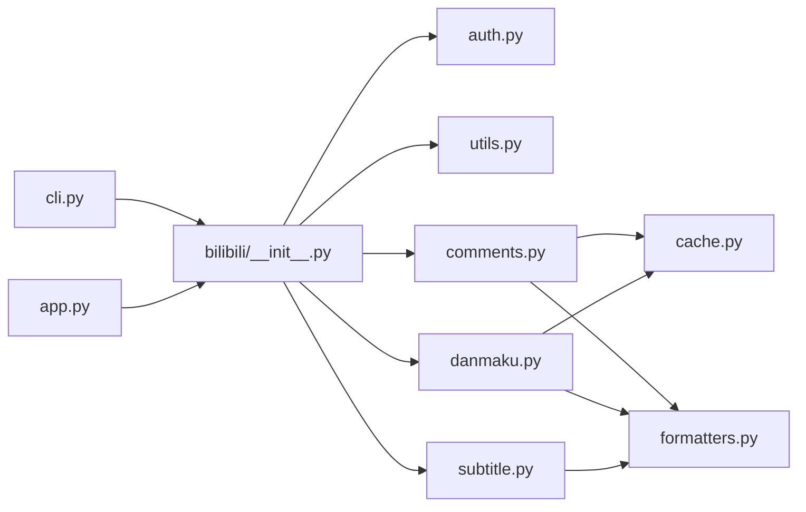

# 核心模块设计

<cite>
**本文引用的文件**   
- [bilibili/auth.py](file://bilibili/auth.py)
- [bilibili/cache.py](file://bilibili/cache.py)
- [bilibili/utils.py](file://bilibili/utils.py)
- [bilibili/formatters.py](file://bilibili/formatters.py)
- [bilibili/comments.py](file://bilibili/comments.py)
- [bilibili/danmaku.py](file://bilibili/danmaku.py)
- [bilibili/subtitle.py](file://bilibili/subtitle.py)
- [bilibili/__init__.py](file://bilibili/__init__.py)
- [cli.py](file://cli.py)
- [app.py](file://app.py)
- [requirements.txt](file://requirements.txt)
</cite>

## 目录
1. [简介](#简介)
2. [项目结构](#项目结构)
3. [核心组件](#核心组件)
4. [架构总览](#架构总览)
5. [详细组件分析](#详细组件分析)
6. [依赖关系分析](#依赖关系分析)
7. [性能考量](#性能考量)
8. [故障排查指南](#故障排查指南)
9. [结论](#结论)
10. [附录](#附录)

## 简介
本技术文档聚焦于 B站弹幕/评论/字幕爬取工具的核心模块设计，围绕以下目标展开：
- 认证模块的 Credential 对象构建与 Cookie 解析机制（含安全与错误处理）
- 缓存模块的文件级实现（MD5 哈希、缓存键策略、过期时间管理）
- 工具模块的通用函数封装（BV号提取、URL处理、格式转换）
- 格式化模块的统一数据输出接口设计
- 模块间调用关系图与数据流转示例
- 性能优化建议与最佳实践

## 项目结构
仓库采用“功能模块化”的组织方式，核心逻辑集中在 bilibili 包内，入口层提供 CLI 与 Streamlit Web 界面。



图表来源
- [cli.py:1-118](file://cli.py#L1-L118)
- [app.py:1-281](file://app.py#L1-L281)
- [bilibili/__init__.py:1-19](file://bilibili/__init__.py#L1-L19)
- [bilibili/auth.py:1-38](file://bilibili/auth.py#L1-L38)
- [bilibili/utils.py:1-28](file://bilibili/utils.py#L1-L28)
- [bilibili/cache.py:1-42](file://bilibili/cache.py#L1-L42)
- [bilibili/comments.py:1-171](file://bilibili/comments.py#L1-L171)
- [bilibili/danmaku.py:1-64](file://bilibili/danmaku.py#L1-L64)
- [bilibili/subtitle.py:1-77](file://bilibili/subtitle.py#L1-L77)
- [bilibili/formatters.py:1-166](file://bilibili/formatters.py#L1-L166)

章节来源
- [bilibili/__init__.py:1-19](file://bilibili/__init__.py#L1-L19)
- [cli.py:1-118](file://cli.py#L1-L118)
- [app.py:1-281](file://app.py#L1-L281)

## 核心组件
本节概述各核心模块的职责与交互要点：
- 认证模块：负责将用户提供的 Cookie 字符串解析为 bilibili_api.Credential 对象，供后续 API 调用使用。
- 缓存模块：基于本地 JSON 文件的轻量缓存，支持 MD5 键生成与过期时间控制。
- 工具模块：提供 BV 号与 URL 的标准化提取与校验。
- 格式化模块：统一的评论、弹幕、字幕保存接口，支持 txt/json/csv/srt/ass/lrc 等格式。
- 业务模块：评论、弹幕、字幕抓取流程，组合认证、缓存与格式化能力。

章节来源
- [bilibili/auth.py:1-38](file://bilibili/auth.py#L1-L38)
- [bilibili/cache.py:1-42](file://bilibili/cache.py#L1-L42)
- [bilibili/utils.py:1-28](file://bilibili/utils.py#L1-L28)
- [bilibili/formatters.py:1-166](file://bilibili/formatters.py#L1-L166)
- [bilibili/comments.py:1-171](file://bilibili/comments.py#L1-L171)
- [bilibili/danmaku.py:1-64](file://bilibili/danmaku.py#L1-L64)
- [bilibili/subtitle.py:1-77](file://bilibili/subtitle.py#L1-L77)

## 架构总览
整体数据流从入口层（CLI/Web）开始，经工具与认证预处理后进入具体业务模块；业务模块在需要时访问缓存与外部 API，并将结果通过格式化模块持久化。



图表来源
- [cli.py:1-118](file://cli.py#L1-L118)
- [app.py:1-281](file://app.py#L1-L281)
- [bilibili/__init__.py:1-19](file://bilibili/__init__.py#L1-L19)
- [bilibili/auth.py:1-38](file://bilibili/auth.py#L1-L38)
- [bilibili/utils.py:1-28](file://bilibili/utils.py#L1-L28)
- [bilibili/danmaku.py:1-64](file://bilibili/danmaku.py#L1-L64)
- [bilibili/comments.py:1-171](file://bilibili/comments.py#L1-L171)
- [bilibili/subtitle.py:1-77](file://bilibili/subtitle.py#L1-L77)
- [bilibili/cache.py:1-42](file://bilibili/cache.py#L1-L42)
- [bilibili/formatters.py:1-166](file://bilibili/formatters.py#L1-L166)

## 详细组件分析

### 认证模块：Credential 构建与 Cookie 解析
职责
- 将包含 SESSDATA 的 Cookie 字符串解析为 bilibili_api.Credential 对象
- 缺失必要字段时返回 None，避免后续 API 调用失败

关键行为
- 按分号分割 Cookie，再按首个等号拆分键值对
- 必须存在 SESSDATA，否则返回 None
- 可选填充 bili_jct、buvid3、DedeUserID 等字段

安全考虑
- 仅做简单字符串解析，不执行任何代码或反序列化，降低注入风险
- 建议在生产环境中通过环境变量或受保护的配置中心传入 Cookie，避免明文硬编码
- 注意 Cookie 泄露风险，不要在日志中打印完整 Cookie 内容

错误处理策略
- 空输入直接返回 None
- 缺少 SESSDATA 返回 None
- 其他异常由上层捕获并提示



图表来源
- [bilibili/auth.py:1-38](file://bilibili/auth.py#L1-L38)

章节来源
- [bilibili/auth.py:1-38](file://bilibili/auth.py#L1-L38)

### 缓存模块：文件级 JSON 缓存
职责
- 以本地 JSON 文件作为缓存介质
- 提供缓存键生成、读取与写入接口
- 支持基于时间的过期策略

关键实现
- 缓存目录：项目根目录下 .bili_cache
- 缓存键：MD5 哈希，输入为 bvid:dtype:page
- 缓存结构：包含 _cached_at、max_age、payload
- 读取时若超过 max_age，则删除文件并返回 None

复杂度与特性
- 键生成 O(n)，n 为输入长度
- 读写均为磁盘 I/O，适合中小规模数据
- 过期策略简单有效，便于调试与清理



图表来源
- [bilibili/cache.py:1-42](file://bilibili/cache.py#L1-L42)

章节来源
- [bilibili/cache.py:1-42](file://bilibili/cache.py#L1-L42)

### 工具模块：BV号提取与URL处理
职责
- 从多种输入格式中提取标准 BV 号
- 支持纯 BV 号、完整 bilibili 链接、短链接 b23.tv

关键行为
- 去除首尾空白与末尾斜杠
- 若包含 bilibili.com/video/ 或 b23.tv，则正则匹配 BV[a-zA-Z0-9]+
- 若以 BV 开头，直接返回
- 无法解析时抛出 ValueError

错误处理策略
- 明确抛出 ValueError，便于上层 UI/CLI 捕获并提示用户



图表来源
- [bilibili/utils.py:1-28](file://bilibili/utils.py#L1-L28)

章节来源
- [bilibili/utils.py:1-28](file://bilibili/utils.py#L1-L28)

### 格式化模块：统一数据输出接口
职责
- 提供评论、弹幕、字幕的统一保存接口
- 支持多格式输出：txt/json/csv/srt/ass/lrc
- 统一命名规则与路径输出

关键函数
- 评论：format_comment/format_reply/save_comments
- 弹幕：save_danmaku
- 字幕：save_subtitle

设计要点
- 输出目录：项目根目录
- CSV 使用 UTF-8-SIG 编码，兼容 Excel
- JSON 使用 ensure_ascii=False 保留中文
- TXT 文本可读性良好，便于快速查看



图表来源
- [bilibili/formatters.py:1-166](file://bilibili/formatters.py#L1-L166)

章节来源
- [bilibili/formatters.py:1-166](file://bilibili/formatters.py#L1-L166)

### 业务模块：评论、弹幕、字幕抓取
- 弹幕模块：根据 bvid 与分P索引获取弹幕，支持缓存与保存
- 评论模块：单页与全量翻页，支持楼中楼回复，支持缓存与保存
- 字幕模块：自动语言选择与指定语言，支持 srt/ass/lrc/json 保存

```mermaid
sequenceDiagram
participant C as "comments.py"
participant D as "danmaku.py"
participant S as "subtitle.py"
participant V as "bilibili_api.video"
participant CM as "bilibili_api.comment"
participant AS as "bilibili_api.ass"
participant K as "cache.py"
participant F as "formatters.py"
Note over C,D,S : 入口由 cli.py/app.py 调用
C->>K : cache_get(key, max_age)
alt 未命中
C->>V : get_info()
C->>CM : get_comments()/Comment().get_sub_comments()
C->>K : cache_set(key, payload, max_age)
C->>F : save_comments(...)
end
D->>K : cache_get(key, max_age)
alt 未命中
D->>V : get_info(), get_danmakus()
D->>K : cache_set(key, payload, max_age)
D->>F : save_danmaku(...)
end
S->>AS : request_subtitle_languages()
S->>S : 选择语言/拉取字幕
S->>F : save_subtitle(...)
```

图表来源
- [bilibili/comments.py:1-171](file://bilibili/comments.py#L1-L171)
- [bilibili/danmaku.py:1-64](file://bilibili/danmaku.py#L1-L64)
- [bilibili/subtitle.py:1-77](file://bilibili/subtitle.py#L1-L77)
- [bilibili/cache.py:1-42](file://bilibili/cache.py#L1-L42)
- [bilibili/formatters.py:1-166](file://bilibili/formatters.py#L1-L166)

章节来源
- [bilibili/comments.py:1-171](file://bilibili/comments.py#L1-L171)
- [bilibili/danmaku.py:1-64](file://bilibili/danmaku.py#L1-L64)
- [bilibili/subtitle.py:1-77](file://bilibili/subtitle.py#L1-L77)

## 依赖关系分析
- 入口层依赖核心包导出：cli.py 与 app.py 均通过 bilibili.__init__.py 统一导入
- 业务模块依赖缓存与格式化：comments.py、danmaku.py、subtitle.py 分别依赖 cache.py 与 formatters.py
- 认证与工具被入口层与业务模块共同使用



图表来源
- [cli.py:1-118](file://cli.py#L1-L118)
- [app.py:1-281](file://app.py#L1-L281)
- [bilibili/__init__.py:1-19](file://bilibili/__init__.py#L1-L19)
- [bilibili/auth.py:1-38](file://bilibili/auth.py#L1-L38)
- [bilibili/utils.py:1-28](file://bilibili/utils.py#L1-L28)
- [bilibili/comments.py:1-171](file://bilibili/comments.py#L1-L171)
- [bilibili/danmaku.py:1-64](file://bilibili/danmaku.py#L1-L64)
- [bilibili/subtitle.py:1-77](file://bilibili/subtitle.py#L1-L77)
- [bilibili/cache.py:1-42](file://bilibili/cache.py#L1-L42)
- [bilibili/formatters.py:1-166](file://bilibili/formatters.py#L1-L166)

章节来源
- [requirements.txt:1-4](file://requirements.txt#L1-L4)

## 性能考量
- 缓存命中率：合理设置 max_age，减少重复网络请求
- 磁盘 I/O：大量弹幕/评论场景下，JSON 体积较大，建议按需启用保存
- 并发与限流：评论翻页与楼中楼请求已加入 sleep，避免触发平台限流
- 内存占用：全量评论可能产生大列表，建议在 UI/CLI 中限制最大页数或条目数
- 编码与转码：CSV 使用 UTF-8-SIG 提升兼容性，但会略增写入开销

[本节为通用指导，无需特定文件引用]

## 故障排查指南
常见问题与定位方法
- Cookie 无效或未包含 SESSDATA：parse_cookie 返回 None，导致后续 API 调用无权限；检查输入的 Cookie 是否正确
- BV 号解析失败：extract_bvid 抛出 ValueError；确认输入是否为合法链接或 BV 号
- 缓存未命中或过期：cache_get 返回 None；检查 max_age 设置与 .bili_cache 目录权限
- 字幕语言不匹配：get_subtitle 自动回退到第一个可用语言；检查 lan_code 参数或语言映射
- 保存失败：检查 OUTPUT_DIR 与 CACHE_DIR 的写权限，以及磁盘空间

章节来源
- [bilibili/auth.py:1-38](file://bilibili/auth.py#L1-L38)
- [bilibili/utils.py:1-28](file://bilibili/utils.py#L1-L28)
- [bilibili/cache.py:1-42](file://bilibili/cache.py#L1-L42)
- [bilibili/subtitle.py:1-77](file://bilibili/subtitle.py#L1-L77)
- [bilibili/formatters.py:1-166](file://bilibili/formatters.py#L1-L166)

## 结论
该核心模块设计以清晰的分层与职责划分实现了弹幕、评论、字幕的抓取与保存。认证与工具模块提供基础能力，缓存与格式化模块增强可用性与可维护性。结合 CLI 与 Streamlit 入口，形成完整的端到端解决方案。建议在生产环境加强 Cookie 安全管理、完善错误上报与监控指标，并根据数据规模评估缓存策略与存储方案。

[本节为总结，无需特定文件引用]

## 附录
- 依赖清单：见 requirements.txt
- 入口用法：参见 cli.py 与 app.py 的参数说明与示例

章节来源
- [requirements.txt:1-4](file://requirements.txt#L1-L4)
- [cli.py:1-118](file://cli.py#L1-L118)
- [app.py:1-281](file://app.py#L1-L281)