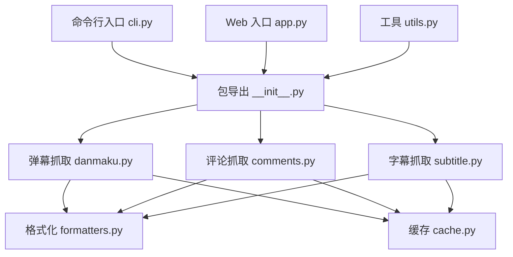
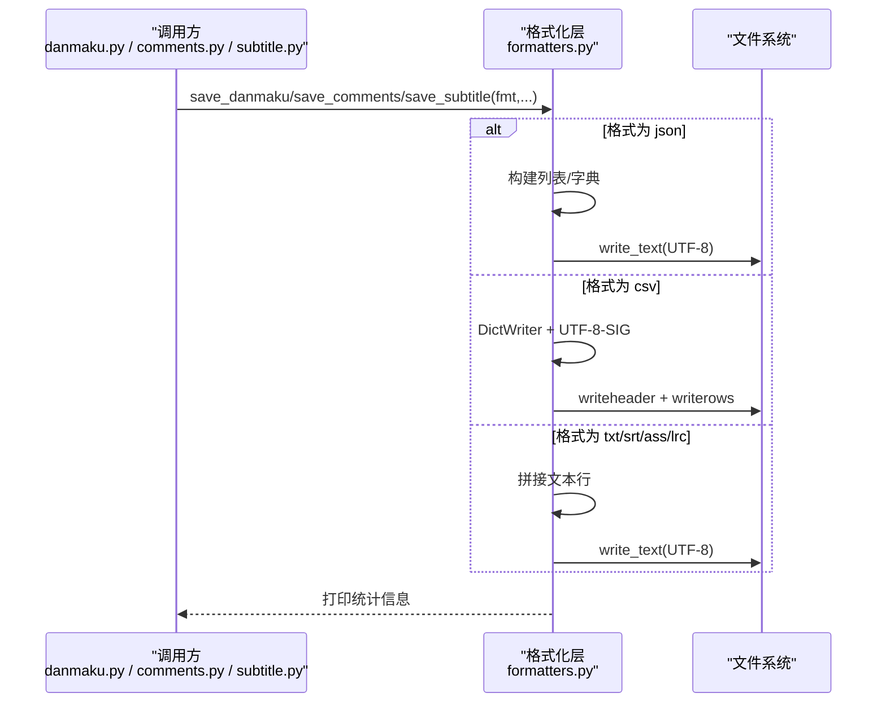
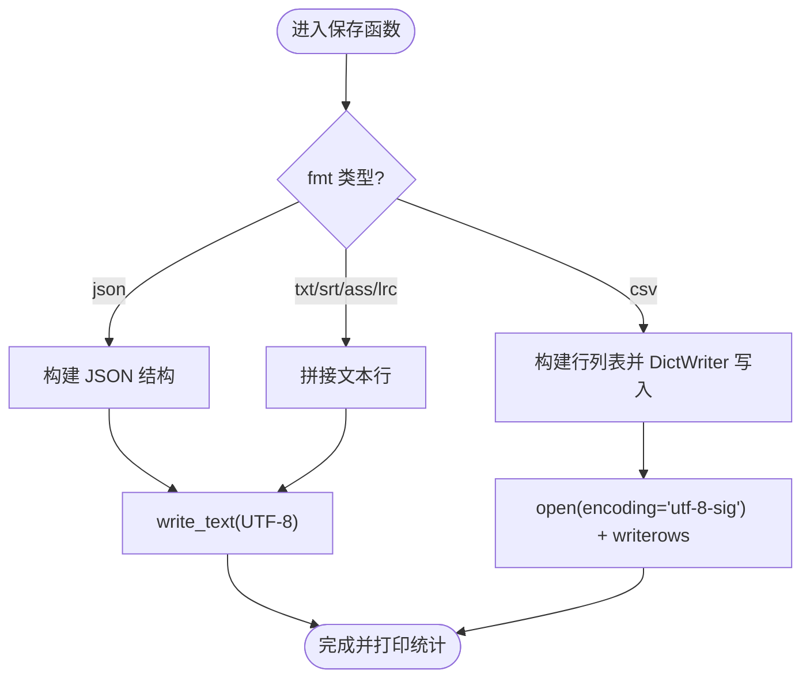
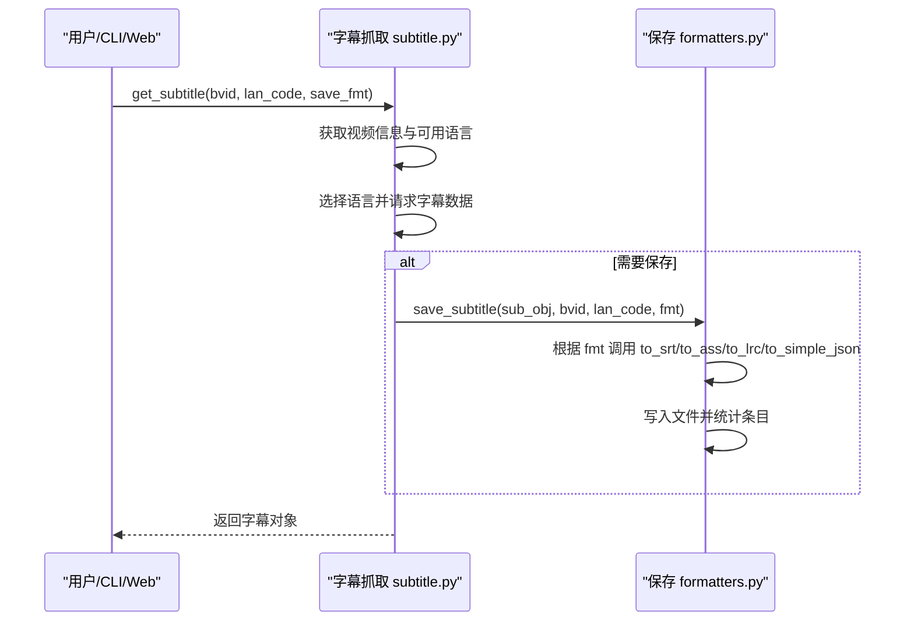
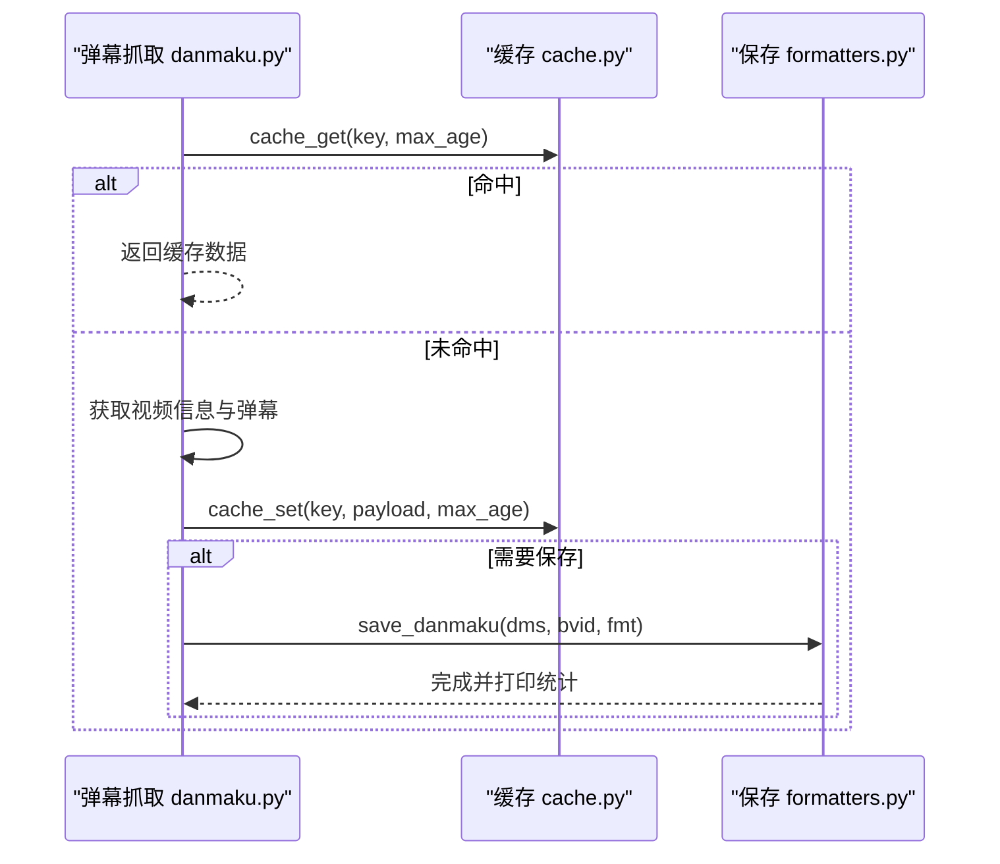
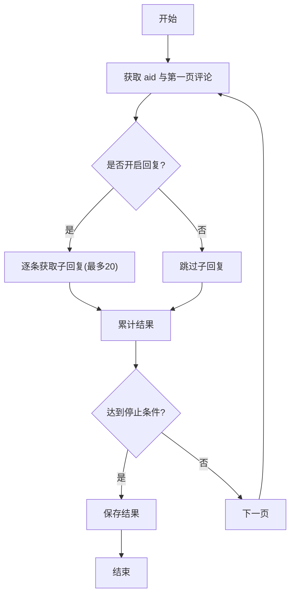
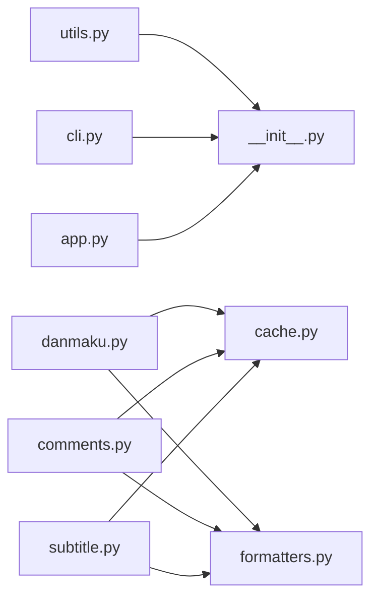

# 格式化模块设计

<cite>
**本文引用的文件**   
- [formatters.py](file://bilibili/formatters.py)
- [subtitle.py](file://bilibili/subtitle.py)
- [danmaku.py](file://bilibili/danmaku.py)
- [comments.py](file://bilibili/comments.py)
- [utils.py](file://bilibili/utils.py)
- [cache.py](file://bilibili/cache.py)
- [__init__.py](file://bilibili/__init__.py)
- [cli.py](file://cli.py)
- [app.py](file://app.py)
</cite>

## 目录
1. [简介](#简介)
2. [项目结构](#项目结构)
3. [核心组件](#核心组件)
4. [架构总览](#架构总览)
5. [详细组件分析](#详细组件分析)
6. [依赖关系分析](#依赖关系分析)
7. [性能与大数据处理](#性能与大数据处理)
8. [故障排查指南](#故障排查指南)
9. [结论](#结论)
10. [附录：自定义格式转换器开发指南](#附录自定义格式转换器开发指南)

## 简介
本技术文档聚焦于“格式化模块”的设计与实现，围绕统一数据输出接口、多格式支持架构与可扩展性展开。重点覆盖以下方面：
- 统一数据输出接口的设计理念与职责边界
- 多格式支持的架构设计与扩展点
- 各数据格式的转换算法与流程（TXT、JSON、CSV、SRT、ASS、LRC）
- 格式选择器的实现逻辑（含编码处理与特殊字符转义）
- 数据验证与清洗流程（字段完整性检查、类型转换、异常数据处理）
- 自定义格式转换器的开发与集成方法
- 性能优化技巧与大数据量处理最佳实践

## 项目结构
本项目采用分层组织方式：
- 入口层：CLI 与 Streamlit Web 界面负责参数解析与调度
- 抓取层：弹幕、评论、字幕的异步抓取与缓存
- 格式化层：统一的保存与导出接口，按格式生成文本/结构化文件
- 工具层：通用工具（如 BV 号解析）、缓存模块

图表来源
- [cli.py:1-118](file://cli.py#L1-L118)
- [app.py:1-281](file://app.py#L1-L281)
- [__init__.py:1-19](file://bilibili/__init__.py#L1-L19)
- [danmaku.py:1-64](file://bilibili/danmaku.py#L1-L64)
- [comments.py:1-171](file://bilibili/comments.py#L1-L171)
- [subtitle.py:1-77](file://bilibili/subtitle.py#L1-L77)
- [formatters.py:1-166](file://bilibili/formatters.py#L1-L166)
- [cache.py:1-42](file://bilibili/cache.py#L1-L42)
- [utils.py:1-28](file://bilibili/utils.py#L1-L28)

章节来源
- [cli.py:1-118](file://cli.py#L1-L118)
- [app.py:1-281](file://app.py#L1-L281)
- [__init__.py:1-19](file://bilibili/__init__.py#L1-L19)

## 核心组件
- 统一保存接口
  - 评论保存：save_comments(comments_with_replies, bvid, fmt="txt")
  - 弹幕保存：save_danmaku(dms, bvid, fmt="txt")
  - 字幕保存：save_subtitle(sub_obj, bvid, lan_code, fmt="srt")
- 字幕语言选择与请求：get_subtitle(...)
- 弹幕/评论抓取与缓存：get_danmaku(...), get_comments(...), get_all_comments(...)
- 工具函数：extract_bvid(...)
- 缓存模块：基于文件的 JSON 缓存，提供 key 生成、读取、写入

章节来源
- [formatters.py:1-166](file://bilibili/formatters.py#L1-L166)
- [subtitle.py:1-77](file://bilibili/subtitle.py#L1-L77)
- [danmaku.py:1-64](file://bilibili/danmaku.py#L1-L64)
- [comments.py:1-171](file://bilibili/comments.py#L1-L171)
- [utils.py:1-28](file://bilibili/utils.py#L1-L28)
- [cache.py:1-42](file://bilibili/cache.py#L1-L42)

## 架构总览
统一数据输出接口位于格式化层，屏蔽上层差异，向下对接具体格式生成器。其核心思想是：
- 输入标准化：将不同来源的数据转换为内部一致的中间表示
- 格式分发：根据 fmt 参数选择对应生成器
- 编码与转义：统一处理 UTF-8、UTF-8-SIG（Excel 兼容 BOM）、CSV 转义
- 可扩展：新增格式只需增加分支或注册表，无需改动调用方

图表来源
- [formatters.py:50-97](file://bilibili/formatters.py#L50-L97)
- [formatters.py:101-142](file://bilibili/formatters.py#L101-L142)
- [formatters.py:146-166](file://bilibili/formatters.py#L146-L166)

## 详细组件分析

### 统一数据输出接口（formatters.py）
- 设计理念
  - 以“保存函数”为中心，每个业务对象（评论、弹幕、字幕）提供独立的保存函数
  - 通过 fmt 参数驱动多格式输出，避免在调用处重复判断
  - 统一输出路径与命名规则，便于后续下载与归档
- 关键函数
  - save_comments：支持 txt/json/csv；对评论与回复进行扁平化（CSV）或嵌套（JSON）
  - save_danmaku：支持 txt/json/csv；时间字段保留一位小数
  - save_subtitle：支持 srt/ass/lrc/json；由字幕对象提供 to_srt/to_ass/to_lrc/to_simple_json
- 编码与转义
  - TXT/JSON/SRT/ASS/LRC：使用 UTF-8
  - CSV：使用 UTF-8-SIG（带 BOM），提升 Excel 兼容性
  - CSV 转义：借助标准库 DictWriter 自动处理逗号、引号、换行等
- 数据结构与复杂度
  - 评论保存：O(N+R)，N 为主评数，R 为回复总数
  - 弹幕保存：O(M)，M 为弹幕条数
  - 字幕保存：O(K)，K 为字幕条目数
- 错误处理
  - 缺失字段时采用默认值（如 reply_count=0、reply_to=""）
  - 字幕为空时直接返回，不写文件

图表来源
- [formatters.py:50-97](file://bilibili/formatters.py#L50-L97)
- [formatters.py:101-142](file://bilibili/formatters.py#L101-L142)
- [formatters.py:146-166](file://bilibili/formatters.py#L146-L166)

章节来源
- [formatters.py:1-166](file://bilibili/formatters.py#L1-L166)

### 字幕保存与格式选择（subtitle.py + formatters.py）
- 语言选择策略
  - 优先匹配用户指定代码；若未命中则尝试关键词模糊匹配；否则回退到第一个可用语言
  - 默认优先中文（AI 自动生成、简体、繁体）
- 数据获取
  - 通过 bilibili_api 提供的 request_subtitle_languages 获取字幕对象
  - 调用 request_ass_data_json 拉取字幕内容
- 格式分发
  - srt：to_srt()
  - ass：to_ass()
  - lrc：to_lrc()
  - json：to_simple_json() 后 JSON 序列化
- 输出统计
  - 通过计数空行估算字幕条目数量

图表来源
- [subtitle.py:21-77](file://bilibili/subtitle.py#L21-L77)
- [formatters.py:146-166](file://bilibili/formatters.py#L146-L166)

章节来源
- [subtitle.py:1-77](file://bilibili/subtitle.py#L1-L77)
- [formatters.py:146-166](file://bilibili/formatters.py#L146-L166)

### 弹幕保存（danmaku.py + formatters.py）
- 抓取流程
  - 从 Video 对象获取 cid 与弹幕列表
  - 将原始对象转为轻量字典用于缓存与输出
- 保存流程
  - txt：每行包含时间与文本
  - json：数组对象，包含时间、模式、字号、颜色、用户 ID
  - csv：UTF-8-SIG 头 + 行数据
- 缓存
  - 使用 cache_key 生成键，按 max_age 控制有效期

图表来源
- [danmaku.py:13-64](file://bilibili/danmaku.py#L13-L64)
- [cache.py:14-42](file://bilibili/cache.py#L14-L42)
- [formatters.py:101-142](file://bilibili/formatters.py#L101-L142)

章节来源
- [danmaku.py:1-64](file://bilibili/danmaku.py#L1-L64)
- [formatters.py:101-142](file://bilibili/formatters.py#L101-L142)
- [cache.py:1-42](file://bilibili/cache.py#L1-L42)

### 评论保存（comments.py + formatters.py）
- 单页与全量翻页
  - 单页：get_comments(page, with_replies)
  - 全量：get_all_comments(max_pages, with_replies)，内置安全上限与空页检测
- 楼中楼回复
  - 可选获取，限制每条评论最多 20 条子回复，并加入延时避免触发限流
- 保存流程
  - txt：缩进显示层级
  - json：嵌套 replies 结构
  - csv：扁平化，level 字段区分主评与回复

图表来源
- [comments.py:42-171](file://bilibili/comments.py#L42-L171)
- [formatters.py:50-97](file://bilibili/formatters.py#L50-L97)

章节来源
- [comments.py:1-171](file://bilibili/comments.py#L1-L171)
- [formatters.py:50-97](file://bilibili/formatters.py#L50-L97)

### 工具与入口（utils.py、__init__.py、cli.py、app.py）
- 工具
  - extract_bvid：从纯 BV 号或链接中提取 BV 号，失败抛出 ValueError
- 包导出
  - __init__.py 聚合常用函数，供外部导入
- CLI 与 Web
  - cli.py：参数解析、默认行为、保存格式选择
  - app.py：Streamlit 界面，映射 UI 选项到保存格式，并提供下载按钮

章节来源
- [utils.py:1-28](file://bilibili/utils.py#L1-L28)
- [__init__.py:1-19](file://bilibili/__init__.py#L1-L19)
- [cli.py:1-118](file://cli.py#L1-L118)
- [app.py:1-281](file://app.py#L1-L281)

## 依赖关系分析
- 模块耦合
  - 抓取层（danmaku.py、comments.py、subtitle.py）依赖缓存与格式化层
  - 格式化层仅依赖标准库与字幕对象的导出方法
  - 入口层（cli.py、app.py）依赖包导出与格式化层
- 外部依赖
  - bilibili_api：视频信息、弹幕、评论、字幕接口
  - 标准库：csv、json、datetime、pathlib、re、hashlib、time、argparse、asyncio

图表来源
- [danmaku.py:1-64](file://bilibili/danmaku.py#L1-L64)
- [comments.py:1-171](file://bilibili/comments.py#L1-L171)
- [subtitle.py:1-77](file://bilibili/subtitle.py#L1-L77)
- [formatters.py:1-166](file://bilibili/formatters.py#L1-L166)
- [cache.py:1-42](file://bilibili/cache.py#L1-L42)
- [utils.py:1-28](file://bilibili/utils.py#L1-L28)
- [__init__.py:1-19](file://bilibili/__init__.py#L1-L19)
- [cli.py:1-118](file://cli.py#L1-L118)
- [app.py:1-281](file://app.py#L1-L281)

章节来源
- [danmaku.py:1-64](file://bilibili/danmaku.py#L1-L64)
- [comments.py:1-171](file://bilibili/comments.py#L1-L171)
- [subtitle.py:1-77](file://bilibili/subtitle.py#L1-L77)
- [formatters.py:1-166](file://bilibili/formatters.py#L1-L166)
- [cache.py:1-42](file://bilibili/cache.py#L1-L42)
- [utils.py:1-28](file://bilibili/utils.py#L1-L28)
- [__init__.py:1-19](file://bilibili/__init__.py#L1-L19)
- [cli.py:1-118](file://cli.py#L1-L118)
- [app.py:1-281](file://app.py#L1-L281)

## 性能与大数据处理
- 缓存策略
  - 基于文件的 JSON 缓存，key 使用 MD5 哈希，max_age 控制过期
  - 建议合理设置 max_age，减少重复网络请求
- 内存与 I/O
  - 弹幕/评论/字幕均以流式写入为主，避免一次性加载超大对象
  - CSV 使用 utf-8-sig 提升 Excel 打开性能
- 速率控制
  - 评论楼中楼获取加入延时，降低被限流风险
- 安全上限
  - 评论全量翻页内置最大条目上限，防止无限增长
- 建议
  - 对超大数据集可考虑分片写入与增量更新
  - 批量导出前清理旧缓存，减少磁盘占用

章节来源
- [cache.py:1-42](file://bilibili/cache.py#L1-L42)
- [comments.py:120-171](file://bilibili/comments.py#L120-L171)
- [danmaku.py:30-64](file://bilibili/danmaku.py#L30-L64)

## 故障排查指南
- BV 号解析失败
  - 现象：抛出无法解析 BV 号的异常
  - 排查：确认输入是否为有效 BV 号或完整链接
  - 参考：[utils.py:8-28](file://bilibili/utils.py#L8-L28)
- 字幕不存在
  - 现象：提示该视频没有字幕
  - 排查：确认视频是否有字幕资源
  - 参考：[subtitle.py:47-50](file://bilibili/subtitle.py#L47-L50)
- 评论回复获取失败
  - 现象：打印失败日志并返回空列表
  - 排查：检查网络与权限，必要时降低并发或增大延时
  - 参考：[comments.py:27-40](file://bilibili/comments.py#L27-L40)
- 文件编码问题
  - 现象：Excel 打开 CSV 乱码
  - 排查：确保使用 utf-8-sig 编码
  - 参考：[formatters.py:76-82](file://bilibili/formatters.py#L76-L82)

章节来源
- [utils.py:8-28](file://bilibili/utils.py#L8-L28)
- [subtitle.py:47-50](file://bilibili/subtitle.py#L47-L50)
- [comments.py:27-40](file://bilibili/comments.py#L27-L40)
- [formatters.py:76-82](file://bilibili/formatters.py#L76-L82)

## 结论
本格式化模块通过统一保存接口与清晰的格式分发机制，实现了多格式输出的高内聚与低耦合。配合缓存与速率控制，兼顾了性能与稳定性。未来可通过注册表机制进一步简化格式扩展，并在大数据场景下引入分片与增量写入以提升吞吐。

## 附录：自定义格式转换器开发指南
- 目标
  - 在不修改调用方的前提下，新增一种新的导出格式（例如 xml、md、xlsx）
- 步骤
  - 在 formatters.py 中新增对应保存函数的分支或独立函数
  - 定义新格式的字段映射与转义规则（如 CSV 需处理逗号、引号、换行）
  - 统一编码策略（文本类用 UTF-8，表格类用 UTF-8-SIG）
  - 在入口层（cli.py、app.py）添加新格式选项，并映射到保存函数
- 示例要点
  - 评论保存：保持 level/reply_to/rpid 等字段的语义一致性
  - 弹幕保存：时间字段精度与单位保持一致
  - 字幕保存：遵循目标格式的时间与样式规范
- 测试建议
  - 构造最小数据集验证字段完整性与转义正确性
  - 使用大样本验证性能与内存占用
  - 校验不同平台（Windows/Excel）下的编码兼容性

章节来源
- [formatters.py:50-97](file://bilibili/formatters.py#L50-L97)
- [formatters.py:101-142](file://bilibili/formatters.py#L101-L142)
- [formatters.py:146-166](file://bilibili/formatters.py#L146-L166)
- [cli.py:54-60](file://cli.py#L54-L60)
- [app.py:40-41](file://app.py#L40-L41)