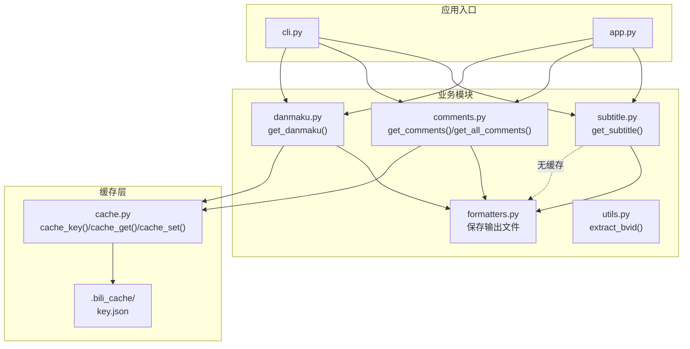
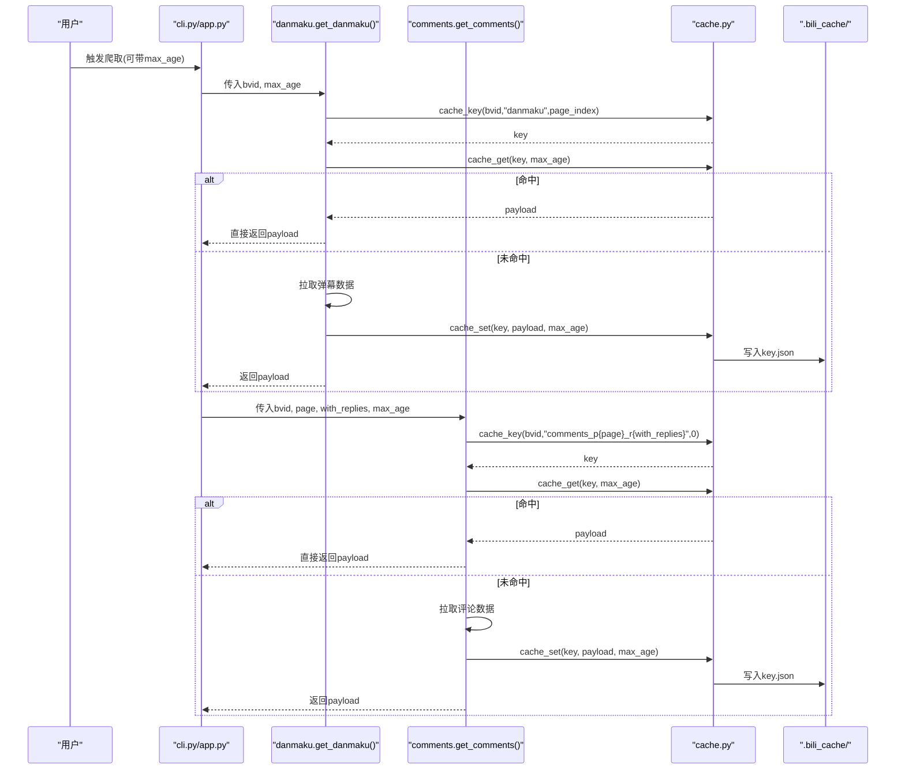
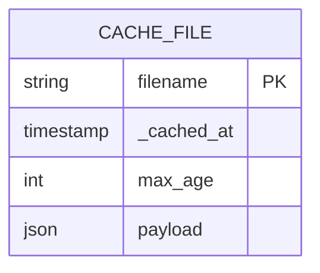
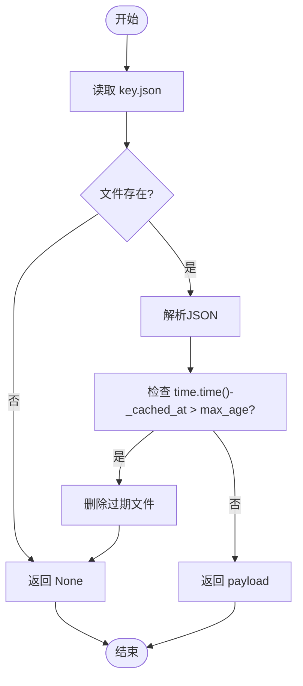
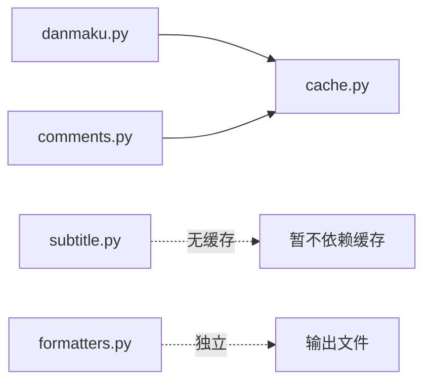

# 缓存模块设计

<cite>
**本文引用的文件列表**
- [bilibili/cache.py](file://bilibili/cache.py)
- [bilibili/danmaku.py](file://bilibili/danmaku.py)
- [bilibili/comments.py](file://bilibili/comments.py)
- [bilibili/subtitle.py](file://bilibili/subtitle.py)
- [bilibili/formatters.py](file://bilibili/formatters.py)
- [bilibili/utils.py](file://bilibili/utils.py)
- [cli.py](file://cli.py)
- [app.py](file://app.py)
</cite>

## 目录
1. [简介](#简介)
2. [项目结构](#项目结构)
3. [核心组件](#核心组件)
4. [架构总览](#架构总览)
5. [详细组件分析](#详细组件分析)
6. [依赖关系分析](#依赖关系分析)
7. [性能与调优](#性能与调优)
8. [故障排查与恢复](#故障排查与恢复)
9. [结论](#结论)
10. [附录：配置与使用](#附录配置与使用)

## 简介
本技术文档聚焦于“基于文件的 JSON 缓存”子系统，围绕以下目标展开：
- 说明文件级缓存系统的架构设计与数据模型
- 阐述基于 MD5 的缓存键生成算法与存储结构
- 解释缓存策略（命名规则、目录组织、过期时间管理）
- 描述缓存读取/写入流程（命中检测、序列化/反序列化）
- 提供清理与维护建议（空间优化、无效缓存自动清理）
- 给出性能调优建议与配置选项说明
- 覆盖失效场景处理与故障恢复机制

该缓存系统为弹幕、评论等网络请求提供本地文件缓存能力，减少重复网络开销并提升交互体验。

## 项目结构
与缓存相关的代码主要位于 bilibili 包内，核心实现集中在 cache.py，并在弹幕、评论等抓取模块中按需调用。CLI 和 Web 入口通过参数控制是否启用缓存及有效期。

图表来源
- [bilibili/cache.py:1-42](file://bilibili/cache.py#L1-L42)
- [bilibili/danmaku.py:1-64](file://bilibili/danmaku.py#L1-L64)
- [bilibili/comments.py:1-171](file://bilibili/comments.py#L1-L171)
- [bilibili/subtitle.py:1-77](file://bilibili/subtitle.py#L1-L77)
- [bilibili/formatters.py:1-166](file://bilibili/formatters.py#L1-L166)
- [bilibili/utils.py:1-28](file://bilibili/utils.py#L1-L28)
- [cli.py:1-118](file://cli.py#L1-L118)
- [app.py:1-281](file://app.py#L1-L281)

章节来源
- [bilibili/cache.py:1-42](file://bilibili/cache.py#L1-L42)
- [bilibili/danmaku.py:1-64](file://bilibili/danmaku.py#L1-L64)
- [bilibili/comments.py:1-171](file://bilibili/comments.py#L1-L171)
- [bilibili/subtitle.py:1-77](file://bilibili/subtitle.py#L1-L77)
- [bilibili/formatters.py:1-166](file://bilibili/formatters.py#L1-L166)
- [bilibili/utils.py:1-28](file://bilibili/utils.py#L1-L28)
- [cli.py:1-118](file://cli.py#L1-L118)
- [app.py:1-281](file://app.py#L1-L281)

## 核心组件
- 缓存键生成：基于 bvid、数据类型与页码组合后计算 MD5 哈希，作为文件名。
- 缓存存储：在 .bili_cache 目录下以 key.json 形式持久化，JSON 结构包含元信息与负载。
- 缓存读取：按 key 查找文件，解析 JSON，校验过期时间；若过期则删除并返回空。
- 缓存写入：将 payload 与元信息序列化为 JSON 写入文件。
- 集成点：弹幕与评论模块在获取数据前尝试命中缓存，命中直接返回；未命中则拉取数据并落盘。字幕模块当前未使用缓存。

章节来源
- [bilibili/cache.py:14-41](file://bilibili/cache.py#L14-L41)
- [bilibili/danmaku.py:30-58](file://bilibili/danmaku.py#L30-L58)
- [bilibili/comments.py:60-86](file://bilibili/comments.py#L60-L86)

## 架构总览
下图展示了从入口到缓存层的完整调用链，以及缓存命中/未命中的分支逻辑。

图表来源
- [bilibili/danmaku.py:30-58](file://bilibili/danmaku.py#L30-L58)
- [bilibili/comments.py:60-86](file://bilibili/comments.py#L60-L86)
- [bilibili/cache.py:14-41](file://bilibili/cache.py#L14-L41)

## 详细组件分析

### 缓存键生成算法
- 输入：bvid（视频标识）、dtype（数据类型，如 danmaku、comments_pX_rY）、page（分P索引或固定占位）。
- 算法：将三者用冒号拼接后计算 MD5 十六进制字符串作为 key。
- 特点：
  - 确定性：相同输入产生相同 key，利于命中。
  - 冲突概率低：MD5 碰撞在实际场景中可忽略。
  - 长度固定：便于文件系统管理与索引扩展。

章节来源
- [bilibili/cache.py:14-16](file://bilibili/cache.py#L14-L16)
- [bilibili/danmaku.py:30](file://bilibili/danmaku.py#L30)
- [bilibili/comments.py:61](file://bilibili/comments.py#L61)

### 数据存储结构与命名规则
- 目录：.bili_cache（项目根目录下隐藏目录），由缓存模块初始化时创建。
- 文件命名：key.json，其中 key 为 MD5 哈希值。
- JSON 结构：
  - _cached_at：缓存写入时的 Unix 时间戳（秒）。
  - max_age：缓存有效期（秒），用于后续过期判断。
  - payload：实际业务数据（弹幕列表、评论列表等）。

图表来源
- [bilibili/cache.py:10-11](file://bilibili/cache.py#L10-L11)
- [bilibili/cache.py:21-41](file://bilibili/cache.py#L21-L41)

章节来源
- [bilibili/cache.py:10-11](file://bilibili/cache.py#L10-L11)
- [bilibili/cache.py:21-41](file://bilibili/cache.py#L21-L41)

### 缓存读取与写入流程
- 读取流程：
  - 根据 key 定位文件，不存在则返回空。
  - 解析 JSON，比较当前时间与 _cached_at 差值是否超过 max_age。
  - 若过期则删除文件并返回空；否则返回 payload。
- 写入流程：
  - 构造包含 _cached_at、max_age、payload 的字典。
  - 序列化为 UTF-8 编码的 JSON 文本，写入 key.json。

图表来源
- [bilibili/cache.py:19-28](file://bilibili/cache.py#L19-L28)
- [bilibili/cache.py:31-41](file://bilibili/cache.py#L31-L41)

章节来源
- [bilibili/cache.py:19-41](file://bilibili/cache.py#L19-L41)

### 各模块对缓存的使用方式
- 弹幕模块：
  - 使用 key = cache_key(bvid, "danmaku", page_index)。
  - 命中则直接返回；未命中则拉取弹幕数据并写入缓存。
- 评论模块：
  - 使用 key = cache_key(bvid, f"comments_p{page}_r{int(with_replies)}", 0)。
  - 命中则直接返回；未命中则拉取评论数据并写入缓存。
- 字幕模块：
  - 当前未使用缓存，仅负责语言选择与下载保存。

章节来源
- [bilibili/danmaku.py:30-58](file://bilibili/danmaku.py#L30-L58)
- [bilibili/comments.py:60-86](file://bilibili/comments.py#L60-L86)
- [bilibili/subtitle.py:21-77](file://bilibili/subtitle.py#L21-L77)

### 缓存失效与过期策略
- 过期判定：time.time() - _cached_at > max_age。
- 过期行为：立即删除对应 key.json 文件，避免脏读。
- 默认有效期：
  - CLI 默认 max_age=30 秒，可通过 --max-age 调整。
  - Web 界面默认 30 秒，支持禁用缓存（max_age=0）。

章节来源
- [bilibili/cache.py:24-27](file://bilibili/cache.py#L24-L27)
- [cli.py:52](file://cli.py#L52)
- [app.py:57](file://app.py#L57)

### 目录组织与命名约定
- 缓存目录：.bili_cache（项目根目录）。
- 文件名：key.json（MD5 哈希 + .json 后缀）。
- 输出文件（非缓存）：保存在项目根目录，命名如 comments_{bvid}.txt/json/csv、danmaku_{bvid}.txt/json/csv、subtitle_{bvid}_{lan_code}.srt/ass/lrc/json。

章节来源
- [bilibili/cache.py:10-11](file://bilibili/cache.py#L10-L11)
- [bilibili/formatters.py:50-96](file://bilibili/formatters.py#L50-96)
- [bilibili/formatters.py:101-141](file://bilibili/formatters.py#L101-L141)
- [bilibili/formatters.py:146-166](file://bilibili/formatters.py#L146-L166)

## 依赖关系分析
- 模块耦合：
  - danmaku.py 与 comments.py 均依赖 cache.py 提供的三个函数。
  - subtitle.py 暂未引入缓存。
  - formatters.py 负责最终结果的文件保存，与缓存层解耦。
- 外部依赖：
  - 标准库：json、time、hashlib、pathlib。
  - 第三方：bilibili_api（用于网络请求，不直接影响缓存逻辑）。

图表来源
- [bilibili/danmaku.py:9](file://bilibili/danmaku.py#L9)
- [bilibili/comments.py:9](file://bilibili/comments.py#L9)
- [bilibili/subtitle.py:1-77](file://bilibili/subtitle.py#L1-L77)
- [bilibili/formatters.py:1-166](file://bilibili/formatters.py#L1-L166)

章节来源
- [bilibili/danmaku.py:1-64](file://bilibili/danmaku.py#L1-L64)
- [bilibili/comments.py:1-171](file://bilibili/comments.py#L1-L171)
- [bilibili/subtitle.py:1-77](file://bilibili/subtitle.py#L1-L77)
- [bilibili/formatters.py:1-166](file://bilibili/formatters.py#L1-L166)

## 性能与调优
- I/O 路径
  - 缓存读写均为单文件 JSON 操作，适合中小规模数据；超大 payload 可能带来序列化/反序列化开销。
- 并发安全
  - 当前实现未加锁，多进程/多线程并发写同一 key 可能存在竞态条件。建议在高频并发场景增加文件锁或改用原子写入（临时文件+重命名）。
- 过期粒度
  - 全局 max_age 适用于多数场景；如需更细粒度，可按数据类型或页面维度设置不同有效期。
- 压缩与分片
  - 对于大体积弹幕/评论，可考虑 gzip 压缩存储或按页分片存储，降低单次 I/O 压力。
- 预取与懒加载
  - 可在首次访问某页时异步预热缓存，减少首屏延迟。
- 监控与统计
  - 可增加命中率统计与缓存大小监控，辅助容量规划与 TTL 调优。

[本节为通用指导，不涉及具体文件分析]

## 故障排查与恢复
- 常见问题
  - 缓存未命中：确认 key 是否正确生成；检查 max_age 是否为 0（禁用缓存）。
  - 缓存未生效：确认调用方是否在命中后直接返回，而非继续拉取。
  - 磁盘空间不足：检查 .bili_cache 目录占用，必要时清理过期文件。
- 诊断步骤
  - 查看 .bili_cache 下是否存在对应 key.json。
  - 检查 JSON 结构是否包含 _cached_at、max_age、payload。
  - 对比 time.time() - _cached_at 与 max_age 的关系。
- 恢复策略
  - 手动删除损坏的 key.json，下次请求将重新拉取并重建缓存。
  - 批量清理：遍历 .bili_cache，删除所有 .json 文件或使用脚本按时间阈值清理。
  - 日志观察：在 CLI/Web 中开启日志输出，观察“缓存命中”提示。

章节来源
- [bilibili/cache.py:19-28](file://bilibili/cache.py#L19-L28)
- [bilibili/danmaku.py:32-34](file://bilibili/danmaku.py#L32-L34)
- [bilibili/comments.py:62-65](file://bilibili/comments.py#L62-L65)
- [cli.py:112-114](file://cli.py#L112-L114)

## 结论
该缓存模块以极简的文件 JSON 方案实现了弹幕与评论数据的本地缓存，具备以下特性：
- 简单可靠：基于 MD5 的键生成与 JSON 存储，易于理解与维护。
- 快速上手：通过 CLI 与 Web 界面即可控制缓存开关与有效期。
- 可扩展性：可平滑演进至压缩、分片、并发锁、命中率统计等高级特性。

[本节为总结性内容，不涉及具体文件分析]

## 附录：配置与使用
- CLI 参数
  - --max-age：缓存有效期（秒），默认 30；设为 0 表示禁用缓存。
  - --save：输出格式（txt/json/csv/srt/ass/lrc）。
  - --cookie：登录凭证（SESSDATA）。
- Web 界面
  - “禁用缓存”复选框：勾选即禁用缓存（max_age=0）。
  - 其他参数与 CLI 类似。
- 环境变量与路径
  - 缓存目录：.bili_cache（项目根目录）。
  - 输出目录：项目根目录（由 formatters.py 定义）。

章节来源
- [cli.py:52](file://cli.py#L52)
- [cli.py:112-114](file://cli.py#L112-L114)
- [app.py:57](file://app.py#L57)
- [bilibili/formatters.py:11](file://bilibili/formatters.py#L11)