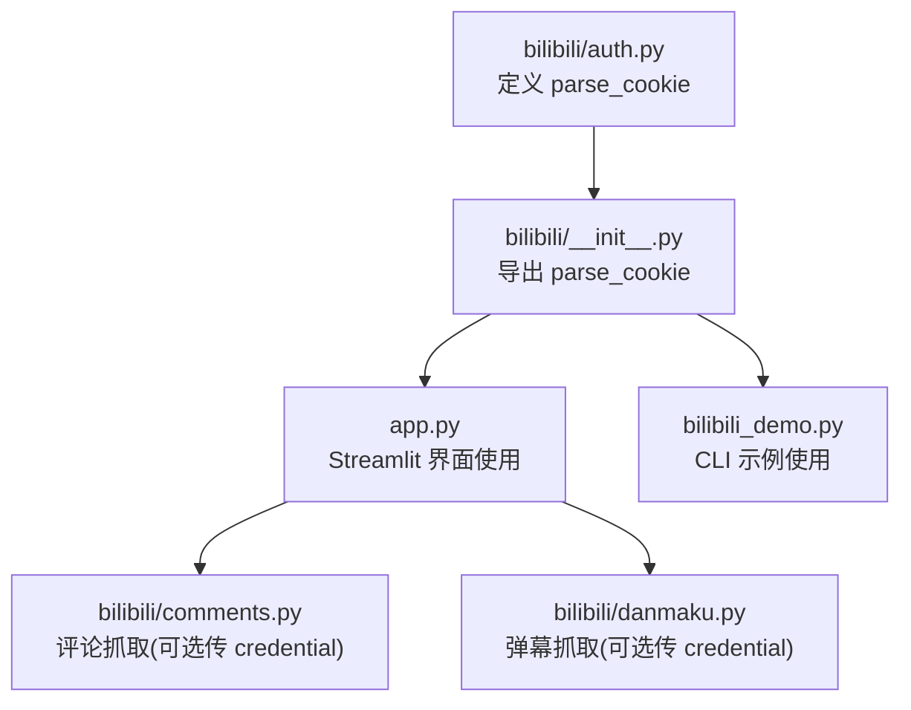
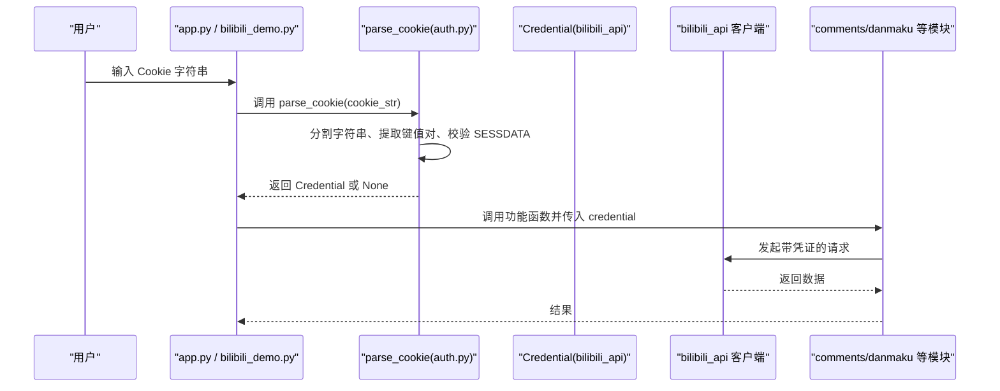
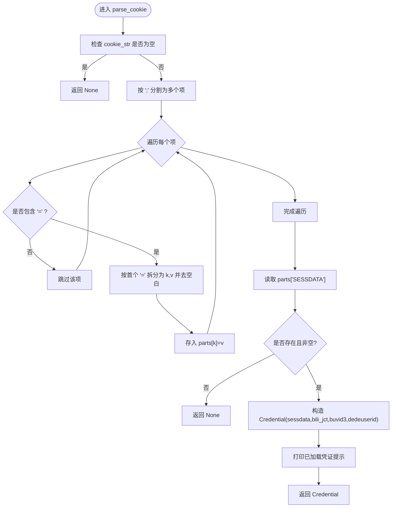
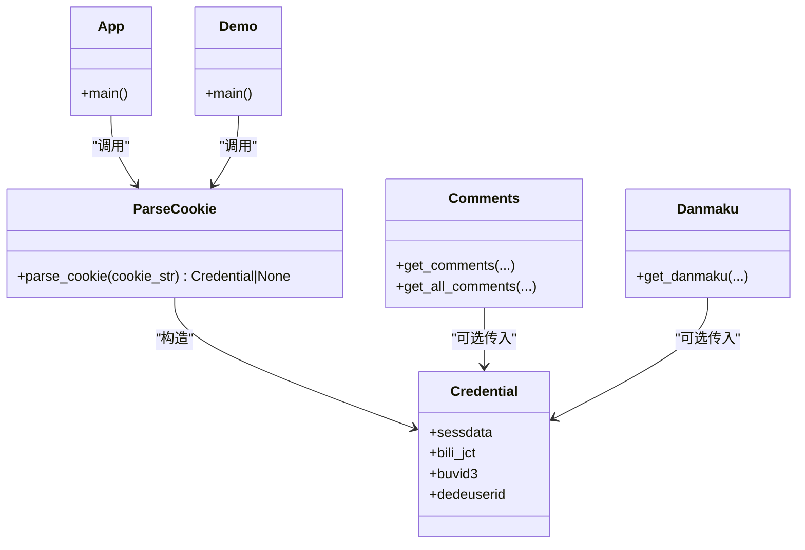

# 认证模块设计

<cite>
**本文引用的文件**
- [bilibili/auth.py](file://bilibili/auth.py)
- [bilibili/__init__.py](file://bilibili/__init__.py)
- [bilibili_demo.py](file://bilibili_demo.py)
- [app.py](file://app.py)
- [bilibili/comments.py](file://bilibili/comments.py)
- [bilibili/danmaku.py](file://bilibili/danmaku.py)
</cite>

## 目录
1. [简介](#简介)
2. [项目结构](#项目结构)
3. [核心组件](#核心组件)
4. [架构总览](#架构总览)
5. [详细组件分析](#详细组件分析)
6. [依赖关系分析](#依赖关系分析)
7. [性能考量](#性能考量)
8. [故障排查指南](#故障排查指南)
9. [结论](#结论)
10. [附录](#附录)

## 简介
本技术文档聚焦于认证模块，围绕 Cookie 解析与凭证构建展开，重点说明：
- parse_cookie 函数的字符串分割算法、键值对提取逻辑与 SESSDATA 字段的验证规则
- Credential 对象的构建过程及各参数（sessdata、bili_jct、buvid3、dedeuserid）的作用与安全考虑
- 错误处理策略：空输入校验、格式异常处理、缺失关键字段处理
- Cookie 获取指南与常见问题解决方案
- 安全最佳实践与凭证管理建议

## 项目结构
认证相关代码主要位于 bilibili/auth.py，并通过包入口 __init__.py 对外暴露。上层应用通过命令行脚本或 Streamlit 界面调用该能力。

图表来源
- [bilibili/auth.py:1-38](file://bilibili/auth.py#L1-L38)
- [bilibili/__init__.py:1-19](file://bilibili/__init__.py#L1-L19)
- [app.py:1-200](file://app.py#L1-L200)
- [bilibili_demo.py:340-452](file://bilibili_demo.py#L340-L452)
- [bilibili/comments.py:1-171](file://bilibili/comments.py#L1-L171)
- [bilibili/danmaku.py:1-64](file://bilibili/danmaku.py#L1-L64)

章节来源
- [bilibili/auth.py:1-38](file://bilibili/auth.py#L1-L38)
- [bilibili/__init__.py:1-19](file://bilibili/__init__.py#L1-L19)

## 核心组件
- parse_cookie(cookie_str: str) -> Credential | None
  - 负责将浏览器 Cookie 字符串解析为 bilibili_api.Credential 对象
  - 仅当包含有效 SESSDATA 时返回凭证；否则返回 None
- Credential(sessdata, bili_jct, buvid3, dedeuserid)
  - 由外部库 bilibili_api 提供，用于携带登录态信息发起受保护请求

章节来源
- [bilibili/auth.py:1-38](file://bilibili/auth.py#L1-L38)

## 架构总览
认证模块在整体系统中的角色是“从用户输入的 Cookie 字符串中抽取必要字段并构造凭证”，随后被各功能模块（弹幕、评论、字幕等）作为可选参数传入以启用登录态访问。

图表来源
- [bilibili/auth.py:1-38](file://bilibili/auth.py#L1-L38)
- [app.py:1-200](file://app.py#L1-L200)
- [bilibili_demo.py:340-452](file://bilibili_demo.py#L340-L452)
- [bilibili/comments.py:1-171](file://bilibili/comments.py#L1-L171)
- [bilibili/danmaku.py:1-64](file://bilibili/danmaku.py#L1-L64)

## 详细组件分析

### parse_cookie 实现原理
- 输入校验
  - 若 cookie_str 为空或空白，直接返回 None
- 字符串分割与键值对提取
  - 按分号 “;” 切分为若干项
  - 对每一项去除首尾空白后，若包含等号 “=”，则按第一个等号拆分为键和值，存入字典
  - 注意：split("=", 1) 保证值中包含等号不会被误拆分
- SESSDATA 验证
  - 从字典中取 SESSDATA；若不存在或为空，返回 None
- 构造 Credential
  - sessdata：取自 SESSDATA
  - bili_jct：取自 bili_jct（若无则为空串）
  - buvid3：取自 buvid3（若无则为空串）
  - dedeuserid：取自 DedeUserID（注意大小写），若无则为空串
- 日志输出
  - 成功加载时会打印提示行

图表来源
- [bilibili/auth.py:1-38](file://bilibili/auth.py#L1-L38)

章节来源
- [bilibili/auth.py:1-38](file://bilibili/auth.py#L1-L38)

### Credential 对象与参数语义
- sessdata
  - 会话标识，通常为用户登录态的核心凭据
  - 必须存在且非空，否则无法建立登录态
- bili_jct
  - 跨站请求令牌，用于部分需要 CSRF 防护的接口
  - 可选；缺失时某些受限操作可能失败
- buvid3
  - 设备/环境指纹类标识，有助于服务端识别环境与风控
  - 可选；缺失不影响基础登录态但可能影响风控通过率
- dedeuserid
  - 用户 ID（Cookie 中的键名为 DedeUserID，注意大小写）
  - 可选；缺失时仍可维持会话，但某些需显式用户标识的接口可能受限

安全考虑
- 以上字段均属于敏感信息，应严格保密，避免明文记录到日志或持久化存储
- 仅在内存中持有，任务完成后尽快释放引用
- 不要将完整 Cookie 字符串写入版本控制或共享配置

章节来源
- [bilibili/auth.py:1-38](file://bilibili/auth.py#L1-L38)

### 错误处理策略
- 空输入校验
  - 输入为空或空白时直接返回 None，避免后续无效处理
- 格式异常处理
  - 未包含等号的项会被忽略，不会导致崩溃
  - 值中包含等号的情况通过 split("=", 1) 正确保留
- 缺失关键字段
  - 缺少 SESSDATA 时返回 None，调用方应据此判断是否需要提示用户重新登录
  - 其他字段缺失时使用空串填充，保持兼容性

章节来源
- [bilibili/auth.py:1-38](file://bilibili/auth.py#L1-L38)

### 使用方式与集成点
- 包入口导出
  - 通过 bilibili.__init__.py 暴露 parse_cookie，供上层统一导入
- CLI 示例
  - bilibili_demo.py 中定义了同名 parse_cookie 并演示如何从命令行参数获取 Cookie 并构造凭证
- Web 界面
  - app.py 通过 Streamlit 提供文本框输入 Cookie，并在点击按钮后调用 parse_cookie 生成凭证，再传递给弹幕/评论/字幕等功能函数

章节来源
- [bilibili/__init__.py:1-19](file://bilibili/__init__.py#L1-L19)
- [bilibili_demo.py:340-452](file://bilibili_demo.py#L340-L452)
- [app.py:1-200](file://app.py#L1-L200)

## 依赖关系分析
- 内部依赖
  - auth.py 依赖 bilibili_api.Credential
  - __init__.py 重导出 parse_cookie
  - app.py 与 bilibili_demo.py 消费 parse_cookie
  - comments.py 与 danmaku.py 接受可选的 Credential 参数
- 外部依赖
  - bilibili_api：提供网络请求封装与 Credential 类型

图表来源
- [bilibili/auth.py:1-38](file://bilibili/auth.py#L1-L38)
- [bilibili/__init__.py:1-19](file://bilibili/__init__.py#L1-L19)
- [app.py:1-200](file://app.py#L1-L200)
- [bilibili_demo.py:340-452](file://bilibili_demo.py#L340-L452)
- [bilibili/comments.py:1-171](file://bilibili/comments.py#L1-L171)
- [bilibili/danmaku.py:1-64](file://bilibili/danmaku.py#L1-L64)

章节来源
- [bilibili/auth.py:1-38](file://bilibili/auth.py#L1-L38)
- [bilibili/__init__.py:1-19](file://bilibili/__init__.py#L1-L19)
- [bilibili/comments.py:1-171](file://bilibili/comments.py#L1-L171)
- [bilibili/danmaku.py:1-64](file://bilibili/danmaku.py#L1-L64)

## 性能考量
- 解析复杂度
  - 时间复杂度 O(n)，n 为 Cookie 字符串长度；空间复杂度 O(k)，k 为键值对数量
- 潜在优化
  - 可考虑一次性正则匹配提升解析效率（当前实现已足够轻量）
  - 避免重复解析：上层可缓存 Credential 实例，减少重复构造开销

[本节为通用指导，不直接分析具体文件]

## 故障排查指南
- 现象：返回 None 或无法登录
  - 检查输入是否为空或空白
  - 确认 Cookie 字符串中包含 SESSDATA 字段
  - 确认分隔符为分号，键值之间包含等号
- 现象：部分功能受限
  - 检查是否缺少 bili_jct、DedeUserID 等字段
  - 某些接口可能需要完整的登录态信息
- 现象：值中包含等号被截断
  - 当前实现使用 split("=", 1) 避免此问题；如仍异常，请检查输入格式
- 现象：权限不足或风控拦截
  - 确保 buvid3 与 DedeUserID 齐全，必要时更新 Cookie

章节来源
- [bilibili/auth.py:1-38](file://bilibili/auth.py#L1-L38)

## 结论
认证模块以极简的方式实现了从 Cookie 字符串到 Credential 的转换，满足弹幕、评论、字幕等功能的登录态需求。其核心在于稳健的字符串解析与严格的 SESSDATA 校验。建议在业务层做好凭证的生命周期管理与安全存储，避免泄露。

[本节为总结性内容，不直接分析具体文件]

## 附录

### Cookie 获取指南
- 在浏览器中打开目标站点并登录
- 打开开发者工具，定位到 Network 请求，查看任意请求的 Cookie 头
- 复制整条 Cookie 字符串（包含 SESSDATA 及可选的 bili_jct、buvid3、DedeUserID 等）
- 粘贴至应用的 Cookie 输入框或命令行参数

### 常见问答
- Q：为什么只要求 SESSDATA？
  - A：SESSDATA 是会话核心；其他字段为增强风控与权限所需，缺失时仍可尝试访问公开或弱鉴权接口
- Q：Cookie 过期怎么办？
  - A：重新登录并刷新 Cookie 后再次传入
- Q：能否保存 Cookie 到配置文件？
  - A：不建议明文保存；如需持久化，请使用加密存储并在运行时解密注入

### 安全最佳实践
- 最小化暴露：仅在内存中持有凭证，避免落盘
- 传输安全：通过 HTTPS 传输，避免中间人劫持
- 访问控制：限制具备 Cookie 的进程/用户的权限
- 审计与告警：对异常登录行为进行监控与告警
- 定期轮换：定期更换 Cookie 或采用更安全的认证方案（如 OAuth）

[本节为通用指导，不直接分析具体文件]