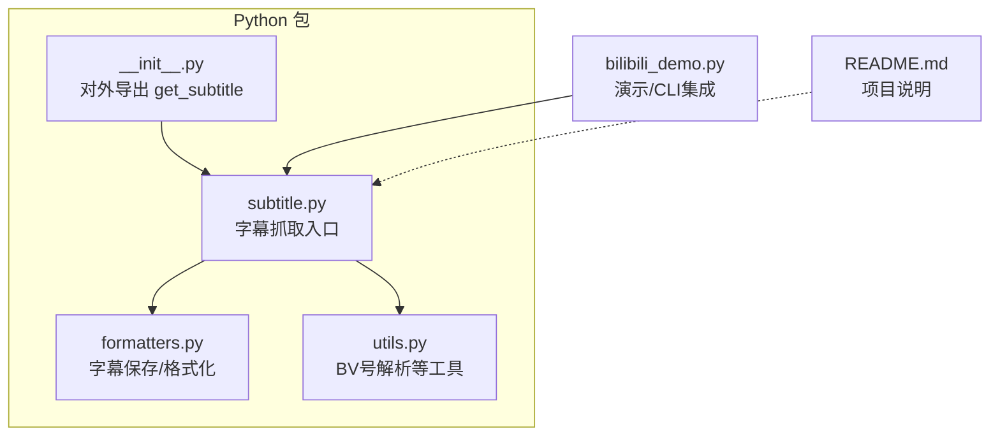
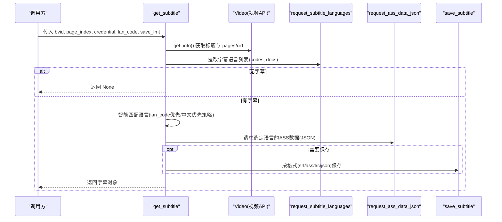
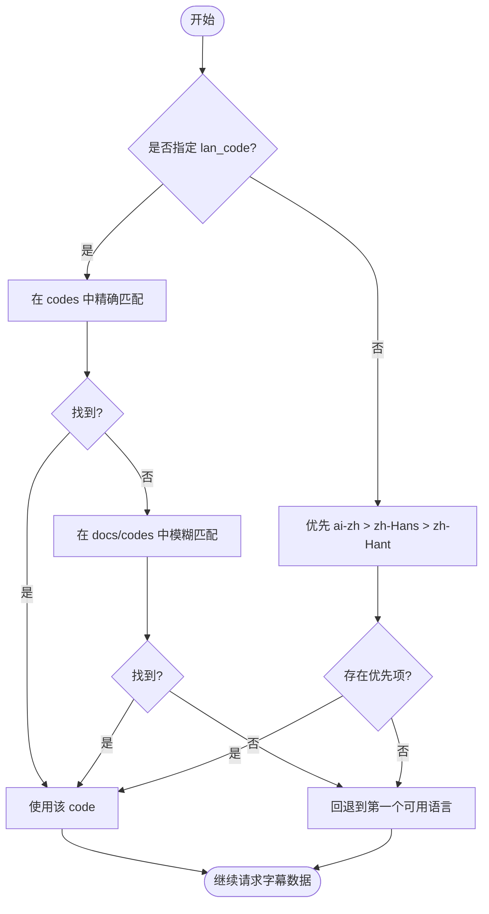
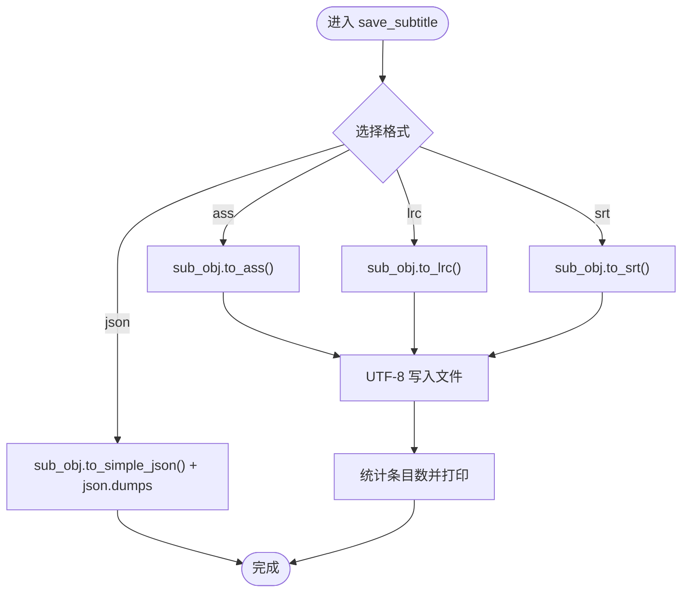
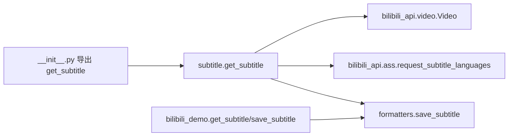
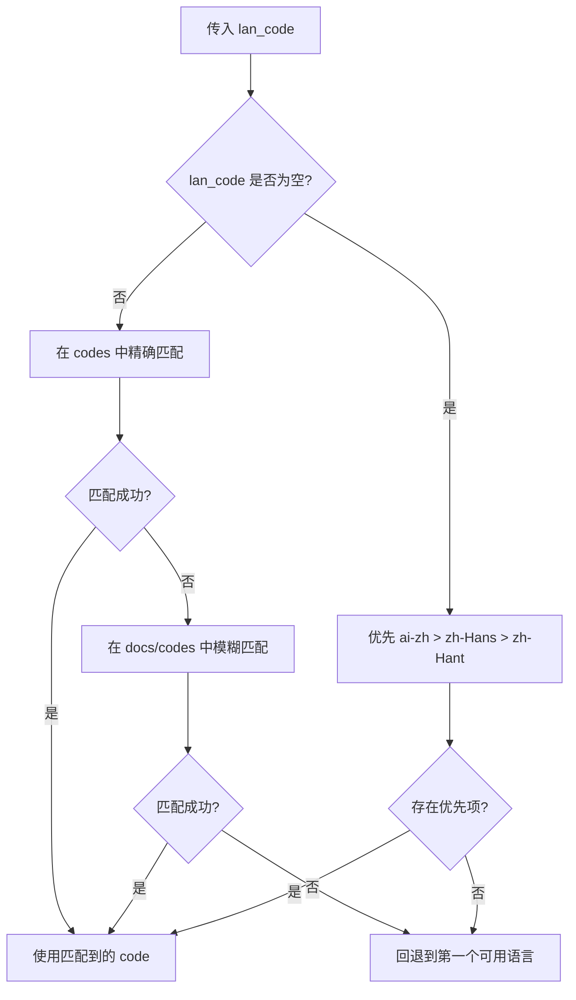

# 字幕抓取功能

<cite>
**本文引用的文件**
- [bilibili/subtitle.py](file://bilibili/subtitle.py)
- [bilibili/formatters.py](file://bilibili/formatters.py)
- [bilibili/utils.py](file://bilibili/utils.py)
- [bilibili/__init__.py](file://bilibili/__init__.py)
- [bilibili_demo.py](file://bilibili_demo.py)
- [README.md](file://README.md)
</cite>

## 目录
1. [简介](#简介)
2. [项目结构](#项目结构)
3. [核心组件](#核心组件)
4. [架构总览](#架构总览)
5. [详细组件分析](#详细组件分析)
6. [依赖关系分析](#依赖关系分析)
7. [性能与扩展性](#性能与扩展性)
8. [故障排查指南](#故障排查指南)
9. [结论](#结论)
10. [附录：使用示例与最佳实践](#附录使用示例与最佳实践)

## 简介
本章节聚焦“字幕抓取”能力，围绕多语言字幕支持、智能匹配算法、数据结构、下载与格式转换、AI生成与人工制作字幕的差异处理、编码与特殊字符兼容性等主题进行系统化说明。该功能基于 bilibili-api-python 提供的接口，封装了从语言列表获取、语言智能匹配、字幕数据拉取到本地保存的完整流程，并支持 srt、ass、lrc、json 等多种输出格式。

## 项目结构
本项目中与字幕相关的核心代码位于 Python 包 bilibili 下，主要包含：
- 字幕抓取入口与语言匹配逻辑：bilibili/subtitle.py
- 字幕保存与格式化：bilibili/formatters.py
- 工具函数（如 BV 号解析）：bilibili/utils.py
- 模块对外暴露：bilibili/__init__.py
- 演示脚本与 CLI 参数集成：bilibili_demo.py
- 项目背景与历史说明：README.md

图表来源
- [bilibili/subtitle.py:1-77](file://bilibili/subtitle.py#L1-L77)
- [bilibili/formatters.py:144-166](file://bilibili/formatters.py#L144-L166)
- [bilibili/utils.py:8-27](file://bilibili/utils.py#L8-L27)
- [bilibili/__init__.py:1-19](file://bilibili/__init__.py#L1-L19)
- [bilibili_demo.py:273-342](file://bilibili_demo.py#L273-L342)
- [README.md:1-114](file://README.md#L1-L114)

章节来源
- [bilibili/subtitle.py:1-77](file://bilibili/subtitle.py#L1-L77)
- [bilibili/formatters.py:144-166](file://bilibili/formatters.py#L144-L166)
- [bilibili/utils.py:8-27](file://bilibili/utils.py#L8-L27)
- [bilibili/__init__.py:1-19](file://bilibili/__init__.py#L1-L19)
- [bilibili_demo.py:273-342](file://bilibili_demo.py#L273-L342)
- [README.md:1-114](file://README.md#L1-L114)

## 核心组件
- 字幕抓取主函数 get_subtitle：负责视频信息获取、字幕语言列表拉取、语言智能匹配、字幕数据请求与保存。
- 字幕保存器 save_subtitle：根据指定格式将字幕对象转换为文本或 JSON 并写入文件。
- 语言映射表 SUBTITLE_LAN_MAP：用于将内部语言代码映射为可读名称，便于日志与展示。
- 工具函数 extract_bvid：从多种输入形式中提取 BV 号，提升易用性。

章节来源
- [bilibili/subtitle.py:21-76](file://bilibili/subtitle.py#L21-L76)
- [bilibili/formatters.py:146-166](file://bilibili/formatters.py#L146-L166)
- [bilibili/utils.py:8-27](file://bilibili/utils.py#L8-L27)

## 架构总览
下图展示了字幕抓取的端到端流程：从传入 BV 号开始，获取视频信息与分P的 cid，调用 API 拉取可用字幕语言列表，执行智能匹配选择目标语言，再拉取具体字幕数据，最后按用户选择的格式保存到本地。

图表来源
- [bilibili/subtitle.py:38-76](file://bilibili/subtitle.py#L38-L76)
- [bilibili/formatters.py:146-166](file://bilibili/formatters.py#L146-L166)

## 详细组件分析

### 多语言字幕支持与智能匹配算法
- 语言列表获取：通过 request_subtitle_languages 获取 codes 与 docs 两个列表，分别对应语言代码与语言文档名。
- 用户指定语言匹配：
  - 优先在 codes 中精确匹配；
  - 若未命中，则在 docs 与 codes 中进行大小写不敏感的部分匹配；
  - 仍无法匹配时，回退到第一个可用语言。
- 默认语言选择策略：当未指定 lan_code 时，优先顺序为 ai-zh（AI自动生成）、zh-Hans（中文简体）、zh-Hant（中文繁体），最后回退到首个可用语言。
- 语言显示映射：SUBTITLE_LAN_MAP 将内部代码映射为人类可读的名称，便于日志输出与界面展示。

图表来源
- [bilibili/subtitle.py:53-67](file://bilibili/subtitle.py#L53-L67)

章节来源
- [bilibili/subtitle.py:43-67](file://bilibili/subtitle.py#L43-L67)

### 字幕数据结构与字段说明
- 语言列表：codes 与 docs 由 get_lan_list 返回，分别表示语言代码与语言文档名。
- 语言代码与可读名称映射：SUBTITLE_LAN_MAP 提供常见语言代码到可读名称的映射，例如 ai-zh、zh-Hans、zh-Hant、en、ja、ko。
- 字幕条目：通过 to_simple_json 可得到精简的 JSON 结构，通常包含时间戳与内容字段（具体字段以库实现为准）。
- 关于 lan、lan_doc、url、file_subtitle_url 等字段：在当前仓库中未发现对这些字段的直接定义或使用。字幕数据主要通过 ASS 相关 API 拉取并以对象方法 to_srt/to_ass/to_lrc/to_simple_json 进行转换与导出。

章节来源
- [bilibili/subtitle.py:10-18](file://bilibili/subtitle.py#L10-L18)
- [bilibili/subtitle.py:46-46](file://bilibili/subtitle.py#L46-L46)
- [bilibili_demo.py:275-282](file://bilibili_demo.py#L275-L282)

### 字幕下载与格式转换
- 支持的输出格式：srt、ass、lrc、json。
- 保存流程：
  - 根据 fmt 分支调用 sub_obj.to_ass()/to_lrc()/to_srt() 或 to_simple_json()；
  - 文本类格式统一以 UTF-8 编码写入文件；
  - JSON 格式使用 ensure_ascii=False 保留非 ASCII 字符，并按缩进美化。
- 文件名约定：subtitle_{bvid}_{lan_code}.{fmt}，便于区分不同语言与格式的输出。

图表来源
- [bilibili/formatters.py:146-166](file://bilibili/formatters.py#L146-L166)
- [bilibili_demo.py:284-300](file://bilibili_demo.py#L284-L300)

章节来源
- [bilibili/formatters.py:146-166](file://bilibili/formatters.py#L146-L166)
- [bilibili_demo.py:284-300](file://bilibili_demo.py#L284-L300)

### AI 生成字幕与人工制作字幕的区别与处理方式
- 语言代码标识：ai-zh 表示“中文（AI自动生成）”，与 zh-Hans（简体）、zh-Hant（繁体）并列，作为可选语言之一。
- 默认优先级：在未指定语言时，优先选择 ai-zh，其次 zh-Hans，再次 zh-Hant，体现对 AI 生成中文的偏好。
- 处理方式：AI 生成与人工制作的字幕在抓取流程上并无差异，均通过同一套语言匹配与数据拉取流程处理，区别仅在于语言代码与可读名称的映射。

章节来源
- [bilibili/subtitle.py:11-18](file://bilibili/subtitle.py#L11-L18)
- [bilibili/subtitle.py:64-67](file://bilibili/subtitle.py#L64-L67)
- [bilibili_demo.py:275-282](file://bilibili_demo.py#L275-L282)

### 编码处理与特殊字符兼容性
- 文本类字幕（srt/ass/lrc）均以 UTF-8 编码写入，确保中文及多语言字符正确显示。
- JSON 输出使用 ensure_ascii=False，避免将非 ASCII 字符转义为 Unicode 序列，提高可读性与兼容性。
- 建议：下游播放器或编辑器应支持 UTF-8 编码；若遇到乱码，检查终端或编辑器的编码设置。

章节来源
- [bilibili/formatters.py:157-163](file://bilibili/formatters.py#L157-L163)
- [bilibili_demo.py:293-298](file://bilibili_demo.py#L293-L298)

## 依赖关系分析
- 外部依赖：
  - bilibili_api.video.Video：用于获取视频信息与分P的 cid。
  - bilibili_api.ass.request_subtitle_languages：用于拉取字幕语言列表与 ASS 数据。
- 内部依赖：
  - formatters.save_subtitle：负责字幕对象的格式转换与文件保存。
  - utils.extract_bvid：辅助解析 BV 号（在 demo 与 CLI 中使用）。
  - __init__.py 暴露 get_subtitle 供上层模块导入。

图表来源
- [bilibili/subtitle.py:5-8](file://bilibili/subtitle.py#L5-L8)
- [bilibili/formatters.py:146-166](file://bilibili/formatters.py#L146-L166)
- [bilibili/__init__.py:9-18](file://bilibili/__init__.py#L9-L18)
- [bilibili_demo.py:273-342](file://bilibili_demo.py#L273-L342)

章节来源
- [bilibili/subtitle.py:5-8](file://bilibili/subtitle.py#L5-L8)
- [bilibili/formatters.py:146-166](file://bilibili/formatters.py#L146-L166)
- [bilibili/__init__.py:9-18](file://bilibili/__init__.py#L9-L18)
- [bilibili_demo.py:273-342](file://bilibili_demo.py#L273-L342)

## 性能与扩展性
- 异步调用：get_subtitle 使用 async/await 与 bilibili_api 的异步接口，有利于并发抓取与减少阻塞。
- 语言匹配复杂度：匹配过程主要为线性扫描与字符串比较，时间复杂度 O(n)，n 为可用语言数量，通常较小，开销可忽略。
- 可扩展点：
  - 新增语言映射：在 SUBTITLE_LAN_MAP 中添加新语言代码与可读名称。
  - 新增输出格式：在 save_subtitle 中增加新的分支与转换逻辑。
  - 自定义匹配策略：调整 prefer 列表或模糊匹配规则以满足特定场景需求。

[本节为通用指导，无需列出具体文件来源]

## 故障排查指南
- 无字幕情况：当 codes 为空时，函数会提示“该视频没有字幕”并返回 None。请确认视频是否存在字幕资源。
- 语言未匹配：若用户指定的 lan_code 无法匹配，系统将回退到第一个可用语言。可通过打印可用语言列表核对。
- 保存失败：检查输出路径权限与磁盘空间；确认终端/编辑器使用 UTF-8 编码以避免乱码。
- 参考说明：README 中记录了字幕接口的迁移与 WBI 签名更新等历史问题，有助于理解可能的兼容性问题。

章节来源
- [bilibili/subtitle.py:47-49](file://bilibili/subtitle.py#L47-L49)
- [bilibili/subtitle.py:61-63](file://bilibili/subtitle.py#L61-L63)
- [README.md:35-43](file://README.md#L35-L43)

## 结论
字幕抓取功能通过清晰的模块化设计与智能语言匹配策略，实现了多语言字幕的高效获取与灵活输出。其默认优先中文（含 AI 生成）的策略贴合中文用户的使用习惯，同时保持了对英文及其他语言的广泛支持。结合 UTF-8 编码与多格式输出，系统具备良好的兼容性与扩展性。

[本节为总结性内容，无需列出具体文件来源]

## 附录：使用示例与最佳实践

### get_subtitle 使用方法
- 基本用法：传入 bvid 与可选的 page_index、credential、lan_code、save_fmt。
- 语言参数配置：
  - 明确指定：如 lan_code="ai-zh"、"zh-Hans"、"zh-Hant"、"en"、"ja"、"ko"。
  - 模糊匹配：传入“中文”、“英语”等关键词，系统会在 docs 与 codes 中进行部分匹配。
  - 自动选择：不传 lan_code 时，默认优先 ai-zh > zh-Hans > zh-Hant。
- 格式选择：save_fmt 支持 srt、ass、lrc、json。
- 批量处理：可在循环中多次调用 get_subtitle，传入不同的 bvid 与参数组合。

章节来源
- [bilibili/subtitle.py:21-76](file://bilibili/subtitle.py#L21-L76)
- [bilibili_demo.py:302-342](file://bilibili_demo.py#L302-L342)

### 语言匹配流程图（代码级）

图表来源
- [bilibili/subtitle.py:53-67](file://bilibili/subtitle.py#L53-L67)

### 保存与格式转换要点
- 文本格式（srt/ass/lrc）：UTF-8 编码写入，适合大多数播放器与编辑器。
- JSON 格式：ensure_ascii=False 保留原始字符，便于后续处理与可视化。
- 文件名规范：subtitle_{bvid}_{lan_code}.{fmt}，便于管理与识别。

章节来源
- [bilibili/formatters.py:146-166](file://bilibili/formatters.py#L146-L166)
- [bilibili_demo.py:284-300](file://bilibili_demo.py#L284-L300)