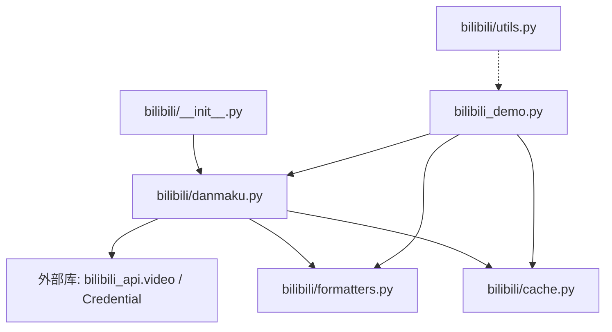
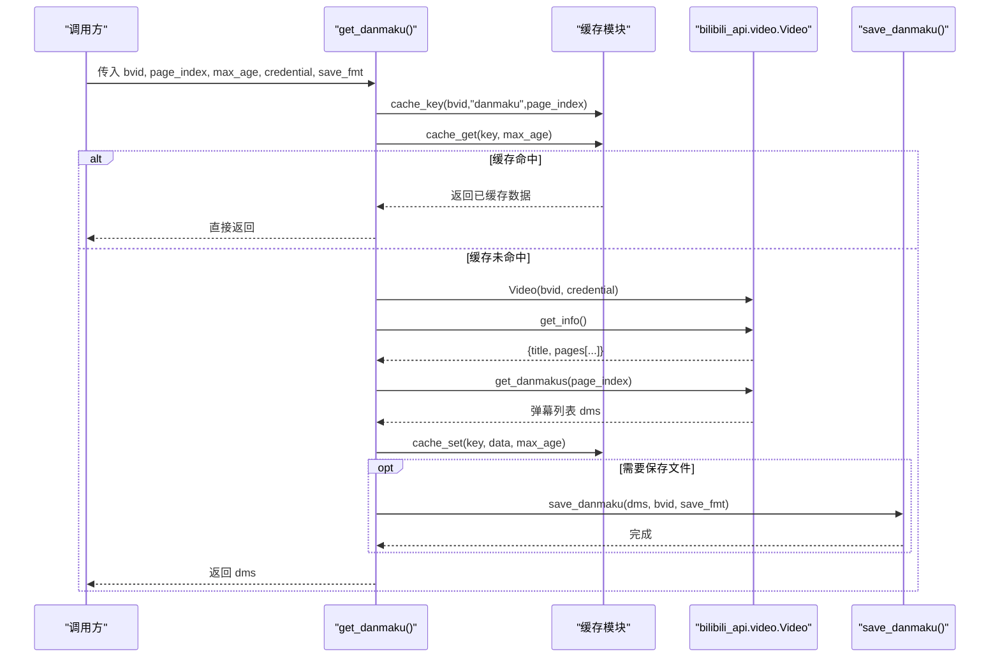
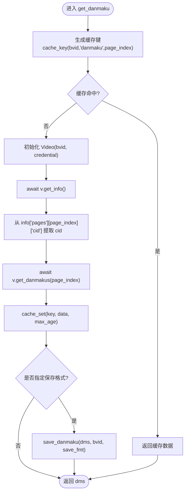
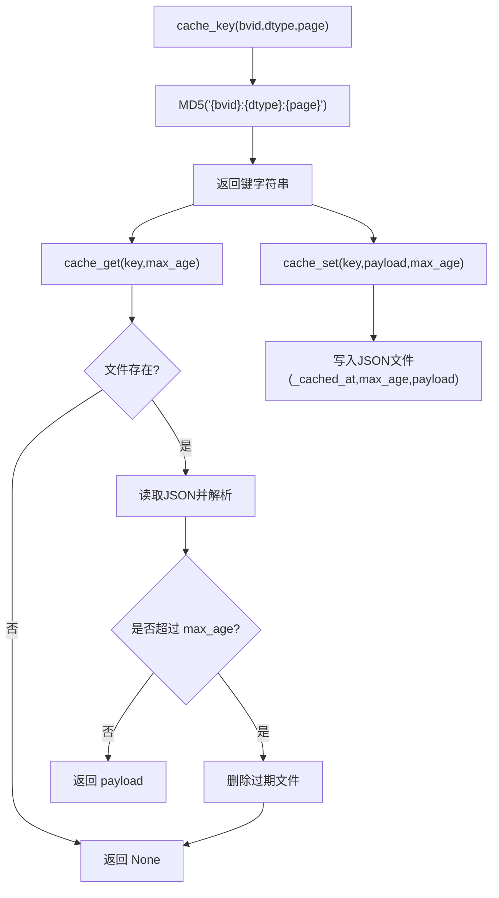
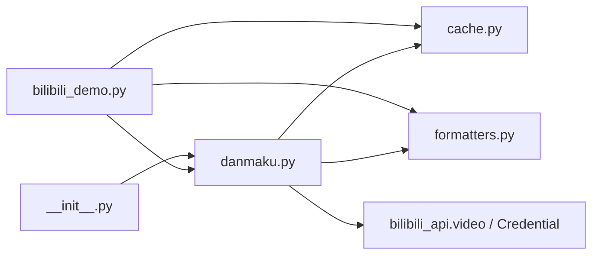

# 弹幕抓取功能

<cite>
**本文引用的文件**   
- [bilibili/danmaku.py](file://bilibili/danmaku.py)
- [bilibili/cache.py](file://bilibili/cache.py)
- [bilibili/formatters.py](file://bilibili/formatters.py)
- [bilibili/utils.py](file://bilibili/utils.py)
- [bilibili/__init__.py](file://bilibili/__init__.py)
- [bilibili_demo.py](file://bilibili_demo.py)
- [requirements.txt](file://requirements.txt)
</cite>

## 目录
1. [简介](#简介)
2. [项目结构](#项目结构)
3. [核心组件](#核心组件)
4. [架构总览](#架构总览)
5. [详细组件分析](#详细组件分析)
6. [依赖关系分析](#依赖关系分析)
7. [性能与优化](#性能与优化)
8. [故障排查指南](#故障排查指南)
9. [结论](#结论)
10. [附录：调用示例与最佳实践](#附录调用示例与最佳实践)

## 简介
本章节面向“弹幕抓取”能力，系统性说明异步获取视频弹幕的实现原理、数据结构、缓存机制、格式化输出以及与B站API的交互流程。文档同时提供可操作的调用示例（参数配置、分P处理、错误处理）和性能优化建议，帮助读者快速集成并稳定运行。

## 项目结构
围绕弹幕抓取的核心代码分布在以下模块中：
- bilibili/danmaku.py：封装异步获取弹幕的主入口 get_danmaku()
- bilibili/cache.py：基于文件的JSON缓存实现（键生成、命中判断、存储）
- bilibili/formatters.py：弹幕数据格式化与保存（txt/json/csv）
- bilibili/utils.py：通用工具（如BV号解析）
- bilibili/__init__.py：对外暴露的包入口
- bilibili_demo.py：演示脚本，包含完整的命令行用法与内部实现参考
- requirements.txt：第三方依赖声明

图表来源
- [bilibili/__init__.py:1-19](file://bilibili/__init__.py#L1-L19)
- [bilibili/danmaku.py:1-64](file://bilibili/danmaku.py#L1-L64)
- [bilibili/cache.py:1-42](file://bilibili/cache.py#L1-L42)
- [bilibili/formatters.py:1-166](file://bilibili/formatters.py#L1-L166)
- [bilibili_demo.py:1-452](file://bilibili_demo.py#L1-L452)

章节来源
- [bilibili/__init__.py:1-19](file://bilibili/__init__.py#L1-L19)
- [bilibili/danmaku.py:1-64](file://bilibili/danmaku.py#L1-L64)
- [bilibili/cache.py:1-42](file://bilibili/cache.py#L1-L42)
- [bilibili/formatters.py:1-166](file://bilibili/formatters.py#L1-L166)
- [bilibili/utils.py:1-28](file://bilibili/utils.py#L1-L28)
- [bilibili_demo.py:1-452](file://bilibili_demo.py#L1-L452)
- [requirements.txt:1-4](file://requirements.txt#L1-L4)

## 核心组件
- 弹幕获取主函数：get_danmaku(bvid, page_index, max_age, credential, save_fmt)
  - 负责缓存检查、初始化Video对象、获取视频信息与cid、拉取弹幕、缓存写入、可选保存到文件。
- 缓存模块：cache_key、cache_get、cache_set
  - 基于本地磁盘的JSON文件缓存，支持按max_age过期策略。
- 格式化与保存：save_danmaku(dms, bvid, fmt)
  - 支持txt/json/csv三种格式输出。
- 工具函数：extract_bvid(raw)
  - 从URL或纯BV号中提取标准BV号。

章节来源
- [bilibili/danmaku.py:13-63](file://bilibili/danmaku.py#L13-L63)
- [bilibili/cache.py:14-42](file://bilibili/cache.py#L14-L42)
- [bilibili/formatters.py:101-142](file://bilibili/formatters.py#L101-L142)
- [bilibili/utils.py:8-27](file://bilibili/utils.py#L8-L27)

## 架构总览
整体流程为：调用方传入BV号与分P索引，先尝试命中缓存；未命中则通过bilibili_api创建Video实例，调用get_info()获取标题与pages中的cid，再调用get_danmakus(page_index)拉取弹幕列表；随后将结果写入缓存并可按需持久化到文件。

图表来源
- [bilibili/danmaku.py:13-63](file://bilibili/danmaku.py#L13-L63)
- [bilibili/cache.py:14-42](file://bilibili/cache.py#L14-L42)
- [bilibili/formatters.py:101-142](file://bilibili/formatters.py#L101-L142)

## 详细组件分析

### 异步弹幕获取流程（get_danmaku）
- 输入参数
  - bvid：视频BV号
  - page_index：分P索引（默认0）
  - max_age：缓存有效期（秒），0表示禁用缓存
  - credential：登录凭证（Credential），可为None
  - save_fmt：保存格式（txt/json/csv），None表示不保存
- 关键步骤
  - 生成缓存键并尝试命中缓存
  - 使用bilibili_api.video.Video初始化对象
  - 调用get_info()获取视频信息，并从info["pages"][page_index]提取cid
  - 调用get_danmakus(page_index=page_index)获取弹幕列表
  - 将结果写入缓存，并按需调用save_danmaku进行持久化
  - 返回原始弹幕对象列表（供上层进一步处理）

图表来源
- [bilibili/danmaku.py:13-63](file://bilibili/danmaku.py#L13-L63)
- [bilibili/cache.py:14-42](file://bilibili/cache.py#L14-L42)
- [bilibili/formatters.py:101-142](file://bilibili/formatters.py#L101-L142)

章节来源
- [bilibili/danmaku.py:13-63](file://bilibili/danmaku.py#L13-L63)

### 弹幕数据结构
从get_danmakus返回的对象列表中，每条弹幕通常包含以下字段（用于展示与导出）：
- time（时间戳）：弹幕出现的时间（秒），在保存时可能以time_s形式保留一位小数
- text（内容）：弹幕文本
- mode（显示模式）：弹幕显示方式（如滚动、顶部、底部等）
- font_size（字体大小）：字体大小数值
- color（颜色）：颜色值（通常为整型或十六进制表示）
- uid（用户ID）：发送弹幕的用户标识

注意：
- 在缓存与导出时，会构造一个字典列表，字段名包括time/text/mode/font_size/color/uid
- 在保存json/csv时，时间字段常命名为time_s（保留一位小数）

章节来源
- [bilibili/danmaku.py:47-57](file://bilibili/danmaku.py#L47-L57)
- [bilibili/formatters.py:106-136](file://bilibili/formatters.py#L106-L136)

### 缓存机制工作原理
- 缓存键生成：cache_key(bvid, dtype, page)
  - 使用MD5对字符串"{bvid}:{dtype}:{page}"进行哈希，得到固定长度键
- 缓存读取：cache_get(key, max_age)
  - 若文件不存在或超过max_age，删除过期文件并返回None
  - 否则返回payload
- 缓存写入：cache_set(key, payload, max_age)
  - 写入包含_cached_at、max_age与payload的JSON文件

图表来源
- [bilibili/cache.py:14-42](file://bilibili/cache.py#L14-L42)

章节来源
- [bilibili/cache.py:14-42](file://bilibili/cache.py#L14-L42)

### 弹幕数据格式化与输出
- 支持格式
  - txt：每行一条，形如“[时间s] 内容”
  - json：数组对象，字段包含time_s/text/mode/font_size/color/uid
  - csv：带表头的CSV，列名同上
- 保存路径
  - 默认保存在项目根目录，文件名形如“danmaku_{bvid}.{fmt}”

章节来源
- [bilibili/formatters.py:101-142](file://bilibili/formatters.py#L101-L142)

### 与B站API的交互流程
- 依赖库：bilibili-api-python
- 主要接口
  - video.Video(bvid, credential)：初始化视频对象
  - await v.get_info()：获取视频信息（含标题、分页信息等）
  - await v.get_danmakus(page_index)：获取指定分P的弹幕列表
- 认证
  - 可通过Credential传入Cookie相关字段，提升访问稳定性与权限范围

章节来源
- [bilibili/danmaku.py:36-43](file://bilibili/danmaku.py#L36-L43)
- [requirements.txt:1-2](file://requirements.txt#L1-L2)

## 依赖关系分析
- 模块耦合
  - danmaku.py 依赖 cache.py 与 formatters.py，并通过bilibili_api与B站服务交互
  - __init__.py 统一对外暴露 get_danmaku 等接口
  - demo 脚本复用相同逻辑，便于命令行测试与演示
- 外部依赖
  - bilibili-api-python：提供video、comment、subtitle等高层API
  - aiohttp：底层异步HTTP客户端（由bilibili-api-python间接使用）

图表来源
- [bilibili/danmaku.py:1-64](file://bilibili/danmaku.py#L1-L64)
- [bilibili/cache.py:1-42](file://bilibili/cache.py#L1-L42)
- [bilibili/formatters.py:1-166](file://bilibili/formatters.py#L1-L166)
- [bilibili/__init__.py:1-19](file://bilibili/__init__.py#L1-L19)
- [bilibili_demo.py:1-452](file://bilibili_demo.py#L1-L452)

章节来源
- [bilibili/danmaku.py:1-64](file://bilibili/danmaku.py#L1-L64)
- [bilibili/__init__.py:1-19](file://bilibili/__init__.py#L1-L19)
- [bilibili_demo.py:1-452](file://bilibili_demo.py#L1-L452)
- [requirements.txt:1-4](file://requirements.txt#L1-L4)

## 性能与优化
- 缓存优先
  - 合理设置max_age，避免重复请求；对于热点视频可增大max_age
- 并发与限流
  - 批量抓取多视频或多分P时，建议使用asyncio.gather并发，但需控制并发度以避免触发平台限频
- I/O优化
  - 大文件保存采用顺序写入，避免频繁小文件操作
- 网络层
  - 依赖aiohttp的异步特性，确保事件循环正确管理；必要时增加重试与退避策略

[本节为通用指导，无需具体文件引用]

## 故障排查指南
- BV号解析失败
  - 现象：无法从输入中提取BV号
  - 排查：确认输入是否为完整链接或纯BV号；参考extract_bvid逻辑
- 缓存未命中或异常
  - 现象：总是重新拉取或报错
  - 排查：检查缓存目录是否存在、磁盘权限、JSON文件格式是否正确
- 弹幕为空或数量异常
  - 现象：返回空列表或数量远小于预期
  - 排查：确认page_index是否正确；检查网络与Cookie；查看日志输出
- 保存格式问题
  - 现象：csv乱码或json编码异常
  - 排查：确保使用utf-8-sig写csv；json使用ensure_ascii=False

章节来源
- [bilibili/utils.py:8-27](file://bilibili/utils.py#L8-L27)
- [bilibili/cache.py:14-42](file://bilibili/cache.py#L14-L42)
- [bilibili/formatters.py:101-142](file://bilibili/formatters.py#L101-L142)

## 结论
本弹幕抓取方案以模块化设计为核心，结合异步API与本地缓存，实现了高效、可扩展的数据获取与持久化能力。通过统一的格式化输出与清晰的调用接口，既适合脚本化批处理，也便于嵌入更复杂的业务系统。

[本节为总结性内容，无需具体文件引用]

## 附录：调用示例与最佳实践

### 基本调用（Python）
- 导入与调用
  - 从包入口导入 get_danmaku
  - 传入bvid、page_index、max_age、credential、save_fmt
- 示例要点
  - 不传credential时，使用匿名访问
  - save_fmt设为txt/json/csv之一即可自动落盘
  - 返回值为原始弹幕对象列表，可用于后续处理

章节来源
- [bilibili/__init__.py:5-18](file://bilibili/__init__.py#L5-L18)
- [bilibili/danmaku.py:13-63](file://bilibili/danmaku.py#L13-L63)

### 命令行示例（Demo脚本）
- 仅弹幕
  - python bilibili_demo.py BVxxxxx -d --save json
- 弹幕+评论
  - python bilibili_demo.py BVxxxxx -dc --all --replies --save json
- 指定Cookie
  - python bilibili_demo.py BVxxxxx -d --cookie "SESSDATA=xxx;..."
- 指定缓存有效期
  - python bilibili_demo.py BVxxxxx -d --max-age 60

章节来源
- [bilibili_demo.py:1-452](file://bilibili_demo.py#L1-L452)

### 分P处理
- 通过page_index指定分P索引（默认0）
- 遍历多个分P时，建议为每个分P单独设置缓存键（已在cache_key中内置page参数）

章节来源
- [bilibili/danmaku.py:13-63](file://bilibili/danmaku.py#L13-L63)
- [bilibili/cache.py:14-16](file://bilibili/cache.py#L14-L16)

### 错误处理建议
- 捕获网络异常与解析异常
- 对空响应或字段缺失做防御性处理
- 记录关键日志（如cid、弹幕条数、保存路径）

章节来源
- [bilibili/danmaku.py:36-63](file://bilibili/danmaku.py#L36-L63)
- [bilibili/formatters.py:101-142](file://bilibili/formatters.py#L101-L142)