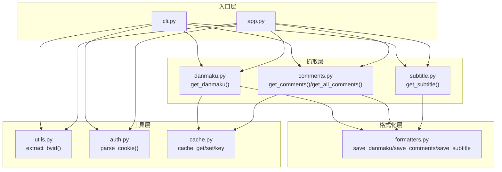
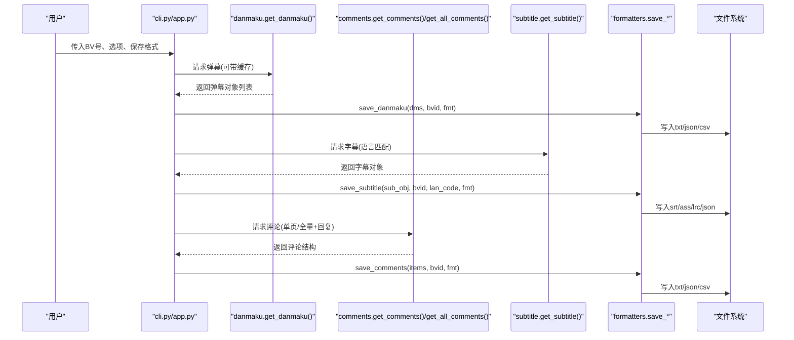
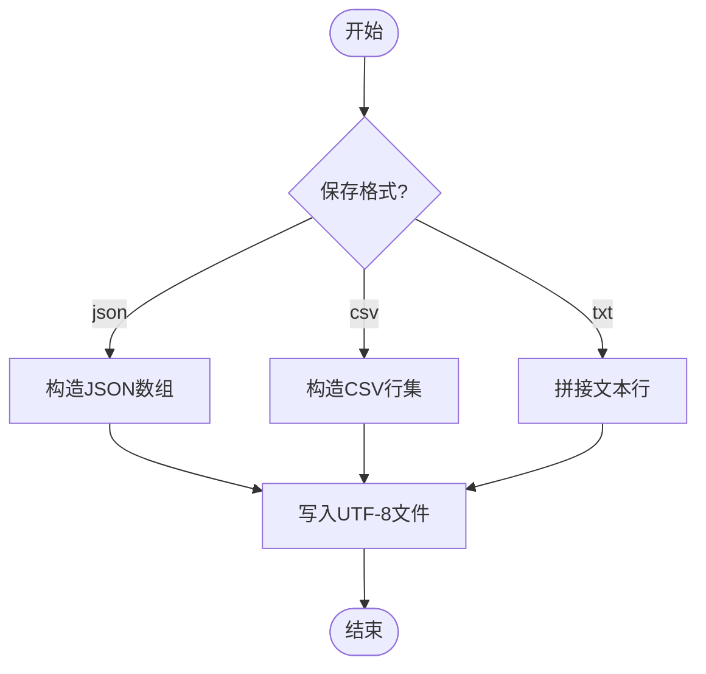
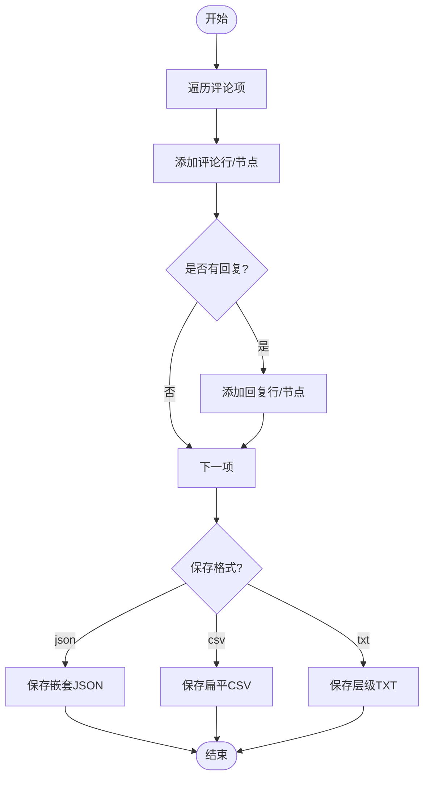
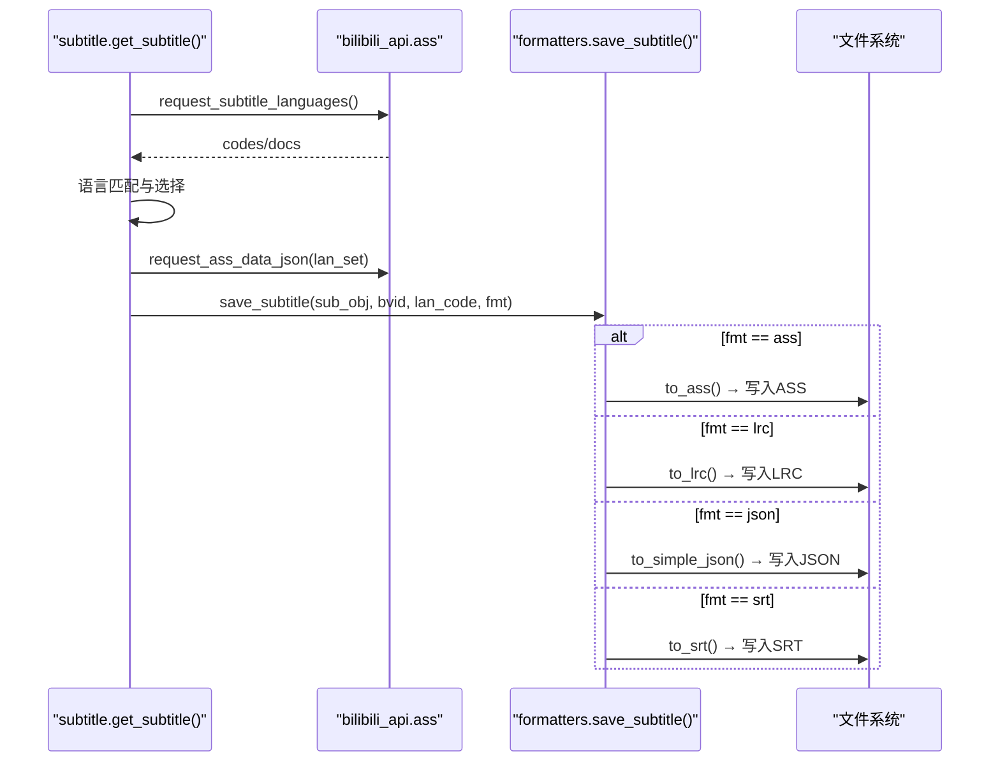
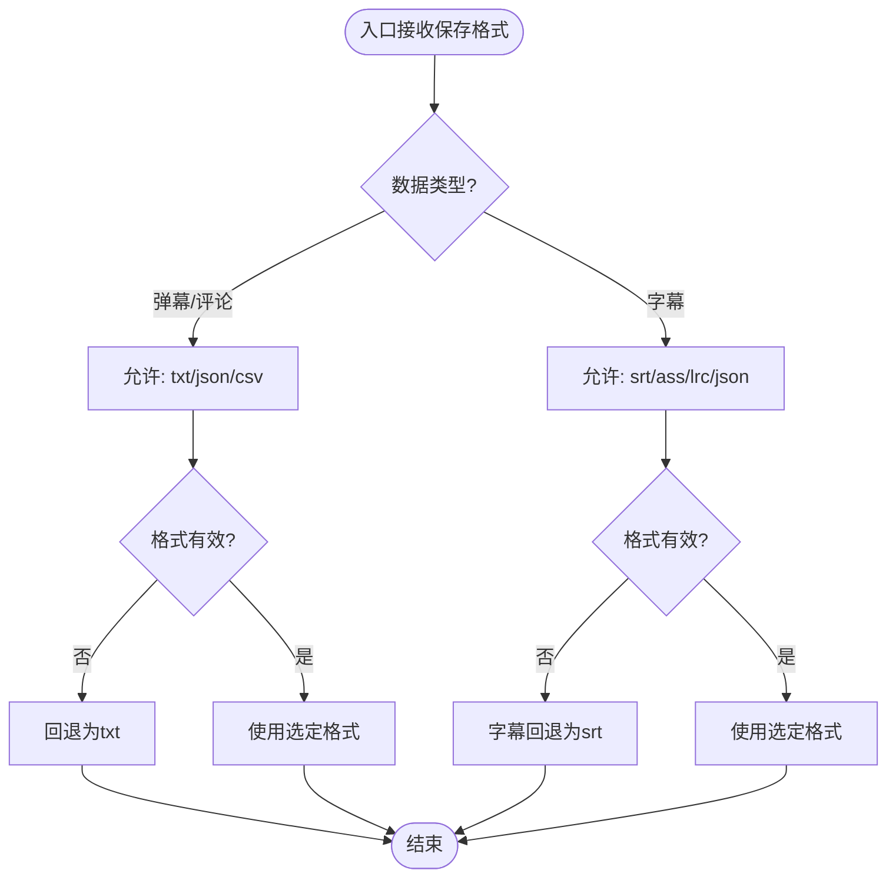
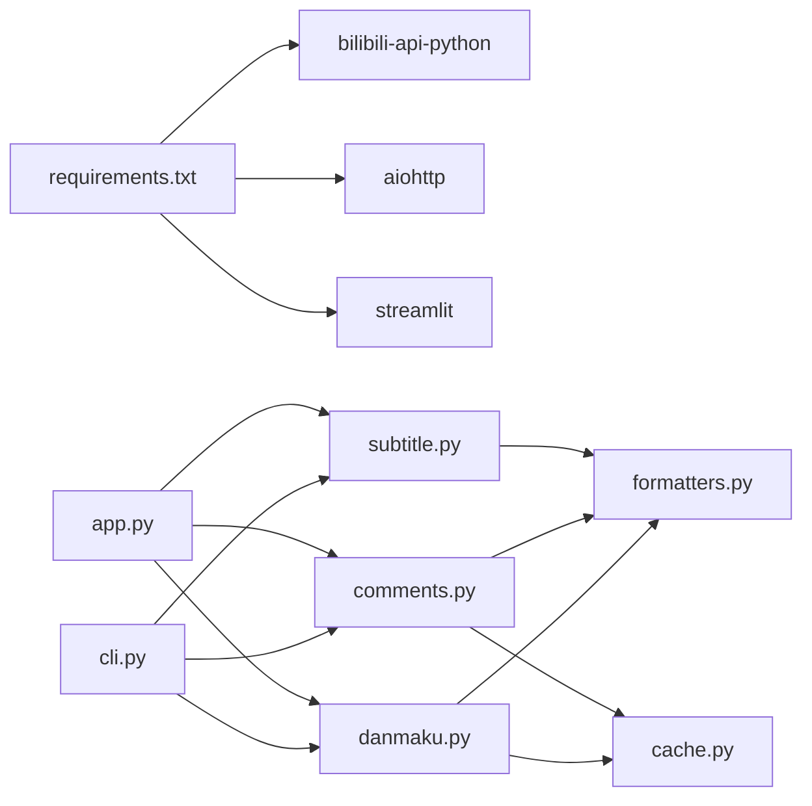

# 数据格式化系统

<cite>
**本文引用的文件**   
- [bilibili/formatters.py](file://bilibili/formatters.py)
- [bilibili/danmaku.py](file://bilibili/danmaku.py)
- [bilibili/comments.py](file://bilibili/comments.py)
- [bilibili/subtitle.py](file://bilibili/subtitle.py)
- [bilibili/utils.py](file://bilibili/utils.py)
- [bilibili/cache.py](file://bilibili/cache.py)
- [bilibili/auth.py](file://bilibili/auth.py)
- [app.py](file://app.py)
- [cli.py](file://cli.py)
- [requirements.txt](file://requirements.txt)
</cite>

## 目录
1. [简介](#简介)
2. [项目结构](#项目结构)
3. [核心组件](#核心组件)
4. [架构总览](#架构总览)
5. [详细组件分析](#详细组件分析)
6. [依赖关系分析](#依赖关系分析)
7. [性能与内存管理](#性能与内存管理)
8. [故障排查指南](#故障排查指南)
9. [结论](#结论)
10. [附录：扩展自定义格式](#附录：扩展自定义格式)

## 简介
本文件系统围绕“统一的数据格式化架构”构建，面向B站弹幕、评论、字幕三类数据，提供一致的输入/输出接口与多格式导出能力。系统支持以下输出格式：
- txt：纯文本，适合快速预览与人工阅读
- json：结构化数据，适合程序处理与分析
- csv：表格数据，适合导入Excel或数据分析工具
- srt：标准字幕格式，通用性强
- ass：高级字幕格式，支持样式与排版
- lrc：歌词格式，适用于音频时间轴对齐场景

本说明将深入阐述各格式的生成逻辑、数据映射规则、编码与命名规范、格式选择器策略、扩展开发接口与最佳实践，并给出可视化流程图与时序图帮助理解。

## 项目结构
本项目采用分层组织方式：
- 入口层：CLI（命令行）与 Streamlit Web 应用
- 抓取层：弹幕、评论、字幕的异步抓取与缓存
- 格式化层：统一的保存与转换逻辑
- 工具层：BV号解析、Cookie解析、缓存等

图表来源
- [cli.py:1-118](file://cli.py#L1-L118)
- [app.py:1-281](file://app.py#L1-L281)
- [bilibili/danmaku.py:1-64](file://bilibili/danmaku.py#L1-L64)
- [bilibili/comments.py:1-171](file://bilibili/comments.py#L1-L171)
- [bilibili/subtitle.py:1-77](file://bilibili/subtitle.py#L1-L77)
- [bilibili/formatters.py:1-166](file://bilibili/formatters.py#L1-L166)
- [bilibili/utils.py:1-28](file://bilibili/utils.py#L1-L28)
- [bilibili/auth.py:1-38](file://bilibili/auth.py#L1-L38)
- [bilibili/cache.py:1-42](file://bilibili/cache.py#L1-L42)

章节来源
- [cli.py:1-118](file://cli.py#L1-L118)
- [app.py:1-281](file://app.py#L1-L281)
- [bilibili/__init__.py:1-19](file://bilibili/__init__.py#L1-L19)

## 核心组件
- 弹幕抓取与保存：从视频对象获取弹幕列表，按格式写入文件
- 评论抓取与保存：单页或全量翻页，可选楼中楼回复，按格式写入
- 字幕抓取与保存：自动语言匹配，支持srt/ass/lrc/json
- 统一格式化器：集中实现txt/json/csv/srt/ass/lrc的生成逻辑
- 格式选择器：根据数据类型与用户选择决定最终输出格式
- 工具与缓存：BV号提取、Cookie解析、基于文件的JSON缓存

章节来源
- [bilibili/danmaku.py:1-64](file://bilibili/danmaku.py#L1-L64)
- [bilibili/comments.py:1-171](file://bilibili/comments.py#L1-L171)
- [bilibili/subtitle.py:1-77](file://bilibili/subtitle.py#L1-L77)
- [bilibili/formatters.py:1-166](file://bilibili/formatters.py#L1-L166)
- [bilibili/utils.py:1-28](file://bilibili/utils.py#L1-L28)
- [bilibili/auth.py:1-38](file://bilibili/auth.py#L1-L38)
- [bilibili/cache.py:1-42](file://bilibili/cache.py#L1-L42)

## 架构总览
统一格式化架构的关键在于“抓取层只负责数据获取与缓存”，“格式化层只负责数据到目标格式的转换与落盘”。入口层通过参数控制是否启用保存以及保存格式。

图表来源
- [cli.py:63-118](file://cli.py#L63-L118)
- [app.py:76-142](file://app.py#L76-L142)
- [bilibili/danmaku.py:13-64](file://bilibili/danmaku.py#L13-L64)
- [bilibili/comments.py:42-171](file://bilibili/comments.py#L42-L171)
- [bilibili/subtitle.py:21-77](file://bilibili/subtitle.py#L21-L77)
- [bilibili/formatters.py:50-166](file://bilibili/formatters.py#L50-L166)

## 详细组件分析

### 弹幕格式化与保存
- 输入：弹幕对象列表（包含时间、文本、显示模式、字号、颜色、用户ID等）
- 输出格式：
  - txt：每行一条，形如“[时间s] 文本”
  - json：数组，每项包含time_s、text、mode、font_size、color、uid
  - csv：表头同上，逐行写入
- 编码：UTF-8；csv使用utf-8-sig以兼容Excel
- 命名：danmaku_{bvid}.{fmt}

图表来源
- [bilibili/formatters.py:101-142](file://bilibili/formatters.py#L101-L142)

章节来源
- [bilibili/danmaku.py:13-64](file://bilibili/danmaku.py#L13-L64)
- [bilibili/formatters.py:101-142](file://bilibili/formatters.py#L101-L142)

### 评论格式化与保存
- 输入：评论项列表，每项包含comment与replies（可选）
- 数据映射：
  - 评论字段：like、uname、time、text、reply_count、rpid
  - 回复字段：like、uname、time、text、reply_to、rpid
  - CSV额外字段：level（comment/reply）、reply_to（评论为空）
- 输出格式：
  - txt：层级缩进展示，便于阅读
  - json：嵌套结构，保留replies
  - csv：扁平化，level区分主评与回复
- 编码：UTF-8；csv使用utf-8-sig
- 命名：comments_{bvid}.{fmt}

图表来源
- [bilibili/formatters.py:21-97](file://bilibili/formatters.py#L21-L97)

章节来源
- [bilibili/comments.py:42-171](file://bilibili/comments.py#L42-L171)
- [bilibili/formatters.py:21-97](file://bilibili/formatters.py#L21-L97)

### 字幕格式化与保存
- 输入：字幕对象（来自bilibili_api.ass），支持多种语言
- 语言选择策略：
  - 优先匹配用户指定代码
  - 若未匹配则尝试关键词模糊匹配
  - 否则默认选择中文相关语言
- 输出格式：
  - srt：标准字幕序列
  - ass：ASS脚本（含样式）
  - lrc：歌词式时间轴
  - json：简化JSON结构
- 编码：UTF-8
- 命名：subtitle_{bvid}_{lan_code}.{fmt}

图表来源
- [bilibili/subtitle.py:21-77](file://bilibili/subtitle.py#L21-L77)
- [bilibili/formatters.py:146-166](file://bilibili/formatters.py#L146-L166)

章节来源
- [bilibili/subtitle.py:1-77](file://bilibili/subtitle.py#L1-L77)
- [bilibili/formatters.py:146-166](file://bilibili/formatters.py#L146-L166)

### 格式选择器与入口集成
- CLI：通过--save选择保存格式，字幕默认srt
- Streamlit：下拉框选择保存格式，字幕在UI层做格式映射（txt/csv→srt）
- 选择策略：
  - 弹幕/评论：txt/json/csv
  - 字幕：srt/ass/lrc/json
  - 当用户选择不支持的组合时，进行安全回退（例如字幕选择txt/csv时转为srt）

图表来源
- [cli.py:54-58](file://cli.py#L54-L58)
- [app.py:89-91](file://app.py#L89-L91)

章节来源
- [cli.py:1-118](file://cli.py#L1-L118)
- [app.py:1-281](file://app.py#L1-L281)

## 依赖关系分析
- 外部依赖：
  - bilibili-api-python：用于访问B站API（弹幕、评论、字幕）
  - aiohttp：异步HTTP客户端（由bilibili-api内部使用）
  - streamlit：Web界面（仅app.py使用）
- 模块耦合：
  - 抓取层依赖缓存与工具模块
  - 格式化层独立于抓取层，仅依赖Python标准库
  - 入口层聚合抓取与格式化，承担参数校验与格式选择

图表来源
- [requirements.txt:1-4](file://requirements.txt#L1-L4)
- [bilibili/danmaku.py:1-64](file://bilibili/danmaku.py#L1-L64)
- [bilibili/comments.py:1-171](file://bilibili/comments.py#L1-L171)
- [bilibili/subtitle.py:1-77](file://bilibili/subtitle.py#L1-L77)
- [bilibili/formatters.py:1-166](file://bilibili/formatters.py#L1-L166)
- [bilibili/cache.py:1-42](file://bilibili/cache.py#L1-L42)
- [cli.py:1-118](file://cli.py#L1-L118)
- [app.py:1-281](file://app.py#L1-L281)

章节来源
- [requirements.txt:1-4](file://requirements.txt#L1-L4)

## 性能与内存管理
- 缓存策略：
  - 基于文件的JSON缓存，键为MD5哈希，包含时间与最大有效期
  - 命中后直接返回payload，避免重复网络请求
- 流式写入：
  - 弹幕/评论/字幕均按行或块写入，避免一次性加载大对象到内存
- 安全上限：
  - 评论全量翻页设置累计条数上限，防止无限增长
- I/O优化：
  - csv使用utf-8-sig提升兼容性
  - JSON使用ensure_ascii=False保留中文，indent=2便于调试
- 建议：
  - 对超大弹幕/评论数据集，考虑分片写入与增量更新
  - 字幕JSON简化结构可减少体积
  - 合理设置max_age，平衡时效性与缓存命中率

章节来源
- [bilibili/cache.py:1-42](file://bilibili/cache.py#L1-L42)
- [bilibili/comments.py:150-171](file://bilibili/comments.py#L150-L171)
- [bilibili/formatters.py:64-97](file://bilibili/formatters.py#L64-L97)
- [bilibili/formatters.py:101-142](file://bilibili/formatters.py#L101-L142)
- [bilibili/formatters.py:146-166](file://bilibili/formatters.py#L146-L166)

## 故障排查指南
- BV号解析失败：
  - 检查输入是否为合法BV号或完整链接
  - 参考工具函数抛出异常的位置
- Cookie无效：
  - 确认SESSDATA存在且有效
  - 登录凭证缺失可能导致受限资源无法访问
- 字幕无可用语言：
  - 某些视频可能没有字幕，需提示用户
- 缓存过期：
  - max_age设置为0会禁用缓存，导致每次重新拉取
- 文件格式不兼容：
  - Excel打开CSV乱码：确保使用utf-8-sig
  - 播放器不支持ASS/LRC：转换为SRT

章节来源
- [bilibili/utils.py:8-28](file://bilibili/utils.py#L8-L28)
- [bilibili/auth.py:8-38](file://bilibili/auth.py#L8-L38)
- [bilibili/subtitle.py:47-50](file://bilibili/subtitle.py#L47-L50)
- [bilibili/cache.py:19-28](file://bilibili/cache.py#L19-L28)

## 结论
本系统通过清晰的职责划分与统一的格式化接口，实现了弹幕、评论、字幕的多格式导出。其优势包括：
- 可扩展的格式体系（txt/json/csv/srt/ass/lrc）
- 稳定的语言选择与回退机制
- 高效的缓存与I/O策略
- 友好的CLI与Web入口

建议在后续迭代中增加：
- 更细粒度的字段映射配置
- 批量任务与进度回调
- 更丰富的错误诊断与日志记录

## 附录：扩展自定义格式
- 扩展点：
  - 在formatters.py新增保存函数（如save_custom）
  - 在入口层（cli.py/app.py）增加格式选择与映射
- 最佳实践：
  - 保持编码一致（UTF-8）
  - 明确命名规范（{type}_{bvid}[_{lang}].{ext}）
  - 提供最小必要字段，避免冗余
  - 对于大数据集，采用流式写入与分块处理
- 示例路径（不含具体代码内容）：
  - 弹幕保存：[bilibili/formatters.py:101-142](file://bilibili/formatters.py#L101-L142)
  - 评论保存：[bilibili/formatters.py:50-97](file://bilibili/formatters.py#L50-L97)
  - 字幕保存：[bilibili/formatters.py:146-166](file://bilibili/formatters.py#L146-L166)
  - CLI选择：[cli.py:54-58](file://cli.py#L54-L58)
  - App选择：[app.py:89-91](file://app.py#L89-L91)