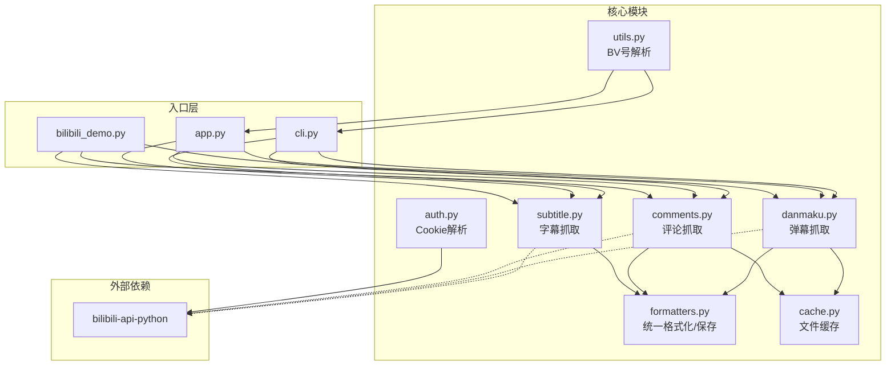
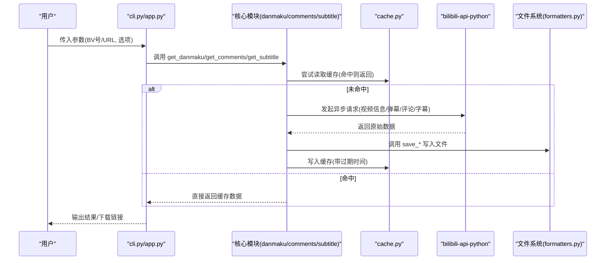
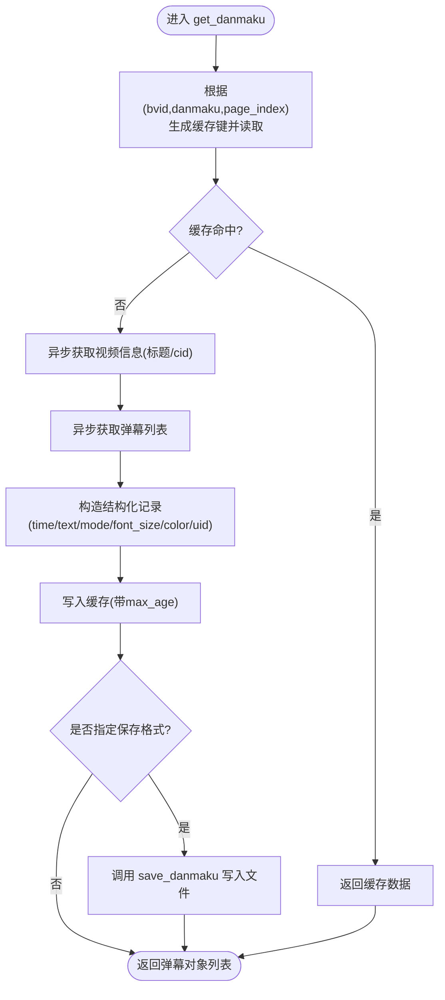
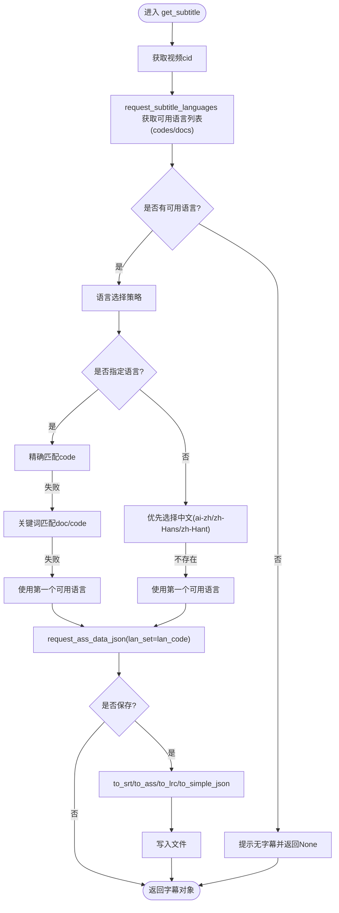
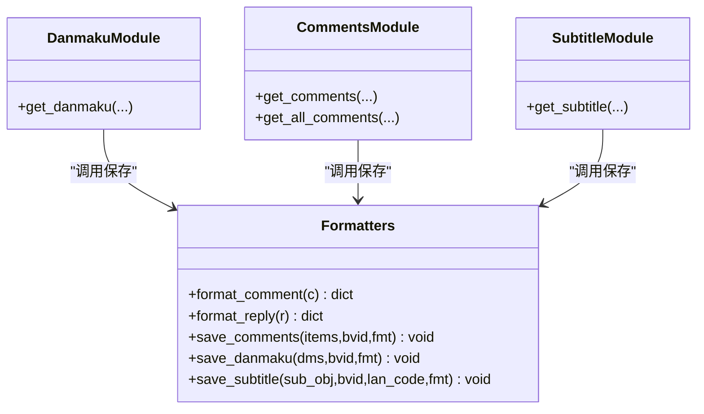
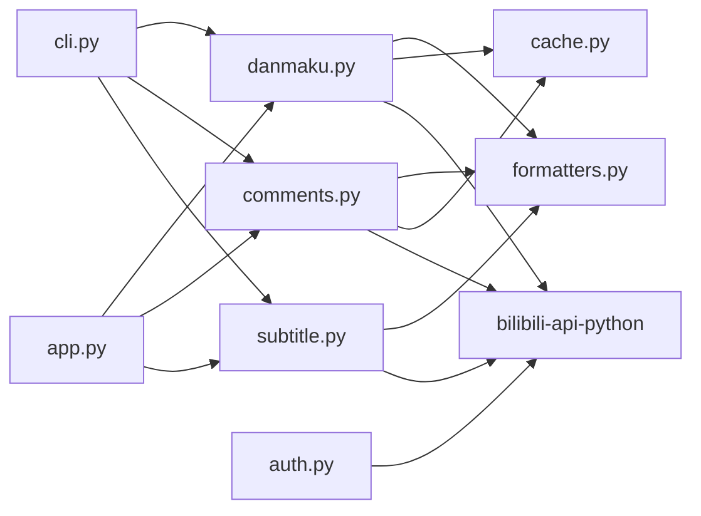

# 核心功能

<cite>
**本文引用的文件**   
- [bilibili/danmaku.py](file://bilibili/danmaku.py)
- [bilibili/comments.py](file://bilibili/comments.py)
- [bilibili/subtitle.py](file://bilibili/subtitle.py)
- [bilibili/formatters.py](file://bilibili/formatters.py)
- [bilibili/cache.py](file://bilibili/cache.py)
- [bilibili/auth.py](file://bilibili/auth.py)
- [bilibili/utils.py](file://bilibili/utils.py)
- [bilibili/__init__.py](file://bilibili/__init__.py)
- [app.py](file://app.py)
- [cli.py](file://cli.py)
- [bilibili_demo.py](file://bilibili_demo.py)
</cite>

## 目录
1. [简介](#简介)
2. [项目结构](#项目结构)
3. [核心组件](#核心组件)
4. [架构总览](#架构总览)
5. [详细组件分析](#详细组件分析)
6. [依赖关系分析](#依赖关系分析)
7. [性能与并发特性](#性能与并发特性)
8. [故障排查指南](#故障排查指南)
9. [结论](#结论)
10. [附录：使用示例与调用方式](#附录使用示例与调用方式)

## 简介
本工具面向B站视频的多模态数据抓取，提供弹幕、评论（含楼中楼回复）、字幕三大核心能力，并内置统一的数据格式化与多格式输出系统。模块采用异步请求处理、基于文件的缓存机制、智能语言匹配与多格式转换，支持命令行与Web界面两种交互方式，便于快速集成与批量处理。

## 项目结构
仓库采用“按功能分模块”的组织方式，核心逻辑集中在 bilibili 包内，入口层提供 CLI 与 Streamlit Web 应用。



图表来源
- [cli.py:1-118](file://cli.py#L1-L118)
- [app.py:1-281](file://app.py#L1-L281)
- [bilibili_demo.py:1-452](file://bilibili_demo.py#L1-L452)
- [bilibili/danmaku.py:1-64](file://bilibili/danmaku.py#L1-L64)
- [bilibili/comments.py:1-171](file://bilibili/comments.py#L1-L171)
- [bilibili/subtitle.py:1-77](file://bilibili/subtitle.py#L1-L77)
- [bilibili/formatters.py:1-166](file://bilibili/formatters.py#L1-L166)
- [bilibili/cache.py:1-42](file://bilibili/cache.py#L1-L42)
- [bilibili/auth.py:1-38](file://bilibili/auth.py#L1-L38)
- [bilibili/utils.py:1-28](file://bilibili/utils.py#L1-L28)

章节来源
- [cli.py:1-118](file://cli.py#L1-L118)
- [app.py:1-281](file://app.py#L1-L281)
- [bilibili_demo.py:1-452](file://bilibili_demo.py#L1-L452)

## 核心组件
- 弹幕抓取：异步获取视频弹幕，解析时间戳与元信息，支持缓存与多格式保存。
- 评论抓取：单页评论获取、全量翻页、楼中楼回复拉取，具备安全上限与空页检测。
- 字幕抓取：多语言支持、智能语言匹配、ASS/SRT/LRC/JSON 等格式转换。
- 统一格式化：评论/弹幕/字幕的统一保存接口，支持 txt/json/csv/srt/ass/lrc。
- 认证与工具：Cookie 解析为凭证对象；BV号从多种输入中提取。
- 缓存：基于文件的 JSON 缓存，支持过期策略与键生成。

章节来源
- [bilibili/danmaku.py:1-64](file://bilibili/danmaku.py#L1-L64)
- [bilibili/comments.py:1-171](file://bilibili/comments.py#L1-L171)
- [bilibili/subtitle.py:1-77](file://bilibili/subtitle.py#L1-L77)
- [bilibili/formatters.py:1-166](file://bilibili/formatters.py#L1-L166)
- [bilibili/auth.py:1-38](file://bilibili/auth.py#L1-L38)
- [bilibili/utils.py:1-28](file://bilibili/utils.py#L1-L28)
- [bilibili/cache.py:1-42](file://bilibili/cache.py#L1-L42)

## 架构总览
整体流程由入口层（CLI/Web）驱动，调用核心模块完成数据抓取与格式化，底层通过 bilibili-api-python 访问 B站服务，并使用本地文件缓存减少重复请求。



图表来源
- [cli.py:63-118](file://cli.py#L63-L118)
- [app.py:76-142](file://app.py#L76-L142)
- [bilibili/danmaku.py:13-64](file://bilibili/danmaku.py#L13-L64)
- [bilibili/comments.py:42-171](file://bilibili/comments.py#L42-L171)
- [bilibili/subtitle.py:21-77](file://bilibili/subtitle.py#L21-L77)
- [bilibili/cache.py:14-42](file://bilibili/cache.py#L14-L42)
- [bilibili/formatters.py:50-166](file://bilibili/formatters.py#L50-L166)

## 详细组件分析

### 弹幕抓取
- 异步请求处理：通过 bilibili-api 的 Video 对象异步获取视频信息与弹幕列表，避免阻塞。
- 数据结构解析：将每条弹幕转换为包含时间、文本、模式、字号、颜色、用户ID的结构化字典，便于后续保存与分析。
- 时间戳映射：dm_time 字段以秒为单位浮点数表示，保存时保留一位小数，确保在播放器或脚本中可被正确解析。
- 缓存策略：以 BV号+类型+分P索引生成MD5键，命中后直接返回，降低网络开销。
- 多格式保存：txt/json/csv，分别用于人类阅读、结构化分析与表格处理。



图表来源
- [bilibili/danmaku.py:13-64](file://bilibili/danmaku.py#L13-L64)
- [bilibili/formatters.py:101-142](file://bilibili/formatters.py#L101-L142)
- [bilibili/cache.py:14-42](file://bilibili/cache.py#L14-L42)

章节来源
- [bilibili/danmaku.py:13-64](file://bilibili/danmaku.py#L13-L64)
- [bilibili/formatters.py:101-142](file://bilibili/formatters.py#L101-L142)

### 评论抓取
- 单页评论获取：按点赞排序分页拉取，返回当前页评论与总数估计。
- 全量翻页机制：循环递增页码，结合空页连续计数、已知总数与安全上限进行终止判断，防止无限爬取。
- 楼中楼回复：对每条评论若存在回复数，则单独拉取第一页最多20条回复，并在拉取间加入延时以避免触发限流。
- 缓存策略：针对“页码+是否含回复”的组合生成缓存键，命中后直接返回。
- 统一保存：支持 txt/json/csv，其中 csv 增加 level 字段区分主评与回复。

```mermaid
sequenceDiagram
participant C as "get_all_comments"
participant V as "Video.get_info"
participant P as "_fetch_one_page"
participant R as "_fetch_replies"
participant F as "save_comments"
C->>V : 获取aid/title
loop 逐页
C->>P : 拉取第page页评论
P-->>C : replies,total
alt 需要回复
for each c in replies
C->>R : 拉取rpid的回复(第1页,<=20)
R-->>C : replies[]
C->>C : 延时0.3s
end
end
C->>C : 累计all_items
C->>C : 检查停止条件(目标页数/空页/总数/安全上限)
end
C->>F : 保存全部评论(可选)
C-->>C : 返回all_items
```

图表来源
- [bilibili/comments.py:92-171](file://bilibili/comments.py#L92-L171)
- [bilibili/comments.py:13-40](file://bilibili/comments.py#L13-L40)
- [bilibili/formatters.py:50-97](file://bilibili/formatters.py#L50-L97)

章节来源
- [bilibili/comments.py:13-40](file://bilibili/comments.py#L13-L40)
- [bilibili/comments.py:42-171](file://bilibili/comments.py#L42-L171)
- [bilibili/formatters.py:50-97](file://bilibili/formatters.py#L50-L97)

### 字幕抓取
- 多语言支持：自动列出可用语言代码与文档说明，支持中文AI、简繁中文、英语、日语、韩语等。
- 智能语言匹配算法：
  - 若用户提供语言代码，优先精确匹配 code；否则回退到关键词匹配（code或doc中包含用户输入）。
  - 若未指定语言，默认优先选择中文相关语言（ai-zh、zh-Hans、zh-Hant），再回退到首个可用语言。
- 格式转换能力：支持 srt/ass/lrc/json 四种格式输出，内部调用 bilibili-api 提供的 to_srt/to_ass/to_lrc/to_simple_json 方法。
- 文件命名：按“subtitle_{bvid}_{lan_code}.{fmt}”规则输出，便于识别语言与内容。



图表来源
- [bilibili/subtitle.py:21-77](file://bilibili/subtitle.py#L21-L77)
- [bilibili/formatters.py:146-166](file://bilibili/formatters.py#L146-L166)

章节来源
- [bilibili/subtitle.py:21-77](file://bilibili/subtitle.py#L21-L77)
- [bilibili/formatters.py:146-166](file://bilibili/formatters.py#L146-L166)

### 统一数据格式化系统
- 评论格式化：
  - format_comment：提取点赞数、用户名、时间、正文、回复数、rpid。
  - format_reply：提取回复的点赞数、用户名、时间、正文、父级用户名、rpid。
  - save_comments：按 txt/json/csv 三种格式输出，csv 增加 level 字段区分主评与回复。
- 弹幕格式化：
  - save_danmaku：按 txt/json/csv 输出，时间字段 time_s 保留一位小数。
- 字幕格式化：
  - save_subtitle：按 srt/ass/lrc/json 输出，json 使用 to_simple_json 简化结构。



图表来源
- [bilibili/formatters.py:21-166](file://bilibili/formatters.py#L21-L166)
- [bilibili/danmaku.py:13-64](file://bilibili/danmaku.py#L13-L64)
- [bilibili/comments.py:42-171](file://bilibili/comments.py#L42-L171)
- [bilibili/subtitle.py:21-77](file://bilibili/subtitle.py#L21-L77)

章节来源
- [bilibili/formatters.py:21-166](file://bilibili/formatters.py#L21-L166)

### 认证与工具
- Cookie 解析：parse_cookie 将 SESSDATA 等字段解析为 Credential 对象，供 bilibili-api 使用。
- BV号提取：extract_bvid 支持纯BV号、完整链接、短链接等多种输入格式，无法解析时抛出异常。

章节来源
- [bilibili/auth.py:8-38](file://bilibili/auth.py#L8-L38)
- [bilibili/utils.py:8-28](file://bilibili/utils.py#L8-L28)

### 缓存机制
- 键生成：cache_key 使用 MD5 哈希 bvid:类型:页码，保证唯一性。
- 读写策略：cache_get 读取并校验过期时间，过期则删除并返回 None；cache_set 写入 payload 与时间戳。
- 使用场景：弹幕与评论均利用缓存减少重复请求，提升效率。

章节来源
- [bilibili/cache.py:14-42](file://bilibili/cache.py#L14-L42)
- [bilibili/danmaku.py:30-34](file://bilibili/danmaku.py#L30-L34)
- [bilibili/comments.py:61-66](file://bilibili/comments.py#L61-L66)

## 依赖关系分析
- 入口层依赖核心模块：
  - cli.py 与 app.py 均导入 danmaku/comments/subtitle 的公开函数，并负责参数解析与流程编排。
- 核心模块依赖：
  - danmaku/comments/subtitle 依赖 bilibili-api-python 进行网络请求。
  - 所有模块均可调用 formatters 进行统一保存。
  - danmaku/comments 使用 cache 进行缓存。
  - auth 提供凭证解析，utils 提供BV号提取。



图表来源
- [cli.py:18-25](file://cli.py#L18-L25)
- [app.py:13-14](file://app.py#L13-L14)
- [bilibili/danmaku.py:7-11](file://bilibili/danmaku.py#L7-L11)
- [bilibili/comments.py:7-11](file://bilibili/comments.py#L7-L11)
- [bilibili/subtitle.py:5-9](file://bilibili/subtitle.py#L5-L9)

章节来源
- [cli.py:18-25](file://cli.py#L18-L25)
- [app.py:13-14](file://app.py#L13-L14)
- [bilibili/danmaku.py:7-11](file://bilibili/danmaku.py#L7-L11)
- [bilibili/comments.py:7-11](file://bilibili/comments.py#L7-L11)
- [bilibili/subtitle.py:5-9](file://bilibili/subtitle.py#L5-L9)

## 性能与并发特性
- 异步请求：弹幕与评论模块均采用 async/await 与 bilibili-api 的异步接口，提高吞吐与响应速度。
- 限速控制：评论拉取回复时加入 asyncio.sleep(0.3)，翻页间隔 asyncio.sleep(0.5)，避免触发平台限流。
- 安全上限：全量评论设置累计条目上限（如超过10000条停止），防止内存与IO压力过大。
- 缓存命中：弹幕与评论均支持缓存，命中后直接返回，显著减少网络请求与CPU消耗。

[本节为通用性能讨论，不直接分析具体文件]

## 故障排查指南
- BV号解析失败：
  - 现象：抛出“无法解析BV号”异常。
  - 排查：确认输入是否为有效BV号或包含 bilibili.com/video/ 或 b23.tv 的链接。
- 登录凭证缺失：
  - 现象：部分受保护资源无法访问。
  - 排查：传入包含 SESSDATA 的 Cookie，确保 parse_cookie 成功返回 Credential。
- 字幕不可用：
  - 现象：提示“该视频没有字幕”。
  - 排查：确认视频是否存在字幕，或尝试其他语言代码。
- 评论为空或提前停止：
  - 现象：连续空页或达到安全上限。
  - 排查：检查 max_pages 与 total 返回值，必要时调整安全上限或分页策略。
- 缓存未生效：
  - 现象：重复请求导致耗时较长。
  - 排查：确认 max_age > 0，且缓存目录存在并可写。

章节来源
- [bilibili/utils.py:8-28](file://bilibili/utils.py#L8-L28)
- [bilibili/auth.py:8-38](file://bilibili/auth.py#L8-L38)
- [bilibili/subtitle.py:47-49](file://bilibili/subtitle.py#L47-L49)
- [bilibili/comments.py:148-156](file://bilibili/comments.py#L148-L156)
- [bilibili/cache.py:19-28](file://bilibili/cache.py#L19-L28)

## 结论
本工具通过模块化设计与统一的格式化保存系统，实现了弹幕、评论、字幕的高效抓取与灵活输出。异步请求与缓存机制提升了性能，智能语言匹配增强了字幕抓取的可用性。配合 CLI 与 Web 界面，用户可快速完成从参数配置到结果下载的完整流程。

[本节为总结性内容，不直接分析具体文件]

## 附录：使用示例与调用方式

- 命令行用法（CLI）
  - 基本抓取（弹幕+评论+字幕）：python cli.py BV1cmofByENF
  - 仅弹幕并保存为 json：python cli.py BV1cmofByENF -d --save json
  - 仅评论并开启楼中楼回复：python cli.py BV1cmofByENF -c --replies
  - 全量翻页评论（目标N页）：python cli.py BV1cmofByENF -c --all --max-pages N
  - 指定字幕语言并保存为 srt：python cli.py BV1cmofByENF -s --sub-lan en --save srt
  - 使用 Cookie 登录：python cli.py BV1cmofByENF -dc --cookie "SESSDATA=xxx;..."

- Web界面用法（Streamlit）
  - 运行：streamlit run app.py
  - 在侧边栏填写 BV号/URL、勾选所需功能、选择保存格式与字幕语言，点击“开始爬取”即可。

- 程序化调用（Python）
  - 弹幕：from bilibili import get_danmaku; await get_danmaku("BVxxxx", save_fmt="json")
  - 评论（单页）：from bilibili import get_comments; await get_comments("BVxxxx", with_replies=True)
  - 评论（全量）：from bilibili import get_all_comments; await get_all_comments("BVxxxx", max_pages=5)
  - 字幕：from bilibili import get_subtitle; await get_subtitle("BVxxxx", lan_code="en", save_fmt="srt")

- 输出文件命名约定
  - 弹幕：danmaku_{bvid}.txt/json/csv
  - 评论：comments_{bvid}.txt/json/csv
  - 字幕：subtitle_{bvid}_{lan_code}.srt/ass/lrc/json

章节来源
- [cli.py:29-60](file://cli.py#L29-L60)
- [cli.py:63-118](file://cli.py#L63-L118)
- [app.py:18-43](file://app.py#L18-L43)
- [app.py:76-142](file://app.py#L76-L142)
- [bilibili/__init__.py:5-18](file://bilibili/__init__.py#L5-L18)
- [bilibili/formatters.py:50-166](file://bilibili/formatters.py#L50-L166)