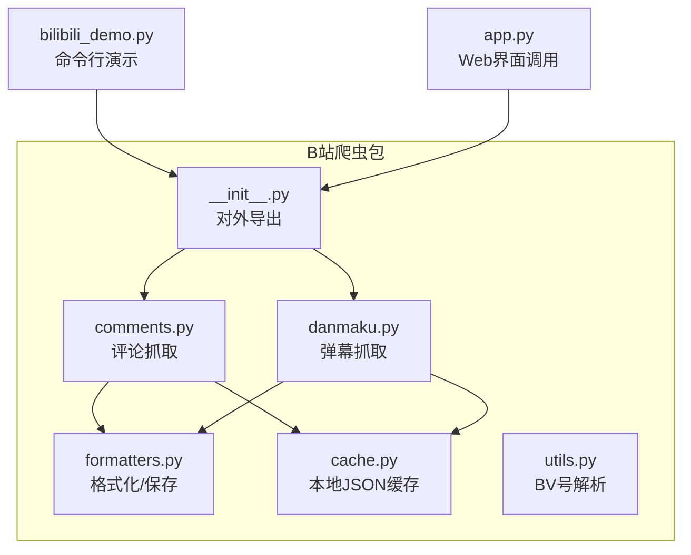
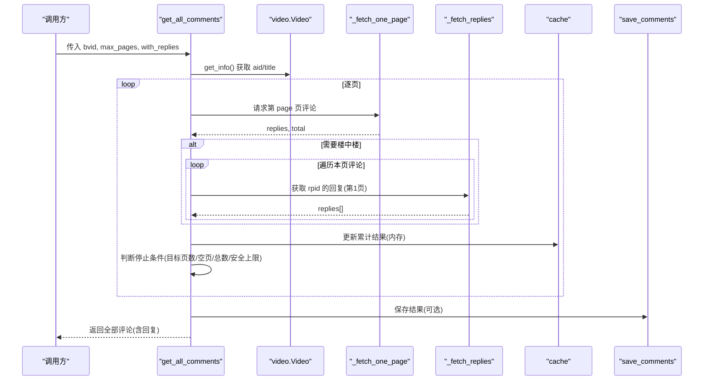
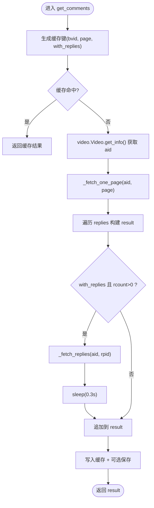
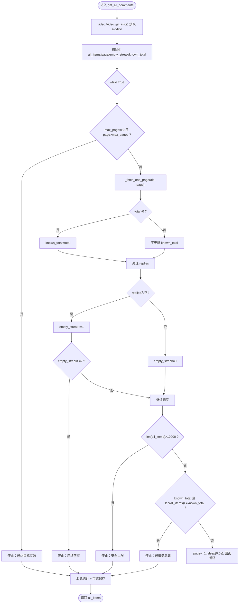
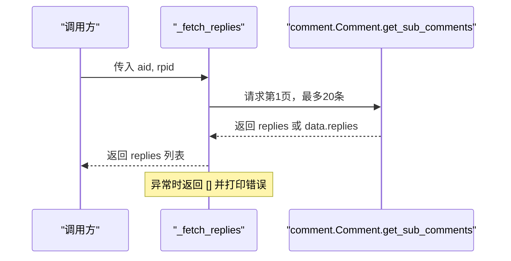
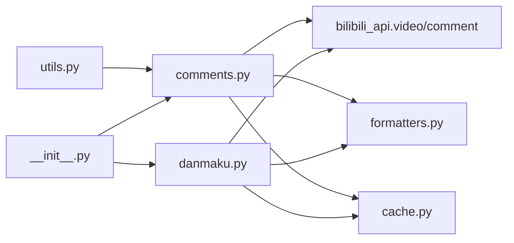

# 评论抓取功能

<cite>
**本文引用的文件**
- [bilibili/comments.py](file://bilibili/comments.py)
- [bilibili/formatters.py](file://bilibili/formatters.py)
- [bilibili/cache.py](file://bilibili/cache.py)
- [bilibili/danmaku.py](file://bilibili/danmaku.py)
- [bilibili/utils.py](file://bilibili/utils.py)
- [bilibili/__init__.py](file://bilibili/__init__.py)
- [bilibili_demo.py](file://bilibili_demo.py)
- [app.py](file://app.py)
</cite>

## 目录
1. [简介](#简介)
2. [项目结构](#项目结构)
3. [核心组件](#核心组件)
4. [架构总览](#架构总览)
5. [详细组件分析](#详细组件分析)
6. [依赖关系分析](#依赖关系分析)
7. [性能与稳定性](#性能与稳定性)
8. [故障排查指南](#故障排查指南)
9. [结论](#结论)
10. [附录：使用示例与最佳实践](#附录使用示例与最佳实践)

## 简介
本章节面向评论抓取功能的整体说明，涵盖单页获取、全量翻页、楼中楼回复处理、数据结构字段、分页参数与安全上限、缓存与保存、以及与弹幕抓取的协作关系和数据一致性保证。

## 项目结构
评论抓取相关代码主要位于 bilibili 包内，围绕 comments.py 实现核心逻辑，formatters.py 负责数据格式化与持久化，cache.py 提供基于文件的 JSON 缓存，danmaku.py 为弹幕模块（用于对比与协作），utils.py 提供 BV 号解析工具，__init__.py 暴露对外接口。

图表来源
- [bilibili/comments.py:1-171](file://bilibili/comments.py#L1-L171)
- [bilibili/formatters.py:1-166](file://bilibili/formatters.py#L1-L166)
- [bilibili/cache.py:1-42](file://bilibili/cache.py#L1-L42)
- [bilibili/danmaku.py:1-64](file://bilibili/danmaku.py#L1-L64)
- [bilibili/utils.py:1-28](file://bilibili/utils.py#L1-L28)
- [bilibili/__init__.py:1-19](file://bilibili/__init__.py#L1-L19)
- [bilibili_demo.py:1-452](file://bilibili_demo.py#L1-L452)
- [app.py:240-280](file://app.py#L240-L280)

章节来源
- [bilibili/__init__.py:1-19](file://bilibili/__init__.py#L1-L19)
- [bilibili/comments.py:1-171](file://bilibili/comments.py#L1-L171)
- [bilibili/formatters.py:1-166](file://bilibili/formatters.py#L1-L166)
- [bilibili/cache.py:1-42](file://bilibili/cache.py#L1-L42)
- [bilibili/danmaku.py:1-64](file://bilibili/danmaku.py#L1-L64)
- [bilibili/utils.py:1-28](file://bilibili/utils.py#L1-L28)
- [bilibili_demo.py:1-452](file://bilibili_demo.py#L1-L452)
- [app.py:240-280](file://app.py#L240-L280)

## 核心组件
- 评论抓取入口
  - get_comments：获取指定页的评论，支持是否拉取楼中楼回复、缓存命中、可选保存到文件。
  - get_all_comments：全量翻页获取评论，支持最大页数限制、安全上限、连续空页停止等策略。
- 内部辅助函数
  - _fetch_one_page：封装对 bilibili_api 的单页评论请求，返回 replies 列表与 total 计数。
  - _fetch_replies：获取某条评论的“楼中楼”回复（第1页，最多20条）。
- 数据格式化与保存
  - format_comment / format_reply：将原始 API 响应转为精简字段集合。
  - save_comments：按 txt/json/csv 三种格式输出到文件。
- 缓存机制
  - cache_key / cache_get / cache_set：基于 .bili_cache 目录的 JSON 文件缓存，带过期时间。
- 弹幕协作
  - danmaku.get_danmaku：与评论模块共享缓存与保存流程，便于统一数据管理。

章节来源
- [bilibili/comments.py:13-171](file://bilibili/comments.py#L13-L171)
- [bilibili/formatters.py:21-96](file://bilibili/formatters.py#L21-L96)
- [bilibili/cache.py:14-42](file://bilibili/cache.py#L14-L42)
- [bilibili/danmaku.py:13-64](file://bilibili/danmaku.py#L13-L64)

## 架构总览
评论抓取的整体流程如下：
- 入口函数根据参数选择单页或全量模式。
- 通过 video.Video.get_info 解析 aid。
- 调用 _fetch_one_page 获取当前页评论与总数。
- 若开启 with_replies，则遍历每条评论并调用 _fetch_replies 拉取楼中楼回复。
- 结果写入缓存，并可按格式保存到文件。
- 全量模式下循环翻页，直至达到目标页数、连续空页、累计数量超过已知总数或触发安全上限。

图表来源
- [bilibili/comments.py:92-171](file://bilibili/comments.py#L92-L171)
- [bilibili/comments.py:13-40](file://bilibili/comments.py#L13-L40)
- [bilibili/formatters.py:50-96](file://bilibili/formatters.py#L50-L96)
- [bilibili/cache.py:14-42](file://bilibili/cache.py#L14-L42)

## 详细组件分析

### 单页评论获取：get_comments
- 功能要点
  - 支持按页码 page 获取评论。
  - 支持 with_replies 开关，当评论存在回复时，会调用 _fetch_replies 获取该评论的“楼中楼”回复（仅第1页，最多20条）。
  - 使用缓存键包含 bvid、page、with_replies，避免重复请求。
  - 打印进度信息，可选择保存为 txt/json/csv。
- 关键流程
  - 构造缓存键 → 命中则直接返回。
  - 解析 aid → 调用 _fetch_one_page → 组装 result 列表。
  - 若开启回复拉取，遍历 replies，检查 rcount > 0 再调用 _fetch_replies，并加入 asyncio.sleep(0.3) 控制频率。
  - 写入缓存，可选保存。

图表来源
- [bilibili/comments.py:42-89](file://bilibili/comments.py#L42-L89)
- [bilibili/comments.py:13-40](file://bilibili/comments.py#L13-L40)
- [bilibili/cache.py:14-42](file://bilibili/cache.py#L14-L42)
- [bilibili/formatters.py:50-96](file://bilibili/formatters.py#L50-L96)

章节来源
- [bilibili/comments.py:42-89](file://bilibili/comments.py#L42-L89)

### 全量翻页获取：get_all_comments
- 功能要点
  - 自动从第1页开始循环翻页，直到满足任一停止条件：
    - 达到目标页数 max_pages（0表示不限）。
    - 连续两页无数据（empty_streak >= 2）。
    - 累计条目数大于等于服务端返回的 total。
    - 累计条目数超过安全上限（10000条）。
  - 支持 with_replies 拉取楼中楼回复（同样仅第1页，最多20条）。
  - 每次翻页后 sleep(0.5s) 控制频率。
- 关键流程
  - 解析 aid/title → 初始化 all_items、page、empty_streak、known_total。
  - 循环翻页：_fetch_one_page → 合并 replies 与回复 → 统计与日志 → 判断停止条件。
  - 完成后汇总评论与回复数量，可选保存。

图表来源
- [bilibili/comments.py:92-171](file://bilibili/comments.py#L92-L171)

章节来源
- [bilibili/comments.py:92-171](file://bilibili/comments.py#L92-L171)

### 楼中楼回复处理：_fetch_replies
- 行为说明
  - 针对某条评论的 rpid，调用 Comment.get_sub_comments(page_index=1, page_size=20)。
  - 兼容不同返回结构（data.replies 或 replies）。
  - 异常捕获并打印失败信息，返回空列表以保证主流程稳定。
- 层级结构
  - 顶层评论 entry.comment 与 entry.replies 构成两层结构。
  - 当前实现未递归获取更深层级（如回复的回复），如需更深嵌套可在 _fetch_replies 基础上扩展递归策略。

图表来源
- [bilibili/comments.py:27-40](file://bilibili/comments.py#L27-L40)

章节来源
- [bilibili/comments.py:27-40](file://bilibili/comments.py#L27-L40)

### 评论数据结构与字段说明
- 顶层评论字段（由 format_comment 定义）
  - like：点赞数
  - uname：用户名
  - time：发布时间（Unix 时间戳转可读字符串）
  - text：评论内容
  - reply_count：回复数（rcount）
  - rpid：评论ID
- 楼中楼回复字段（由 format_reply 定义）
  - like：点赞数
  - uname：用户名
  - time：发布时间（Unix 时间戳转可读字符串）
  - text：回复内容
  - reply_to：被回复的用户名（从 members 映射 parent 得到）
  - rpid：回复ID
- 保存格式
  - json：保留嵌套 replies 结构。
  - csv：扁平化，level 区分 comment/reply，reply_to 指向父用户。
  - txt：人类可读文本，缩进表示层级。

章节来源
- [bilibili/formatters.py:21-45](file://bilibili/formatters.py#L21-L45)
- [bilibili/formatters.py:50-96](file://bilibili/formatters.py#L50-L96)

### 分页参数配置与最大页数限制
- 单页获取
  - get_comments 的 page 参数指定页码。
- 全量获取
  - get_all_comments 的 max_pages 参数控制目标页数；0 表示不限。
  - 其他停止条件包括连续空页、累计数量超过 known_total、安全上限 10000。
- 频率控制
  - 拉取回复时 sleep(0.3s)，翻页间隔 sleep(0.5s)。

章节来源
- [bilibili/comments.py:42-89](file://bilibili/comments.py#L42-L89)
- [bilibili/comments.py:92-171](file://bilibili/comments.py#L92-L171)

### 过滤与排序
- 排序
  - 单页请求使用 order=LIKE，即按点赞数降序排列。
- 过滤
  - 当前实现未内置自定义过滤逻辑（如关键词、用户白名单等）。
  - 可通过外部处理保存后的数据进行二次筛选。

章节来源
- [bilibili/comments.py:13-24](file://bilibili/comments.py#L13-L24)

### 与弹幕抓取的协作关系与数据一致性
- 共同点
  - 两者均使用 video.Video.get_info 解析视频元信息（aid/cid）。
  - 都采用相同的缓存键策略与本地 JSON 缓存目录，便于统一管理。
  - 都支持可选的文件保存（弹幕：txt/json/csv；评论：txt/json/csv）。
- 差异点
  - 弹幕按分P索引 page_index 获取，评论按页码 page 获取。
  - 弹幕对象包含时间轴、样式等属性；评论对象包含互动信息与嵌套回复。
- 一致性建议
  - 在批量任务中，优先确保 credential 一致，避免权限差异导致数据不一致。
  - 合理设置 max_age，使评论与弹幕在同一时间窗口内保持一致性。

章节来源
- [bilibili/danmaku.py:13-64](file://bilibili/danmaku.py#L13-L64)
- [bilibili/cache.py:14-42](file://bilibili/cache.py#L14-L42)
- [bilibili/formatters.py:101-142](file://bilibili/formatters.py#L101-L142)

## 依赖关系分析
- 模块耦合
  - comments.py 依赖 bilibili_api.video/comment 进行网络请求，依赖 formatters 保存，依赖 cache 做缓存。
  - danmaku.py 与 comments.py 在缓存与保存上复用相同模式，降低维护成本。
- 外部依赖
  - bilibili_api：提供 video、comment、Credential 等能力。
  - 标准库：json、time、hashlib、pathlib、csv、datetime、asyncio。
- 潜在风险
  - 网络异常：_fetch_replies 已做异常捕获，但上层仍需关注返回空列表的情况。
  - 速率限制：sleep 控制可缓解，但在大规模抓取时需结合代理或队列策略。

图表来源
- [bilibili/comments.py:1-171](file://bilibili/comments.py#L1-L171)
- [bilibili/danmaku.py:1-64](file://bilibili/danmaku.py#L1-L64)
- [bilibili/formatters.py:1-166](file://bilibili/formatters.py#L1-L166)
- [bilibili/cache.py:1-42](file://bilibili/cache.py#L1-L42)
- [bilibili/utils.py:1-28](file://bilibili/utils.py#L1-L28)
- [bilibili/__init__.py:1-19](file://bilibili/__init__.py#L1-L19)

章节来源
- [bilibili/comments.py:1-171](file://bilibili/comments.py#L1-L171)
- [bilibili/danmaku.py:1-64](file://bilibili/danmaku.py#L1-L64)
- [bilibili/formatters.py:1-166](file://bilibili/formatters.py#L1-L166)
- [bilibili/cache.py:1-42](file://bilibili/cache.py#L1-L42)
- [bilibili/utils.py:1-28](file://bilibili/utils.py#L1-L28)
- [bilibili/__init__.py:1-19](file://bilibili/__init__.py#L1-L19)

## 性能与稳定性
- 并发与串行
  - 当前实现为串行翻页与串行拉取回复，简单可靠，适合中小规模抓取。
- 频率控制
  - 拉取回复 sleep(0.3s)，翻页 sleep(0.5s)，有助于规避限流。
- 安全上限
  - 全量模式默认 10000 条上限，防止无限增长。
- 缓存命中
  - 合理设置 max_age 可减少重复请求，提升整体效率。
- 优化建议
  - 引入异步并发拉取多条评论的回复（注意限流与资源占用）。
  - 增加重试与退避策略，提高鲁棒性。
  - 对 large 视频可启用分片或增量抓取（记录上次最后 rpid 或时间戳）。

[本节为通用指导，无需具体文件引用]

## 故障排查指南
- 常见问题
  - 回复获取失败：_fetch_replies 捕获异常并返回空列表，需检查网络与凭证。
  - 连续空页：可能遇到分页边界或服务器返回空数组，程序会自动停止。
  - 安全上限触发：累计超过 10000 条会停止，可调整业务需求或分批抓取。
- 定位方法
  - 查看控制台日志中的 “[评论]”、“[!] 回复获取失败” 等信息。
  - 检查 .bili_cache 目录下的缓存文件是否存在与过期情况。
  - 确认 cookie 与 Credential 是否正确传递。

章节来源
- [bilibili/comments.py:27-40](file://bilibili/comments.py#L27-L40)
- [bilibili/comments.py:148-156](file://bilibili/comments.py#L148-L156)
- [bilibili/cache.py:19-28](file://bilibili/cache.py#L19-L28)

## 结论
评论抓取模块提供了稳定的单页与全量翻页能力，支持楼中楼回复的初步嵌套结构，具备完善的缓存与保存机制，并与弹幕模块保持统一的风格与数据管理方式。通过合理的分页参数与频率控制，能够在大多数场景下高效完成数据采集。后续可扩展并发拉取、深度嵌套、过滤与排序等功能以满足更复杂的需求。

[本节为总结，无需具体文件引用]

## 附录：使用示例与最佳实践
- 单页获取
  - 调用 get_comments(bvid, page=1, with_replies=False/True, save_fmt=None/"txt"/"json"/"csv")。
  - 参考路径：[bilibili_demo.py:183-212](file://bilibili_demo.py#L183-L212)、[app.py:247-251](file://app.py#L247-L251)。
- 全量抓取
  - 调用 get_all_comments(bvid, with_replies=True, max_pages=0/N, save_fmt=None/"txt"/"json"/"csv")。
  - 参考路径：[bilibili_demo.py:214-271](file://bilibili_demo.py#L214-L271)、[app.py:240-245](file://app.py#L240-L245)。
- 分页控制
  - 单页：page 参数控制起始页。
  - 全量：max_pages 控制目标页数；0 表示不限。
  - 参考路径：[bilibili_demo.py:387-393](file://bilibili_demo.py#L387-L393)。
- 与弹幕协作
  - 同时抓取弹幕与评论时，建议统一 credential 与 max_age，确保数据一致性。
  - 参考路径：[bilibili_demo.py:428-445](file://bilibili_demo.py#L428-L445)、[bilibili/danmaku.py:13-64](file://bilibili/danmaku.py#L13-L64)。
- 最佳实践
  - 合理设置 max_age，避免频繁请求。
  - 对于热门视频，适当增大 sleep 或引入队列与重试。
  - 使用 CSV/JSON 保存以便后续分析与过滤。

章节来源
- [bilibili_demo.py:183-271](file://bilibili_demo.py#L183-L271)
- [bilibili_demo.py:387-445](file://bilibili_demo.py#L387-L445)
- [app.py:240-251](file://app.py#L240-L251)
- [bilibili/danmaku.py:13-64](file://bilibili/danmaku.py#L13-L64)