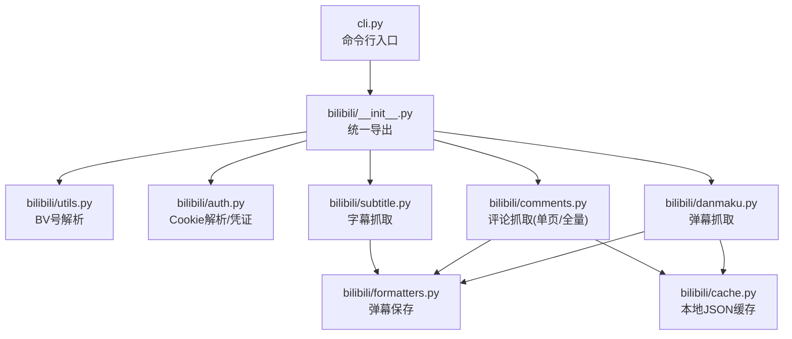
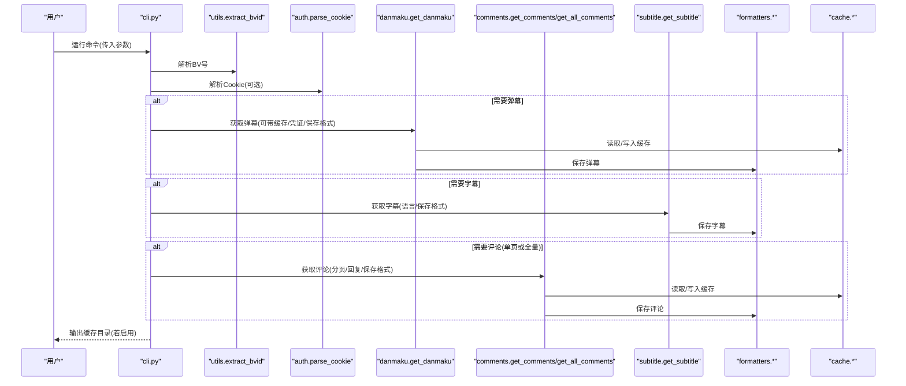

# CLI命令行界面

<cite>
**本文引用的文件**
- [cli.py](file://cli.py)
- [bilibili/__init__.py](file://bilibili/__init__.py)
- [bilibili/utils.py](file://bilibili/utils.py)
- [bilibili/auth.py](file://bilibili/auth.py)
- [bilibili/cache.py](file://bilibili/cache.py)
- [bilibili/danmaku.py](file://bilibili/danmaku.py)
- [bilibili/comments.py](file://bilibili/comments.py)
- [bilibili/subtitle.py](file://bilibili/subtitle.py)
- [bilibili/formatters.py](file://bilibili/formatters.py)
- [requirements.txt](file://requirements.txt)
</cite>

## 目录
1. [简介](#简介)
2. [项目结构](#项目结构)
3. [核心组件](#核心组件)
4. [架构总览](#架构总览)
5. [详细组件分析](#详细组件分析)
6. [依赖关系分析](#依赖关系分析)
7. [性能与缓存](#性能与缓存)
8. [故障排查与调试](#故障排查与调试)
9. [结论](#结论)
10. [附录：参数参考与常用示例](#附录参数参考与常用示例)

## 简介
本指南面向使用命令行工具批量抓取B站视频弹幕、评论（含楼中楼回复）和字幕的用户。文档覆盖BV号输入格式、功能开关参数、评论控制参数、字幕语言设置、文件保存选项、认证配置、缓存机制、错误处理与调试技巧，并提供完整的参数参考表与常用命令示例，帮助你高效完成数据抓取任务。

## 项目结构
CLI入口位于根目录的脚本文件中，核心能力封装在包内模块中，便于复用与扩展。

图表来源
- [cli.py:1-118](file://cli.py#L1-L118)
- [bilibili/__init__.py:1-19](file://bilibili/__init__.py#L1-L19)
- [bilibili/utils.py:1-28](file://bilibili/utils.py#L1-L28)
- [bilibili/auth.py:1-38](file://bilibili/auth.py#L1-L38)
- [bilibili/danmaku.py:1-64](file://bilibili/danmaku.py#L1-L64)
- [bilibili/comments.py:1-171](file://bilibili/comments.py#L1-L171)
- [bilibili/subtitle.py:1-77](file://bilibili/subtitle.py#L1-L77)
- [bilibili/formatters.py:1-166](file://bilibili/formatters.py#L1-L166)
- [bilibili/cache.py:1-42](file://bilibili/cache.py#L1-L42)

章节来源
- [cli.py:1-118](file://cli.py#L1-L118)
- [bilibili/__init__.py:1-19](file://bilibili/__init__.py#L1-L19)

## 核心组件
- 命令行解析与流程编排：负责解析参数、组合执行逻辑、输出缓存路径等。
- BV号解析：支持纯BV号、完整链接、短链接三种输入形式。
- 认证模块：从Cookie字符串提取SESSDATA等字段并构造凭证对象。
- 弹幕抓取：获取分P弹幕，支持缓存与多格式保存。
- 评论抓取：支持单页与全量翻页，可选楼中楼回复，内置安全上限与空页检测。
- 字幕抓取：自动列出可用语言，支持中文优先策略与多格式保存。
- 格式化与保存：将结果写入txt/json/csv/srt/ass/lrc等格式。
- 缓存机制：基于文件的JSON缓存，按键+过期时间管理。

章节来源
- [cli.py:29-118](file://cli.py#L29-L118)
- [bilibili/utils.py:8-27](file://bilibili/utils.py#L8-L27)
- [bilibili/auth.py:8-37](file://bilibili/auth.py#L8-L37)
- [bilibili/danmaku.py:13-63](file://bilibili/danmaku.py#L13-L63)
- [bilibili/comments.py:42-171](file://bilibili/comments.py#L42-L171)
- [bilibili/subtitle.py:21-77](file://bilibili/subtitle.py#L21-L77)
- [bilibili/formatters.py:50-166](file://bilibili/formatters.py#L50-L166)
- [bilibili/cache.py:14-42](file://bilibili/cache.py#L14-L42)

## 架构总览
下图展示了CLI到各功能模块的调用关系与数据流向。

图表来源
- [cli.py:63-118](file://cli.py#L63-L118)
- [bilibili/utils.py:8-27](file://bilibili/utils.py#L8-L27)
- [bilibili/auth.py:8-37](file://bilibili/auth.py#L8-L37)
- [bilibili/danmaku.py:13-63](file://bilibili/danmaku.py#L13-L63)
- [bilibili/comments.py:42-171](file://bilibili/comments.py#L42-L171)
- [bilibili/subtitle.py:21-77](file://bilibili/subtitle.py#L21-L77)
- [bilibili/formatters.py:50-166](file://bilibili/formatters.py#L50-L166)
- [bilibili/cache.py:14-42](file://bilibili/cache.py#L14-L42)

## 详细组件分析

### 命令行入口与参数解析
- 入口函数负责解析参数、判断执行分支、调用对应异步方法，并在启用缓存时打印缓存目录。
- 默认行为：未显式指定任何功能开关时，默认同时执行弹幕、评论、字幕三项。
- 关键参数：
  - BV号位置参数：支持纯BV号、完整链接、短链接。
  - 功能开关：-d/--danmaku、-c/--comments、-dc（弹幕+评论）、-s/--subtitle。
  - 评论控制：--all/--replies/--page/--max-pages。
  - 字幕语言：--sub-lan。
  - 保存格式：--save（txt/json/csv/srt/ass/lrc）。
  - 认证：--cookie（需包含SESSDATA）。
  - 缓存有效期：--max-age（秒，0=禁用）。

章节来源
- [cli.py:29-60](file://cli.py#L29-L60)
- [cli.py:63-118](file://cli.py#L63-L118)

### BV号输入格式
- 支持：
  - 纯BV号：如 BV1cmofByENF
  - 完整链接：https://www.bilibili.com/video/BVxxxxx
  - 短链接：https://b23.tv/xxxxx
- 无法识别时抛出异常，提示“无法解析BV号”。

章节来源
- [bilibili/utils.py:8-27](file://bilibili/utils.py#L8-L27)

### 认证配置(--cookie)
- 从Cookie字符串中解析SESSDATA等字段，生成凭证对象。
- 若未提供或不含SESSDATA，则返回None（匿名访问）。
- 成功加载会输出提示信息。

章节来源
- [bilibili/auth.py:8-37](file://bilibili/auth.py#L8-L37)

### 弹幕抓取(-d/-dc)
- 流程要点：
  - 计算缓存键，命中则直接返回。
  - 通过API获取视频信息与CID，拉取弹幕列表。
  - 将结果写入缓存；若指定保存格式，调用保存器输出文件。
- 输出信息包括标题、CID、弹幕条数及前若干条预览。

章节来源
- [bilibili/danmaku.py:13-63](file://bilibili/danmaku.py#L13-L63)
- [bilibili/formatters.py:101-141](file://bilibili/formatters.py#L101-L141)

### 评论抓取(-c/-dc, --all/--replies/--page/--max-pages)
- 单页模式：
  - 根据页码获取评论，可选楼中楼回复（每条评论最多拉取第1页、20条）。
  - 支持缓存与保存。
- 全量模式：
  - 循环翻页，直到达到目标页数、连续空页、已知总数或安全上限（10000条）为止。
  - 支持楼中楼回复与保存。
- 进度与统计：
  - 实时打印每页评论数量、累计数量、回复数量等信息。

章节来源
- [bilibili/comments.py:42-171](file://bilibili/comments.py#L42-L171)
- [bilibili/formatters.py:50-97](file://bilibili/formatters.py#L50-L97)

### 字幕抓取(-s, --sub-lan)
- 流程要点：
  - 获取视频CID与可用字幕语言列表。
  - 语言匹配策略：优先精确匹配code，其次模糊匹配doc/code关键词，否则回退到第一个可用语言。
  - 默认优先中文（AI自动生成、简体、繁体）。
  - 支持保存为srt/ass/lrc/json。
- 无字幕时的提示：该视频没有字幕。

章节来源
- [bilibili/subtitle.py:21-77](file://bilibili/subtitle.py#L21-L77)
- [bilibili/formatters.py:146-166](file://bilibili/formatters.py#L146-L166)

### 缓存机制(max-age)
- 缓存目录：位于包上级目录下的隐藏文件夹。
- 缓存键：由BV号、数据类型、页码组成哈希值。
- 读写策略：
  - 读取：存在且未过期则返回payload；过期则删除并返回None。
  - 写入：记录创建时间与最大有效期，存储payload。
- CLI在启用缓存时会打印缓存目录路径。

章节来源
- [bilibili/cache.py:10-42](file://bilibili/cache.py#L10-L42)
- [cli.py:112-114](file://cli.py#L112-L114)

### 保存格式与输出文件
- 弹幕：支持txt/json/csv。
- 评论：支持txt/json/csv。
- 字幕：支持srt/ass/lrc/json。
- 文件名规则：
  - 弹幕：danmaku_{BV}.{ext}
  - 评论：comments_{BV}.{ext}
  - 字幕：subtitle_{BV}_{lan_code}.{ext}
- 输出目录：与脚本同级目录。

章节来源
- [bilibili/formatters.py:50-166](file://bilibili/formatters.py#L50-L166)

## 依赖关系分析
- 外部依赖：
  - bilibili-api-python：用于视频、评论、字幕等API交互。
  - aiohttp：异步HTTP客户端。
  - streamlit：Web界面（非CLI必需）。
- 内部依赖：
  - cli.py 依赖 bilibili 包的统一导出接口。
  - 各抓取模块依赖缓存与格式化模块。

章节来源
- [requirements.txt:1-4](file://requirements.txt#L1-L4)
- [bilibili/__init__.py:5-18](file://bilibili/__init__.py#L5-L18)

## 性能与缓存
- 缓存命中可显著减少网络请求与I/O开销，适合重复抓取同一资源。
- 建议：
  - 批量任务开启合理max-age，避免频繁刷新。
  - 全量评论抓取时注意安全上限与空页检测，防止长时间运行。
  - 楼中楼回复会增加额外请求，按需开启。
- 并发与限流：
  - 评论翻页间有短暂休眠，降低被限流风险。
  - 如需更高吞吐，可在上层进行批处理与重试策略设计。

[本节为通用指导，不直接分析具体文件]

## 故障排查与调试
- BV号解析失败：
  - 检查输入是否为有效BV号或包含bilibili.com/b23.tv的链接。
  - 确认URL末尾是否有多余斜杠。
- Cookie无效或未登录：
  - 确保--cookie中包含SESSDATA字段。
  - 某些受限内容可能需要完整Cookie集。
- 字幕语言不匹配：
  - 先不加--sub-lan运行，查看可用语言列表，再选择合适代码。
- 评论为空或提前停止：
  - 检查是否连续两页无数据触发停止条件。
  - 关注是否达到安全上限或目标页数。
- 缓存问题：
  - 若发现数据未更新，检查max-age是否过长或缓存目录权限。
  - 可通过--max-age 0临时禁用缓存验证。
- 输出文件缺失：
  - 确认--save参数与对应功能组合是否正确。
  - 检查脚本运行目录是否有写权限。

章节来源
- [bilibili/utils.py:8-27](file://bilibili/utils.py#L8-L27)
- [bilibili/auth.py:8-37](file://bilibili/auth.py#L8-L37)
- [bilibili/subtitle.py:43-77](file://bilibili/subtitle.py#L43-L77)
- [bilibili/comments.py:123-171](file://bilibili/comments.py#L123-L171)
- [bilibili/cache.py:19-42](file://bilibili/cache.py#L19-L42)
- [cli.py:112-114](file://cli.py#L112-L114)

## 结论
本CLI工具提供了统一的入口，支持弹幕、评论（含回复）、字幕的一站式抓取，具备灵活的参数组合、完善的缓存与保存机制，以及友好的日志输出。通过合理的参数配置与最佳实践，可以高效完成大规模数据采集任务。

[本节为总结性内容，不直接分析具体文件]

## 附录：参数参考与常用示例

### 参数参考表
- 位置参数
  - bvid：视频BV号或完整B站URL（支持短链接）
- 功能开关
  - -d/--danmaku：获取弹幕
  - -c/--comments：获取评论
  - -dc：同时获取弹幕与评论
  - -s/--subtitle：获取字幕
- 评论控制
  - --all：全量翻页评论
  - --replies：同时提取楼中楼回复
  - --page：评论起始页码（默认1）
  - --max-pages：目标页数，0表示全部（默认0）
- 字幕语言
  - --sub-lan：字幕语言代码（如 ai-zh、en、ja；默认自动选择）
- 保存选项
  - --save：保存到文件，支持 txt、json、csv、srt、ass、lrc
- 认证配置
  - --cookie：Cookie字符串（必须包含SESSDATA）
- 缓存控制
  - --max-age：缓存有效期秒，0=禁用（默认30）

章节来源
- [cli.py:29-60](file://cli.py#L29-L60)

### 常用命令示例
- 批量抓取（弹幕+评论+字幕，保存为json）
  - python cli.py BV1cmofByENF -dc --all --replies --save json
- 仅评论（全量+回复），使用Cookie
  - python cli.py BV1cmofByENF -c --all --replies --cookie "SESSDATA=xxx"
- 仅弹幕，保存为csv
  - python cli.py BV1cmofByENF -d --save csv
- 仅字幕（英文），保存为srt
  - python cli.py BV1cmofByENF -s --sub-lan en --save srt
- 仅字幕（ASS格式）
  - python cli.py BV1cmofByENF -s --save ass
- 指定起始页与目标页数
  - python cli.py BV1cmofByENF -c --page 3 --max-pages 5 --replies --save json
- 禁用缓存
  - python cli.py BV1cmofByENF -dc --max-age 0

章节来源
- [cli.py:33-40](file://cli.py#L33-L40)
- [cli.py:63-118](file://cli.py#L63-L118)

### 最佳实践建议
- 首次抓取建议关闭缓存(--max-age 0)以验证数据正确性，随后开启缓存提升效率。
- 全量评论抓取时，结合--max-pages限制规模，避免过大数据量。
- 楼中楼回复按需开启，必要时分批抓取以降低请求压力。
- 字幕语言不确定时，先不加--sub-lan运行，观察可用语言列表后再指定。
- 批量任务建议使用--save json以便后续处理与分析。
- 定期清理缓存目录，避免磁盘占用过大。

[本节为通用指导，不直接分析具体文件]