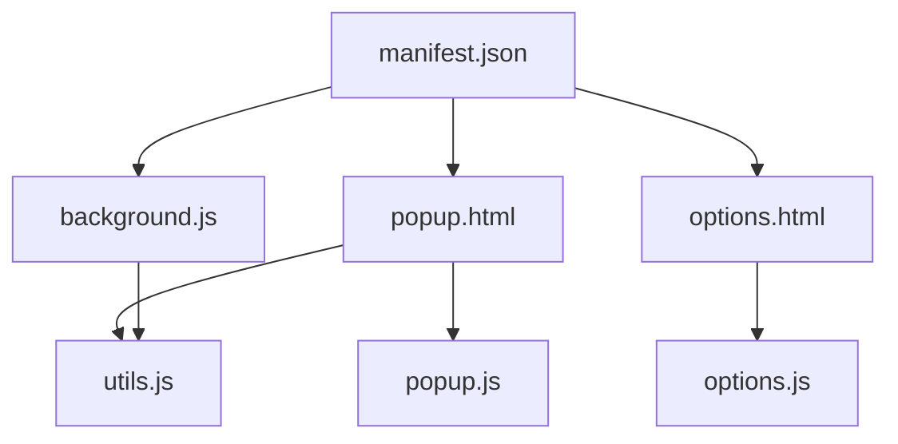
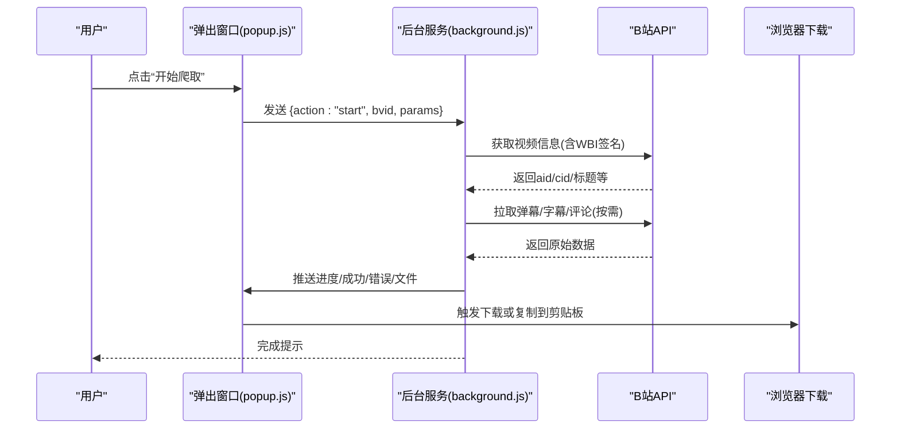
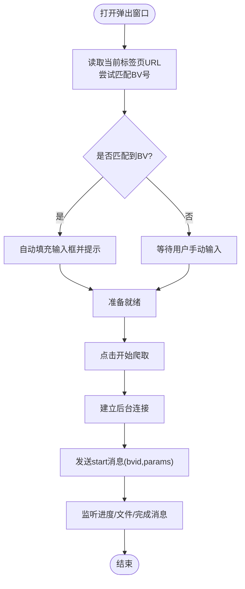
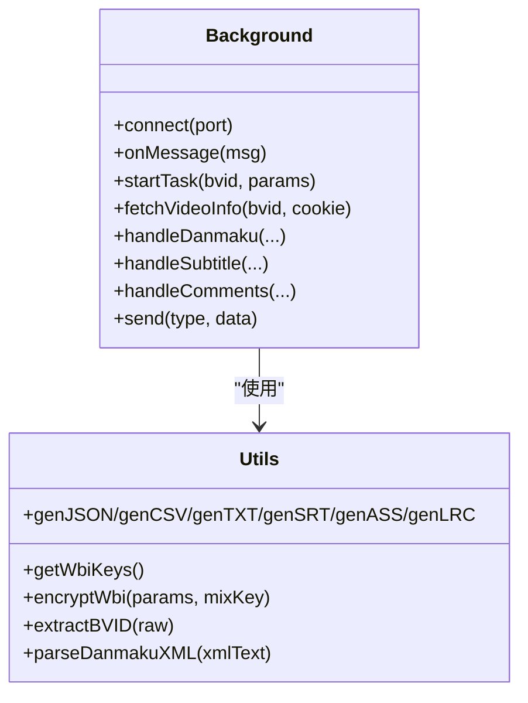
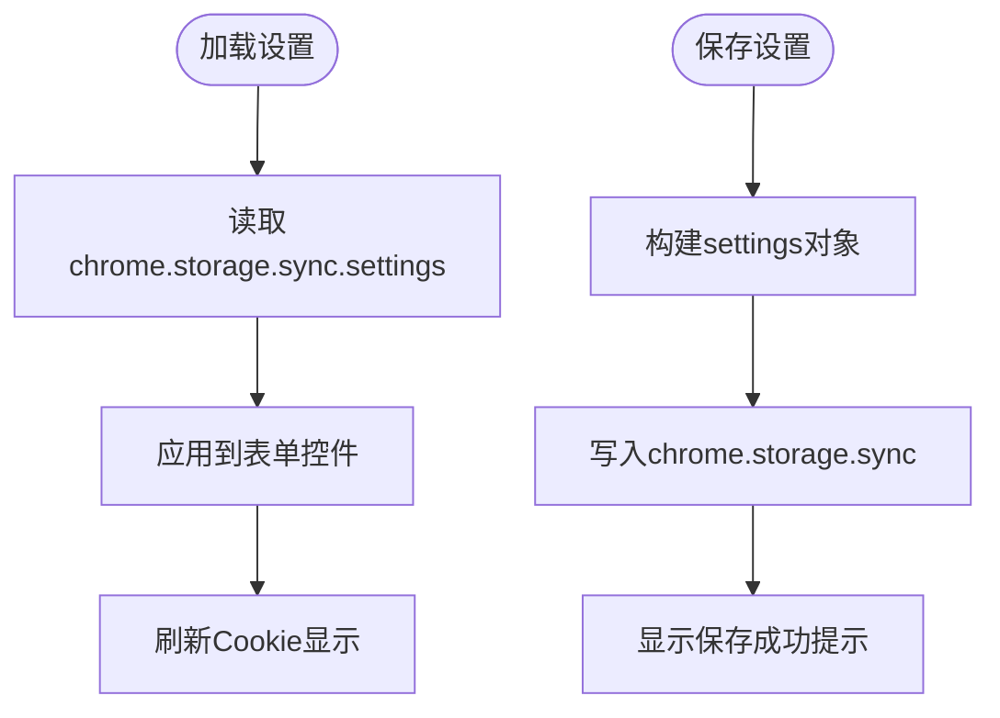
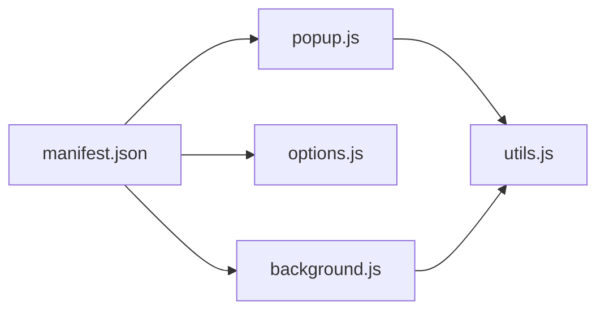

# Chrome浏览器扩展

<cite>
**本文引用的文件**   
- [manifest.json](file://bilibili-extension--main/manifest.json)
- [background.js](file://bilibili-extension--main/background.js)
- [popup.html](file://bilibili-extension--main/popup.html)
- [popup.js](file://bilibili-extension--main/popup.js)
- [options.html](file://bilibili-extension--main/options.html)
- [options.js](file://bilibili-extension--main/options.js)
- [utils.js](file://bilibili-extension--main/utils.js)
- [app.py](file://app.py)
- [bilibili_demo.py](file://bilibili_demo.py)
- [cli.py](file://cli.py)
</cite>

## 目录
1. [简介](#简介)
2. [项目结构](#项目结构)
3. [核心组件](#核心组件)
4. [架构总览](#架构总览)
5. [详细组件分析](#详细组件分析)
6. [依赖关系分析](#依赖关系分析)
7. [性能与稳定性](#性能与稳定性)
8. [使用指南与最佳实践](#使用指南与最佳实践)
9. [故障排除](#故障排除)
10. [结论](#结论)
11. [附录：开发与技术细节](#附录开发与技术细节)

## 简介
本Chrome扩展提供“一键抓取B站视频弹幕、评论、字幕”的能力，支持在弹出窗口中操作、后台服务执行任务、右键菜单快捷启动，以及设置页自定义默认行为。同时仓库包含Python端（Streamlit网页版与命令行）可复用同一套业务逻辑，便于本地部署或二次开发。

## 项目结构
扩展位于 bilibili-extension--main 目录，采用Manifest V3架构，包含以下关键文件：
- manifest.json：扩展清单，声明权限、入口、背景脚本等
- background.js：后台服务Worker，负责网络请求、数据处理、下载与消息转发
- popup.html / popup.js：弹出窗口UI与交互逻辑
- options.html / options.js：设置页面与持久化配置
- utils.js：通用工具函数（WBI签名、时间格式、数据格式化、文件生成等）

图表来源
- [manifest.json:1-20](file://bilibili-extension--main/manifest.json#L1-L20)
- [background.js:1-20](file://bilibili-extension--main/background.js#L1-L20)
- [popup.html:125-127](file://bilibili-extension--main/popup.html#L125-L127)
- [options.html:131-133](file://bilibili-extension--main/options.html#L131-L133)

章节来源
- [manifest.json:1-20](file://bilibili-extension--main/manifest.json#L1-L20)

## 核心组件
- 弹出窗口（Popup）
  - 自动识别当前页面的BV号并填充输入框
  - 勾选需要抓取的数据类型（弹幕、评论、字幕），并可开启楼中楼回复、限制最大页数、选择导出格式与字幕语言
  - 可选填写Cookie以访问私密内容或提升限额
  - 实时日志显示进度、成功/错误信息，并提供下载与复制按钮
- 后台服务（Background Service Worker）
  - 通过端口连接接收任务，按顺序执行视频信息获取、弹幕、字幕、评论抓取
  - 封装biliFetch/biliFetchJSON统一请求头与错误处理
  - 实现WBI签名与备用API切换，增强鲁棒性
  - 将结果以文件形式推送至前端或直接触发浏览器下载
- 设置页面（Options）
  - 管理默认勾选项、默认导出格式、字幕语言、最大翻页数、TXT字幕时间格式、开发者模式
  - 读取当前浏览器中的B站Cookie并展示状态
- 工具库（Utils）
  - WBI密钥获取与签名、BV号提取、时间格式化、弹幕XML解析、多格式文件生成（JSON/CSV/TXT/SRT/ASS/LRC）

章节来源
- [popup.js:1-228](file://bilibili-extension--main/popup.js#L1-L228)
- [background.js:1-567](file://bilibili-extension--main/background.js#L1-L567)
- [options.js:1-80](file://bilibili-extension--main/options.js#L1-L80)
- [utils.js:1-296](file://bilibili-extension--main/utils.js#L1-L296)

## 架构总览
扩展采用前后端分离的Chrome扩展架构：Popup作为用户界面，Background作为任务调度与网络层，两者通过runtime.connect建立长连接进行消息传递；设置页独立运行，读写chrome.storage.sync；工具函数被Popup与Background共享。

图表来源
- [popup.js:177-206](file://bilibili-extension--main/popup.js#L177-L206)
- [background.js:496-517](file://bilibili-extension--main/background.js#L496-L517)
- [background.js:428-475](file://bilibili-extension--main/background.js#L428-L475)

## 详细组件分析

### 弹出窗口（Popup）
- 自动检测BV号
  - 打开时查询当前活动标签页URL，若匹配BV正则则自动填入并显示提示
- 连接后台
  - 初始化时建立名为“scraper”的端口连接，监听progress/info/success/error/file/done/abort消息
- 参数收集与发送
  - 根据勾选与下拉框值组装params对象，发送至后台
- 下载与复制
  - 收到file消息后创建Blob并生成下载链接，同时提供复制按钮

图表来源
- [popup.js:12-51](file://bilibili-extension--main/popup.js#L12-L51)
- [popup.js:59-99](file://bilibili-extension--main/popup.js#L59-L99)
- [popup.js:177-206](file://bilibili-extension--main/popup.js#L177-L206)

章节来源
- [popup.html:66-128](file://bilibili-extension--main/popup.html#L66-L128)
- [popup.js:1-228](file://bilibili-extension--main/popup.js#L1-L228)

### 后台服务（Background）
- 消息协议
  - 连接名固定为“scraper”，支持start/cancel动作；向前端推送progress/info/success/error/file/done/abort消息
- 任务编排
  - startTask依次执行：获取视频信息→弹幕→字幕→评论，任一环节出错不影响后续（try/catch包裹）
- 网络与签名
  - biliFetch统一设置UA/Referer/Cookie等头部；biliFetchJSON校验code=0
  - 评论接口优先主流cursor API，失败则回退page-based API并启用WBI签名
  - 字幕优先Player API，失败则回退video info字段并重试
- 文件输出
  - 通过send('file', ...)将内容推送到Popup，由Popup触发下载或复制；在无连接时直接调用downloads.download
- 右键菜单
  - onInstalled注册两个上下文菜单，分别用于“弹幕+字幕”和“评论”快速抓取，进入无头模式（不恢复currentPort）

图表来源
- [background.js:496-517](file://bilibili-extension--main/background.js#L496-L517)
- [background.js:428-475](file://bilibili-extension--main/background.js#L428-L475)
- [utils.js:104-147](file://bilibili-extension--main/utils.js#L104-L147)
- [utils.js:185-296](file://bilibili-extension--main/utils.js#L185-L296)

章节来源
- [background.js:1-567](file://bilibili-extension--main/background.js#L1-L567)

### 设置页面（Options）
- 默认选项
  - 默认勾选项（弹幕/评论/字幕/回复）、默认导出格式、默认字幕语言、最大翻页数、TXT字幕时间格式、开发者模式
- Cookie管理
  - 读取.bilibili.com域下的所有Cookie并展示，支持刷新
- 持久化
  - 保存设置到chrome.storage.sync，键名为settings

图表来源
- [options.js:1-80](file://bilibili-extension--main/options.js#L1-L80)
- [options.html:38-133](file://bilibili-extension--main/options.html#L38-L133)

章节来源
- [options.html:1-134](file://bilibili-extension--main/options.html#L1-L134)
- [options.js:1-80](file://bilibili-extension--main/options.js#L1-L80)

### 工具库（Utils）
- WBI签名流程
  - getWbiKeys从nav接口获取img/sub密钥并缓存1小时
  - encryptWbi拼接参数与时戳，计算md5得到w_rid
- BV号提取
  - 支持完整URL或纯BV号，返回标准化BV字符串
- 时间格式化
  - SRT/ASS/LRC/TXT多种时间格式转换
- 弹幕解析
  - 基于正则解析XML弹幕节点，提取时间、文本、样式等字段
- 文件生成
  - JSON/CSV/TXT/SRT/ASS/LRC多格式输出，CSV带BOM以便Excel正确识别中文

章节来源
- [utils.js:1-296](file://bilibili-extension--main/utils.js#L1-L296)

## 依赖关系分析
- 权限与主机范围
  - storage/downloads/activeTab/cookies/contextMenus/notifications
  - host_permissions仅允许*.bilibili.com
- 模块耦合
  - Popup与Background通过runtime.connect通信，职责清晰
  - Background强依赖utils.js提供的签名与格式化能力
  - Options独立于运行时，仅读写storage

图表来源
- [manifest.json:6-18](file://bilibili-extension--main/manifest.json#L6-L18)
- [popup.js:1-228](file://bilibili-extension--main/popup.js#L1-L228)
- [background.js:1-567](file://bilibili-extension--main/background.js#L1-L567)
- [utils.js:1-296](file://bilibili-extension--main/utils.js#L1-L296)

章节来源
- [manifest.json:1-20](file://bilibili-extension--main/manifest.json#L1-L20)

## 性能与稳定性
- 并发与限流
  - 评论抓取循环内对每条评论的回复请求间隔约300ms，翻页间隔约500ms，避免触发风控
- 安全上限
  - 评论抓取内置最大条目上限（如10000条），防止内存与耗时过大
- 容错与回退
  - 评论接口先尝试cursor API，失败则切换到page-based API并启用WBI签名
  - 字幕优先Player API，失败则回退video info字段并重试
- 取消机制
  - sleep支持中断检查，startTask内部多处检查cancelled标志，确保及时停止

[本节为通用性能讨论，无需具体文件引用]

## 使用指南与最佳实践

### 安装与配置
- 从本地加载扩展
  - 打开Chrome扩展管理页面（地址栏输入 chrome://extensions/）
  - 开启“开发者模式”
  - 点击“加载已解压的扩展程序”，选择 bilibili-extension--main 目录
- 权限说明
  - storage：读写设置
  - downloads：触发文件下载
  - activeTab：读取当前标签页URL以自动识别BV号
  - cookies：读取.bilibili.com域Cookie（需登录B站）
  - contextMenus：右键菜单
  - notifications：通知（当前未直接使用）
  - host_permissions：*://*.bilibili.com/*

章节来源
- [manifest.json:6-18](file://bilibili-extension--main/manifest.json#L6-L18)

### 自动BV号检测机制
- 触发条件
  - 打开弹出窗口时，读取当前活动标签页URL
  - 若URL中包含符合BV正则的片段，则自动填充输入框并显示提示
- 注意事项
  - 仅在B站视频页或包含BV号的URL上有效
  - 非B站页面不会触发自动填充

章节来源
- [popup.js:12-25](file://bilibili-extension--main/popup.js#L12-L25)

### Cookie自动填充功能
- 配置方法
  - 在设置页开启“自动从浏览器读取B站Cookie”
  - 每次打开插件时，会尝试读取.bilibili.com域下的所有Cookie并拼接为字符串
- 使用场景
  - 访问私密视频或提高API限额
  - 建议保持B站登录态，否则无法读取有效Cookie

章节来源
- [popup.js:39-50](file://bilibili-extension--main/popup.js#L39-L50)
- [options.js:16-37](file://bilibili-extension--main/options.js#L16-L37)

### 弹出窗口操作流程
- 步骤
  - 打开B站任意视频页面，点击扩展图标打开弹出窗口
  - 确认BV号已自动识别，或手动输入
  - 勾选所需数据类型（弹幕/评论/字幕），按需开启“楼中楼回复”与“最大页数”
  - 选择导出格式与字幕语言，必要时粘贴Cookie
  - 点击“开始爬取”，观察日志与下载区域
- 结果
  - 完成后会在下载区出现对应文件的下载按钮，也可复制到剪贴板

章节来源
- [popup.html:66-128](file://bilibili-extension--main/popup.html#L66-L128)
- [popup.js:177-206](file://bilibili-extension--main/popup.js#L177-L206)

### 后台服务工作机制与消息协议
- 连接与任务
  - Popup通过runtime.connect(name='scraper')建立连接
  - 发送{action:'start', bvid, params}启动任务；发送{action:'cancel'}取消
- 消息类型
  - progress/info/success/error：进度与状态
  - file：包含task/filename/content/mimeType，用于前端下载
  - done/abort：任务完成或中止
- 无头模式
  - 右键菜单触发时，后台进入无头模式（不恢复currentPort），直接触发浏览器下载

章节来源
- [background.js:496-517](file://bilibili-extension--main/background.js#L496-L517)
- [background.js:519-566](file://bilibili-extension--main/background.js#L519-L566)

### 设置页面各项配置
- Cookie相关
  - 自动读取Cookie开关、当前Cookie预览、刷新按钮
- 默认勾选项
  - 弹幕/评论/字幕/楼中楼回复
- 默认参数
  - 导出格式、字幕语言、最大翻页数、TXT字幕时间格式
- 开发者模式
  - 控制后台devLog输出

章节来源
- [options.html:41-126](file://bilibili-extension--main/options.html#L41-L126)
- [options.js:1-80](file://bilibili-extension--main/options.js#L1-L80)

### 最佳实践
- 首次使用建议在设置页开启“自动Cookie”，并确保已在B站登录
- 批量抓取评论时合理设置“最大页数”，避免过长耗时
- 导出格式推荐：
  - 数据分析：JSON/CSV
  - 观看辅助：SRT/ASS/LRC
- 遇到风控或失败时，可在设置页开启“开发者模式”，并在扩展详情“检查视图”的Console查看日志

[本节为通用指导，无需具体文件引用]

## 故障排除
- 无法自动识别BV号
  - 确认当前页面确为B站视频页且URL包含BV号
  - 手动输入BV号重试
- 评论抓取失败或为空
  - 可能触发了风控，后台会自动回退到page-based API并启用WBI签名
  - 检查网络连接与Cookie有效性
- 字幕为空或下载失败
  - 优先使用Player API，失败则回退video info字段并重试
  - 某些视频可能确实没有字幕
- 下载按钮不可用
  - 检查浏览器下载权限与下载路径设置
- 无法读取Cookie
  - 确认已登录B站且未启用隐私模式
  - 在设置页点击“刷新”重新读取

章节来源
- [background.js:97-134](file://bilibili-extension--main/background.js#L97-L134)
- [background.js:148-192](file://bilibili-extension--main/background.js#L148-L192)
- [options.js:16-37](file://bilibili-extension--main/options.js#L16-L37)

## 结论
该扩展以清晰的模块化设计实现了B站弹幕、评论、字幕的一键抓取，具备自动BV识别、Cookie自动填充、右键快捷抓取、灵活导出格式与完善的错误回退机制。配合Python端的Streamlit与CLI，形成跨平台的数据采集方案，适合个人研究、内容分析与二次开发。

[本节为总结，无需具体文件引用]

## 附录：开发与技术细节

### 扩展开发要点
- Manifest V3要求
  - 使用service_worker替代旧版background scripts
  - 权限最小化原则，仅申请必要权限
- 消息传递
  - 使用runtime.connect建立长连接，避免频繁postMessage开销
- 存储策略
  - 使用chrome.storage.sync同步用户设置，注意容量限制与异步特性

章节来源
- [manifest.json:16-18](file://bilibili-extension--main/manifest.json#L16-L18)
- [popup.js:59-99](file://bilibili-extension--main/popup.js#L59-L99)
- [options.js:56-75](file://bilibili-extension--main/options.js#L56-L75)

### Python端集成与复用
- Streamlit网页版
  - app.py提供可视化界面，复用bilibili包的核心函数，支持弹幕/评论/字幕抓取与文件下载
- 命令行工具
  - cli.py与bilibili_demo.py提供丰富的命令行参数，支持缓存、Cookie、全量翻页与多格式导出

章节来源
- [app.py:1-281](file://app.py#L1-L281)
- [bilibili_demo.py:1-452](file://bilibili_demo.py#L1-L452)
- [cli.py:1-118](file://cli.py#L1-L118)