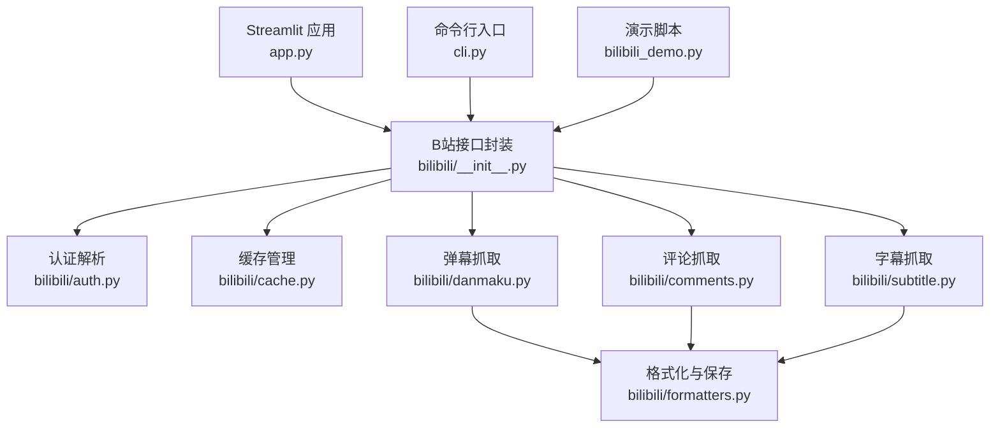
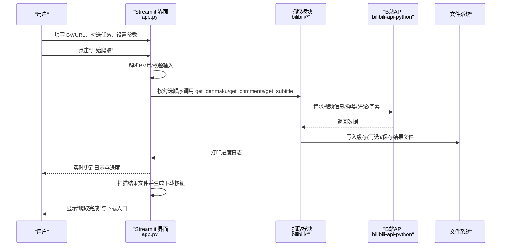
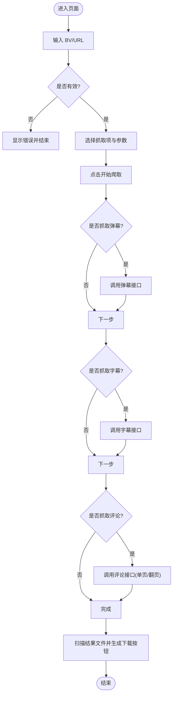
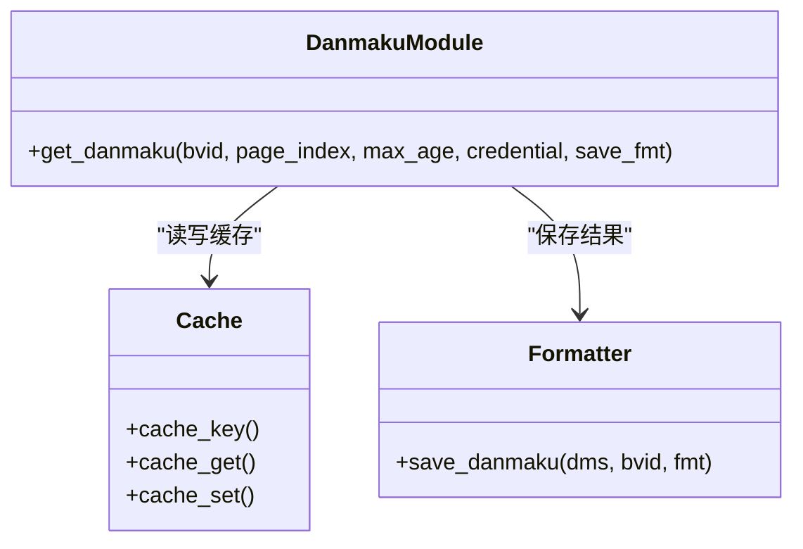
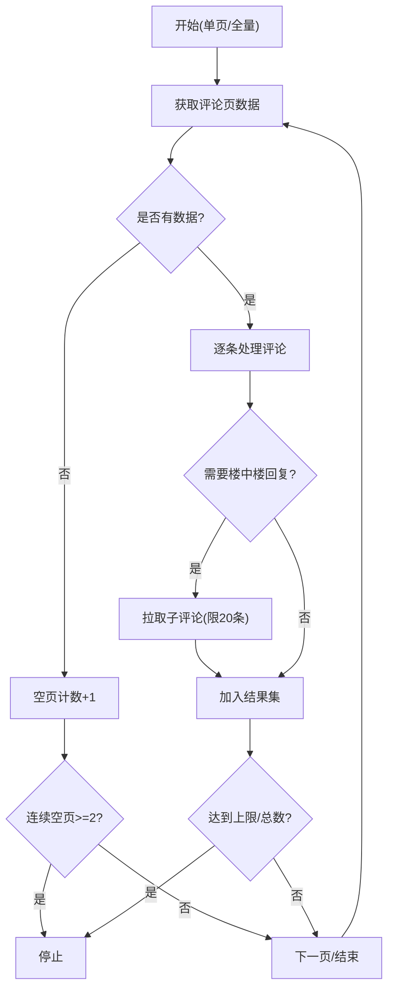
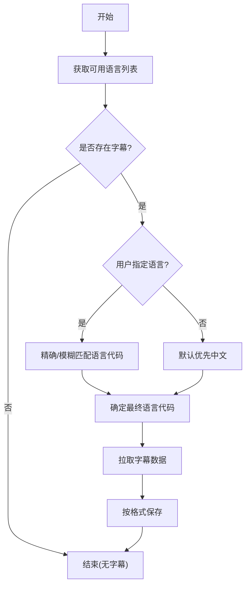
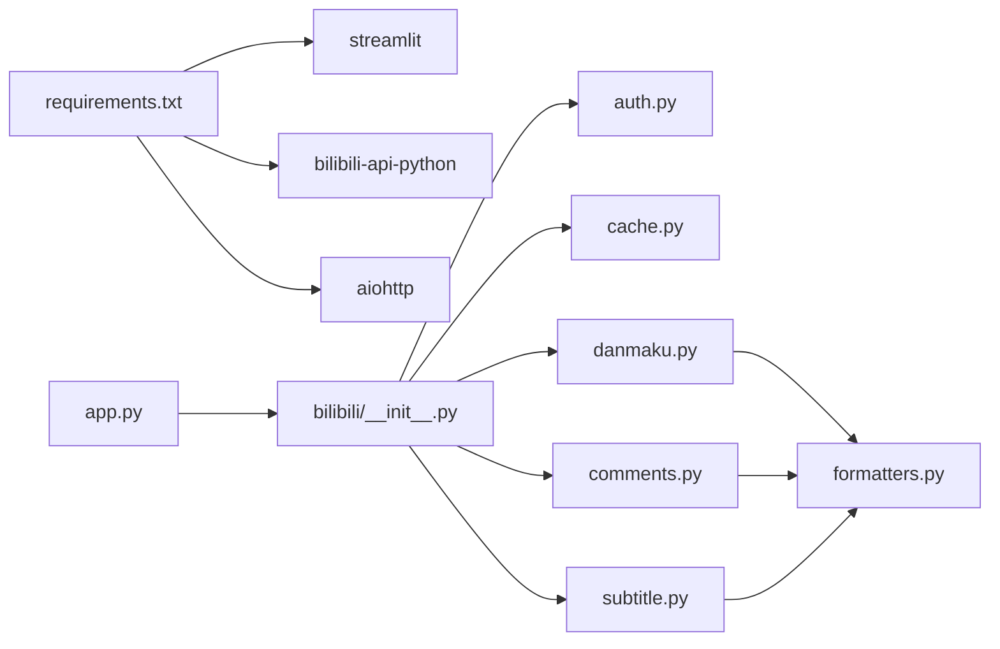

# Streamlit Web界面

<cite>
**本文引用的文件**
- [app.py](file://app.py)
- [bilibili_demo.py](file://bilibili_demo.py)
- [cli.py](file://cli.py)
- [requirements.txt](file://requirements.txt)
- [bilibili/__init__.py](file://bilibili/__init__.py)
- [bilibili/auth.py](file://bilibili/auth.py)
- [bilibili/cache.py](file://bilibili/cache.py)
- [bilibili/danmaku.py](file://bilibili/danmaku.py)
- [bilibili/comments.py](file://bilibili/comments.py)
- [bilibili/subtitle.py](file://bilibili/subtitle.py)
- [bilibili/utils.py](file://bilibili/utils.py)
- [bilibili/formatters.py](file://bilibili/formatters.py)
</cite>

## 目录
1. [简介](#简介)
2. [项目结构](#项目结构)
3. [核心组件](#核心组件)
4. [架构总览](#架构总览)
5. [详细组件分析](#详细组件分析)
6. [依赖关系分析](#依赖关系分析)
7. [性能考虑](#性能考虑)
8. [故障排查指南](#故障排查指南)
9. [结论](#结论)
10. [附录](#附录)

## 简介
本使用指南面向通过 Streamlit 本地网页版操作 B站弹幕、评论与字幕抓取工具的用户。你将了解：
- Web 界面的布局与各功能模块（BV号输入区、Cookie配置面板、抓取参数设置、实时进度显示、结果下载）
- 从输入视频链接到数据下载的完整交互流程
- 各配置项的作用与影响（弹幕/评论/字幕选择、页数控制、楼中楼回复、字幕语言、保存格式、缓存开关）
- 常见问题解决方案与性能优化建议

## 项目结构
Web 入口由 app.py 提供，它基于 Streamlit 构建侧边栏表单与主区域状态展示，并调用底层抓取逻辑。底层逻辑封装在 bilibili 包中，分别负责认证、缓存、弹幕、评论、字幕与格式化输出；同时提供命令行入口 cli.py 与演示脚本 bilibili_demo.py。

图表来源
- [app.py:1-142](file://app.py#L1-L142)
- [bilibili/__init__.py:1-19](file://bilibili/__init__.py#L1-L19)
- [bilibili/auth.py:1-38](file://bilibili/auth.py#L1-L38)
- [bilibili/cache.py:1-42](file://bilibili/cache.py#L1-L42)
- [bilibili/danmaku.py:1-64](file://bilibili/danmaku.py#L1-L64)
- [bilibili/comments.py:1-171](file://bilibili/comments.py#L1-L171)
- [bilibili/subtitle.py:1-77](file://bilibili/subtitle.py#L1-L77)
- [bilibili/formatters.py:1-166](file://bilibili/formatters.py#L1-L166)
- [cli.py:1-118](file://cli.py#L1-L118)
- [bilibili_demo.py:1-452](file://bilibili_demo.py#L1-L452)

章节来源
- [app.py:1-142](file://app.py#L1-L142)
- [bilibili/__init__.py:1-19](file://bilibili/__init__.py#L1-L19)
- [cli.py:1-118](file://cli.py#L1-L118)
- [bilibili_demo.py:1-452](file://bilibili_demo.py#L1-L452)

## 核心组件
- 页面与侧边栏
  - 页面标题与图标、居中布局
  - 侧边栏包含：BV号/URL输入、弹幕/评论/字幕勾选、目标页数、楼中楼回复、字幕语言、保存格式、Cookie、禁用缓存、开始爬取按钮
- 运行期状态
  - 日志区域：捕获标准输出，滚动显示最近若干行
  - 进度提示：根据当前抓取任务动态更新
  - 错误提示：异常时显示错误信息
- 异步执行与文件下载
  - 使用事件循环顺序执行所选任务
  - 完成后扫描同目录下对应文件名后缀的文件并提供下载按钮

章节来源
- [app.py:15-43](file://app.py#L15-L43)
- [app.py:46-142](file://app.py#L46-L142)

## 架构总览
下图展示了用户点击“开始爬取”后，Web 界面如何驱动底层抓取流程，以及数据落盘与下载按钮生成的过程。

图表来源
- [app.py:46-142](file://app.py#L46-L142)
- [bilibili/danmaku.py:13-64](file://bilibili/danmaku.py#L13-L64)
- [bilibili/comments.py:42-171](file://bilibili/comments.py#L42-L171)
- [bilibili/subtitle.py:21-77](file://bilibili/subtitle.py#L21-L77)
- [bilibili/formatters.py:101-166](file://bilibili/formatters.py#L101-L166)

## 详细组件分析

### 界面布局与交互流程
- 输入区
  - 支持纯 BV 号或完整链接（含短链），内部会提取 BV 号
  - 若无法解析，将显示错误提示并终止
- 抓取选项
  - 弹幕：默认勾选
  - 评论：可勾选
  - 字幕：可勾选
- 评论分页与回复
  - 目标页数：0=全部，N=仅前N页
  - 楼中楼回复：开启后会为每条评论拉取首层回复（最多20条）
- 字幕语言
  - 下拉列表包含多种语言，实际可用语言以接口返回为准
- 保存格式
  - 弹幕/评论：txt/json/csv
  - 字幕：srt/ass/lrc/json
- Cookie 与缓存
  - Cookie 用于登录态访问受限资源
  - 禁用缓存则每次重新请求，否则使用本地 JSON 缓存（默认有效期秒级）
- 运行反馈
  - 日志区域实时滚动显示最近若干行
  - 进度文本提示当前步骤
  - 完成后自动列出可下载文件

图表来源
- [app.py:46-142](file://app.py#L46-L142)
- [bilibili/utils.py:8-27](file://bilibili/utils.py#L8-L27)

章节来源
- [app.py:15-43](file://app.py#L15-L43)
- [app.py:46-142](file://app.py#L46-L142)
- [bilibili/utils.py:8-27](file://bilibili/utils.py#L8-L27)

### 弹幕抓取模块
- 功能要点
  - 优先命中缓存（按 BV+类型+分P索引计算键）
  - 获取视频信息与 cid，拉取弹幕并打印样例
  - 支持 txt/json/csv 三种保存格式
- 复杂度与性能
  - 时间复杂度与弹幕数量线性相关
  - 可通过缓存避免重复请求

图表来源
- [bilibili/danmaku.py:13-64](file://bilibili/danmaku.py#L13-L64)
- [bilibili/cache.py:14-42](file://bilibili/cache.py#L14-L42)
- [bilibili/formatters.py:101-142](file://bilibili/formatters.py#L101-L142)

章节来源
- [bilibili/danmaku.py:13-64](file://bilibili/danmaku.py#L13-L64)
- [bilibili/formatters.py:101-142](file://bilibili/formatters.py#L101-L142)

### 评论抓取模块
- 功能要点
  - 单页抓取：指定页码，可选择是否拉取楼中楼回复
  - 全量翻页：支持目标页数限制、空页检测、总量上限保护
  - 支持 txt/json/csv 保存格式
- 关键策略
  - 连续空页停止、达到已知总数停止、累计超过安全上限停止
  - 对每条有回复的评论额外请求子评论（带延时）

图表来源
- [bilibili/comments.py:42-171](file://bilibili/comments.py#L42-L171)

章节来源
- [bilibili/comments.py:42-171](file://bilibili/comments.py#L42-L171)
- [bilibili/formatters.py:50-96](file://bilibili/formatters.py#L50-L96)

### 字幕抓取模块
- 功能要点
  - 查询可用字幕语言列表，按用户选择或默认策略匹配语言代码
  - 支持 srt/ass/lrc/json 保存格式
- 语言匹配策略
  - 优先精确匹配 code；其次模糊匹配文档描述；均失败则回退到第一个可用语言

图表来源
- [bilibili/subtitle.py:21-77](file://bilibili/subtitle.py#L21-L77)
- [bilibili/formatters.py:146-166](file://bilibili/formatters.py#L146-L166)

章节来源
- [bilibili/subtitle.py:21-77](file://bilibili/subtitle.py#L21-L77)
- [bilibili/formatters.py:146-166](file://bilibili/formatters.py#L146-L166)

### 认证与缓存
- 认证
  - 解析 Cookie 字符串，提取 SESSDATA 等字段，构造凭证对象
- 缓存
  - 基于文件的 JSON 缓存，键由 BV、数据类型与页码组成
  - 过期即删除旧缓存，未命中则重新请求

章节来源
- [bilibili/auth.py:8-37](file://bilibili/auth.py#L8-L37)
- [bilibili/cache.py:14-42](file://bilibili/cache.py#L14-L42)

### 输出与下载
- 输出文件命名规则
  - 弹幕：danmaku_{BV}.{格式}
  - 评论：comments_{BV}.{格式}
  - 字幕：subtitle_{BV}_{语言}.{格式}
- 下载机制
  - 完成后扫描同级目录下匹配前缀与后缀的文件，逐个生成下载按钮
  - 不同扩展名对应不同的 MIME 类型

章节来源
- [app.py:118-136](file://app.py#L118-L136)
- [bilibili/formatters.py:101-166](file://bilibili/formatters.py#L101-L166)

## 依赖关系分析
- 外部依赖
  - bilibili-api-python：封装 B站 API 调用
  - aiohttp：异步网络库
  - streamlit：Web 框架
- 内部依赖
  - app.py 依赖 bilibili 包的统一导出入口
  - 各抓取模块依赖缓存与格式化模块
  - CLI 与演示脚本复用同一套核心能力

图表来源
- [requirements.txt:1-4](file://requirements.txt#L1-L4)
- [bilibili/__init__.py:1-19](file://bilibili/__init__.py#L1-L19)
- [app.py:1-142](file://app.py#L1-L142)

章节来源
- [requirements.txt:1-4](file://requirements.txt#L1-L4)
- [bilibili/__init__.py:1-19](file://bilibili/__init__.py#L1-L19)

## 性能考虑
- 启用缓存
  - 默认开启（有效期秒级），可显著减少重复请求
  - 如需强制刷新，可在界面勾选“禁用缓存”
- 控制评论规模
  - 合理设置“目标页数”，避免全量翻页导致耗时过长
  - 谨慎开启“楼中楼回复”，会触发额外的子评论请求
- 降低并发压力
  - 抓取过程中存在固定延时（如子评论拉取），有助于避免被限流
- 选择合适的保存格式
  - 大数据量下，json/csv 更利于后续处理；txt 便于快速预览

[本节为通用建议，不直接分析具体文件]

## 故障排查指南
- 无法解析 BV 号
  - 现象：输入无效链接或非法 BV 号时，界面显示错误提示
  - 解决：确保输入为合法 BV 号或完整 B站链接
- 没有字幕
  - 现象：提示该视频没有字幕
  - 解决：确认视频是否提供字幕；或尝试其他语言
- 评论为空或提前停止
  - 现象：连续空页或达到安全上限停止
  - 解决：检查网络状况；适当调小“目标页数”或关闭“楼中楼回复”
- Cookie 无效
  - 现象：部分受保护内容无法获取
  - 解决：确保 Cookie 中包含有效的 SESSDATA，且未过期
- 下载按钮未出现
  - 现象：抓取完成但未看到下载按钮
  - 解决：确认已选择保存格式；检查同级目录是否生成对应文件

章节来源
- [app.py:46-142](file://app.py#L46-L142)
- [bilibili/subtitle.py:43-49](file://bilibili/subtitle.py#L43-L49)
- [bilibili/comments.py:148-158](file://bilibili/comments.py#L148-L158)
- [bilibili/auth.py:8-37](file://bilibili/auth.py#L8-L37)

## 结论
本 Web 界面将弹幕、评论与字幕抓取能力整合为直观的可视化操作，支持灵活的参数配置与实时进度反馈。通过合理的缓存与分页策略，可在保证体验的同时提升效率。建议新用户先从小范围抓取开始，逐步熟悉各项参数的影响后再进行大规模采集。

[本节为总结性内容，不直接分析具体文件]

## 附录

### 配置项说明速查
- BV 号/URL：支持纯 BV 号或完整链接（含短链）
- 弹幕/评论/字幕：勾选所需任务
- 目标页数：0=全部，N=仅前 N 页
- 楼中楼回复：为每条评论拉取首层回复（最多20条）
- 字幕语言：从下拉列表选择，实际可用语言以接口返回为准
- 保存格式：弹幕/评论支持 txt/json/csv；字幕支持 srt/ass/lrc/json
- Cookie：包含 SESSDATA 的完整 Cookie 字符串
- 禁用缓存：勾选后将不使用本地缓存

章节来源
- [app.py:18-43](file://app.py#L18-L43)
- [bilibili/utils.py:8-27](file://bilibili/utils.py#L8-L27)
- [bilibili/auth.py:8-37](file://bilibili/auth.py#L8-L37)
- [bilibili/cache.py:14-42](file://bilibili/cache.py#L14-L42)
- [bilibili/formatters.py:101-166](file://bilibili/formatters.py#L101-L166)