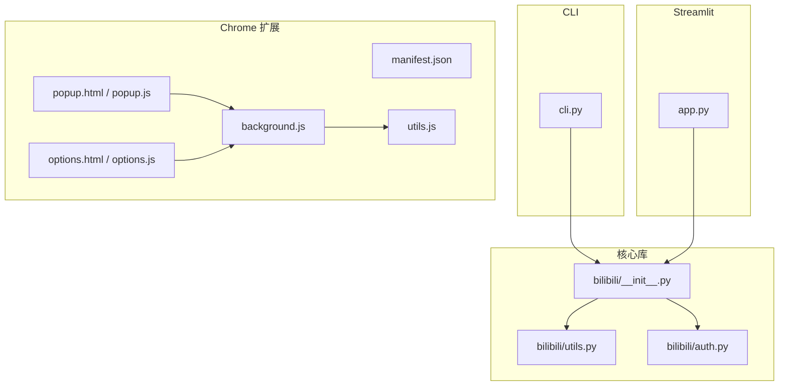
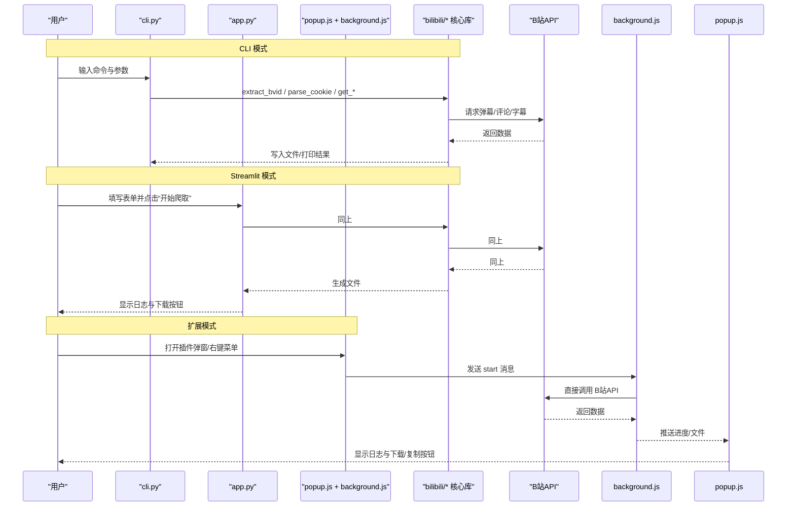
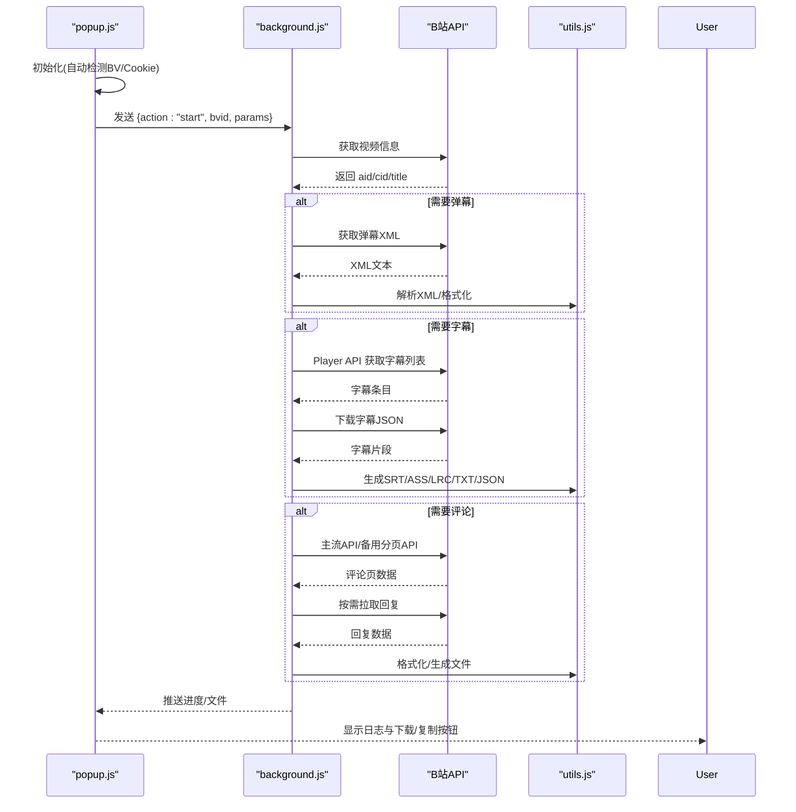
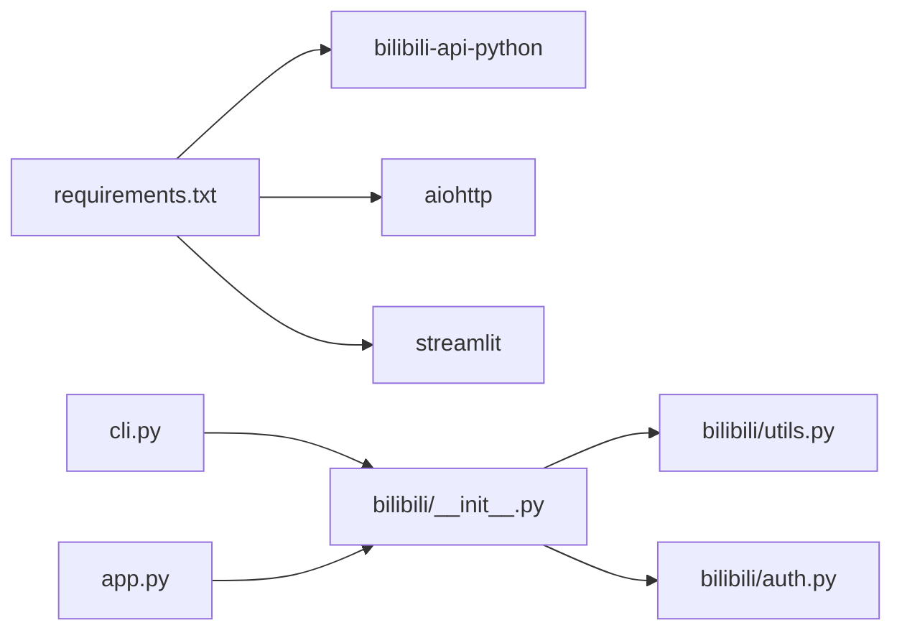

# 用户界面

<cite>
**本文引用的文件**   
- [cli.py](file://cli.py)
- [app.py](file://app.py)
- [bilibili/__init__.py](file://bilibili/__init__.py)
- [bilibili/utils.py](file://bilibili/utils.py)
- [bilibili/auth.py](file://bilibili/auth.py)
- [requirements.txt](file://requirements.txt)
- [bilibili-extension--main/manifest.json](file://bilibili-extension--main/manifest.json)
- [bilibili-extension--main/popup.html](file://bilibili-extension--main/popup.html)
- [bilibili-extension--main/options.html](file://bilibili-extension--main/options.html)
- [bilibili-extension--main/popup.js](file://bilibili-extension--main/popup.js)
- [bilibili-extension--main/options.js](file://bilibili-extension--main/options.js)
- [bilibili-extension--main/background.js](file://bilibili-extension--main/background.js)
- [bilibili-extension--main/utils.js](file://bilibili-extension--main/utils.js)
</cite>

## 目录
1. [简介](#简介)
2. [项目结构](#项目结构)
3. [核心组件](#核心组件)
4. [架构总览](#架构总览)
5. [详细组件分析](#详细组件分析)
6. [依赖关系分析](#依赖关系分析)
7. [性能与使用建议](#性能与使用建议)
8. [故障排查指南](#故障排查指南)
9. [结论](#结论)
10. [附录：常见问题与最佳实践](#附录：常见问题与最佳实践)

## 简介
本指南面向最终用户，聚焦三种用户界面的使用方法与最佳实践：
- CLI 命令行界面：适合批量、自动化与脚本化操作。
- Streamlit Web 界面：适合本地浏览器交互，可视化进度与一键下载。
- Chrome 浏览器扩展：适合在 B 站页面内快速抓取，支持自动检测 BV 号、Cookie 自动填充与设置页配置。

文档将覆盖各界面的参数说明、操作流程、截图位置提示、流程图示、差异对比与常见问题解决方案。

## 项目结构
本项目包含三类界面入口与共享能力：
- CLI 入口：解析命令行参数并调用核心库函数执行抓取任务。
- Streamlit 应用：提供图形化表单与下载按钮，复用同一套核心库函数。
- Chrome 扩展：通过后台脚本直接调用 B 站 API，实现弹窗式抓取与设置管理。

图表来源
- [cli.py:1-118](file://cli.py#L1-L118)
- [app.py:1-281](file://app.py#L1-L281)
- [bilibili-extension--main/manifest.json:1-20](file://bilibili-extension--main/manifest.json#L1-L20)
- [bilibili-extension--main/popup.html:1-129](file://bilibili-extension--main/popup.html#L1-L129)
- [bilibili-extension--main/options.html:1-134](file://bilibili-extension--main/options.html#L1-L134)
- [bilibili-extension--main/popup.js:1-228](file://bilibili-extension--main/popup.js#L1-L228)
- [bilibili-extension--main/options.js:1-80](file://bilibili-extension--main/options.js#L1-L80)
- [bilibili-extension--main/background.js:1-567](file://bilibili-extension--main/background.js#L1-L567)
- [bilibili-extension--main/utils.js:1-296](file://bilibili-extension--main/utils.js#L1-L296)
- [bilibili/__init__.py:1-19](file://bilibili/__init__.py#L1-L19)
- [bilibili/utils.py:1-28](file://bilibili/utils.py#L1-L28)
- [bilibili/auth.py:1-38](file://bilibili/auth.py#L1-L38)

章节来源
- [cli.py:1-118](file://cli.py#L1-L118)
- [app.py:1-281](file://app.py#L1-L281)
- [bilibili-extension--main/manifest.json:1-20](file://bilibili-extension--main/manifest.json#L1-L20)
- [bilibili-extension--main/popup.html:1-129](file://bilibili-extension--main/popup.html#L1-L129)
- [bilibili-extension--main/options.html:1-134](file://bilibili-extension--main/options.html#L1-L134)
- [bilibili-extension--main/popup.js:1-228](file://bilibili-extension--main/popup.js#L1-L228)
- [bilibili-extension--main/options.js:1-80](file://bilibili-extension--main/options.js#L1-L80)
- [bilibili-extension--main/background.js:1-567](file://bilibili-extension--main/background.js#L1-L567)
- [bilibili-extension--main/utils.js:1-296](file://bilibili-extension--main/utils.js#L1-L296)
- [bilibili/__init__.py:1-19](file://bilibili/__init__.py#L1-L19)
- [bilibili/utils.py:1-28](file://bilibili/utils.py#L1-L28)
- [bilibili/auth.py:1-38](file://bilibili/auth.py#L1-L38)

## 核心组件
- CLI 命令行工具：提供弹幕、评论（含回复）、字幕的抓取与保存；支持多种导出格式与缓存控制。
- Streamlit Web 界面：以侧边栏表单组织参数，实时日志输出，完成后提供下载按钮。
- Chrome 扩展：在 B 站页面中自动识别 BV 号，支持 Cookie 自动读取、默认勾选与导出格式等设置，后台执行抓取并触发下载。

章节来源
- [cli.py:29-60](file://cli.py#L29-L60)
- [app.py:18-43](file://app.py#L18-L43)
- [bilibili-extension--main/popup.html:69-123](file://bilibili-extension--main/popup.html#L69-L123)
- [bilibili-extension--main/options.html:41-126](file://bilibili-extension--main/options.html#L41-L126)

## 架构总览
下图展示三种界面如何与核心库或后台脚本协作完成一次抓取任务。

图表来源
- [cli.py:63-117](file://cli.py#L63-L117)
- [app.py:46-142](file://app.py#L46-L142)
- [bilibili-extension--main/popup.js:177-206](file://bilibili-extension--main/popup.js#L177-L206)
- [bilibili-extension--main/background.js:427-475](file://bilibili-extension--main/background.js#L427-L475)
- [bilibili/__init__.py:5-18](file://bilibili/__init__.py#L5-L18)

## 详细组件分析

### CLI 命令行界面
- 启动方式
  - 在终端运行：python cli.py <BV号或URL> [选项]
- 参数说明
  - bvid（必需）：视频 BV 号或完整链接
  - -d/--danmaku：获取弹幕
  - -c/--comments：获取评论
  - -dc：同时获取弹幕和评论
  - -s/--subtitle：获取字幕
  - --sub-lan：字幕语言代码（如 ai-zh、en、ja；默认自动选择）
  - --all：全量翻页评论
  - --replies：提取评论的回复（楼中楼）
  - --page：评论起始页码（默认 1）
  - --max-pages：目标页数，0=全部（默认 0）
  - --max-age：缓存有效期秒，0=禁用（默认 30）
  - --save：保存到文件，可选 txt/json/csv/srt/ass/lrc
  - --cookie：Cookie（需包含 SESSDATA）
- 常用示例
  - 抓取弹幕+评论+字幕，保存为 JSON：
    - python cli.py BV1cmofByENF -dc --all --replies --save json
  - 仅抓取评论并带回复，指定最大页数：
    - python cli.py BV1cmofByENF -c --all --replies --max-pages 5 --save csv
  - 仅抓取字幕为 SRT：
    - python cli.py BV1cmofByENF -s --sub-lan en --save srt
  - 指定 Cookie 访问受限内容：
    - python cli.py BV1cmofByENF -dc --cookie "SESSDATA=xxx; bili_jct=yyy"
- 行为说明
  - 若未显式指定任何抓取项，默认会尝试弹幕、评论、字幕三项。
  - 当启用 --all 或 --max-pages 时，走全量翻页逻辑；否则按 --page 抓取单页。
  - 若设置 --max-age > 0，会在控制台输出缓存目录路径。
- 最佳实践
  - 批量处理建议使用 --save json 便于后续处理。
  - 大评论集建议配合 --max-pages 限制规模，避免过长耗时。
  - 需要私密视频或更高限额时传入 --cookie。

章节来源
- [cli.py:29-60](file://cli.py#L29-L60)
- [cli.py:63-117](file://cli.py#L63-L117)
- [bilibili/utils.py:8-27](file://bilibili/utils.py#L8-L27)
- [bilibili/auth.py:8-37](file://bilibili/auth.py#L8-L37)

### Streamlit Web 界面
- 启动方式
  - 安装依赖后运行：streamlit run app.py
- 界面布局与交互流程
  - 侧边栏“参数设置”区域包含：
    - 视频 BV 号/URL 输入框
    - 功能勾选：弹幕、评论、字幕
    - 评论翻页：目标页数（0=全部），是否抓取楼中楼回复
    - 字幕语言下拉框
    - 保存格式下拉框（txt/json/csv/srt/ass/lrc）
    - Cookie 输入框（密码类型）
    - 禁用缓存复选框
    - “开始爬取”主按钮
  - 主区域显示：
    - 实时日志（最近若干行滚动）
    - 进度提示（正在获取弹幕/字幕/评论）
    - 完成后显示成功提示与下载按钮
- 关键流程
  - 校验 BV 号有效性
  - 解析 Cookie（可选）
  - 根据勾选顺序依次执行：弹幕 → 字幕 → 评论
  - 完成后扫描同目录下生成的文件并提供下载按钮
- 最佳实践
  - 首次使用建议先勾选“弹幕”，确认网络与 Cookie 正常后再开启评论/字幕。
  - 评论量大时建议设置“目标页数”以避免长时间等待。
  - 如需离线查看，优先选择 json 格式以便二次处理。
- 截图位置提示
  - 侧边栏参数区：[app.py:18-43](file://app.py#L18-L43)
  - 主区域日志与下载按钮：[app.py:59-136](file://app.py#L59-L136)

章节来源
- [app.py:18-43](file://app.py#L18-L43)
- [app.py:46-142](file://app.py#L46-L142)

### Chrome 浏览器扩展
- 安装与加载
  - 在扩展管理页面选择“开发者模式”，加载解压后的扩展文件夹。
  - manifest 声明了权限与背景脚本、弹窗与设置页。
- 弹窗（popup）功能
  - 自动检测当前页面的 BV 号并填入输入框，若处于 B 站但未检测到则给出提示。
  - 支持勾选弹幕/评论/字幕、是否抓取回复、最大页数、字幕语言、导出格式、Cookie。
  - 点击“开始爬取”后，后台执行抓取，弹窗内显示日志与下载/复制按钮。
  - 支持取消任务。
- 设置页（options）功能
  - Cookie 自动读取开关：开启后每次打开插件自动从浏览器读取 B 站 Cookie。
  - 默认勾选项：弹幕/评论/字幕/回复。
  - 默认参数：导出格式、字幕语言、最大翻页数、TXT 字幕时间格式。
  - 开发者模式：用于在扩展控制台调试。
- 后台（background）工作流
  - 接收来自弹窗的消息，执行视频信息获取、弹幕/字幕/评论抓取。
  - 评论抓取具备主流 API 与备用分页 API 的自动切换机制。
  - 字幕抓取优先 Player API，失败回退到视频信息字段，再回退重新拉取视频信息。
  - 支持右键菜单快捷抓取（弹幕+字幕 或 仅评论）。
- 自动 BV 号检测机制
  - 弹窗初始化时查询当前活动标签 URL，正则匹配 BV 号并回填。
- Cookie 自动填充
  - 若设置页开启“自动从浏览器读取 B 站 Cookie”，弹窗初始化时会读取 .bilibili.com 域下的所有 Cookie 并拼接为字符串填入。
- 设置页面选项
  - 可持久化存储至 chrome.storage.sync，包括默认勾选、默认格式、默认语言、最大页数、时间格式与开发者模式。
- 最佳实践
  - 建议在设置页预先配置默认勾选与导出格式，减少重复操作。
  - 对私密视频或高频抓取场景，务必开启 Cookie 自动读取或手动粘贴。
  - 评论抓取建议设置合理“最大页数”，避免触发风控。
- 截图位置提示
  - 弹窗 UI：[popup.html:69-123](file://bilibili-extension--main/popup.html#L69-L123)
  - 设置页 UI：[options.html:41-126](file://bilibili-extension--main/options.html#L41-L126)
  - 自动检测与 Cookie 填充逻辑：[popup.js:12-51](file://bilibili-extension--main/popup.js#L12-L51)
  - 设置读写逻辑：[options.js:40-75](file://bilibili-extension--main/options.js#L40-L75)
  - 后台抓取流程：[background.js:427-475](file://bilibili-extension--main/background.js#L427-L475)

章节来源
- [bilibili-extension--main/manifest.json:1-20](file://bilibili-extension--main/manifest.json#L1-L20)
- [bilibili-extension--main/popup.html:69-123](file://bilibili-extension--main/popup.html#L69-L123)
- [bilibili-extension--main/options.html:41-126](file://bilibili-extension--main/options.html#L41-L126)
- [bilibili-extension--main/popup.js:12-51](file://bilibili-extension--main/popup.js#L12-L51)
- [bilibili-extension--main/options.js:40-75](file://bilibili-extension--main/options.js#L40-L75)
- [bilibili-extension--main/background.js:427-475](file://bilibili-extension--main/background.js#L427-L475)

### 抓取流程时序图（扩展模式）

图表来源
- [bilibili-extension--main/popup.js:177-206](file://bilibili-extension--main/popup.js#L177-L206)
- [bilibili-extension--main/background.js:427-475](file://bilibili-extension--main/background.js#L427-L475)
- [bilibili-extension--main/utils.js:186-296](file://bilibili-extension--main/utils.js#L186-L296)

## 依赖关系分析
- Python 环境依赖
  - bilibili-api-python：用于构建 Credential 对象与部分封装能力。
  - aiohttp：异步 HTTP 客户端（核心库内部使用）。
  - streamlit：Web 界面框架。
- 模块导入关系
  - CLI 与 Streamlit 均通过 bilibili/__init__.py 统一暴露接口。
  - utils.py 提供 BV 号解析；auth.py 提供 Cookie 解析。

图表来源
- [requirements.txt:1-4](file://requirements.txt#L1-L4)
- [bilibili/__init__.py:5-18](file://bilibili/__init__.py#L5-L18)

章节来源
- [requirements.txt:1-4](file://requirements.txt#L1-L4)
- [bilibili/__init__.py:5-18](file://bilibili/__init__.py#L5-L18)

## 性能与使用建议
- 评论抓取策略
  - 优先使用主流 API，遇到风控自动切换到备用分页 API，降低失败率。
  - 建议设置合理的“最大页数”，避免无限翻页导致超时或被限流。
- 字幕抓取策略
  - 优先使用 Player API，失败回退到视频信息字段，再回退重新拉取视频信息，提高成功率。
- 并发与限速
  - 评论翻页间内置延时，避免过于频繁的请求。
- 缓存
  - CLI 支持 max_age 控制缓存有效期；Streamlit 提供禁用缓存选项。
- 资源占用
  - 大量评论与回复会显著增加内存与 CPU 消耗，建议分批抓取或限制页数。

章节来源
- [bilibili-extension--main/background.js:98-134](file://bilibili-extension--main/background.js#L98-L134)
- [bilibili-extension--main/background.js:148-192](file://bilibili-extension--main/background.js#L148-L192)
- [bilibili-extension--main/background.js:262-375](file://bilibili-extension--main/background.js#L262-L375)
- [cli.py:52-53](file://cli.py#L52-L53)
- [app.py:42](file://app.py#L42)

## 故障排查指南
- 无法解析 BV 号
  - 检查输入是否为有效 BV 号或完整链接；确保不包含多余字符。
  - 参考：[bilibili/utils.py:8-27](file://bilibili/utils.py#L8-L27)
- Cookie 无效或未登录
  - 确认 Cookie 中包含 SESSDATA；扩展模式下可开启“自动读取 Cookie”。
  - 参考：[bilibili/auth.py:8-37](file://bilibili/auth.py#L8-L37)、[bilibili-extension--main/options.js:17-37](file://bilibili-extension--main/options.js#L17-L37)
- 评论抓取被风控
  - 扩展会自动切换到备用分页 API；也可尝试提供 Cookie 提升配额。
  - 参考：[bilibili-extension--main/background.js:98-134](file://bilibili-extension--main/background.js#L98-L134)
- 字幕为空或下载失败
  - 优先尝试 ai-zh 或 zh-Hans；若仍失败，检查网络与 Cookie。
  - 参考：[bilibili-extension--main/background.js:148-192](file://bilibili-extension--main/background.js#L148-L192)
- 下载按钮不可用
  - 确认已选择保存格式且抓取成功；检查浏览器下载权限与弹窗拦截。
  - 参考：[app.py:118-136](file://app.py#L118-L136)、[bilibili-extension--main/background.js:8-15](file://bilibili-extension--main/background.js#L8-L15)

章节来源
- [bilibili/utils.py:8-27](file://bilibili/utils.py#L8-L27)
- [bilibili/auth.py:8-37](file://bilibili/auth.py#L8-L37)
- [bilibili-extension--main/options.js:17-37](file://bilibili-extension--main/options.js#L17-L37)
- [bilibili-extension--main/background.js:98-134](file://bilibili-extension--main/background.js#L98-L134)
- [bilibili-extension--main/background.js:148-192](file://bilibili-extension--main/background.js#L148-L192)
- [app.py:118-136](file://app.py#L118-L136)
- [bilibili-extension--main/background.js:8-15](file://bilibili-extension--main/background.js#L8-L15)

## 结论
- CLI 适合自动化与批处理，参数丰富、易于集成。
- Streamlit 适合交互式体验，直观展示进度与一键下载。
- Chrome 扩展适合在 B 站页面内快速抓取，具备自动检测 BV 号与 Cookie 自动填充能力，并通过设置页统一管理默认行为。
- 三者共享相同的核心抓取能力，可根据场景灵活选用。

## 附录：常见问题与最佳实践
- 不同界面间的功能差异与适用场景
  - CLI：适合脚本化、定时任务、CI/CD 集成。
  - Streamlit：适合个人本地使用，可视化强，便于分享与演示。
  - 扩展：适合日常浏览时的即时抓取，无需离开 B 站页面。
- 最佳实践清单
  - 首次使用先测试弹幕，确认网络与 Cookie 正常后再开启评论/字幕。
  - 评论抓取建议设置“最大页数”，避免长时间运行。
  - 批量处理优先使用 CLI 与 JSON 输出，便于后续数据处理。
  - 扩展模式下开启“自动读取 Cookie”，减少手动粘贴。
  - 字幕语言优先选择 ai-zh 或 zh-Hans，兼容性更好。
- 截图与流程图位置提示
  - CLI 帮助与示例：[cli.py:30-41](file://cli.py#L30-L41)
  - Streamlit 侧边栏与主区域：[app.py:18-43](file://app.py#L18-L43)、[app.py:59-136](file://app.py#L59-L136)
  - 扩展弹窗与设置页：[popup.html:69-123](file://bilibili-extension--main/popup.html#L69-L123)、[options.html:41-126](file://bilibili-extension--main/options.html#L41-L126)