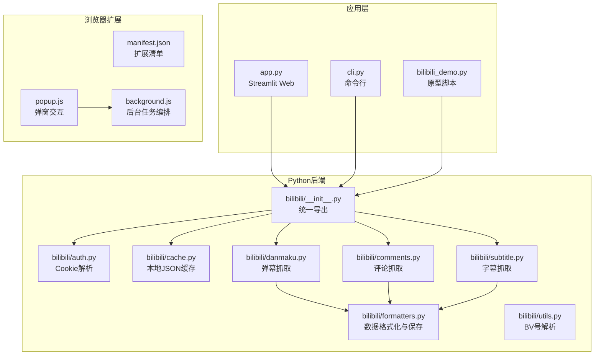
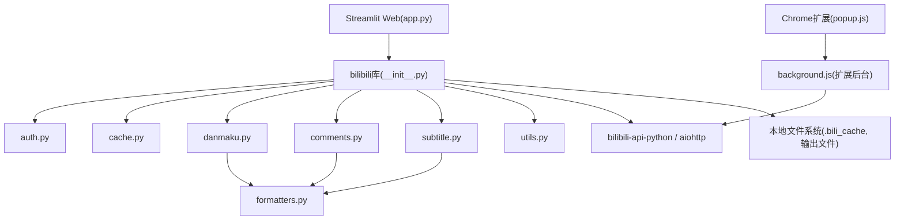
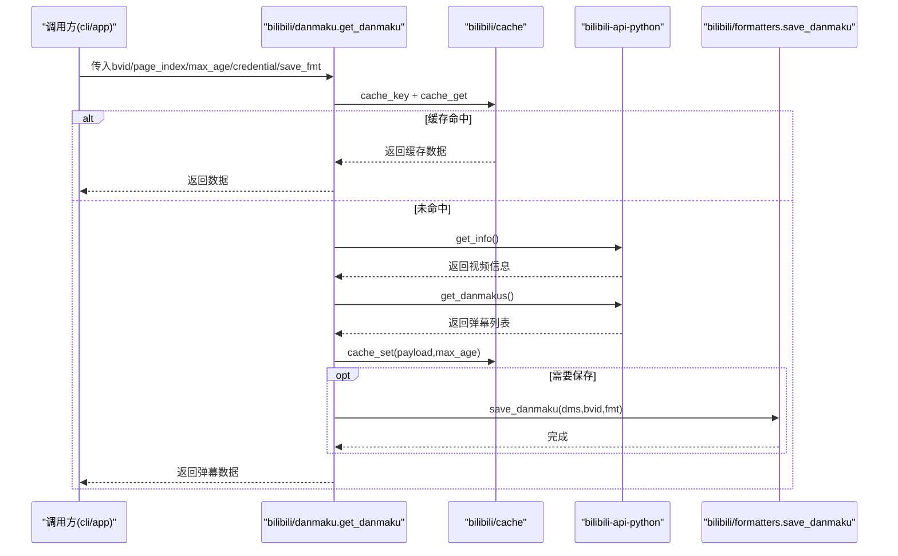
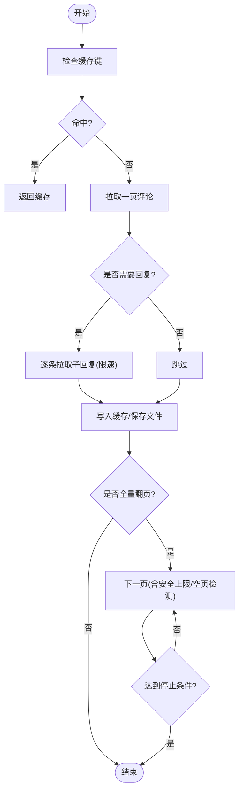
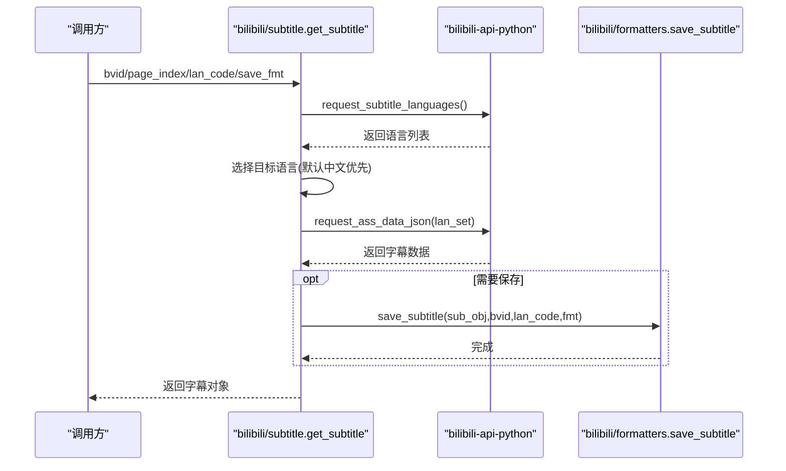
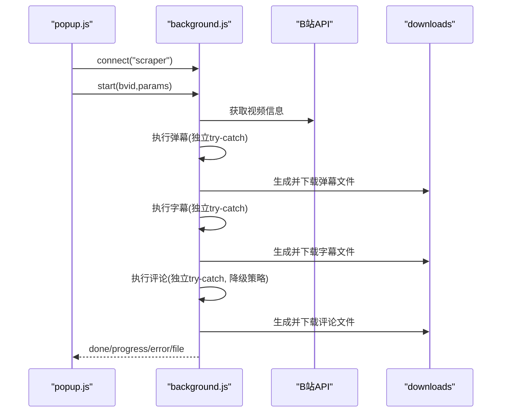
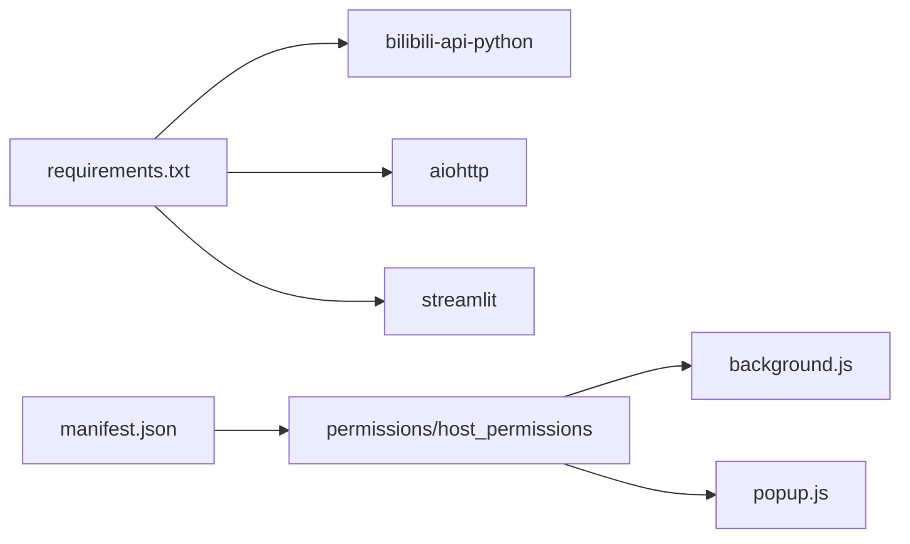

# 项目概述

<cite>
**本文引用的文件**   
- [README.md](file://README.md)
- [app.py](file://app.py)
- [cli.py](file://cli.py)
- [bilibili_demo.py](file://bilibili_demo.py)
- [requirements.txt](file://requirements.txt)
- [bilibili/__init__.py](file://bilibili/__init__.py)
- [bilibili/auth.py](file://bilibili/auth.py)
- [bilibili/cache.py](file://bilibili/cache.py)
- [bilibili/danmaku.py](file://bilibili/danmaku.py)
- [bilibili/comments.py](file://bilibili/comments.py)
- [bilibili/subtitle.py](file://bilibili/subtitle.py)
- [bilibili/formatters.py](file://bilibili/formatters.py)
- [bilibili/utils.py](file://bilibili/utils.py)
- [bilibili-extension--main/manifest.json](file://bilibili-extension--main/manifest.json)
- [bilibili-extension--main/background.js](file://bilibili-extension--main/background.js)
- [bilibili-extension--main/popup.js](file://bilibili-extension--main/popup.js)
</cite>

## 目录
1. [简介](#简介)
2. [项目结构](#项目结构)
3. [核心组件](#核心组件)
4. [架构总览](#架构总览)
5. [详细组件分析](#详细组件分析)
6. [依赖关系分析](#依赖关系分析)
7. [性能与可靠性](#性能与可靠性)
8. [故障排查指南](#故障排查指南)
9. [快速开始](#快速开始)
10. [结论](#结论)

## 简介
本项目面向B站视频数据的便捷抓取，提供弹幕、评论（含楼中楼回复）和字幕三大核心能力。项目采用“Python后端模块 + Streamlit Web界面 + Chrome浏览器扩展”的复合架构：
- Python后端模块：封装异步API调用、缓存、格式化与保存等通用能力，支持CLI与Web两种使用方式。
- Streamlit Web界面：为不熟悉命令行的用户提供可视化操作入口。
- Chrome扩展：在浏览器内直接运行，自动读取当前页BV号与Cookie，一键下载结果文件。

项目强调模块化设计、异步并发、本地缓存与多格式输出，兼顾易用性与可扩展性。

章节来源
- [README.md:1-114](file://README.md#L1-L114)

## 项目结构
仓库采用“功能分层 + 入口聚合”的组织方式：
- bilibili/：核心库，按职责拆分为认证(auth)、缓存(cache)、弹幕(danmaku)、评论(comments)、字幕(subtitle)、格式化(formatters)、工具(utils)，并通过__init__.py统一对外暴露接口。
- app.py：Streamlit Web入口，复用bilibili库实现图形化爬取。
- cli.py：命令行入口，解析参数并调度bilibili库。
- bilibili_demo.py：早期原型脚本，保留完整逻辑用于参考与兼容。
- requirements.txt：Python依赖声明。
- bilibili-extension--main：Chrome扩展源码，包含清单、后台服务、弹窗UI与工具函数。

图表来源
- [bilibili/__init__.py:1-19](file://bilibili/__init__.py#L1-L19)
- [bilibili/auth.py:1-38](file://bilibili/auth.py#L1-L38)
- [bilibili/cache.py:1-42](file://bilibili/cache.py#L1-L42)
- [bilibili/danmaku.py:1-64](file://bilibili/danmaku.py#L1-L64)
- [bilibili/comments.py:1-171](file://bilibili/comments.py#L1-L171)
- [bilibili/subtitle.py:1-77](file://bilibili/subtitle.py#L1-L77)
- [bilibili/formatters.py:1-166](file://bilibili/formatters.py#L1-L166)
- [bilibili/utils.py:1-28](file://bilibili/utils.py#L1-L28)
- [app.py:1-281](file://app.py#L1-L281)
- [cli.py:1-118](file://cli.py#L1-L118)
- [bilibili_demo.py:1-452](file://bilibili_demo.py#L1-L452)
- [bilibili-extension--main/manifest.json:1-20](file://bilibili-extension--main/manifest.json#L1-L20)
- [bilibili-extension--main/background.js:1-567](file://bilibili-extension--main/background.js#L1-L567)
- [bilibili-extension--main/popup.js:1-228](file://bilibili-extension--main/popup.js#L1-L228)

章节来源
- [app.py:1-281](file://app.py#L1-L281)
- [cli.py:1-118](file://cli.py#L1-L118)
- [bilibili_demo.py:1-452](file://bilibili_demo.py#L1-L452)
- [bilibili-extension--main/manifest.json:1-20](file://bilibili-extension--main/manifest.json#L1-L20)

## 核心组件
- 认证模块(auth)：解析Cookie字符串，构造bilibili_api的Credential对象，支持SESSDATA等字段。
- 缓存模块(cache)：基于文件的JSON缓存，提供键生成、过期判断与读写，减少重复请求。
- 弹幕模块(danmaku)：获取视频信息、拉取弹幕、写入缓存与可选保存。
- 评论模块(comments)：单页与全量翻页拉取评论，支持楼中楼回复与限速保护。
- 字幕模块(subtitle)：通过官方ASS接口获取字幕语言列表与内容，支持多格式输出。
- 格式化模块(formatters)：统一将原始数据转为txt/json/csv/srt/ass/lrc等格式并落盘。
- 工具模块(utils)：从URL或纯BV号中提取BV标识。

章节来源
- [bilibili/auth.py:1-38](file://bilibili/auth.py#L1-L38)
- [bilibili/cache.py:1-42](file://bilibili/cache.py#L1-L42)
- [bilibili/danmaku.py:1-64](file://bilibili/danmaku.py#L1-L64)
- [bilibili/comments.py:1-171](file://bilibili/comments.py#L1-L171)
- [bilibili/subtitle.py:1-77](file://bilibili/subtitle.py#L1-L77)
- [bilibili/formatters.py:1-166](file://bilibili/formatters.py#L1-L166)
- [bilibili/utils.py:1-28](file://bilibili/utils.py#L1-L28)

## 架构总览
系统由三层构成：
- 表现层：Streamlit Web与Chrome扩展弹窗，负责用户输入、进度展示与结果下载。
- 业务层：bilibili库中的各功能模块，封装网络请求、分页、缓存与格式化。
- 基础设施层：bilibili-api-python与aiohttp，提供异步HTTP与B站API封装；本地文件系统作为缓存与输出介质。

图表来源
- [app.py:1-281](file://app.py#L1-L281)
- [bilibili/__init__.py:1-19](file://bilibili/__init__.py#L1-L19)
- [bilibili-extension--main/background.js:1-567](file://bilibili-extension--main/background.js#L1-L567)
- [bilibili-extension--main/popup.js:1-228](file://bilibili-extension--main/popup.js#L1-L228)

## 详细组件分析

### 弹幕抓取流程
- 输入：BV号、分P索引、凭证、缓存有效期、保存格式。
- 流程：计算缓存键→命中则返回→否则获取视频信息→拉取弹幕→写入缓存→按需保存。
- 输出：内存数据结构与可选文件(txt/json/csv)。

图表来源
- [bilibili/danmaku.py:1-64](file://bilibili/danmaku.py#L1-L64)
- [bilibili/cache.py:1-42](file://bilibili/cache.py#L1-L42)
- [bilibili/formatters.py:101-141](file://bilibili/formatters.py#L101-L141)

章节来源
- [bilibili/danmaku.py:1-64](file://bilibili/danmaku.py#L1-L64)
- [bilibili/formatters.py:101-141](file://bilibili/formatters.py#L101-L141)

### 评论抓取流程（含降级策略）
- 单页：根据page与是否带回复构建缓存键，命中则返回，否则拉取一页并按需拉取楼中楼。
- 全量：循环翻页，内置空页检测、总数上限与安全条数上限，支持最大页数限制。
- 降级：扩展端优先主流cursor接口，失败后回退到page接口，并持续使用该模式。

图表来源
- [bilibili/comments.py:1-171](file://bilibili/comments.py#L1-L171)
- [bilibili-extension--main/background.js:92-145](file://bilibili-extension--main/background.js#L92-L145)

章节来源
- [bilibili/comments.py:1-171](file://bilibili/comments.py#L1-L171)
- [bilibili-extension--main/background.js:92-145](file://bilibili-extension--main/background.js#L92-L145)

### 字幕抓取流程
- 语言选择：优先中文系(ai-zh/zh-Hans/zh-Hant)，其次用户指定或首个可用语言。
- 获取路径：优先Player API(WBI签名)→视频信息字段→重新拉取视频信息。
- 输出：srt/ass/lrc/json/txt多种格式。

图表来源
- [bilibili/subtitle.py:1-77](file://bilibili/subtitle.py#L1-L77)
- [bilibili/formatters.py:146-166](file://bilibili/formatters.py#L146-L166)

章节来源
- [bilibili/subtitle.py:1-77](file://bilibili/subtitle.py#L1-L77)
- [bilibili/formatters.py:146-166](file://bilibili/formatters.py#L146-L166)

### 浏览器扩展工作流
- 弹窗(popup.js)：自动识别当前页BV号、加载用户设置、连接后台、发送任务与接收日志/文件。
- 后台(background.js)：统一编排任务，依次执行弹幕/字幕/评论，独立try-catch避免互相阻塞，支持取消与降级策略。
- 右键菜单：在B站页面可直接触发抓取任务。

图表来源
- [bilibili-extension--main/popup.js:1-228](file://bilibili-extension--main/popup.js#L1-L228)
- [bilibili-extension--main/background.js:1-567](file://bilibili-extension--main/background.js#L1-L567)

章节来源
- [bilibili-extension--main/popup.js:1-228](file://bilibili-extension--main/popup.js#L1-L228)
- [bilibili-extension--main/background.js:1-567](file://bilibili-extension--main/background.js#L1-L567)

## 依赖关系分析
- Python依赖：bilibili-api-python、aiohttp、streamlit。
- 扩展依赖：Manifest V3，权限包括storage、downloads、activeTab、cookies、contextMenus、notifications，仅对bilibili.com域名生效。

图表来源
- [requirements.txt:1-4](file://requirements.txt#L1-L4)
- [bilibili-extension--main/manifest.json:1-20](file://bilibili-extension--main/manifest.json#L1-L20)

章节来源
- [requirements.txt:1-4](file://requirements.txt#L1-L4)
- [bilibili-extension--main/manifest.json:1-20](file://bilibili-extension--main/manifest.json#L1-L20)

## 性能与可靠性
- 异步编程：Python侧使用asyncio驱动API调用，提升吞吐；扩展侧使用Promise链式调用与sleep控制节奏。
- 缓存机制：本地JSON缓存，按bvid+数据类型+页码生成MD5键，支持max_age过期策略，显著降低重复请求。
- 降级与容错：评论接口优先cursor版，失败自动切换page版；字幕优先Player API，失败回退至视频信息字段；每个任务独立try-catch，避免级联失败。
- 速率控制：评论拉取时加入延时，防止风控；全量翻页具备空页检测与条数上限保护。

章节来源
- [bilibili/cache.py:1-42](file://bilibili/cache.py#L1-L42)
- [bilibili/comments.py:1-171](file://bilibili/comments.py#L1-L171)
- [bilibili-extension--main/background.js:92-145](file://bilibili-extension--main/background.js#L92-L145)
- [bilibili-extension--main/background.js:147-230](file://bilibili-extension--main/background.js#L147-L230)

## 故障排查指南
- Cookie无效或未携带SESSDATA：认证模块会返回None，导致受限接口失败。请确保传入有效Cookie或在扩展中启用自动Cookie。
- 字幕为空：可能因Player API返回的subtitle_url为空，扩展已实现多级回退；若仍为空，确认视频是否存在可下载字幕。
- 评论被风控：扩展会自动切换到备用page接口；如仍失败，检查WBI签名相关设置或降低请求频率。
- 任务中断：扩展支持取消，后台会在sleep与循环处检查取消标志并退出。

章节来源
- [bilibili/auth.py:1-38](file://bilibili/auth.py#L1-L38)
- [bilibili-extension--main/background.js:147-230](file://bilibili-extension--main/background.js#L147-L230)
- [bilibili-extension--main/background.js:477-517](file://bilibili-extension--main/background.js#L477-L517)

## 快速开始

### 环境准备
- 安装Python依赖：
  - 使用requirements.txt进行安装。
- 扩展安装：
  - 在Chrome/Edge中加载bilibili-extension--main目录，开启开发者模式并加载未打包扩展。

章节来源
- [requirements.txt:1-4](file://requirements.txt#L1-L4)
- [bilibili-extension--main/manifest.json:1-20](file://bilibili-extension--main/manifest.json#L1-L20)

### 使用方式一：命令行(CLI)
- 基本用法示例：
  - 同时抓取弹幕与评论：python cli.py BVxxxxx -dc
  - 仅抓取字幕并指定语言：python cli.py BVxxxxx -s --sub-lan en --save srt
  - 全量翻页评论并保存json：python cli.py BVxxxxx -c --all --save json
- 常用参数：
  - --save：输出格式(txt/json/csv/srt/ass/lrc)
  - --cookie：包含SESSDATA的Cookie字符串
  - --max-age：缓存有效期秒，0禁用
  - --replies：抓取楼中楼回复
  - --max-pages：评论目标页数，0表示全部

章节来源
- [cli.py:1-118](file://cli.py#L1-L118)

### 使用方式二：Web界面(Streamlit)
- 启动：运行app.py，打开浏览器访问本地页面。
- 操作：输入BV号或链接，勾选所需功能，选择保存格式与语言，点击开始即可。
- 特点：实时日志、进度提示、一键下载生成的文件。

章节来源
- [app.py:1-281](file://app.py#L1-L281)

### 使用方式三：浏览器扩展
- 自动识别：在B站视频页打开扩展，自动填充BV号与Cookie（需在设置中启用）。
- 快捷抓取：支持右键菜单直接抓取弹幕+字幕或仅评论。
- 结果处理：弹窗内显示日志并提供下载与复制到剪贴板按钮。

章节来源
- [bilibili-extension--main/popup.js:1-228](file://bilibili-extension--main/popup.js#L1-L228)
- [bilibili-extension--main/background.js:519-567](file://bilibili-extension--main/background.js#L519-L567)

## 结论
本项目以清晰的模块化设计与稳定的异步/缓存机制，实现了弹幕、评论与字幕的一站式抓取。通过CLI、Web与扩展三种形态覆盖不同使用场景，既满足自动化需求，也兼顾非技术用户的易用性。未来可在AI总结、词云可视化与批量导入等方面继续演进。